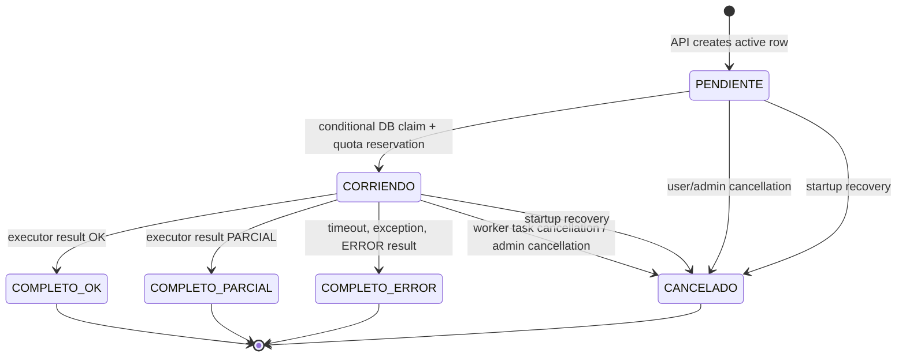

# V2 async jobs and workers research
## Scope and method
- **Purpose:** factual implementation inventory for the V3 remote-worker redesign.
- **Source repository inspected:** `api-bots-mrbot-v2`.
- **Output repository:** `api-bots-mrbot-v3/.research`.
- **Read-only guarantee:** this research did not modify V2 files or create V2 commits.
- **Primary sources:**
  `app/jobs/manager.py`, `worker.py`, `registry.py`, `config.py`, and `metrics.py`.
- **Additional primary sources:** active/history models, executor base/helpers, five representative executors, all remaining executor heads/persistence markers, job API factory/status code, and the named utilities.
- **Notation:** source references use `path:line`.
- **Terminology:** *active row* means `playwright_jobs_active`; *history row* means `playwright_jobs_history`.
- **GUESS policy:** statements marked **GUESS** are design inferences, not an observed behavior.
## Executive findings
1. V2 is a database-backed queue implemented inside every FastAPI process.
2. FastAPI lifespan starts an in-process `WorkerManager`, not a separate worker service.
3. The queue is polled from SQLAlchemy, claimed with an optimistic conditional `UPDATE`, and then executed in an `asyncio.Task`.
4. A running job has an active-table row. Completion or cancellation copies selected fields into history and deletes the active row.
5. V2 has two unrelated local concurrency gates: `MAX_BOTS=4` job tasks and `BROWSER_CONCURRENCY=3` browser launches by default.
6. Neither gate coordinates processes, pods, or replicas.
7. The central job record does not persist result payloads. Per-bot `consulta_*` log tables hold result payloads and artifact metadata keyed by `job_id`.
8. Nearly every real executor opens `SessionLocal()` itself when no injected DB session exists, deduplicates its log by `job_id`, and writes that log directly.
9. Therefore V2 executors are not stateless and cannot run unchanged on V3 workers with no database.
10. V3 needs an API-owned job/result store plus a worker HTTP protocol that replaces executor DB writes with result-report requests.
---
# 1. Job lifecycle, end to end
## 1.1 Job creation entry point
- Generated JSON create endpoint returns `JobCreateResponse(success=True, job_id=job_id, status="PENDIENTE")` at `app/api/v2/factory.py:852`.
- Equivalent multipart endpoint returns that shape at `factory.py:797`.
- Both receive `Idempotency-Key`, authenticate the user, normalize request fields, protect secrets, then call the manager.
- The schema declares `success`, `job_id`, and `status` at `app/schemas/v2/job.py:7-10`.
## 1.2 `create_job` manager transition

- `PlaywrightJobManager.create_job` starts at `app/jobs/manager.py:30`.
- It accepts `(db, user_id, bot, operation, request_data, idempotency_key=None)`.
- It first validates that `bot` exists in the Playwright registry at `manager.py:34-36`.
- Unsupported bots receive FastAPI HTTP `400`.
- If an idempotency key is present, it queries active rows by:
  `user_id`, `bot`, `operation`, and `idempotency_key`.
- That initial lookup is at `manager.py:39-45`.
- If found, it immediately returns the existing active row’s `job_id` at `manager.py:45-46`.
- Otherwise it creates a UUIDv7 string at `manager.py:47`.
- It inserts a `PlaywrightJobActive` with:
  `job_id`, `user_id`, `bot`, `operation`, `status`, `request_data`, `created_at`, and `idempotency_key`.
- Initial status is explicitly `PENDIENTE` at `manager.py:48-57`.
- `created_at` is set to `datetime.now(timezone.utc)` at `manager.py:55`.
- It calls `db.add(job)` then commits at `manager.py:58-60`.
- On `IntegrityError`, it rolls back at `manager.py:61-66`.
- If the request had an idempotency key, it re-queries the active row and returns its ID at `manager.py:67-78`.
- Otherwise it re-raises the integrity failure.
- It returns the already-known ID rather than refreshing the ORM object after commit at `manager.py:80-85`.


## 1.3 Active-job table: exact ORM columns

Source: `app/models/playwright_job_active.py:23-43`.

| Column | SQLAlchemy declaration | Nullable | Meaning / writer |
|---|---|---:|---|
| `job_id` | `Column(String, primary_key=True, index=True)` | no | UUIDv7 string. Created in `manager.py:47`. |
| `user_id` | `Column(Integer, ForeignKey("users.id"), nullable=False, index=True)` | no | Owning `users.id`; used for authorization and quota. |
| `bot` | `Column(String, nullable=False, index=True)` | no | Registry key, e.g. `mis_comprobantes`. |
| `operation` | `Column(String, nullable=False)` | no | Operation such as `consulta`, `historial`, or `carga`. |
| `status` | `Column(String, nullable=False, index=True)` | no | Active-table legal values documented as `PENDIENTE` and `CORRIENDO`. |
| `request_data` | `Column(JSON, nullable=False)` | no | Normalized request JSON, including encrypted runtime secret envelope. |
| `created_at` | `Column(DateTime, nullable=False, default=lambda: datetime.now(timezone.utc), index=True)` | no | FIFO order key. |
| `started_at` | `Column(DateTime, nullable=True)` | yes | Claim time when the worker changes status to `CORRIENDO`. |
| `worker_id` | `Column(String, nullable=True)` | yes | Diagnostic worker identity set during claim. |
| `attempts` | `Column(Integer, nullable=False, default=0)` | no | Future-facing field. V2 does not increment it. |
| `idempotency_key` | `Column(String, nullable=True, index=True)` | yes | Client create de-duplication key. |


## 1.4 Claim: `PENDIENTE -> CORRIENDO`

- Claiming is `PlaywrightJobManager.acquire_next_pending_job` at `manager.py:175-246`.
- It receives a SQLAlchemy session and a textual `worker_id`.
- First query selects the oldest pending row:

```python
job = (
    db.query(PlaywrightJobActive)
    .filter_by(status="PENDIENTE")
    .order_by(PlaywrightJobActive.created_at.asc())
    .first()
)
```

- The exact query is `manager.py:178-184`.
- If no row exists, it returns `None` at `manager.py:185-186`.
- It copies `job_id` and `user_id`, then calls `db.rollback()` to end the read transaction before write claim at `manager.py:188-195`.
- Claim is an optimistic conditional update:

```python
rows = (
    db.query(PlaywrightJobActive)
    .filter_by(job_id=job_id, status="PENDIENTE")
    .update({
        "status": "CORRIENDO",
        "started_at": datetime.now(timezone.utc),
        "worker_id": worker_id,
    }, synchronize_session=False)
)
```

- The exact code is `manager.py:201-211`.
- If update count is not exactly one, it rolls back and returns `None` at `manager.py:212-215`.
- This is what prevents two DB-polling workers from claiming one pending row simultaneously.
- The claim transaction also reserves monthly quota.
- It conditionally increments `User.consultas_realizadas` only where it remains less than `User.maximas_consultas_mensuales`.
- That conditional user update is `manager.py:221-230`.
- If quota update count is not one, it rolls back the job claim as well at `manager.py:232-236`.
- It commits both the running transition and quota increment in the same transaction at `manager.py:238-241`.
- It then re-queries and returns the newly claimed active row at `manager.py:243-246`.
- A pending job that cannot reserve quota remains pending.
- No state or error is written onto such a quota-blocked pending job by this method.
- **GUESS:** it will be repeatedly reselected on every poll until quota changes or the job is cancelled, because it is still the oldest pending row.

## 1.5 Worker task dispatch

- `WorkerManager._poll_loop` runs while `_running` is true at `worker.py:378-390`.
- It invokes `_poll_once`, catches non-cancellation exceptions, logs them, and sleeps `poll_interval` seconds.
- `_poll_once` attempts to fill every currently free `MAX_BOTS` slot, not just one job per tick.
- That fill loop begins at `worker.py:401-404`.
- It acquires the local semaphore before marking a database row as running at `worker.py:404-410`.
- It opens a fresh `session_factory()` database session for each claim at `worker.py:414-430`.
- It calls `acquire_next_pending_job(db, worker_id=self.worker_id)` at `worker.py:417`.
- It releases the permit if the claim failed or returned no job at `worker.py:418-438`.
- It schedules a job with `asyncio.create_task(self._run_job_task(job_id))` at `worker.py:443-446`.
- The task is tracked in `self._running_jobs[job_id]` at `worker.py:446`.
- Completion callback removes the map entry and logs cancellation/unhandled exception at `worker.py:448-457`.
- `_run_job_task` adds a private `_worker_started = True` attribute before calling `_execute_job` at `worker.py:459-464`.
- That private flag lets shutdown distinguish an unstarted task from an executing task.

## 1.6 Execution path

- `_execute_job` begins at `app/jobs/worker.py:489`.
- It reopens a new DB session and re-queries the active job by `job_id` at `worker.py:502-522`.
- If it no longer exists, it logs and exits at `worker.py:505-508`.
- Thus a job cancelled between claim and execution is not run.
- It restores secrets from `job.request_data` at `worker.py:510`.
- It passes `request_data.get("clave_encriptada")` into thread/context helper `set_current_encrypted_credential` at `worker.py:511`.
- It saves `job.user_id`, `job.bot`, and a detached loaded job reference for later logging at `worker.py:512-520`.
- It closes this fetch session before invoking the executor at `worker.py:521-522`.
- It resolves executor dynamically using `get_executor(bot)` at `worker.py:528-531`.
- A missing executor becomes a caught `RuntimeError` and eventually terminal `ERROR`.
- It inspects the executor signature at `worker.py:533-549`.
- If the signature supports `job_id` and `user_id`, those are passed.
- If it also contains `db`, V2 explicitly passes `db=None` at `worker.py:541-542`.
- Otherwise legacy executors receive only `request_data`.
- A callable executor with no `.execute` is supported at `worker.py:550-558`.
- A non-callable/non-executor causes `RuntimeError` at `worker.py:559-560`.

## 1.7 Browser-limited, time-limited invocation

- The worker invokes an executor through `_run_with_browser_limit(coro, timeout=self.job_timeout)` at `worker.py:562-568`.
- `_run_with_browser_limit` is defined at `worker.py:149-167`.
- It wraps executor invocation inside `async with limit_browser():` at `worker.py:159-162`.
- It applies `asyncio.wait_for` around both browser-slot wait and execution at `worker.py:164`.
- Therefore time queued waiting for a browser consumes the job’s wall-clock timeout.
- The `finally` closes a coroutine created before a timeout while waiting to prevent an unawaited coroutine at `worker.py:165-167`.
- See section 2 for exact concurrency behavior.

## 1.8 Result normalization

- A dict return is interpreted from its `result` key at `worker.py:570-592`.
- Accepted values are `OK`, `PARCIAL`, and `ERROR`.
- Strings are trimmed and uppercased before matching at `worker.py:574-577`.
- `SUCCESS` and `SUCCESSFUL` map to `OK` at `worker.py:578-579`.
- `PARTIAL` maps to `PARCIAL` at `worker.py:580-581`.
- Executor `CANCELADO` maps to terminal `ERROR`, not history `CANCELADO`, at `worker.py:582-584`.
- Unknown string values default to `OK` at `worker.py:585-586`.
- A non-string `result` also defaults to `OK` at `worker.py:587-588`.
- Executor error data is sanitized/bounded through `_safe_error_message` at `worker.py:589-591`.
- A non-dict executor return is treated as successful data:

```python
result_str = "OK"
result_payload = {"result": "OK", "files": [], "data": result_payload}
```

- This behavior is at `worker.py:593-597`.
- **Consequence:** executor contract violations that return a non-dict can falsely terminally complete as `OK`.

## 1.9 Exceptions and terminal execution states

- Timeout becomes `result_str = "ERROR"` at `worker.py:601-605`.
- Its error is a public/catalogued timeout message, not raw exception text.
- Any ordinary executor exception becomes `ERROR` at `worker.py:656-660`.
- Error messages are sanitized via `safe_public_message`.
- If an `ERROR` lacks a message, worker adds a fallback safe message at `worker.py:662-666`.
- Executor cancellation follows a distinct path at `worker.py:606-655`.
- On `asyncio.CancelledError`, it fetches the active row at `worker.py:610-613`.
- It calls `manager.cancel_job(..., cancelled_by="admin")` at `worker.py:614-616`.
- If that fails, it attempts a manual history insert and active delete at `worker.py:624-648`.
- It returns without calling normal completion at `worker.py:654-655`.
- Thus a task cancellation becomes history status `CANCELADO`, not `COMPLETO/ERROR`.

## 1.10 Result log persistence

- Before final job completion, worker invokes `_persist_log_for_bot` best-effort at `worker.py:668-697`.
- It ensures `files`, `result`, and sanitized `error` keys on the log payload at `worker.py:670-688`.
- `_persist_log_for_bot` starts at `worker.py:56`.
- It only has a worker-level fallback implementation for Mis Comprobantes variants.
- That branch covers `mis_comprobantes`, `mis_comprobantes_solicitar`, and `mis_comprobantes_historial` at `worker.py:69`.
- It opens `session_factory()` and queries `ConsultaLog` by `job_id` at `worker.py:70-78`.
- It skips if an executor already persisted the row.
- It persists a legacy `ConsultaLog` fallback at `worker.py:119-136`.
- For every other bot, it logs a debug skip at `worker.py:142-144`.
- Most real executors write their own per-bot log independently. See section 10.

## 1.11 Finish: `CORRIENDO -> COMPLETO` and table move

- Worker reopens a DB session and re-queries active row at `worker.py:699-703`.
- If the row still exists, it validates `result_str` and calls `complete_job` at `worker.py:704-718`.
- `complete_job` is `app/jobs/manager.py:274-300`.
- It only permits results `OK`, `PARCIAL`, or `ERROR` at `manager.py:281-284`.
- It creates a history row with `status="COMPLETO"` at `manager.py:285-296`.
- It copies active identity and timing data.
- It sets `finished_at` to `datetime.now(timezone.utc)`.
- It writes the safe `error_message` supplied by worker.
- It then `db.add(hist)`, `db.delete(job)`, and `db.commit()` at `manager.py:297-300`.
- That removes the active row and leaves only history for a terminal completed job.
- On `complete_job` failure, worker rolls back then attempts a manual history `COMPLETO/ERROR` plus active delete at `worker.py:719-744`.
- If the active row disappeared before finish, worker only warns at `worker.py:745-746`.
- The semaphore is released in `_execute_job` `finally` at `worker.py:753-761`.

## 1.12 Cancellation transitions

- Public cancellation endpoint is `POST {route}/cancelar/{job_id}` at `factory.py:854-885`.
- It parses `job_id` as UUID and calls `manager.cancel_job(..., cancelled_by="user")` at `factory.py:855-867`.
- `cancel_job` begins at `manager.py:115`.
- It queries active rows scoped to `(job_id, user_id)` at `manager.py:122-127`.
- If no active row exists but history exists, it returns HTTP `409 Job ya terminado` at `manager.py:128-137`.
- If user attempts to cancel `CORRIENDO`, it returns HTTP `409` at `manager.py:140-143`.
- User can cancel `PENDIENTE`.
- Admin can cancel `PENDIENTE` or `CORRIENDO` at `manager.py:145-148`.
- For allowed cancellation it writes a history row with `status="CANCELADO"`, `result=None`, and terminal time at `manager.py:154-166`.
- It deletes active and commits at `manager.py:167-170`.
- Cancellation reason is either `cancelado por usuario` or `cancelado por administrador` at `manager.py:149-153`.
- Cancel authority value is `user` or `admin` in this method.
- System-restart cancellation is handled separately below.
- `WorkerManager.cancel_running(job_id)` cancels an in-memory task only if it is registered in this process at `worker.py:763-786`.
- There is no observed generated public route calling `cancel_running`.
- **GUESS:** an admin/control route elsewhere may call it, but no invocation was found in the inspected job files.

## 1.13 Restart recovery / stuck-job policy

- FastAPI lifespan runs recovery before starting the worker at `app/main.py:57-100`.
- It creates `SessionLocal()` at `main.py:58-62`.
- It calls `PlaywrightJobManager().recover_jobs_after_restart(db)` at `main.py:63-64`.
- It logs recovery count then closes the session at `main.py:65-86`.
- If recovery fails, `_worker_ready` remains false and the worker does not start at `main.py:88-100`.
- Recovery finds all active rows whose status is in `PENDIENTE` or `CORRIENDO` at `manager.py:302-307`.
- It snapshots their selected values and rolls back the read transaction at `manager.py:311-326`.
- For each snapshot it conditionally deletes an active row still in either active state at `manager.py:337-349`.
- A deletion count other than one causes it to skip, avoiding duplicate history under multiple recovering instances.
- It writes history status `CANCELADO`, result `None`, and `cancelled_by="system_restart"` at `manager.py:352-366`.
- It sets `cancel_reason="cancelado por reinicio del servidor"` at `manager.py:361-363`.
- It commits after all successes at `manager.py:369-370`.
- V2 does not requeue either pending or running jobs after a process restart.
- Therefore restart recovery is cancellation, not at-least-once delivery.
- It also means jobs queued immediately before an ordinary deployment restart are discarded as cancelled.

## 1.14 State machine



- Public `status` values are `PENDIENTE`, `CORRIENDO`, `COMPLETO`, and `CANCELADO`.
- This is documented in `app/schemas/v2/job.py:19-31`.
- `result` is `OK`, `PARCIAL`, or `ERROR` only for `COMPLETO` history.
- `CANCELADO` has `result=None`.
- There is no `RETRYING`, `FAILED`, `TIMED_OUT`, `LEASE_EXPIRED`, `ASSIGNED`, or `ACKNOWLEDGED` state.
- There is no worker-owned assignment state persisted separately from `CORRIENDO`.

## 1.15 History-job table: exact ORM columns

Source: `app/models/playwright_job_history.py:17-38`.

| Column | SQLAlchemy declaration | Nullable | Meaning / writer |
|---|---|---:|---|
| `job_id` | `Column(String, primary_key=True, index=True)` | no | Same string ID moved from active. |
| `user_id` | `Column(Integer, ForeignKey("users.id"), nullable=False, index=True)` | no | Job owner. |
| `bot` | `Column(String, nullable=False, index=True)` | no | Bot registry name. |
| `operation` | `Column(String, nullable=False)` | no | Operation kind. |
| `status` | `Column(String, nullable=False, index=True)` | no | `COMPLETO` or `CANCELADO` in normal V2 transitions. |
| `result` | `Column(String, nullable=True)` | yes | `OK`, `PARCIAL`, `ERROR` for `COMPLETO`; null for cancellation. |
| `created_at` | `Column(DateTime, nullable=False)` | no | Copied from active. |
| `started_at` | `Column(DateTime, nullable=True)` | yes | Copied from active. |
| `finished_at` | `Column(DateTime, nullable=False, default=lambda: datetime.now(timezone.utc))` | no | Terminal timestamp. |
| `cancel_reason` | `Column(String, nullable=True)` | yes | User/admin/system restart cancellation reason. |
| `cancelled_by` | `Column(String, nullable=True)` | yes | `user`, `admin`, `system_restart`. |
| `error_message` | `Column(String, nullable=True)` | yes | Sanitized failure error for complete error jobs. |

- `user = relationship("User")` is `history.py:32`.
- `idx_jobs_history_user` covers `(user_id, job_id)` at `history.py:34-38`.
- `idx_jobs_history_status` indexes `status`.
- `idx_jobs_history_bot` indexes `bot`.
- The model documentation says result content is in `consulta_*_logs` by `job_id`, not in history (`history.py:9-16`).

## 1.16 Client status/result response

- GET route is generated at `factory.py:887-1022`.
- It queries active first, then history, using `manager.get_job(db, job_id, user_id)` at `manager.py:98-113`.
- Active pending response supplies status but no result, files, data, or error at `factory.py:905-921`.
- Active running response supplies `started_at`, but no result, files, data, or error at `factory.py:922-937`.
- Completed-history route fetches a per-bot log by `job_id` at `factory.py:956-971`.
- It returns history timing/result plus files/data derived from that log at `factory.py:973-987`.
- Cancelled response contains cancellation metadata but no files/data at `factory.py:988-1003`.
- The response schema is exactly:
  `job_id`, `status`, `result`, `bot`, `operation`, `created_at`, `started_at`, `finished_at`, `cancel_reason`, `cancelled_by`, `error`, `files`, `data`.
- This schema is `app/schemas/v2/job.py:19-32`.

---

# 2. Current concurrency limits

## 2.1 `MAX_BOTS`: concurrent job tasks

- Default `MAX_BOTS` is `4` at `app/jobs/config.py:28-34`.
- It reads environment variable `MAX_BOTS`.
- Config validates range `1 <= MAX_BOTS <= 20` at `config.py:32-34`.
- `WorkerManager.__init__` reads the config default at `worker.py:188-203`.
- It validates the same range in constructor at `worker.py:199-203`.
- It creates `self.semaphore = asyncio.Semaphore(max_bots)` at `worker.py:214-220`.
- This semaphore caps scheduled/claimed job tasks in this one worker manager.
- `_poll_once` fills permits while `not self.semaphore.locked()` at `worker.py:401-410`.
- A permit is acquired before database claim.
- A permit is released if no claim happens at `worker.py:418-438`.
- A permit is released in `_execute_job` `finally` at `worker.py:753-758`.
- A pre-start task cancellation path also releases it at `worker.py:321-327` and `780-785`.
- This limit includes time while a task waits for the browser limiter because the job-task permit was claimed first.

## 2.2 `BROWSER_CONCURRENCY`: concurrent Chromium launches

- Default browser concurrency is `3`.
- It is read independently from environment variable `BROWSER_CONCURRENCY` in `app/utils/browser_limiter.py:39-45`.
- Invalid/noninteger values silently fall back to `3`.
- Values less than one are clamped to one with `max(1, value)` at `browser_limiter.py:45`.
- Browser limiter documentation states it bounds browser launches to avoid cgroup PID exhaustion at `browser_limiter.py:2-16`.
- It stores one `asyncio.Semaphore` per running event loop in a weak-key cache at `browser_limiter.py:33-36`.
- `get_browser_semaphore` obtains current running loop at `browser_limiter.py:48-69`.
- It creates `asyncio.Semaphore(_max_browsers())` lazily at `browser_limiter.py:63-69`.
- `limit_browser.__aenter__` awaits acquire at `browser_limiter.py:96-102`.
- `__aexit__` releases only acquired permits at `browser_limiter.py:104-110`.
- Worker applies this context around every executor invocation at `worker.py:149-167`.

## 2.3 Effective numbers and topology

| Limit | Environment | Default | Scope | Enforced at |
|---|---|---:|---|---|
| Concurrent job tasks | `MAX_BOTS` | 4 | One `WorkerManager` / event loop / API process | `worker.py:219`, `392-457` |
| Concurrent browser sections | `BROWSER_CONCURRENCY` | 3 | One event loop in one process | `browser_limiter.py:33-45`, `96-110` |
| Pending queue global | `MAX_PENDING_JOBS` | 500 | Intended shared DB queue | API pre-create count gate |
| Pending queue per user | `MAX_PENDING_JOBS_PER_USER` | 500 | Intended shared DB queue | API pre-create count gate |
| Executor wall time | `PLAYWRIGHT_JOB_TIMEOUT` | 1800 seconds | One worker invocation | `worker.py:164`, `566-568` |
| Poll interval | `PLAYWRIGHT_QUEUE_POLL_INTERVAL` | 1.0 seconds | One worker loop | `worker.py:378-390` |

- `MAX_BOTS` documentation explicitly says it is process/local-loop only at `config.py:3-6` and `28-31`.
- Browser limiter documentation explicitly says it does not coordinate processes, independent workers, or replicas at `browser_limiter.py:9-15`.
- In one standard process at defaults, at most four tasks can be running while at most three are inside `limit_browser`.
- If every executor needs Chromium, one job can hold a `MAX_BOTS` permit while waiting for a browser permit.
- With two API replicas using default config, **up to 8 tasks and 6 browser permits** can exist across replicas.
- With N replicas, those ceilings multiply by N.
- **GUESS:** actual browser count can exceed the browser semaphore when bot code independently launches Chromium outside worker-wrapped executor execution, but inspected worker code does wrap the executor call itself.

---

# 3. Worker startup and queue mechanism

## 3.1 In-process startup

- FastAPI defines an async lifespan context at `app/main.py:52-128`.
- Startup first runs DB recovery, then imports `worker_manager` and calls `await worker_manager.start()` at `main.py:88-94`.
- `WorkerManager.start()` sets `_running=True` at `worker.py:270-278`.
- It creates `_poll_loop()` with `asyncio.create_task` at `worker.py:278`.
- It creates `_retention_loop()` with `asyncio.create_task` at `worker.py:279`.
- These tasks run inside the FastAPI server process/event loop.
- Lifespan shutdown calls `await wm_stop.stop()` at `main.py:110-119`.
- `stop()` cancels poll and retention tasks at `worker.py:290-309`.
- It then cancels in-memory execution tasks at `worker.py:310-329`.

## 3.2 Default singleton construction

- Module-level `worker_manager` is constructed at `app/jobs/worker.py:789-797`.
- It imports `SessionLocal` and calls `WorkerManager(session_factory=_SessionLocal)` at `worker.py:791-793`.
- Failed DB import produces `worker_manager = None` after a warning at `worker.py:794-797`.
- There is no process manager, Celery worker, Redis consumer, subprocess, or broker client in the inspected job subsystem.

## 3.3 Queue transport

- Queue transport is the shared relational database table `playwright_jobs_active`.
- Producers directly insert active rows using SQLAlchemy.
- Consumers periodically query those rows using SQLAlchemy.
- Claiming is conditional SQLAlchemy UPDATE against the same table.
- Results are per-bot log-table writes plus active-to-history database move.
- There is no Redis list, stream, pub/sub, SQS, RabbitMQ, Kafka, task broker, or HTTP worker pull protocol in the inspected files.
- Poll default is one second (`PLAYWRIGHT_QUEUE_POLL_INTERVAL=1.0`) at `config.py:41-44`.
- This is DB polling, not database notifications.


---

# 4. Executor registry and contract

## 4.1 Registry population

- `PLAYWRIGHT_BOTS` is a dict initialized with 33 recognized bot keys at `app/jobs/registry.py:45-83`.
- Values start as `None`.
- The module asserts `len(PLAYWRIGHT_BOTS) == 33` at `registry.py:81-83`.
- `is_playwright_bot` handles aliases and hyphen-to-underscore normalization at `registry.py:86-108`.
- `get_executor(bot)` is defined at `registry.py:111-214`.
- It aliases Mis Comprobantes operation names at `registry.py:121-137`.
- It checks existing cached values first at `registry.py:138-145`.
- It maps canonical bot keys to module strings in `_lazy_bots` at `registry.py:146-186`.
- It imports module using `__import__(..., fromlist=["executor_instance"])` at `registry.py:188-201`.
- It reads module-level `executor_instance` and caches it in registered keys at `registry.py:193-198`.
- Generic import fallback attempts `app.jobs.executors.{bot}` at `registry.py:202-214`.
- Import exceptions in the generic fallback are swallowed.
- The module also eagerly imports most executors at import time in a loop at `registry.py:217-235`.
- Eager import exceptions are swallowed at `registry.py:234-235`.


## 4.2 Required executor interface

- Registry documentation specifies:

```python
async def execute(request_data: dict, job_id, user_id, db) -> dict
```

- This statement is `registry.py:111-119`.
- `BaseExecutor.execute` declares the canonical optional-argument shape at `app/jobs/executors/base.py:95-102`.
- Canonical signature is:

```python
async def execute(
    self,
    request_data: Dict[str, Any],
    job_id: Optional[str] = None,
    user_id: Optional[int] = None,
    db: Optional[Any] = None,
) -> Dict[str, Any]:
```

- Base implementation raises `NotImplementedError`.
- Worker remains backward-compatible with old one-argument methods through introspection (`worker.py:533-558`).
- Executor module convention is module-level async function plus a `BaseExecutor` subclass and `executor_instance` singleton.
- Example `MisComprobantesExecutor` delegates at `mis_comprobantes.py:288-303`.
- Example `HaciendaExecutor` delegates at `hacienda.py:442-453`.
- Example `VepExecutor` is declared at `vep.py:734-745`.

## 4.3 Return envelope

- All five representative executors document/return this shape:

```python
{
    "result": "OK" | "PARCIAL" | "ERROR",
    "files": [
        {"name": str, "object_key": str, "bucket": str, "size": int | None}
    ],
    "data": dict | list | scalar,
    "error": str | list[str] | None,
}
```

- Mis Comprobantes documents it at `mis_comprobantes.py:26-40` and returns at `:222-227`.
- VEP documents it at `vep.py:134-145` and returns success around `:670`.
- Controladores documents it at `controladores_fiscales.py:136-147` and returns at `:556-561`.
- Hacienda documents it at `hacienda.py:30-39` and returns success around `:384`.
- Portal IVA carga returns at `portal_iva_carga.py:623`.
- Worker only requires enough shape to derive status/error. It does not persist `files` or `data` in history.
- Per-bot log persistence is responsible for caller-visible data/artifacts.

## 4.4 Error boundary in `BaseExecutor`

- `BaseExecutor.__init_subclass__` automatically wraps each subclass-defined `execute` at `base.py:55-93`.
- The wrapper examines the original execute signature at `base.py:63-78`.
- It filters `job_id`, `user_id`, `db`, and extra kwargs to only parameters accepted by executor.
- It catches ordinary `Exception` at `base.py:79-89`.
- It logs exception context internally.
- It returns a normalized safe error envelope:

```python
{
    "result": "ERROR",
    "files": [],
    "data": {},
    "error": [safe_public_message(...)],
}
```

- It sanitizes returned payload afterward at `base.py:90`.
- The wrapper does not catch `BaseException`, so cancellation is still able to propagate.
- Worker additionally protects executor boundaries with its own `try/except`.
- Safe-message helpers constrain public error output at `base.py:23-53` and `worker.py:24-53`.

---

# 5. Credential and secret handling

## 5.1 Sensitive-key detection

- Secret logic is in `app/utils/job_secrets.py`.
- Runtime envelope key is `__mrbot_runtime_values__` at `job_secrets.py:21`.
- Sensitive key token set appears at `job_secrets.py:22-36`.
- It includes `password`, `passwd`, `secret`, `token`, `api_key`, `access_key`, `private_key`, `cuit_password`, `clave`, `contrasena`, and `contraseña`.
- Key names are tokenized across snake case, delimiters, and camel case at `job_secrets.py:39-56`.

## 5.2 Encryption primitive and key selection

- V2 uses `cryptography.fernet.Fernet` at `job_secrets.py:18`.
- It selects configuration in this precedence order:
  `JOB_SECRETS_KEY`, `SECRET_KEY`, then `API_KEY_HMAC_SECRET`.
- That selection is `job_secrets.py:59-75`.
- If none is configured, it raises `RuntimeError("No está configurada la clave interna de jobs")`.
- It hashes the selected string with SHA-256 and URL-safe-base64 encodes that digest to construct Fernet key at `job_secrets.py:74-75`.
- `_encrypt` JSON-serializes a secret with compact separators then Fernet encrypts it at `job_secrets.py:78-83`.
- `_decrypt` Fernet-decrypts and JSON parses it at `job_secrets.py:85-90`.
- Bad/malformed token produces a generic credential restoration `RuntimeError`.
- This module is Fernet symmetric encryption, not RSA.

## 5.3 Relationship to RSA credential support

- Worker imports `set_current_encrypted_credential` from `app.security.rsa_credentials` at `worker.py:19`.
- At execution it calls:

```python
set_current_encrypted_credential(request_data.get("clave_encriptada"))
```

- That is `worker.py:510-511`.
- `clave_encriptada` itself is treated as a sensitive key by job-secret token matching because it contains `clave`.
- **Observed conclusion:** job envelope protection is Fernet transport-at-rest encryption; any RSA behavior is delegated to `rsa_credentials` via the restored `clave_encriptada` field.
- **GUESS:** RSA encryption is likely consumed by underlying bot/credential resolution. It was not among requested scoped files, so this report does not assert its key management or plaintext behavior.

## 5.4 What persists in active job request data

- `protect_runtime_secrets(payload)` begins at `job_secrets.py:93`.
- It only transforms mapping payloads at `job_secrets.py:100-101`.
- It recursively walks mappings, lists, and tuples at `job_secrets.py:105-118`.
- For a sensitive key it omits that plaintext key from normal object body.
- It adds an envelope entry with:
  `{"path": path + [key], "value": _encrypt(item)}`.
- This exact action is `job_secrets.py:108-113`.
- It stores all entries under `RUNTIME_VALUES_KEY` at `job_secrets.py:120-123`.
- Thus normal nonsecret request fields persist visibly in `request_data`.
- Secret values persist encrypted within the JSON envelope.
- Secret path/key names persist as JSON path metadata inside that envelope.
- Job history intentionally does not copy `request_data`, so no job request payload is in history model.

## 5.5 Restoration and ephemerality

- `restore_runtime_secrets(payload)` starts at `job_secrets.py:147-169`.
- It deep-copies the payload at `job_secrets.py:152`.
- It pops the runtime envelope from its in-memory copy at `job_secrets.py:153`.
- It decrypts each entry and restores it to its original path at `job_secrets.py:160-167`.
- Worker invokes it immediately before executor selection at `worker.py:510`.
- It passes the restored plain request dict to executor.
- It uses that restored dict for Mis Comprobantes fallback log extraction, as comments state at `worker.py:81-86`.
- Therefore credential values are plaintext in Python process memory during bot execution.
- Executor code typically copies that plaintext into consultation log model fields such as `clave_representante`.
- See section 10 for the major V3 implication.

## 5.6 Persistence sanitizer interaction

- `app/utils/persistence.py` globally wraps JSON columns with `NoUrlJSON` through an SQLAlchemy Column listener at `persistence.py:181-199`.
- `sanitize_for_storage` removes URL-named fields/URL values at `persistence.py:84-106`.
- It redacts sensitive-key values with a redaction marker at `persistence.py:89-100`.
- Job secret code explicitly keeps encrypted secret values below opaque envelope entry key `value`, and comments explain why at `job_secrets.py:93-99`.
- `FiscalCredentialString` deliberately writes string values unchanged but returns redacted marker on ordinary ORM reads at `persistence.py:154-172`.
- It applies only to specified fiscal credential columns in `consulta_*` tables at `persistence.py:174-197`.
- Its documentation says plaintext is allowed in SQLite consultation logs and explicitly authorized admin surfaces at `persistence.py:154-161`.


---

# 6. Artifact and result handling

## 6.1 Artifact storage basics

- `app/utils/bucket.py` is a MinIO/S3 helper.
- TLS is mandatory: `MINIO_SSL=false` is rejected at `bucket.py:27-50`.
- Client creation requires endpoint/access/secret and uses `secure=True` at `bucket.py:53-69`.
- General file upload helper is `subir_archivo_a_minio` at `bucket.py:167-217`.
- It returns **object key**, not presigned URL, on success at `bucket.py:178-211`.
- It returns `""` on MinIO failures.
- Presigned URL generation is `generar_url_presigned(bucket, object_key, expires=None)` at `bucket.py:220-281`.
- Default URL TTL is `MINIO_PRESIGNED_EXPIRES=3600` seconds at `jobs/config.py:91-93` and `bucket.py:239-244`.
- Generated URLs are explicitly intended for GET/status or V1 compatibility at `bucket.py:226-234`.

## 6.2 JSON externalization

- `externalize_json_list` is in `app/jobs/executors/helpers.py:17-108`.
- Default JSON bucket is `MINIO_BUCKET_JSON` or `mrbot-json` at `helpers.py:10-12`.
- It builds JSON object keys with `build_json_object_key` and uploads using `subir_json_a_minio` at `helpers.py:87-105`.
- Result is `([file_entry], object_key)` on success.
- File entry has `name`, `object_key`, `bucket`, and `size` at `helpers.py:98-105`.
- It skips externalization in tests at `helpers.py:46-49`.
- It keeps small payloads inline under threshold ≤10 items and <8192 bytes at `helpers.py:51-63`.
- `force_inline=True` means never externalize at `helpers.py:26-39`.
- The function logs and falls back inline if MinIO unavailable/fails at `helpers.py:89-108`.
- `subir_json_a_minio` writes a temporary JSON file then calls general upload at `bucket.py:329-408`.
- Expected key shape is documented as `{endpoint}/{cuit}_{job_id}.json` at `bucket.py:341-349`.
- Actual `build_json_object_key` uses full job ID for uniqueness at `bucket.py:411-445`.

## 6.3 Multipart input artifacts

- Multipart enqueue first creates job, then uploads submitted bytes to temp bucket.
- This occurs at `factory.py:758-795`.
- It generates key `"{endpoint}/{job_id}/{filename}"` via `build_temp_object_key` at `factory.py:762-767` and `bucket.py:484-493`.
- It uploads bytes through `subir_bytes_a_temp` at `factory.py:767`.
- Temp bucket default is `MINIO_BUCKET_TEMP` or `mrbot-temp` at `bucket.py:479-481`.
- It appends metadata into active row `request_data` via `manager.append_request_data` at `factory.py:779-795`.
- Stored entries include `nombre`, `object_key`, `bucket`, optional `campo` at `factory.py:768-775`.
- `append_request_data` only operates on existing active job and updates JSON then commits at `manager.py:248-272`.
- Upload happens **after** job creation.
- **GUESS:** if temp upload fails, the job is left pending with partial/no uploaded-file reference because enqueue catches/logs upload failure then still returns accepted job.


## 6.4 What caller receives

- The job creation caller receives only `success`, `job_id`, `status=PENDIENTE`.
- The polling caller gets `JobStatusResponse` schema at `schemas/v2/job.py:19-32`.
- Completed `files` are derived from per-bot log `archivos` field, not job history.
- `extract_files_from_log` is `app/api/v2/job_status.py:27-93`.
- For each file metadata dict it reads name, object key, bucket, and size at `job_status.py:40-47`.
- It checks object existence with `verificar_existencia_objeto` then creates a fresh presigned URL at `job_status.py:48-59`.
- If privacy policy says object does not exist, `url` becomes `PRIVACY_MSG` at `job_status.py:50-60`.
- `FileResponse` contains only `name`, `url`, optional `size` at `schemas/v2/job.py:13-16`.
- The API therefore deliberately does not return raw object keys to caller in this response schema.
- Data is rehydrated from JSON bucket if a log artifact bucket is `mrbot-json`/contains `json` at `job_status.py:96-113`.
- Otherwise `response_data` is returned if present at `job_status.py:115-121`.
- Legacy reflection fallback examines log columns at `job_status.py:122-143`.


---

# 7. Retries, timeouts, cancellation, stuck recovery, idempotency

## 7.1 Retries

- Active model has `attempts` default `0` and comment says future/no auto retry at `active.py:20-21`, `34`.
- No inspected manager or worker code increments `attempts`.
- No retry count config exists in `jobs/config.py`.
- No retry state exists.
- No delayed scheduling or exponential backoff exists.
- Executor database log deduplication by `job_id` exists, but it is not execution retry logic.
- **Observed result:** V2 has zero automatic retries.

## 7.2 Timeout

- `PLAYWRIGHT_JOB_TIMEOUT` default is `1800` seconds at `config.py:36-39`.
- It must be greater than zero.
- Worker passes it to `asyncio.wait_for` at `worker.py:164` and `566-568`.
- Timeout catches `asyncio.TimeoutError` and terminally completes `ERROR` at `worker.py:601-605`.
- Timeout does not requeue/retry.
- Browser-wait time is included inside timeout boundary (`worker.py:152-164`).

## 7.3 Cancellation

- User can cancel only pending jobs (`manager.py:140-148`).
- Admin cancellation supports active running job database transition.
- Worker `cancel_running` only reaches an in-memory task registered in same process (`worker.py:763-786`).
- Cross-process task cancellation is impossible through `_running_jobs` because it is a Python dict local to one worker manager.
- In multi-replica deployment, admin DB cancellation of a running row does not itself cancel the remote/in-process executor task.
- **GUESS:** that task can continue browser side effects after another replica moved its active row to cancellation history, because execution has no DB cancellation polling or lease check.

## 7.4 Stuck-job recovery

- Startup recovery cancels all `PENDIENTE` and `CORRIENDO` active rows.
- There is no age-based watchdog/lease-expiry recovery during a running process.
- There is no heartbeat on active rows.
- There is no liveness check of worker by `worker_id`.
- There is no recovery where a dead worker’s job is reassigned while other API replicas remain up.
- A process restart creates cancellation terminality, avoiding active stranded rows but discarding work.

## 7.5 Idempotency

- Create idempotency key is optional client header `Idempotency-Key` at `factory.py:804` and multipart `:605`.
- Identity is scoped to `(user_id, bot, operation, idempotency_key)` in manager queries at `manager.py:41-43` and `68-74`.
- It only checks `PlaywrightJobActive`.
- Completed/cancelled history is not queried for idempotency.
- Thus reuse of same key after active row is terminally moved to history creates a new job.
- Race recovery relies on a claimed uniqueness restriction as documented at `manager.py:61-78`.
- Executor log writes generally query `Consulta*Log` by `job_id` before insert.
- Example Mis Comprobantes uses that pattern at `mis_comprobantes.py:172-205`.
- Example Controladores uses it at `controladores_fiscales.py:514-537`.
- This mitigates duplicated log rows for same job ID, but only if duplicate execution uses same ID.
- It does not guarantee external portal operation idempotency.

---

# 8. Metrics collected today

Source: `app/jobs/metrics.py`.

- `percentile(values, quantile)` is a local inclusive linear interpolation implementation at `metrics.py:19-32`.
- It returns `None` for no observations.
- `percentile_summary(values)` returns stable keys at `metrics.py:35-43`.
- Those keys are `count`, `p50`, `p95`, `p99`.
- `_seconds_between` returns nonnegative seconds or `None` at `metrics.py:46-52`.
- `collect_job_metrics(db)` begins at `metrics.py:55`.
- It calculates current `queue_depth` as count of active rows status `PENDIENTE` at `metrics.py:62-66`.
- It loads **all** history rows with `.all()` at `metrics.py:67`.
- Queue latency is `created_at -> started_at` at `metrics.py:70-73`.
- Execution duration is `started_at -> finished_at` at `metrics.py:74-75`.
- Rows missing either timestamp pair are excluded from corresponding metric.
- Returned shape is:

```python
{
    "queue_depth": int,
    "queue_latency_seconds": {"count": int, "p50": number | None, "p95": number | None, "p99": number | None},
    "execution_duration_seconds": {"count": int, "p50": number | None, "p95": number | None, "p99": number | None},
}
```

- Return occurs at `metrics.py:78-82`.
- Admin route imports `collect_job_metrics` at `app/api/routes/admin.py:39` and returns it around `:1283`.
- No metric is observed for active-running count.
- No metric is observed for result/error/cancellation totals.
- No metric is observed per bot, user, operation, worker, or replica.
- No metric is observed for browser permits, worker task permits, queue age maximum, retries, or worker health.
- No Prometheus/OpenTelemetry emission appears in this metric module.
- **GUESS:** history `.all()` becomes costly as 90-day retention grows, because percentiles are computed in application memory.

---

# 9. UUIDv7 and integer IDs

## 9.1 UUIDv7 usage observed

- Search found `uuid7_str` usage only in `app/jobs/manager.py:13,47` within application code inspected.
- It creates every job `job_id` in `PlaywrightJobManager.create_job`.
- Active model documents job ID as UUIDv7 at `active.py:12`.
- Job create schema describes it as UUIDv7 at `schemas/v2/job.py:9`.
- `app/utils/uuid7.py:1-30` defines `uuid7_str()`.
- Preferred implementation uses `uuid_utils.uuid7` when package exists at `uuid7.py:4-9`.
- Fallback emulates UUIDv7 timestamp/version/random layout at `uuid7.py:10-30`.
- Fallback timestamp uses milliseconds at `uuid7.py:19`.
- It is only approximate/time-sortable UUIDv7 behavior as comments acknowledge.

## 9.2 Remaining autoincrement integer primary keys

- `users.id` is integer primary key at `app/models/user.py:26`.
- Active and history job models do **not** have integer ID; `job_id` string is their primary key.
- Consultation/audit log models retain integer primary keys:
- `logs_rcel.py:30`.
- `admin_fiscal_credential_audit.py:13`.
- `logs_aportes_en_linea.py:26`.
- `logs_ccma.py:25`.
- `logs_certificado_mipyme.py:13`.
- `logs_controladores_fiscales.py:12`.
- `logs_declaracion_en_linea.py:30`.
- `logs_facturometro.py:13`.
- `logs_hacienda.py:17`.
- `logs_libros_portal_iva.py:30`.
- `logs_liquidacion_granos.py:17`.
- `logs_mc.py:32`.
- `logs_mis_facilidades.py:29`.
- `logs_mis_retenciones.py:31`.
- `logs_mis_retenciones_iva_simple.py:16`.
- `logs_moa.py:12`.
- `logs_pago_devoluciones.py:32`.
- `logs_portal_iva.py:36`.
- `logs_portal_iva_carga.py:37`.
- `logs_retper_iibb_agip.py:11`.
- `logs_retper_iibb_arba.py:11`.
- `logs_retper_iibb_misiones.py:32`.
- `logs_sct.py:26`.
- `logs_sct_compensaciones.py:15`.
- `logs_sifere.py:29`.
- `logs_siper.py:25`.
- `logs_srt.py:15`.
- `logs_vep.py:31`.
- `logs_vep_ccma.py:29`.
- These log tables additionally associate API-visible completion data using `job_id` fields.

---

# 10. Executor review

## 10.1 Representative executors read fully

- `mis_comprobantes.py`: calls bot, creates object-key file entries and V1 body, then reads/writes `ConsultaLog` by `job_id` (`:87-205`, `:229-285`).
- `vep.py`: materializes input TXT locally, calls VEP bot, and directly de-duplicates/persists `ConsultaVEPLog` in multiple paths (`:29-125`, `:254-278`, `:613-709`).
- `controladores_fiscales.py`: handles base64/ZIP or temp-bucket inputs, runs bot, and writes `ConsultaControladoresFiscalesLog`, including credential field (`:29-188`, `:508-608`).
- `portal_iva_carga.py`: materializes upload files, calls bot headless, externalizes output, and writes `ConsultaPortalIvaCargaLog` (`:25-267`, `:401-623`).
- `hacienda.py`: invokes bot, turns object keys into file entries, externalizes as applicable, and reads/writes `ConsultaHaciendaLog` (`:67-95`, `:341-439`).

## 10.2 Remaining executor fleet skim

- `aportes_en_linea.py` integrates `bot_aportes_en_linea` and `ConsultaAportesEnLineaLog` (`:1-24`).
- Direct DB markers: `:250,254,271,272` and `:304,308,329,330`.
- `carga_portal_iva.py` is deprecated shim importing `portal_iva_carga`.
- `ccma.py` integrates `bot_ccma` and `ConsultaCCMALog` (`:1-24`).
- Direct DB markers: `:176,180,200,201` and `:233,237,253,254`.
- `certificado_mipyme.py` integrates `descargar_certificado_mipyme` and `ConsultaCertificadoMipymeLog` (`:1-24`).
- Direct DB markers: `:373,377,395,396` and `:436,440,456,457`.
- `compensaciones.py` is deprecated shim importing `sct_compensaciones`.
- `consulta_pagos_vep.py` integrates a VEP bot and `ConsultaVEPLog` (`:1-24`).
- Direct DB markers: `:397,401,422,423` and `:464,468,487,488`.
- `declaracion_en_linea.py` integrates `bot_declaracion_en_linea` and `ConsultaDeclaracionEnLineaLog`.
- Direct DB markers: `:249,253,273,274` and `:306,310,336,337`.
- `facturometro.py` integrates `bot_facturometro` and `ConsultaFacturometroLog`.
- Direct DB markers: `:390,394,421,422` and `:459,463,478,479`.
- `libros_portal_iva.py` integrates `bot_libros_portal_iva` and `ConsultaLibrosIvaLog`.
- Direct DB markers: `:414,418,442,443` and `:477,481,501,502`.
- `liquidacion_granos.py` integrates `descargar_liquidacion_granos` and `ConsultaLiquidacionGranosLog`.
- Direct DB markers: `:396,400,421,422` and `:460,464,483,484`.
- `mis_comprobantes_historial.py` integrates `descarga_csv_consulta` and shared `ConsultaLog`.
- Direct DB markers: `:165,169,202,203` and `:235,239,265,266`.
- `mis_comprobantes_solicitar.py` integrates `solicitar_consulta_mis_comprobantes` and shared `ConsultaLog`.
- Direct DB markers: `:130,134,171,172` and `:205,209,235,236`.
- `mis_facilidades.py` integrates `bot_mis_facilidades` and `ConsultaMisFacilidadesLog`.
- Direct DB markers: `:227,231,249,250` and `:282,286,310,311`.
- `mis_retenciones.py` integrates `bot_mis_retenciones` and `ConsultaMisRetencionesLog`.
- Direct DB markers: `:213,217,237,238` and `:270,274,299,300`.
- `mis_retenciones_iva_simple.py` imports `ConsultaMisRetencionesIvaSimpleLog` at `:8`.
- No `SessionLocal`/session write marker was found by the exact persistence search.
- It is still coupled to V2 model import and should not carry that dependency into worker package.
- `moa.py` integrates `moa_bot` and `ConsultaMOALog`.
- Direct DB markers: `:386,390,418,419` and `:453,457,476,477`.
- `pago_devoluciones.py` integrates `bot_pago_devoluciones` and `ConsultaPagoDevolucionesLog`.
- Direct DB markers: `:397,401,435,436` and `:473,477,494,495`.
- `portal_iva.py` integrates `bot_portal_iva` and `ConsultaPortalIvaLog`.
- Direct DB markers: `:425,429,463,464` and `:496,500,522,523`.
- `rcel.py` integrates `descargar_facturas` and `ConsultaRCELLog`.
- Direct DB markers: `:206,210,231,232` and `:264,268,295,296`.
- `retper_iibb_agip.py` integrates `bot_retper_iibb_agip` and `ConsultaRetPerIIBBAGIPLog`.
- Direct DB markers: `:216,220,242,243` and `:275,279,306,307`.
- `retper_iibb_arba.py` integrates `bot_arba` and `ConsultaRetPerIIBBARBALog`.
- Direct DB markers: `:217,221,241,242` and `:274,278,303,304`.
- `retper_iibb_misiones.py` integrates `bot_retper_iibb_misiones` and `ConsultaRetPerIIBBMisionesLog`.
- Direct DB markers: `:227,231,253,254` and `:286,290,317,318`.
- `sct.py` integrates `bot_sct` and `ConsultaSCTLog`.
- Direct DB markers: `:232,236,274,275` and `:307,311,326,327`.
- `sct_compensaciones.py` integrates `bot_compensaciones` and `ConsultaSCTCompensacionesLog`.
- Direct DB markers: `:223,227,249,250` and `:284,288,308,309`.
- `sifere.py` integrates `bot_sifere` and `ConsultaSIFERELog`.
- Direct DB markers: `:275,279,298,299` and `:331,335,361,362`.
- `siper.py` integrates `bot_siper` and `ConsultaSIPERLog`.
- Direct DB markers: `:214,218,240,241` and `:273,277,291,292`.
- `srt.py` imports `ConsultaSRTLog` and has DB markers `:92,96,111,112`, `:434,438,455,456`, and `:490,494,509,510`.
- `vep_ccma.py` integrates VEP CCMA bot and `ConsultaVEPCCMALog`.
- Direct DB markers: `:444,448,480,481` and `:515,519,539,540`.

## 10.3 Executor fleet structure facts

- There are 36 executor-directory Python files listed in `app/jobs/executors`.
- Three are framework/package files: `base.py`, `helpers.py`, `__init__.py`.
- Two are deprecated forwarding shims: `carga_portal_iva.py`, `compensaciones.py`.
- The remaining concrete files use the module function/class/singleton convention shown by registry.
- Concrete executor classes all appear to inherit `BaseExecutor` based on the inventory.
- The consistent direct DB pattern is:

```python
if db is None:
    from app.db.database import SessionLocal
    session = SessionLocal()
existing = session.query(ConsultaSpecificLog).filter_by(job_id=job_id).first()
if existing is None:
    session.add(log)
    session.commit()
```

- This exact pattern is demonstrably present in the five fully read executors and in persistence marker inventory above.

---

# 11. Every V2 executor shared-DB assumption to remove for V3

## 11.1 Direct executor assumptions

1. Executors import SQLAlchemy models from `app.models.logs_*`.
2. All real executor result persistence is coupled to a bot-specific log table schema.
3. Most executors import `SessionLocal` from `app.db.database` inside execute paths.
4. Most executors create their own DB session when worker passed `db=None`.
5. Most executors query log tables by `job_id` for local idempotency before writing.
6. Most executors call `session.add(log)` and `session.commit()` themselves.
7. Most executors call `session.rollback()` on log failure.
8. Many executor error paths separately write error logs.
9. Executors write per-bot `response_data`, `archivos`, `status`, and `error_message` that API later reads.
10. Several executors write plaintext fiscal credential fields such as `clave_representante` into log records.
11. Executors expect `job_id` and `user_id` to identify/attribute the log row.
12. Executors interpret absent `job_id`/`user_id` as reason not to persist log, rather than a protocol error.
13. Executor-side log de-duplication assumes central database visibility shared with worker/API.
14. Workers intentionally pass `db=None`, thereby relying on executor’s importable V2 `SessionLocal` fallback.
15. V2 API completes client response by querying those same logs after history completion.

## 11.2 Worker/manager shared-DB assumptions, outside executors

1. Producers insert queue rows directly through `PlaywrightJobManager.create_job`.
2. Consumers poll active table using database query.
3. Claim is an update against active table.
4. Quota reservation updates `users` in the claim transaction.
5. Worker re-reads active row before execution.
6. Worker writes history/moves rows after execution.
7. Worker fallback logger writes `ConsultaLog` for Mis Comprobantes.
8. Startup scans DB to cancel all active rows.
9. API GET uses active/history and per-bot logs from the shared DB.
10. Queue depth metrics and backpressure query the same DB.
11. Retention worker deletes history from the same DB.
12. `worker_id` is only diagnostic row data, not a remotely registered worker.

## 11.3 V3 replacement boundary

- **Central API owns:** job rows, state machine, assignment, quota, idempotency, terminal writes, retention, client polling, response assembly, metrics, and audit logs.
- **Remote worker owns:** transient execution, browser resources, local temp directories, artifact upload, result construction, and HTTP reports.
- **Remote worker must not import:** `app.db.database`, `SessionLocal`, `PlaywrightJobActive`, `PlaywrightJobHistory`, or any `app.models.logs_*`.
- **Remote executor must not call:** `query`, `add`, `commit`, `rollback`, or database-derived object/result lookups.
- **V3 executor return should be pure:** a typed result envelope with artifacts and safe error fields.
- **API, not executor, should materialize canonical V1-compatible log/result record.**

---

# 12. Required V3 architecture changes

## 12.1 Assignment protocol

- Replace DB polling inside workers with central API assignment over authenticated HTTP.
- Worker reports available capacity and asks for work, or API pushes to a registered worker.
- Given the requested design, enforce **maximum 5 concurrent jobs per worker**.
- Replace V2 `MAX_BOTS` default 4 with worker-local capacity configuration default/hard ceiling 5.
- Make capacity explicit in worker health/claim response, rather than inferred from an in-process semaphore only.
- Worker must report `worker_id`, version, availability, active count, max concurrency=5, queue depth, and heartbeat timestamp.
- **Recommended assignment lifecycle:** `PENDING -> ASSIGNED -> RUNNING -> COMPLETED|CANCELLED|FAILED`.
- Persist an assignment lease ID/token and lease expiration centrally.
- Require worker to ACK assignment before execution.
- Require heartbeat/lease extension while running.
- Requeue/mark lost only after lease/heartbeat policy, not immediately on API restart.

## 12.2 Idempotent HTTP endpoints

- `POST /workers/register` or equivalent establishes identity/capabilities.
- `POST /workers/{id}/heartbeat` carries health, active count, local queued count, browser availability, version.
- `POST /workers/{id}/claim` or `GET /assignments/next` returns at most available capacity jobs.
- `POST /jobs/{job_id}/started` idempotently transitions assigned job to running.
- `POST /jobs/{job_id}/complete` carries result envelope and artifact references.
- `POST /jobs/{job_id}/fail` carries categorized safe error and retryability.
- `POST /jobs/{job_id}/cancelled` acknowledges cancellation.
- All reports must include assignment/lease token so stale workers cannot terminally overwrite reassigned jobs.
- All report endpoints need idempotency key or sequence/version guard.

## 12.3 Executor redesign

- Preserve input signature conceptually as `execute(request_data, job_id, user_id)` only when identifiers are operationally useful.
- Remove `db` parameter from V3 executor public contract.
- Replace direct DB log insert with return values or injected `ResultReporter` HTTP abstraction.
- Prefer a pure result return:

```python
async def execute(job: WorkerJob) -> ExecutionResult:
    # no SQLAlchemy, no SessionLocal
    return ExecutionResult(
        outcome="OK",
        data={...},
        artifacts=[ArtifactRef(bucket="...", object_key="...", name="...", size=...)],
        error=None,
    )
```

- Keep V1 response shaping in central API or a shared pure mapper library.
- Do not let remote executor generate caller-facing presigned URLs.
- Worker uploads artifacts, reports object keys, and API generates presigned URLs when clients poll.
- Put bot-specific log schema mapping on API side, if legacy log tables remain during migration.


## 12.4 Concurrency and health

- Worker must maintain two counters locally:
  task concurrency maximum 5 and browser concurrency configured safely.
- Decide whether browser count equals task count or remains a lower worker-local value.
- Do not count a claimed-but-browser-waiting task as free capacity.
- Health payload should expose both `active_jobs` and `browser_slots_in_use`.
- Health payload should expose local waiting/queued work, even if desired steady-state queue is central.
- API scheduler should assign no more than `5 - active_jobs - reserved_claims` to that worker.
- Worker needs bounded local assignment queue to avoid overassignment.
- The API must consider health stale after explicit TTL and reconcile leases.


---

