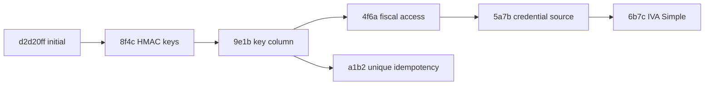

# V2 persistence and data-model research

**Scope.** Read-only inventory of the V2 repository on 2026-09-16. This report is
intended as input to the V3 PostgreSQL microservice design. It covers
`app/db/database.py`, every module under `app/models/`, Alembic, both repository
SQL reports, and `app/utils/persistence.py`. No V2 file was changed.

**Notation used below.** `NULL` is the effective SQLAlchemy nullability. A bare
`Column(...)` is nullable unless it is a primary key. `Py:` means a Python-side
SQLAlchemy default, not a database `server_default`. `IDX` is a non-unique index.
`UQ` is unique. `FK` gives the declared target. `—` means none. `String` has no
length bound in source. The persistence listener replaces most ordinary source
`String` / `JSON` types when columns attach to tables, as described below.

## 1. Engines, connection configuration, and persistence transformations

### Engine selection

| Concern | Current behavior | Evidence |
|---|---|---|
| Default engine | SQLite file `sqlite:///./sql_app.db` | `app/db/database.py:13` |
| Runtime switch | `DATABASE_URL`, if nonempty, is passed verbatim to `create_engine`; it can therefore select PostgreSQL (for example `postgresql+psycopg://...`) as well as SQLite | `app/db/database.py:13,30-38` |
| Alembic default | SQLite file `sqlite:///./sql_app.db` | `alembic.ini:86` |
| Alembic runtime switch | `alembic/env.py` reads `DATABASE_URL` and overwrites `sqlalchemy.url` | `alembic/env.py:24-33,65-72` |
| Docker SQLite relocation | A `sqlite:////code/...` URL is redirected under the repository when `/code` is absent. The code creates the parent directory. | `app/db/database.py:15-21`; `alembic/env.py:27-32` |
| Session factory | Synchronous `sessionmaker(autocommit=False, autoflush=False, bind=engine)` | `app/db/database.py:53` |
| ORM base | Legacy `sqlalchemy.ext.declarative.declarative_base()` | `app/db/database.py:55` |
| Runtime pool | `QueuePool`, size 10, overflow 20, pre-ping, recycle 1,800 seconds | `app/db/database.py:23-38` |
| Migration pool | `NullPool`; migrations use `render_as_batch=True`, `compare_type=True` | `alembic/env.py:47-84` |

There is no hard-coded PostgreSQL URL, dialect branch, `UUID`, `JSONB`, or
Postgres-specific type in the inspected model layer. PostgreSQL is supported by
configuration only. SQLite is the dominant/default configuration.

Repository files confirm SQLite use: `test_local.db` exists at repository root;
additional SQLite files include `data/sql_app.db` (about 133 MB) and several
runtime/test DB files. Their presence is evidence of local SQLite use, not proof
that a production deployment is not PostgreSQL. **GUESS:** production may be
switched by `DATABASE_URL`, but the repository alone does not identify its
actual production endpoint.

### SQLite-specific behavior and portability risks

| SQLite-specific item | Effect / V3 implication | Evidence |
|---|---|---|
| `connect_args={"check_same_thread": False}` | SQLite connection sharing across event-loop threads. This argument is SQLite-specific and may be invalid/unneeded for some PostgreSQL drivers. | `app/db/database.py:28-33` |
| `QueuePool` rationale names SQLite | Comment explicitly says QueuePool is needed with the SQLite thread setting. | `app/db/database.py:28-29` |
| SQLite PRAGMAs | On URLs starting `sqlite`, connection event enables WAL, `busy_timeout=5000`, and `synchronous=NORMAL`. None applies to Postgres. | `app/db/database.py:40-51` |
| Alembic batch mode | `render_as_batch=True` is generally used to work around SQLite `ALTER TABLE` limitations. It is enabled for all dialects. | `alembic/env.py:50-57,76-81` |
| Migrations recreate tables | Fiscal credential migration explicitly uses `recreate="always"`, likely for SQLite type changes. | `alembic/versions/4f6a7b8c9d10_fiscal_log_access.py:40-47` |
| Dynamic table inspection | Several migrations enumerate live tables with SQLAlchemy inspector rather than fixed schema operations. | `4f6a7b8c9d10:22-48`; `5a7b8c9d0e1f:14-31` |

### `app.utils.persistence` behavior

| Type / listener | Stored behavior | V3 design implication | Evidence |
|---|---|---|---|
| `NoUrlJSON` | JSON bind values have URL keys/values removed and sensitive keyed values replaced with `[REDACTED]`. | Keep explicit payload classification. Do not rely on a generic mutation layer to preserve audit semantics. | `app/utils/persistence.py:84-115` |
| `NoUrlString` | A value looking like a URL is persisted as `NULL`. | A potentially surprising destructive transform. Validate at API boundary in V3. | `persistence.py:119-126` |
| `RuntimeApiKeyString` | New API-key values become an HMAC verifier on bind. | Use a dedicated credential/verifier field, never plaintext. | `persistence.py:129-142` |
| `SensitiveString` | Any non-NULL value becomes `[REDACTED]`. | It prevents ordinary sensitive string persistence. | `persistence.py:144-152` |
| `FiscalCredentialString` | SQL type `TEXT`; writes the supplied clear text, but ordinary ORM reads return `[REDACTED]`. | Do not interpret redacted ORM reads as data loss. V3 should avoid storing credentials in execution logs. | `persistence.py:154-171` |
| attach listener | Every `JSON` becomes `NoUrlJSON`; every `String` becomes `FiscalCredentialString` for credential columns of `consulta_*`, `SensitiveString` for otherwise sensitive names, otherwise `NoUrlString`. | The source declaration alone does not always describe the eventual bound/physical type. | `persistence.py:181-199` |

Credential matching considers `clave`, `clave_representante`, `contrasena`, and
`clave_encriptada` fiscal credential names. For `consulta_*` tables this means
`clave` and `clave_representante` are effectively `TEXT` / redacted-on-ORM-read;
`clave_encriptada` is inherited as `String` but is likewise transformed. See
`app/utils/persistence.py:18-35,174-178`.

## 2. Complete current ORM schema

The schema has **33 tables**: one user table, 28 consultation-log tables, two
Playwright job tables, and one credential-access audit table. `credential_log.py`
is a mixin, not a table. Table defaults listed below are ORM/Python defaults,
not database server defaults, unless stated otherwise.

### Shared inherited log column

Every `Consulta*Log` table below inherits this column in addition to its local
columns. It was physically added by migration `5a7b8c9d0e1f` for pre-existing
consultation tables. The source mixin says `String`, but the listener converts
it to `FiscalCredentialString` (`TEXT`) when attached to a `consulta_*` table.

| Column | Effective type | NULL | Default | PK / FK / index / unique | Source |
|---|---|---:|---|---|---|
| `clave_encriptada` | `TEXT` via `FiscalCredentialString` | yes | Py: `current_encrypted_credential` | — | `app/models/credential_log.py:10-16`; `app/utils/persistence.py:174-197` |

### Users

| Column | Effective type | NULL | Default | PK / FK / index / unique |
|---|---|---:|---|---|---|
| `id` | `INTEGER` | no | SQLite integer PK allocation | PK, IDX `ix_users_id` | |
| `mail` | `NoUrlString` / unbounded string | yes | — | UQ, IDX `ix_users_mail` | |
| `api_key` | `RuntimeApiKeyString` / string verifier | yes | — | UQ, IDX `ix_users_api_key` | |
| `maximas_consultas_mensuales` | `INTEGER` | yes | Py: `20` | — | |
| `consultas_realizadas` | `INTEGER` | yes | Py: `0` | — | |
| `habilitado` | `BOOLEAN` | yes | Py: `False` | — | |
| `fecha_ultimo_reset` | `DATETIME` | yes | Py: UTC now | — | |
| `created_at` | `DATETIME` | yes | Py: UTC now | — | |
| `updated_at` | `DATETIME` | yes | Py: UTC now; Py update: UTC now | — | |

Table: `users`. Model and relationship: `User`, with `consultas` relationship
only to `ConsultaLog` (`consulta_mc_logs`). Source: `app/models/user.py:8-24`.
The initial migration creates the same columns and indexes at
`alembic/versions/d2d20ff42fc1_initial_schema.py:26-41`.

### Playwright job tables

| Table / model | Column | Effective type | NULL | Default | PK / FK / index / unique |
|---|---|---|---:|---|---|
| `playwright_jobs_active` / `PlaywrightJobActive` | `job_id` | `NoUrlString` / string | no | application creates UUIDv7 | PK, IDX `ix_playwright_jobs_active_job_id` |
| | `user_id` | `INTEGER` | no | — | FK `users.id`, IDX `ix_playwright_jobs_active_user_id` |
| | `bot` | `NoUrlString` / string | no | — | IDX `ix_playwright_jobs_active_bot` |
| | `operation` | `NoUrlString` / string | no | — | — |
| | `status` | `NoUrlString` / string | no | — | IDX `ix_playwright_jobs_active_status` |
| | `request_data` | `NoUrlJSON` / JSON | no | — | — |
| | `created_at` | `DATETIME` | no | Py: UTC now | IDX `ix_playwright_jobs_active_created_at` |
| | `started_at` | `DATETIME` | yes | — | — |
| | `worker_id` | `NoUrlString` / string | yes | — | — |
| | `attempts` | `INTEGER` | no | Py: `0` | — |
| | `idempotency_key` | `NoUrlString` / string | yes | — | see UQ below |
| `playwright_jobs_history` / `PlaywrightJobHistory` | `job_id` | `NoUrlString` / string | no | application copies UUIDv7 | PK, IDX `ix_playwright_jobs_history_job_id` |
| | `user_id` | `INTEGER` | no | — | FK `users.id`, IDX `ix_playwright_jobs_history_user_id` |
| | `bot` | `NoUrlString` / string | no | — | IDX `ix_playwright_jobs_history_bot` |
| | `operation` | `NoUrlString` / string | no | — | — |
| | `status` | `NoUrlString` / string | no | — | IDX `ix_playwright_jobs_history_status` |
| | `result` | `NoUrlString` / string | yes | — | — |
| | `created_at` | `DATETIME` | no | — | — |
| | `started_at` | `DATETIME` | yes | — | — |
| | `finished_at` | `DATETIME` | no | Py: UTC now | — |
| | `cancel_reason` | `NoUrlString` / string | yes | — | — |
| | `cancelled_by` | `NoUrlString` / string | yes | — | — |
| | `error_message` | `NoUrlString` / string | yes | — | — |

Additional active-job indexes declared by the model are:

| Table | Name | Columns | Unique | Evidence |
|---|---|---|---:|---|
| `playwright_jobs_active` | `idx_jobs_active_status_created` | `status, created_at` | no | `app/models/playwright_job_active.py:36-40` |
| | `idx_jobs_active_user` | `user_id, job_id` | no | same |
| | `idx_jobs_active_bot` | `bot` | no | same, duplicates the column-created bot index by columns |
| `playwright_jobs_history` | `idx_jobs_history_user` | `user_id, job_id` | no | `app/models/playwright_job_history.py:30-34` |
| | `idx_jobs_history_status` | `status` | no | same, duplicates the column-created status index by columns |
| | `idx_jobs_history_bot` | `bot` | no | same, duplicates the column-created bot index by columns |
| `playwright_jobs_active` | `uq_playwright_jobs_active_idempotency` | `user_id, bot, operation, idempotency_key` | yes | migration `a1b2c3d4e5f6:23-33` |

The composite UQ is **not present in the model `__table_args__`**, though it is
created by the final migration on its branch. This is metadata/migration drift.
Both SQLite and PostgreSQL allow multiple `NULL` values under that index, as its
migration comment notes. Sources: `app/models/playwright_job_active.py:9-43`;
`app/models/playwright_job_history.py:9-34`.

### Administration audit table

| Column | Effective type | NULL | Default | PK / FK / index / unique |
|---|---|---:|---|---|---|
| `id` | `INTEGER` | no | SQLite integer PK allocation | PK, IDX `ix_admin_fiscal_credential_audits_id` |
| `timestamp` | `DATETIME` | no | Py: UTC now | — |
| `admin_username` | `NoUrlString` / string | no | — | — |
| `action` | `NoUrlString` / string | no | — | — |
| `table_name` | `NoUrlString` / string | no | — | — |
| `row_id` | `INTEGER` | yes | — | — |
| `affected_rows` | `INTEGER` | yes | — | — |
| `remote_addr` | `NoUrlString` / string | yes | — | — |
| `user_agent` | `NoUrlString` / string | yes | — | — |

Table: `admin_fiscal_credential_audits`. There are no declared FKs, including no
FK from `row_id` to any log record. Source: `app/models/admin_fiscal_credential_audit.py:8-21`.

### Consultation log schema, part 1

All rows in this and the next four sections inherit `clave_encriptada` from the
shared table above. Every consultation table has `id` integer PK and IDX, and
`user_id INTEGER NULL FK users.id`. Every `job_id` shown is an independent,
nullable, indexed string, not an FK to the Playwright job table. `timestamp` is
nullable and defaults in Python to UTC now. `status` is nullable string. For
all listed `String` columns, `NoUrlString` applies except credential fields
(`clave`, `clave_representante`) which become `FiscalCredentialString`/TEXT.
For all JSON fields, `NoUrlJSON` applies.

| Table / source | Local column | Type | NULL | Default | Constraint / index |
|---|---|---|---:|---|---|
| `consulta_aportes_en_linea_logs` `logs_aportes_en_linea.py` | `id` | INTEGER | no | allocation | PK, IDX |
| | `user_id` | INTEGER | yes | — | FK `users.id` |
| | `timestamp` | DATETIME | yes | UTC now | — |
| | `cuit_representante` | String | yes | — | — |
| | `clave_representante` | TEXT credential | yes | — | — |
| | `cuit_representado` | String | yes | — | — |
| | `archivos` | JSON | yes | — | — |
| | `response_data` | JSON | yes | — | — |
| | `job_id` | String | yes | — | IDX |
| | `status` | String | yes | — | — |
| | `error_message` | String | yes | — | — |
| `consulta_ccma_logs` `logs_ccma.py` | `id` | INTEGER | no | allocation | PK, IDX |
| | `user_id` | INTEGER | yes | — | FK `users.id` |
| | `timestamp` | DATETIME | yes | UTC now | — |
| | `cuit_representante` | String | yes | — | — |
| | `clave_representante` | TEXT credential | yes | — | — |
| | `cuit_representado` | String | yes | — | — |
| | `response_ccma` | JSON | yes | — | — |
| | `archivos` | JSON | yes | — | — |
| | `response_data` | JSON | yes | — | — |
| | `job_id` | String | yes | — | IDX |
| | `status` | String | yes | — | — |
| | `error_message` | String | yes | — | — |
| `consulta_certificado_mipyme_logs` `logs_certificado_mipyme.py` | `id` | INTEGER | no | allocation | PK, IDX |
| | `user_id` | INTEGER | yes | — | FK `users.id` |
| | `timestamp` | DATETIME | yes | UTC now | — |
| | `cuit_representante` | String | yes | — | — |
| | `cuit_representado` | String | yes | — | — |
| | `clave_representante` | TEXT credential | yes | — | — |
| | `opciones_encontradas` | JSON | yes | — | — |
| | `archivos` | JSON | yes | — | — |
| | `response_data` | JSON | yes | — | — |
| | `job_id` | String | yes | — | IDX |
| | `status` | String | yes | — | — |
| | `error_message` | String | yes | — | — |
| `consulta_controladores_fiscales_logs` `logs_controladores_fiscales.py` | `id` | INTEGER | no | allocation | PK, IDX |
| | `user_id` | INTEGER | yes | — | FK `users.id` |
| | `timestamp` | DATETIME | yes | UTC now | — |
| | `cuit_representante` | String | yes | — | — |
| | `clave_representante` | TEXT credential | yes | — | — |
| | `cantidad_archivos` | INTEGER | yes | Py: 0 | — |
| | `response_data` | JSON | yes | — | — |
| | `resultados` | JSON | yes | — | — |
| | `archivos` | JSON | yes | — | — |
| | `job_id` | String | yes | — | IDX |
| | `status` | String | yes | — | — |
| | `error_message` | String | yes | — | — |
| `consulta_declaracion_en_linea_logs` `logs_declaracion_en_linea.py` | `id` | INTEGER | no | allocation | PK, IDX |
| | `user_id` | INTEGER | yes | — | FK `users.id` |
| | `timestamp` | DATETIME | yes | UTC now | — |
| | `cuit_representante` | String | yes | — | — |
| | `clave_representante` | TEXT credential | yes | — | — |
| | `cuit_representado` | String | yes | — | — |
| | `representado_nombre` | String | yes | — | — |
| | `periodo_desde` | String | yes | — | — |
| | `periodo_hasta` | String | yes | — | — |
| | `archivos` | JSON | yes | — | — |
| | `response_data` | JSON | yes | — | — |
| | `job_id` | String | yes | — | IDX |
| | `status` | String | yes | — | — |
| | `error_message` | String | yes | — | — |
| `consulta_facturometro_logs` `logs_facturometro.py` | `id` | INTEGER | no | allocation | PK, IDX |
| | `user_id` | INTEGER | yes | — | FK `users.id` |
| | `timestamp` | DATETIME | yes | UTC now | — |
| | `cuit_representante` | String | yes | — | — |
| | `cuit_representado` | String | yes | — | — |
| | `clave` | TEXT credential | yes | — | — |
| | `monto_facturado` | String | yes | — | — |
| | `tope_facturacion` | String | yes | — | — |
| | `categoria` | String | yes | — | — |
| | `archivos` | JSON | yes | — | — |
| | `response_data` | JSON | yes | — | — |
| | `job_id` | String | yes | — | IDX |
| | `status` | String | yes | — | — |
| | `error_message` | String | yes | — | — |
| `consulta_hacienda_logs` `logs_hacienda.py` | `id` | INTEGER | no | allocation | PK, IDX |
| | `user_id` | INTEGER | yes | — | FK `users.id` |
| | `timestamp` | DATETIME | yes | UTC now | — |
| | `desde` | String | yes | — | — |
| | `hasta` | String | yes | — | — |
| | `cuit_representante` | String | yes | — | — |
| | `clave_representante` | TEXT credential | yes | — | — |
| | `cuit_representado` | String | yes | — | — |
| | `nombre_representado` | String | yes | — | — |
| | `cbtes` | JSON | yes | — | — |
| | `archivos` | JSON | yes | — | — |
| | `response_data` | JSON | yes | — | — |
| | `job_id` | String | yes | — | IDX |
| | `status` | String | yes | — | — |
| | `error_message` | String | yes | — | — |

### Consultation log schema, part 2

| Table / source | Local column | Type | NULL | Default | Constraint / index |
|---|---|---|---:|---|---|
| `consulta_libros_iva_logs` `logs_libros_portal_iva.py` | `id` | INTEGER | no | allocation | PK, IDX |
| | `user_id` | INTEGER | yes | — | FK `users.id` |
| | `timestamp` | DATETIME | yes | UTC now | — |
| | `cuit_representante` | String | yes | — | — |
| | `clave_representante` | TEXT credential | yes | — | — |
| | `cuit_representado` | String | yes | — | — |
| | `denominacion` | String | yes | — | — |
| | `periodo_desde` | String | yes | — | — |
| | `periodo_hasta` | String | yes | — | — |
| | `periodos_descargados` | JSON | yes | — | — |
| | `periodos_error` | JSON | yes | — | — |
| | `archivos` | JSON | yes | — | — |
| | `response_data` | JSON | yes | — | — |
| | `job_id` | String | yes | — | IDX |
| | `status` | String | yes | — | — |
| | `error_message` | String | yes | — | — |
| `consulta_liquidacion_granos_logs` `logs_liquidacion_granos.py` | `id` | INTEGER | no | allocation | PK, IDX |
| | `user_id` | INTEGER | yes | — | FK `users.id` |
| | `timestamp` | DATETIME | yes | UTC now | — |
| | `desde` | String | yes | — | — |
| | `hasta` | String | yes | — | — |
| | `cuit_representante` | String | yes | — | — |
| | `clave_representante` | TEXT credential | yes | — | — |
| | `cuit_representado` | String | yes | — | — |
| | `nombre_representado` | String | yes | — | — |
| | `cbtes` | JSON | yes | — | — |
| | `archivos` | JSON | yes | — | — |
| | `response_data` | JSON | yes | — | — |
| | `job_id` | String | yes | — | IDX |
| | `status` | String | yes | — | — |
| | `error_message` | String | yes | — | — |
| `consulta_mc_logs` `logs_mc.py` | `id` | INTEGER | no | allocation | PK, IDX |
| | `user_id` | INTEGER | yes | — | FK `users.id` |
| | `timestamp` | DATETIME | yes | UTC now | — |
| | `desde` | String | yes | — | — |
| | `hasta` | String | yes | — | — |
| | `cuit_representante` | String | yes | — | — |
| | `clave_representante` | TEXT credential | yes | — | — |
| | `cuit_representado` | String | yes | — | — |
| | `nombre_representado` | String | yes | — | — |
| | `emitidos` | BOOLEAN | yes | — | — |
| | `recibidos` | BOOLEAN | yes | — | — |
| | `archivos` | JSON | yes | — | — |
| | `response_data` | JSON | yes | — | — |
| | `job_id` | String | yes | — | IDX |
| | `status` | String | yes | — | — |
| | `error_message` | String | yes | — | — |
| `consulta_mis_facilidades_logs` `logs_mis_facilidades.py` | `id` | INTEGER | no | allocation | PK, IDX |
| | `user_id` | INTEGER | yes | — | FK `users.id` |
| | `timestamp` | DATETIME | yes | UTC now | — |
| | `cuit_representante` | String | yes | — | — |
| | `clave_representante` | TEXT credential | yes | — | — |
| | `cuit_representado` | String | yes | — | — |
| | `denominacion` | String | yes | — | — |
| | `archivos` | JSON | yes | — | — |
| | `response_data` | JSON | yes | — | — |
| | `job_id` | String | yes | — | IDX |
| | `status` | String | yes | — | — |
| | `error_message` | String | yes | — | — |
| `consulta_mis_retenciones_logs` `logs_mis_retenciones.py` | `id` | INTEGER | no | allocation | PK, IDX |
| | `user_id` | INTEGER | yes | — | FK `users.id` |
| | `timestamp` | DATETIME | yes | UTC now | — |
| | `cuit_representante` | String | yes | — | — |
| | `clave_representante` | TEXT credential | yes | — | — |
| | `cuit_representado` | String | yes | — | — |
| | `denominacion` | String | yes | — | — |
| | `periodo_desde` | String | yes | — | — |
| | `periodo_hasta` | String | yes | — | — |
| | `archivos` | JSON | yes | — | — |
| | `response_data` | JSON | yes | — | — |
| | `job_id` | String | yes | — | IDX |
| | `status` | String | yes | — | — |
| | `error_message` | String | yes | — | — |
| `consulta_mis_retenciones_iva_simple_logs` `logs_mis_retenciones_iva_simple.py` | `id` | INTEGER | no | allocation | PK, IDX |
| | `user_id` | INTEGER | yes | — | FK `users.id` |
| | `timestamp` | DATETIME | yes | UTC now | — |
| | `cuit_representante` | String | yes | — | — |
| | `clave_representante` | TEXT credential | yes | — | — |
| | `cuit_representado` | String | yes | — | — |
| | `denominacion` | String | yes | — | — |
| | `periodo_desde` | String | yes | — | — |
| | `periodo_hasta` | String | yes | — | — |
| | `archivos` | JSON | yes | — | — |
| | `response_data` | JSON | yes | — | — |
| | `job_id` | String | yes | — | IDX |
| | `status` | String | yes | — | — |
| | `error_message` | String | yes | — | — |
| `consulta_moa_logs` `logs_moa.py` | `id` | INTEGER | no | allocation | PK, IDX |
| | `user_id` | INTEGER | yes | — | FK `users.id` |
| | `timestamp` | DATETIME | yes | UTC now | — |
| | `cuit_representante` | String | yes | — | — |
| | `clave_representante` | TEXT credential | yes | — | — |
| | `cuit_representado` | String | yes | — | — |
| | `despachos` | JSON | yes | — | — |
| | `despachos_procesados` | INTEGER | yes | Py: 0 | — |
| | `despachos_exitosos` | INTEGER | yes | Py: 0 | — |
| | `despachos_con_error` | INTEGER | yes | Py: 0 | — |
| | `archivos` | JSON | yes | — | — |
| | `response_data` | JSON | yes | — | — |
| | `job_id` | String | yes | — | IDX |
| | `status` | String | yes | — | — |
| | `error_message` | String | yes | — | — |

### Consultation log schema, part 3

| Table / source | Local column | Type | NULL | Default | Constraint / index |
|---|---|---|---:|---|---|
| `consulta_pago_devoluciones_logs` `logs_pago_devoluciones.py` | `id` | INTEGER | no | allocation | PK, IDX |
| | `user_id` | INTEGER | yes | — | FK `users.id` |
| | `timestamp` | DATETIME | yes | UTC now | — |
| | `cuit_representante` | String | yes | — | — |
| | `clave_representante` | TEXT credential | yes | — | — |
| | `cuit_representado` | String | yes | — | — |
| | `request_carga_minio` | BOOLEAN | yes | Py: True | — |
| | `request_proxy` | BOOLEAN | yes | Py: False | — |
| | `archivo_nombre` | String | yes | — | — |
| | `archivo_path` | String | yes | — | — |
| | `errores_por_seccion` | JSON | yes | — | — |
| | `archivos` | JSON | yes | — | — |
| | `response_data` | JSON | yes | — | — |
| | `job_id` | String | yes | — | IDX |
| | `status` | String | yes | — | — |
| | `error_message` | String | yes | — | — |
| `consulta_portal_iva_logs` `logs_portal_iva.py` | `id` | INTEGER | no | allocation | PK, IDX |
| | `user_id` | INTEGER | yes | — | FK `users.id` |
| | `timestamp` | DATETIME | yes | UTC now | — |
| | `cuit_representante` | String | yes | — | — |
| | `clave_representante` | TEXT credential | yes | — | — |
| | `cuit_representado` | String | yes | — | — |
| | `denominacion` | String | yes | — | — |
| | `periodo` | String | yes | — | — |
| | `request_carga_minio` | BOOLEAN | yes | Py: True | — |
| | `request_proxy` | BOOLEAN | yes | Py: False | — |
| | `descarga_csv_ventas` | BOOLEAN | yes | Py: False | — |
| | `descarga_csv_compras` | BOOLEAN | yes | Py: False | — |
| | `importar_txt_ventas` | BOOLEAN | yes | Py: False | — |
| | `importar_txt_compras` | BOOLEAN | yes | Py: False | — |
| | `archivos` | JSON | yes | — | — |
| | `response_data` | JSON | yes | — | — |
| | `importaciones` | JSON | yes | — | — |
| | `job_id` | String | yes | — | IDX |
| | `status` | String | yes | — | — |
| | `error_message` | String | yes | — | — |
| `consulta_portal_iva_carga_logs` `logs_portal_iva_carga.py` | `id` | INTEGER | no | allocation | PK, IDX |
| | `user_id` | INTEGER | yes | — | FK `users.id` |
| | `timestamp` | DATETIME | yes | UTC now | — |
| | `cuit_representante` | String | yes | — | — |
| | `clave_representante` | TEXT credential | yes | — | — |
| | `cuit_representado` | String | yes | — | — |
| | `denominacion` | String | yes | — | — |
| | `periodo` | String | yes | — | — |
| | `operaciones_ng_o_e` | BOOLEAN | yes | Py: False | — |
| | `prorrateo_global` | BOOLEAN | yes | Py: False | — |
| | `prorrateo_asignacion_directa` | BOOLEAN | yes | Py: False | — |
| | `prorrateo_ambos` | BOOLEAN | yes | Py: False | — |
| | `request_proxy` | BOOLEAN | yes | Py: False | — |
| | `resultados_ventas` | JSON | yes | — | — |
| | `resultados_compras` | JSON | yes | — | — |
| | `resultados_aperturas` | JSON | yes | — | — |
| | `archivos_recibidos` | JSON | yes | — | — |
| | `archivos` | JSON | yes | — | — |
| | `response_data` | JSON | yes | — | — |
| | `job_id` | String | yes | — | IDX |
| | `status` | String | yes | — | — |
| | `error_message` | String | yes | — | — |
| `consulta_rcel_logs` `logs_rcel.py` | `id`; `user_id`; `timestamp` | INTEGER; INTEGER; DATETIME | no; yes; yes | allocation; —; UTC now | PK/IDX; FK `users.id`; — |
| | `desde`; `hasta`; `cuit_representante`; `clave_representante`; `cuit_representado`; `nombre_representado` | String; String; String; TEXT credential; String; String | all yes | — | — |
| | `cbtes`; `archivos`; `response_data`; `job_id`; `status`; `error_message` | JSON; JSON; JSON; String; String; String | all yes | — | job_id IDX |
| `consulta_retenciones_percepciones_iibb_agip_logs` `logs_retper_iibb_agip.py` | `id`; `user_id`; `timestamp` | INTEGER; INTEGER; DATETIME | no; yes; yes | allocation; —; UTC now | PK/IDX; FK `users.id`; — |
| | `usuario`; `clave`; `cuit_representado`; `denominacion`; `periodo_desde`; `periodo_hasta` | String; TEXT credential; String; String; String; String | all yes | — | — |
| | `request_carga_minio`; `request_proxy`; `archivos`; `response_data`; `job_id`; `status`; `error_message` | BOOLEAN; BOOLEAN; JSON; JSON; String; String; String | all yes | True; False; —; —; —; —; — | job_id IDX |
| `consulta_retenciones_percepciones_iibb_arba_logs` `logs_retper_iibb_arba.py` | `id`; `user_id`; `timestamp` | INTEGER; INTEGER; DATETIME | no; yes; yes | allocation; —; UTC now | PK/IDX; FK `users.id`; — |
| | `cuit`; `clave`; `denominacion`; `periodo` | String; TEXT credential; String; String | all yes | — | — |
| | `request_carga_minio`; `request_proxy`; `archivos`; `response_data`; `job_id`; `status`; `error_message` | BOOLEAN; BOOLEAN; JSON; JSON; String; String; String | all yes | True; False; —; —; —; —; — | job_id IDX |
| `consulta_retenciones_percepciones_iibb_misiones_logs` `logs_retper_iibb_misiones.py` | `id`; `user_id`; `timestamp` | INTEGER; INTEGER; DATETIME | no; yes; yes | allocation; —; UTC now | PK/IDX; FK `users.id`; — |
| | `cuit_representante`; `clave_representante`; `cuit_representado`; `denominacion`; `periodo_desde`; `periodo_hasta` | String; TEXT credential; String; String; String; String | all yes | — | — |
| | `request_carga_minio`; `request_proxy`; `archivos`; `response_data`; `job_id`; `status`; `error_message` | BOOLEAN; BOOLEAN; JSON; JSON; String; String; String | all yes | True; False; —; —; —; —; — | job_id IDX |

### Consultation log schema, part 4

| Table / source | Local column(s) | Type(s) | NULL | Default | Constraint / index |
|---|---|---|---|---|---|
| `consulta_sct_logs` `logs_sct.py` | `id`; `user_id`; `timestamp` | INTEGER; INTEGER; DATETIME | no; yes; yes | allocation; —; UTC now | PK/IDX; FK `users.id`; — |
| | `cuit_representante`; `clave_representante`; `cuit_representado` | String; TEXT credential; String | all yes | — | — |
| | `archivos`; `response_data`; `job_id`; `status`; `error_message` | JSON; JSON; String; String; String | all yes | — | job_id IDX |
| `consulta_sct_compensaciones_logs` `logs_sct_compensaciones.py` | `id`; `user_id`; `timestamp` | INTEGER; INTEGER; DATETIME | no; yes; yes | allocation; —; UTC now | PK/IDX; FK `users.id`; — |
| | `cuit_representante`; `clave_representante`; `cuit_representado`; `desde`; `hasta` | String; TEXT credential; String; String; String | all yes | — | — |
| | `request_excel`; `request_csv`; `request_pdf`; `archivos`; `response_data`; `job_id`; `status`; `error_message` | BOOLEAN; BOOLEAN; BOOLEAN; JSON; JSON; String; String; String | all yes | False; False; False; —; —; —; —; — | job_id IDX |
| `consulta_sifere_logs` `logs_sifere.py` | `id`; `user_id`; `timestamp` | INTEGER; INTEGER; DATETIME | no; yes; yes | allocation; —; UTC now | PK/IDX; FK `users.id`; — |
| | `cuit_representante`; `clave_representante`; `cuit_representado`; `periodo`; `representado_nombre` | String; TEXT credential; String; String; String | all yes | — | — |
| | `archivos`; `response_data`; `job_id`; `status`; `error_message` | JSON; JSON; String; String; String | all yes | — | job_id IDX |
| `consulta_siper_logs` `logs_siper.py` | `id`; `user_id`; `timestamp` | INTEGER; INTEGER; DATETIME | no; yes; yes | allocation; —; UTC now | PK/IDX; FK `users.id`; — |
| | `cuit_representante`; `clave_representante`; `archivos`; `response_data`; `job_id`; `status`; `error_message` | String; TEXT credential; JSON; JSON; String; String; String | all yes | — | job_id IDX |
| `consulta_srt_logs` `logs_srt.py` | `id`; `user_id`; `timestamp` | INTEGER; INTEGER; DATETIME | no; yes; yes | allocation; —; UTC now | PK/IDX; FK `users.id`; — |
| | `cuit_representante`; `clave_representante`; `cuits_consultados`; `archivos`; `response_data`; `job_id`; `status`; `error_message` | String; TEXT credential; String; JSON; JSON; String; String; String | all yes | — | job_id IDX |
| `consulta_vep_logs` `logs_vep.py` | `id`; `user_id`; `timestamp` | INTEGER; INTEGER; DATETIME | no; yes; yes | allocation; —; UTC now | PK/IDX; FK `users.id`; — |
| | `cuit_representante`; `cuit_representado`; `clave_representante`; `medio_pago`; `archivo_nombre`; `response_nombre_archivo`; `response_ruta_archivo` | String; String; TEXT credential; String; String; String; String | all yes | — | — |
| | `archivos`; `response_data`; `job_id`; `status`; `error_message` | JSON; JSON; String; String; String | all yes | — | job_id IDX |
| `consulta_vep_ccma_logs` `logs_vep_ccma.py` | `id`; `user_id`; `timestamp` | INTEGER; INTEGER; DATETIME | no; yes; yes | allocation; —; UTC now | PK/IDX; FK `users.id`; — |
| | `cuit_representante`; `clave_representante`; `cuit_representado`; `medio_pago` | String; TEXT credential; String; String | all yes | — | — |
| | `response_volante_data`; `response_total_seleccionado`; `response_nombre_archivo`; `response_nombre_qr`; `archivos`; `response_data`; `job_id`; `status`; `error_message` | JSON; INTEGER; String; String; JSON; JSON; String; String; String | all yes | — | job_id IDX |

All models in this section inherit `clave_encriptada TEXT NULL`, with the Py
`current_encrypted_credential` default described above. Source names are exact
paths under `app/models/`; exports are listed in `app/models/__init__.py:7-34`.

## 3. Users table, API keys, and quota

* **ID:** `users.id` is `Integer(primary_key=True, index=True)`, a default
  SQLite integer-primary-key allocation. It is not UUID and has no explicit
  `autoincrement=` in `app/models/user.py:10`.
* **Required V3 removals:** `fecha_ultimo_reset`, `created_at`, and `updated_at`
  are nullable `DATETIME` fields with Python UTC defaults. `updated_at` has a
  Python `onupdate`, not a database trigger. Remove all three as requested.
  Evidence: `app/models/user.py:17-19`.
* **API key:** nullable, indexed, unique `api_key` is `RuntimeApiKeyString`.
  Bind writes use `hmac-sha256$` plus HMAC-SHA256 (`API_KEY_HMAC_SECRET`,
  fallback `SECRET_KEY`), not plaintext. `8f4c2d1a7b90` hashes legacy keys,
  nulls old `[REDACTED]` values, and has an irreversible downgrade. Sources:
  `app/utils/api_keys.py:1-107`; `app/utils/persistence.py:129-142`;
  `alembic/versions/8f4c2d1a7b90_hash_user_api_keys.py:27-65`.
* **Quota:** `maximas_consultas_mensuales INTEGER NULL Py:20` and
  `consultas_realizadas INTEGER NULL Py:0`; `habilitado BOOLEAN NULL Py:false`.
  Validation resets the counter on UTC month change, rejects at the limit (429),
  and increments with an SQLAlchemy atomic `col = col + 1` update. Sources:
  `app/api/deps.py:117-155`; `app/models/user.py:13-17`.
* **Subscription-ish / billing:** there are no subscription, plan, payment,
  invoice, transaction, credit, balance, or entitlement models. The monthly
  counter/cap is the sole billing-adjacent data. `mail` is nullable despite UQ.

**V3 recommendation:** UUIDv4 `users.id`, non-null email UQ, a rotation-ready
API-key-verifier table, and an append-only usage/quota-period ledger. **GUESS:**
a transactional quota reservation or ledger is safer than V2's separate check
and increment, which could oversubscribe under concurrency.

## 4. Unifying logs in V3

### V2 common shape

All 28 consultation tables have an integer PK/index, nullable `user_id` FK,
nullable UTC `timestamp`, status/error text, JSON `archivos` and `response_data`,
nullable indexed string `job_id` with **no FK**, and `clave_encriptada`. Most
have fiscal CUIT/credential fields. All JSON is transformed to `NoUrlJSON`; URL
keys/values are dropped and sensitive data redacted at bind time
(`app/utils/persistence.py:84-115,181-199`). Credential TEXT is clear in DB but
redacted through normal ORM reads (`persistence.py:154-171`).

### Generic worker-owned V3 execution table

| Column | Proposed PostgreSQL design | Absorbs |
|---|---|---|
| `id` | UUIDv7 `uuid PK` | each integer log ID |
| `job_id` | UUIDv7 `uuid`, non-null logical job reference | unlinked V2 job ID |
| `user_id` | UUIDv4 central-API subject reference | each `users.id` FK |
| `bot`, `operation`, `status` | constrained text/enum, non-null | table name, job metadata, status |
| lifecycle fields | `queued_at`, `started_at`, `finished_at timestamptz` | log timestamp plus job dates |
| `request_payload`, `result_payload` | sanitized/redacted `JSONB` | per-bot inputs, `response_data` |
| `error` | text + error-code/JSONB | `error_message`, per-section errors |
| `artifacts` | JSONB manifest or normalized UUIDv7 artifact rows | `archivos`/paths/names |
| `attempt`, `worker_id`, `correlation_id` | typed execution metadata | active jobs/outer request IDs |

Do not carry `clave`, `clave_representante`, or `clave_encriptada` into V3 logs.
Use a short-lived opaque credential reference and a separate access audit.

| Bot / table | Fields that genuinely differ and should be payload |
|---|---|
| CCMA; Certificado; Controladores | `response_ccma`; `opciones_encontradas`; file count and `resultados` |
| Declaración, Libros, Mis Retenciones, IVA Simple, SIFERE | represented name/denomination, periods, downloaded/error period data |
| MC, Hacienda, Liquidación, RCEL | date range, represented name, `emitidos`/`recibidos` or `cbtes` |
| Facturómetro | invoice amount, cap, category |
| MOA | dispatches and processed/success/error counts |
| Pago Devoluciones | MinIO/proxy flags, file name/path, section errors |
| Portal IVA / Carga | period, import/download/proration flags, import or per-section results, received files |
| AGIP / ARBA / Misiones | jurisdiction identity/period/range and proxy/MinIO flags |
| SCT Compensaciones | date range and Excel/CSV/PDF flags |
| SRT | `cuits_consultados` |
| VEP / VEP CCMA | payment method and response file/QR/volante fields |

## 5. IDs and relationships

| Current ID strategy | Exhaustive table set |
|---|---|
| Integer PK allocation | `users`, `admin_fiscal_credential_audits`, and every 28 `consulta_*_logs` table listed in the schema. |
| UUIDv7 in `String` | `playwright_jobs_active.job_id`, `playwright_jobs_history.job_id`. `PlaywrightJobManager.create_job()` calls `uuid7_str()`. Sources: `app/jobs/manager.py:30-86`; `app/utils/uuid7.py:5-30`. |
| UUIDv4 model IDs | None. UUIDv4 `.hex` is only request correlation outside these tables (`app/api/api_router.py:88-154`). |

Relationships: each log user ID is a nullable FK to users; active/history job
user IDs are non-null FKs; only MC has the reverse `User.consultas` relationship.
Log `job_id` does not FK to job tables. Audit `table_name`/`row_id` is a
polymorphic, unenforced reference. These user-to-jobs/logs edges cross the
future central-API identity/quota boundary to worker jobs/execution boundary.
V3 should exchange user UUID/job UUID and events/outbox data rather than retain
cross-microservice DB FKs. **GUESS:** credential material should be a third,
separately-owned security boundary.

## 6. Alembic history and state

| Revision in dependency order | Down revision | What upgrade does |
|---|---|---|
| `d2d20ff42fc1` initial schema | none | Creates users, original consultation logs, active/history jobs, indexes/FKs. `Create Date: 2026-08-29`. |
| `8f4c2d1a7b90` HMAC user keys | `d2d20ff42fc1` | Data-migrates API keys to HMAC verifier. Irreversible. `2026-09-04`. |
| `9e1b2c3d4e5f` job idempotency | `8f4c2d1a7b90` | Adds nullable active `idempotency_key` plus nonunique index. `2026-09-06`. |
| `4f6a7b8c9d10` fiscal log access | `9e1b2c3d4e5f` | Inspects live `consulta_*`; changes credential strings to TEXT via recreate, creates audit table. `2026-09-07`. |
| `5a7b8c9d0e1f` encrypted credential source | `4f6a7b8c9d10` | Dynamically adds `clave_encriptada TEXT` to current consultation tables. |
| `6b7c8d9e0f12` IVA Simple | `5a7b8c9d0e1f` | Creates IVA Simple log table if absent. |
| `a1b2c3d4e5f6` unique job idempotency | `9e1b2c3d4e5f` | Drops prior idempotency index and creates UQ `(user_id,bot,operation,idempotency_key)`. `2026-09-14`. |

There are **two heads**, `6b7c8d9e0f12` and `a1b2c3d4e5f6`, with no merge
revision. The state is not a clean linear migration history. Other drift:
`a1b2`'s UQ is absent from ORM `__table_args__`; the initial migration uses
`NoUrlString` for `api_key` whereas the model now has `RuntimeApiKeyString`.
Dynamic inspector-based table/column guards and `recreate="always"` are manual,
operational edits. `alembic` executable was unavailable, so heads were derived
from all seven revision declarations, not command execution. Evidence:
`alembic/env.py`; every file under `alembic/versions/`.

## 7. Billing, data volume, and retention

Both SQL files, `reporte/query_resumen.sql` and `reporte/query_desglose_cuit.sql`,
are hand-maintained `UNION ALL` reports of success/failure by user/service and
optionally CUIT, filtered by `timestamp`. They are not generic and require edits
when bots change. Each log has only `id` and `job_id` indexes, not user/timestamp
or report dimension indexes. **GUESS:** date-filtered report and retention
queries become table scans at scale.

`data/sql_app.db` is about 133 MB, a local volume hint only. Object-store payload
externalization is documented in `archivos` comments. Retention exists: admin
can delete all logs, or dynamically delete `consulta_*` entries older than a
cutoff while writing audit entries (`app/api/routes/admin.py:845-945`). Job
history is purged by `finished_at` through admin and periodically by worker
(`admin.py:1251-1270`; `app/jobs/manager.py:372-388`; `app/jobs/worker.py:331-373`).
No cleanup was found for users, active jobs, or credential-audit rows.

## 8. V3 checklist

1. Native Postgres `uuid`: users UUIDv4, every bot/job/execution/artifact UUIDv7.
2. One worker execution schema with `JSONB`, bot discriminator, artifact model,
   meaningful lifecycle timestamps and per-data-class retention.
3. Central API owns identity/key verifier/quota. Worker owns jobs/executions.
4. Remove exactly `fecha_ultimo_reset`, `created_at`, `updated_at` from users.
5. Keep API-key HMAC verification and replace scalar quota with an atomic
   reservation or usage ledger.
6. Separate credential brokerage/access audit from execution payloads.
7. Start V3 Alembic at one clean head with CI checking one head and metadata
   consistency. Use `timestamptz`, named constraints, and query-backed indexes.

## Coverage

Read: `app/db/database.py`, `app/models/__init__.py`, all 33 other Python model
modules, `alembic.ini`, `alembic/env.py`, all seven revisions, both `reporte/*.sql`
files, and `app/utils/persistence.py`. This is exhaustive from source/migrations,
not database introspection, so it does not assert each local SQLite file reached
both migration heads.
