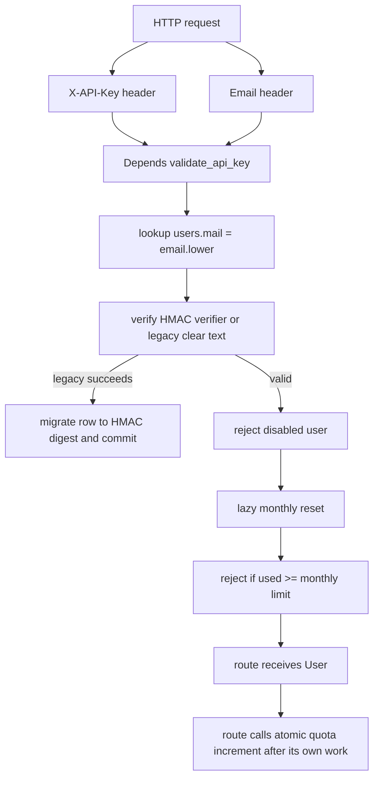
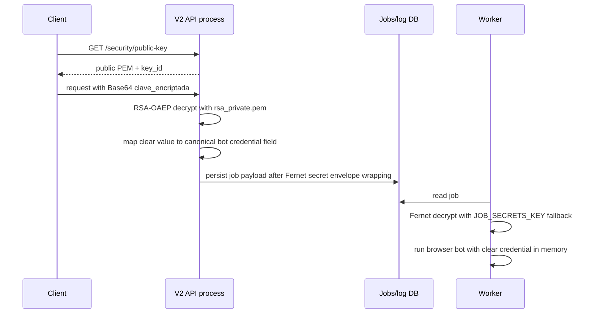

# V2 authentication, administration, configuration, and secrets research

- **Source repository:** `api-bots-mrbot-v2`
- **Research date:** 2026-09-16
- **Method:** read-only source review. No V2 file was modified.
- **Citation convention:** `path:line` refers to the V2 working tree inspected.
- **Secret convention:** this report never reproduces `.env` values. Examples use `<placeholder>`.
- **Scope note:** `app/core/config.py` is only a compatibility re-export. Its canonical settings are actually in `app/jobs/config.py`.

## 1. Executive findings

1. Customer authentication is API-key based, not JWT based.
2. Each customer request presents `X-API-Key` and `Email` headers.
3. Current keys are random `secrets.token_urlsafe(32)` values, approximately 256 bits before URL-safe encoding.
4. At rest, current `users.api_key` values are HMAC-SHA-256 verifiers prefixed `hmac-sha256$`.
5. Legacy clear-text API-key rows are accepted once and are migrated on successful customer authentication.
6. The HMAC secret is `API_KEY_HMAC_SECRET`, with `SECRET_KEY` as an unsafe historical fallback.
7. No JWT issuer, signing code, refresh token, OAuth client, bearer-token validation, or authorization claim model was found in the scoped code.
8. A normal user is a row in `users`; there is no role column, permission table, organization, account, or tenant ID.
9. An administrator is one global environment username/password pair, not a database principal.
10. Admin access accepts either HTTP Basic credentials or a signed cookie session.
11. The cookie is a manually constructed HMAC token and lasts eight hours.
12. The API key quota is a monthly integer counter and limit stored directly on `users`.
13. Authentication resets the monthly counter lazily during an authenticated request.
14. Counting is an atomic `UPDATE value = value + 1`, but the check and increment are separate operations.
15. There is no general request-rate limiter visible in the reviewed scope.
16. Job admission has global and per-user pending-job limits, but they are not the same as the monthly quota.
17. RSA-OAEP is transport encryption for fiscal passwords submitted as `clave_encriptada`.
18. V2 decrypts RSA data in the API process, before it stores work for an asynchronous worker.
19. The worker receives a separate Fernet-encrypted secret envelope, requiring a shared `JOB_SECRETS_KEY` or fallback secret.
20. RSA private-key possession is process/file-system based, not identity-, role-, or service-policy based.
21. A serious design issue is that the credential-log mixin persists a column called `clave_encriptada` as `String`, while its value becomes plaintext during request resolution.
22. The authenticated generic table explorer deliberately casts and displays fiscal credential columns in raw form.
23. Those reads and destructive fiscal-log operations are audited, but ordinary user/admin actions are not comprehensively audited.
24. The panel is Jinja2 server-rendered HTML, not a separate SPA or API management console.
25. It already exposes worker-related job state, worker IDs, cancellation controls, queue metrics, and job-history retention.
26. No MercadoPago, payment, billing, subscription, checkout, or entitlement implementation was found.

## 2. Customer authentication model

### 2.1 Credential issuance and storage

- `generate_api_key()` returns `secrets.token_urlsafe(32)` in `app/api/routes/user.py:25-27`.
- The protected `/user/` creation endpoint generates that key at `app/api/routes/user.py:30-59`.
- The protected `/user/reset-key/` endpoint rotates it at `app/api/routes/user.py:66-95`.
- The browser admin creation form either accepts an operator-supplied key or generates one at `app/api/routes/admin.py:494-536`.
- The browser admin rotation form takes an operator-supplied new key at `app/api/routes/admin.py:1407-1431`.
- API-key emails are optional in the admin flow and sent immediately after creation at `app/api/routes/admin.py:548-572`.
- The API `/user` routes email newly generated keys at `app/api/routes/user.py:53-59` and `85-91`.
- `User.api_key` uses `RuntimeApiKeyString`, is unique and indexed, and has storage policy metadata `hmac_digest` at `app/models/user.py:26-35`.
- SQLAlchemy calls `digest_for_storage()` for INSERT, UPDATE, and equality bind values in `app/utils/persistence.py:129-141`.
- `digest_for_storage()` preserves `None` and already-digested values, otherwise computes a digest at `app/utils/api_keys.py:100-107`.
- Digest format is `hmac-sha256$` plus 64 lower-case hexadecimal characters at `app/utils/api_keys.py:18-25`.
- The digest is HMAC-SHA-256 over the exact presented key at `app/utils/api_keys.py:55-62`.
- The secret selection is `API_KEY_HMAC_SECRET` first, otherwise `SECRET_KEY`, at `app/utils/api_keys.py:32-40`.
- Missing both secrets raises `ApiKeySecretConfigurationError`; verification then fails closed at `app/utils/api_keys.py:85-90`.
- No password hashing algorithm is involved for customer keys because they are random bearer secrets, not user-chosen passwords.

### 2.2 Header-to-user code path

- FastAPI obtains `x_api_key` from header `X-API-Key` and `email` from `Email` in `app/api/deps.py:102-105`.
- Missing key is `401`; missing email is `400` at `app/api/deps.py:107-111`.
- `validate_api_key()` invokes `get_user_by_api_key(db, email, x_api_key)` at `app/api/deps.py:113-115`.
- The lookup is a case-insensitive-by-normalization exact database lookup: `User.mail == email.lower()` at `app/api/deps.py:37-56`.
- It verifies the supplied key against the stored value with `verify_api_key()` at `app/api/deps.py:54-56`.
- A digest comparison uses `hmac.compare_digest()` at `app/utils/api_keys.py:85-90`.
- A legacy value uses a constant-time byte comparison at `app/utils/api_keys.py:92-97`.
- If a legacy value authenticates, the request updates the row to an HMAC digest and commits at `app/api/deps.py:58-66`.
- The migration is deliberately refused if HMAC-secret configuration is unavailable at `app/api/deps.py:58-64`.
- A failed lookup or comparison returns `401 API key o email inválido` at `app/api/deps.py:113-115`.
- A disabled user returns `403` at `app/api/deps.py:117-118`.
- Many business routes inject this dependency, for example `consulta_cuit` at `app/api/routes/consulta_cuit.py:24-53`.
- The repository search found 30 route modules using `Depends(validate_api_key)`.

### 2.3 JWT and HTTP authentication conclusions

- **JWT:** no JWT issuance or validation was found in the reviewed auth, route, model, schema, config, or search results.
- **Customer bearer auth:** the service uses the API key itself as a bearer secret in `X-API-Key`, plus an email selector.
- **Admin Basic auth:** HTTP Basic is supported through `HTTPBasic(auto_error=False)` at `app/api/routes/admin.py:42-43`.
- **Admin browser auth:** a form login creates a signed cookie at `app/api/routes/admin.py:419-444`.
- **Admin API `/user` routes:** `require_admin()` delegates to the same `verify_admin()` policy at `app/api/deps.py:22-34`.
- **GUESS:** no route-wide gateway is enforcing an alternative JWT scheme, because the individual routes consistently inject `validate_api_key`.

## 3. Roles, permissions, and tenant model

### 3.1 Current authorization classes

| Class | Representation | Capability | Evidence |
|---|---|---|---|
| Public client | None | Can call the public RSA public-key endpoint | `app/api/routes/security.py:7-20` |
| Customer | `users` row with API-key verifier | Can invoke routes that use `validate_api_key` if enabled and under quota | `app/api/deps.py:102-138` |
| Disabled customer | `habilitado=False` | Authenticated key is denied | `app/api/deps.py:117-118` |
| Administrator | One env username/password or corresponding signed cookie | All `/admin` UI actions and `/user` provisioning routes | `app/api/routes/admin.py:141-198`; `app/api/deps.py:22-34` |
| Worker process | Operational process identity only | Reads job payloads and restores secret envelope | `app/jobs/worker.py:18`; `app/utils/job_secrets.py:147-169` |

- `users` has no `role`, `permission`, `scope`, `organization_id`, `tenant_id`, `account_id`, or plan column in `app/models/user.py:24-43`.
- `UserInDB` exposes no such claim either at `app/schemas/user.py:16-34`.
- User isolation is only by `User.id` and email, including job ownership references used by the jobs panel at `app/api/routes/admin.py:1014-1089`.
- The admin credential pair is process configuration, not a row that can be disabled, audited at login, or assigned granular permissions.
- `verify_admin()` accepts a valid signed cookie first, otherwise Basic username/password, at `app/api/routes/admin.py:182-198`.
- `ADMIN_USERNAME` and `ADMIN_PASSWORD` are compared with `secrets.compare_digest()` at `app/api/routes/admin.py:189-191`.
- The panel’s cookie has name `mrbot_admin_session`, `HttpOnly`, `SameSite=Lax`, eight-hour max age, and conditional `Secure` at `app/api/routes/admin.py:60-61` and `435-443`.
- The cookie payload is `<username>:<unix-expiry>:<HMAC>` at `app/api/routes/admin.py:160-179`.
- Its signing secret is `ADMIN_SESSION_SECRET` if present, otherwise the concatenated admin username and password at `app/api/routes/admin.py:152-157`.
- **No tenant or organization concept exists.** This is a direct model/schema finding, not a guess.

### 3.2 V3 authorization requirements

1. Create identity records separate from API keys.
2. Create organization/tenant records and make every user, API key, quota, job, artifact, and audit record tenant-scoped.
3. Add named roles and explicit permissions, especially `support_read`, `credential_audit_read`, `credential_delete`, `job_cancel`, and `user_manage`.
4. Use short-lived OIDC/OAuth or signed JWT access tokens for people, with MFA for administrators.
5. Keep service-to-service authentication separate, preferably workload identity plus mTLS or short-lived signed service tokens.
6. Keep API keys as scoped, rotatable client credentials with identifier, prefix, creation date, expiration, last-used timestamp, and revocation state.
7. Do not use a global environment password as the durable admin identity system.

## 4. Quotas, rate limiting, and consumption

### 4.1 Users-table quota state

| Column | Type/default | Present meaning | Evidence |
|---|---|---|---|
| `id` | integer primary key | Internal customer identity and job ownership key | `app/models/user.py:26` |
| `mail` | unique indexed string | API-key lookup selector | `app/models/user.py:27`; `app/api/deps.py:54` |
| `api_key` | unique indexed HMAC-backed type | API-key verifier, never intended clear text | `app/models/user.py:28-35` |
| `maximas_consultas_mensuales` | integer, default 20 | Monthly allowance | `app/models/user.py:36` |
| `consultas_realizadas` | integer, default 0 | Current monthly consumption counter | `app/models/user.py:37` |
| `habilitado` | boolean, default false | Account service enablement flag | `app/models/user.py:38` |
| `fecha_ultimo_reset` | datetime UTC default | Last lazy quota-period reset time | `app/models/user.py:39` |
| `created_at` | datetime UTC default | Customer creation timestamp | `app/models/user.py:40` |
| `updated_at` | UTC default/onupdate | Last update timestamp | `app/models/user.py:41` |

- The model docstring calls `fecha_ultimo_reset` “fecha del último reinicio de la contraseña,” but its actual usage is quota reset, not password reset, at `app/models/user.py:14-22`.
- This documentation mismatch should be fixed in V3.
- Admin creation initializes `consultas_realizadas=0` and `fecha_ultimo_reset=now` at `app/api/routes/admin.py:526-535`.
- Admin can change the monthly limit but not explicitly reset usage through a dedicated action at `app/api/routes/admin.py:1434-1464`.
- The protected balance endpoint returns `limit - used` at `app/api/routes/user.py:98-130`.

### 4.2 Monthly enforcement sequence

1. `validate_api_key()` authenticates the customer first at `app/api/deps.py:102-115`.
2. It rejects disabled accounts at `app/api/deps.py:117-118`.
3. It gets UTC time at `app/api/deps.py:120`.
4. It checks whether `fecha_ultimo_reset` is absent or its year/month precedes current UTC year/month at `app/api/deps.py:121-128`.
5. It resets `consultas_realizadas` to zero and updates `fecha_ultimo_reset`, committing at `app/api/deps.py:129-131`.
6. It compares `consultas_realizadas >= maximas_consultas_mensuales` at `app/api/deps.py:133`.
7. Reaching the limit produces HTTP 429 at `app/api/deps.py:133-136`.
8. The route receives the user only after that sequence at `app/api/deps.py:138`.
9. Successful routes typically call `incrementar_consultas_realizadas(db, usuario.id)`.
10. The helper uses one SQL expression `User.consultas_realizadas + 1` at `app/api/deps.py:141-153`.
11. Repository search found this helper throughout most synchronous bot routes, such as `app/api/routes/aportes_en_linea.py:98`, `app/api/routes/ccma.py:82`, and `app/api/routes/mis_comprobantes.py:122`.
12. **GUESS:** some exceptional/legacy routes may be inconsistent because billing is invoked individually after business work rather than by a central middleware or job state machine.

### 4.3 What is not a rate limit

- No IP-based, API-key-per-minute, endpoint, burst, leaky-bucket, token-bucket, Redis, or gateway rate limiter was found in the scoped code.
- The 429 above is a monthly allowance denial, not time-window request throttling.
- `MAX_BOTS` is local worker concurrency, not customer request rate limiting, as documented at `app/jobs/config.py:1-6` and `28-34`.
- `MAX_PENDING_JOBS` is global queue backpressure, default 500, at `app/jobs/config.py:50-54`.
- `MAX_PENDING_JOBS_PER_USER` is a per-user pending-job cap, defaulting to the global cap, at `app/jobs/config.py:56-70`.
- Those job queue controls are V2 operational limits, not rows on the `users` table.

### 4.4 Quota weaknesses and V3 design

1. Make reservation/debit atomic with admission, not a read check followed by later increment.
2. Decide and document the charging event: submitted, accepted, started, completed, or successful result.
3. Store immutable ledger events with idempotency keys, not only a mutable monthly total.
4. Use a transaction or conditional update such as `used < limit` to eliminate oversubscription races.
5. Implement all reset/period calculations centrally in a billing/quota service, with explicit timezone and billing-cycle state.
6. Add API-key and tenant rate limits at the gateway, plus per-operation concurrency and cost units.
7. Have workers report state transitions to a central usage service; workers must not make uncoordinated quota decisions.
8. Return standard rate-limit headers and a `Retry-After` where appropriate.

## 5. RSA credential transport and job secret handling

### 5.1 RSA file and key management in V2

- `KEY_DIR` is `Path(os.getenv("MRBOT_KEYS_DIR", "./mrbot-keys"))` at `app/security/rsa_credentials.py:19`.
- The private file is `<KEY_DIR>/rsa_private.pem` at `app/security/rsa_credentials.py:20`.
- The public file is `<KEY_DIR>/rsa_public.pem` at `app/security/rsa_credentials.py:21`.
- The documented `.env.example` default is `MRBOT_KEYS_DIR=./mrbot-keys` at `.env.example:191-194`.
- The example tells operators to use `python scripts/generate_rsa_keys.py` at `.env.example:191-194`.
- Private PEM loading uses `serialization.load_pem_private_key(raw, password=None)` at `app/security/rsa_credentials.py:56-63`.
- Therefore V2 expects an **unencrypted private PEM file**. File permissions and mount access are the principal protection.
- Public PEM loading uses `serialization.load_pem_public_key()` at `app/security/rsa_credentials.py:46-53`.
- The algorithm is RSA-OAEP with MGF1 SHA-256 and SHA-256 at `app/security/rsa_credentials.py:22-23` and `38-43`.
- Ciphertext encoding is Base64 at `app/security/rsa_credentials.py:22-23` and `78-83`.
- The public key identifier is SHA-256 of the public PEM bytes at `app/security/rsa_credentials.py:74-75`.
- `/security/public-key` returns key ID, algorithm, encoding, and PEM to any client at `app/api/routes/security.py:7-20`.
- Failure to read public material returns HTTP 503, not its underlying error, at `app/api/routes/security.py:10-20`.

### 5.2 Exact encrypted-credential flow

- The accepted public aliases are `clave`, `clave_representante`, and `contrasena` at `app/security/rsa_credentials.py:24-28`.
- Pydantic request schemas expose optional `clave_encriptada` described as RSA-OAEP-SHA256 Base64 at `app/schemas/credentials.py:11-22`.
- The request validator calls `resolve_model_payload()` before normal validation at `app/schemas/credentials.py:72-77`.
- `decrypt_credential()` Base64-validates, loads the private key, RSA decrypts, and UTF-8 decodes at `app/security/rsa_credentials.py:86-94`.
- Failure becomes a generic `CredentialDecryptionError`, avoiding raw cryptographic detail at `app/security/rsa_credentials.py:34-35` and `86-94`.
- If encrypted input exists, `resolve_credential_payload()` replaces `clave_encriptada` with plaintext at `app/security/rsa_credentials.py:97-116`.
- If no plaintext alias was supplied, it copies that decrypted value into the canonical declared credential field at `app/security/rsa_credentials.py:119-134`.
- If plaintext and encrypted data both appear, the plaintext value wins for execution, per `app/security/rsa_credentials.py:100-102` and `169-171`.
- Multiple plaintext aliases must match, otherwise the request fails at `app/security/rsa_credentials.py:157-171`.
- A `ContextVar` retains the value sourced from `clave_encriptada` at `app/security/rsa_credentials.py:29-31`, `123-129`, and `175-180`.

### 5.3 Who can decrypt in V2

- Any process identity that can read `mrbot-keys/rsa_private.pem` can decrypt RSA client payloads.
- The API process is explicitly intended to hold that private key, according to `app/security/rsa_credentials.py:1-5`.
- A client with only `rsa_public.pem` can encrypt but cannot decrypt.
- The worker’s shown path does **not** need the RSA private key after the API has decrypted the request.
- Instead, the worker restores job secrets using Fernet at `app/utils/job_secrets.py:147-169`.
- That Fernet key derives from `JOB_SECRETS_KEY`, falling back to `SECRET_KEY`, then `API_KEY_HMAC_SECRET`, at `app/utils/job_secrets.py:59-75`.
- Consequently any worker that needs execution credentials must have the shared secret or an equivalent fallback secret.
- Shared fallback use couples API-key verification, admin/session behavior, and job-secret recovery more than V3 should permit.

### 5.4 Persisted credential and logging risk

- `CredentialLogMixin.clave_encriptada` is a nullable plain SQLAlchemy `String` with default `current_encrypted_credential` at `app/models/credential_log.py:1-17`.
- Its module comment says the persistence layer stores the field as `TEXT` while normal ORM reads are redacted by `FiscalCredentialString` at `app/models/credential_log.py:1-5`.
- However this mixin’s actual column type is `String`, not `FiscalCredentialString`.
- The resolver stores the **decrypted value** into `clave_encriptada` at `app/security/rsa_credentials.py:109-110`.
- Thus the apparent ciphertext field name is misleading. The source strongly indicates clear fiscal credentials can be placed in consultation-log storage.
- The generic table UI casts credential fields to text deliberately to read raw values at `app/api/routes/admin.py:754-772`.
- This is a high-priority V3 migration risk. Preserve needed auditability without retaining reversible customer credentials in ordinary logs.

### 5.5 V3 separation-of-services design

1. Do not distribute the RSA private PEM to every worker.
2. Replace PEM files with KMS/HSM-managed asymmetric or envelope-encryption keys and key IDs.
3. Let the API decrypt only after authentication, authorization, schema validation, and audit intent are established.
4. The API should create a short-lived, job-specific encrypted envelope for an authorized worker identity.
5. The worker should receive only a wrapped data-encryption key or a KMS decrypt grant constrained to job ID, tenant, worker identity, purpose, and expiry.
6. Bind encrypted envelopes to tenant, job ID, bot, credential purpose, and expiration with authenticated encryption additional data.
7. Use a per-job data key and rotate root keys. Never reuse `SECRET_KEY` for RSA, HMAC, sessions, and Fernet.
8. Store ciphertext and metadata only. Do not persist plaintext in logs, error messages, admin tables, or analytics exports.
9. Key rotation requires `key_id`, dual-read capability during migration, rewrap workflow, revocation, and an access audit trail.
10. Workers should wipe in-memory credential references when feasible and never log payload structures containing them.

## 6. Admin panel inventory

### 6.1 Rendering and navigation

- The router prefix is `/admin`, excluded from OpenAPI, at `app/api/routes/admin.py:42`.
- It initializes `Jinja2Templates(directory=app/templates)` at `app/api/routes/admin.py:46-49`.
- The templates are `admin/base.html`, `admin/login.html`, `admin/users.html`, `admin/tables.html`, `admin/jobs.html`, and `admin/reporting.html`.
- The shared layout uses server-side Jinja inheritance and navigation at `app/templates/admin/base.html:1-178`.
- The base/nav has sections for Users, Tables, Jobs, Reporting, plus logout. See `app/templates/admin/base.html`.
- Login is a server-rendered form POSTing to `/admin/login` at `app/templates/admin/login.html:22-32`.
- User page inherits base at `app/templates/admin/users.html:1-5`.
- Jobs page inherits base at `app/templates/admin/jobs.html:1-4`.
- Tables page inherits base at `app/templates/admin/tables.html:1-4`.
- Reporting page inherits base at `app/templates/admin/reporting.html:1-5`.

### 6.2 Endpoint and page inventory

| Method/path | Auth | Page/action | Key behavior and evidence |
|---|---|---|---|
| `GET /admin` | Cookie check only | Login or redirect | Renders login unless session exists, then redirects users page. `admin.py:408-416` |
| `POST /admin/login` | Form username/password | Sign in | Constant-time env credential comparison, creates 8h cookie. `admin.py:419-444` |
| `POST /admin/logout` | None required | Sign out | Deletes admin cookie. `admin.py:447-451` |
| `GET /admin/legacy` | Admin | Redirect | Redirects old path to users. `admin.py:454-456` |
| `GET /admin/users` | Admin | User page | Search users by numeric ID or email. `admin.py:459-491` |
| `POST /admin/users/create` | Admin | Create user | Validates email, quota, key, enabled state, optional email. `admin.py:494-573` |
| `POST /admin/users/bulk` | Admin | Bulk enable/disable | Enables/disables selected IDs. `admin.py:1354-1385` |
| `POST /admin/users/{id}/toggle` | Admin | Toggle one user | Flips `habilitado`. `admin.py:1388-1404` |
| `POST /admin/users/{id}/api-key` | Admin | Rotate/set key | Rejects blank/duplicate, assigns new key. `admin.py:1407-1431` |
| `POST /admin/users/{id}/monthly-limit` | Admin | Set allowance | Rejects negative, updates monthly cap. `admin.py:1434-1464` |
| `GET /admin/tables` | Admin | Table explorer | Reflects DB tables, filter/query preview, includes fiscal credential exception. `admin.py:576-827` |
| `POST /admin/tables/clear-consulta-logs` | Admin | Delete all consultation logs | Requires `ELIMINAR`, deletes all `consulta_*`, audits each table. `admin.py:830-894` |
| `POST /admin/tables/purge-consulta-logs` | Admin | Retention purge | Deletes rows older than chosen days by timestamp, audits each table. `admin.py:897-945` |
| `GET /admin/jobs` | Admin | Job dashboard | Lists active/history jobs with filters and worker data. `admin.py:948-1180` |
| `POST /admin/jobs/{job_id}/cancel` | Admin | Cancel one job | Calls in-process `worker_manager` for running jobs, then manager cancel. `admin.py:1183-1248` |
| `POST /admin/jobs/purge` | Admin | Purge history | Deletes old job-history rows using retention days. `admin.py:1251-1270` |
| `GET /admin/jobs/metrics` | Admin | JSON operational metrics | Queue depth, scheduling latency, duration p50/p95/p99. `admin.py:1273-1283` |
| `POST /admin/jobs/bulk_cancel` | Admin | Cancel selected jobs | Performs same cancellation loop for selected active IDs. `admin.py:1286-1351` |
| `GET /admin/reporting` | Admin | Report page | Executes selected date-range SQL, preview max 200, summary totals. `admin.py:1467-1553` |
| `GET /admin/reporting/download` | Admin | CSV export | Executes report query and streams CSV. `admin.py:1556-1613` |
| `GET /admin/reports/download` | Admin | Legacy CSV alias | Delegates legacy params to above. `admin.py:1616-1630` |

### 6.3 What the pages do

- **Users:** creates accounts, sets enabled state and quota, accepts key input, optionally emails it, searches, bulk enables/disables, and changes individual keys/limits. `app/templates/admin/users.html:3-118`.
- The Users UI displays “Configurada” rather than the API key value. `app/templates/admin/users.html:107-118`.
- **Tables:** reflects every database table, shows selected columns, supports equality/range/multiselect filters, limits up to 5,000 rows, and has a “show all” option. `app/api/routes/admin.py:55-58`, `576-827`; `app/templates/admin/tables.html:49-112`.
- **Tables risky exception:** noncredential sensitive markers are hidden, but credential columns named `clave`, `clave_representante`, `contrasena`, or `clave_encriptada` in `consulta_*` are intentionally appended for admins. `app/api/routes/admin.py:63-114`.
- **Jobs:** filters by general query, status, bot, user ID, job ID, and limit. `app/templates/admin/jobs.html:3-56`.
- The jobs grid exposes job ID, user, bot, operation, status, result, created/started/finished timestamps, worker ID, cancellation reason, and actions. `app/templates/admin/jobs.html:73-88`.
- **Reporting:** runs either `resumen` or `desglose_cuit` SQL by date interval, shows totals and supports CSV download. `app/templates/admin/reporting.html:3-70`.
- Report SQL comes only from the fixed mapping to `query_resumen.sql` and `query_desglose_cuit.sql`, not user-supplied SQL, at `app/api/routes/admin.py:51-54` and `211-277`.

### 6.4 Existing worker and health visibility

- The panel exposes **job visibility**, not a distinct worker health page.
- Jobs are read from `playwright_jobs_active` and `playwright_jobs_history` models imported at `app/api/routes/admin.py:34-35`.
- It distinguishes PENDIENTE, CORRIENDO, COMPLETO, and CANCELADO in the UI at `app/templates/admin/jobs.html:13-18`.
- It displays `worker_id` as a job field at `app/templates/admin/jobs.html:77-88`.
- It exposes queue depth, start latency, and duration percentiles in authenticated JSON via `/admin/jobs/metrics` at `app/api/routes/admin.py:1273-1283`.
- Cancellation calls `worker_manager.cancel_running()` through an in-process import at `app/api/routes/admin.py:1197-1207` and `1306-1314`.
- That is a V2 monolith assumption. A V3 central admin service cannot rely on importing a worker singleton.
- V3 must preserve: job state, owner/tenant, worker assignment, timings, cancellation reason, retry/attempt data, queue depth, and percentiles.
- V3 should add: worker heartbeat, version/build, capacity, browser pool health, drain state, last error, liveness/readiness, queue partition lag, dead-letter visibility, and command acknowledgement.

### 6.5 V3 panel features to retain and improve

1. Retain customer search, account enablement, key rotation, plan/allowance control, job inspection, cancellation, retention operations, reports, and CSV exports.
2. Replace direct generic database reflection with purpose-built, paginated, permissioned resource views.
3. Never display credential columns. Replace with presence, source, last-use, masked fingerprint, and audited break-glass workflow if recovery is legally necessary.
4. Add CSRF defenses for every cookie-authenticated state-changing form.
5. Use real admin users, OIDC sessions, MFA, roles, device/session inventory, forced logout, and immutable audit events.
6. Send cancellation commands over a durable control plane and show acknowledged versus pending cancellation.
7. Use an observability backend for metrics rather than exposing only ad hoc database-derived values.

## 7. Audit logging

### 7.1 Credential-log mixin

- `CredentialLogMixin` contributes `clave_encriptada` to consultation log models at `app/models/credential_log.py:11-17`.
- It marks the field `info={"expose": False}` at `app/models/credential_log.py:12-16`.
- The repository search found the mixin incorporated into many `Consulta*Log` models, for example Aportes, CCMA, MiPyME, Controladores Fiscales, Mis Comprobantes, and others.
- It is not an append-only access audit. It is a data-bearing log-field mixin.
- Its name should not be interpreted as proof of ciphertext at rest, given the resolver behavior described in Section 5.4.

### 7.2 Admin fiscal-credential access audit

| Field | Meaning | Evidence |
|---|---|---|
| `id` | Primary key | `app/models/admin_fiscal_credential_audit.py:13` |
| `timestamp` | UTC default event time | `app/models/admin_fiscal_credential_audit.py:14` |
| `admin_username` | Global admin name from auth | `app/models/admin_fiscal_credential_audit.py:15` |
| `action` | e.g. read/delete/retention operation | `app/models/admin_fiscal_credential_audit.py:16` |
| `table_name` | Affected consultation table | `app/models/admin_fiscal_credential_audit.py:17` |
| `row_id` | Optional credential-record identity | `app/models/admin_fiscal_credential_audit.py:18` |
| `affected_rows` | Optional bulk operation count | `app/models/admin_fiscal_credential_audit.py:19` |
| `remote_addr` | `request.client.host` | `app/models/admin_fiscal_credential_audit.py:20`; `admin.py:127-137` |
| `user_agent` | Request User-Agent header | `app/models/admin_fiscal_credential_audit.py:21`; `admin.py:127-137` |

- `_record_fiscal_audit()` creates events with those fields at `app/api/routes/admin.py:117-138`.
- Deleting all `consulta_*` rows records action `delete_all` for each table at `app/api/routes/admin.py:865-878`.
- Retention purges record action `retention_purge` for each table at `app/api/routes/admin.py:917-935`.
- Reading a fiscal credential via table explorer should be audited by the design intent, but the visible reviewed `admin_tables` lines show raw selection and no direct `_record_fiscal_audit()` call. **GUESS:** verify this behavior with an integration test before asserting read events are emitted.
- The model has no tenant, target customer, before/after values, request/correlation ID, session ID, reason/ticket, success/failure, or tamper-evident chain.
- V3 should emit immutable structured audit events for every admin authentication, view, export, key lifecycle event, quota change, job command, credential access attempt, policy decision, and data deletion.

## 8. Configuration inventory

### 8.1 Interpretation rules

- Source-of-truth job values are loaded from env at import in `app/jobs/config.py:8-25`.
- `app/core/config.py:1-20` only re-exports six job settings and omits several current job settings.
- “V3 owner” below is a recommendation based on code usage: **Central**, **Worker**, **Both**, **Build/ops**, or **Retire/decide**.
- Defaults reflect code when present. “Example” means `.env.example` supplies a sample but inspected code has no typed default in the scoped source.
- Every variable below appears in `.env.example`; duplicate `MINIO_BUCKET_JSON` declarations are listed once with all source lines.

| Variable | Type/default | Purpose | V3 owner | Evidence |
|---|---|---|---|---|
| `CONTEXT_SSL` | bool, code default `true` | Require verified TLS for SMTP | Central | `.env.example:1-7`; `email.py:39-50` |
| `SMTP_USER` | string required | SMTP login/from address | Central | `.env.example:3-7`; `email.py:52-73` |
| `SMTP_PASSWORD` | secret required | SMTP login password | Central | `.env.example:3-7`; `email.py:52-73` |
| `SMTP_PORT` | int, code default `587` | SMTP STARTTLS port | Central | `.env.example:3-7`; `email.py:60-66` |
| `SMTP_SERVER` | string required | SMTP host | Central | `.env.example:3-7`; `email.py:52-57` |
| `SQLITE_DATABASE` | string, example only | sqlitebrowser/local DB tool setting | Retire/ops | `.env.example:9-11` |
| `SQLITE_WEB_PASSWORD` | secret/string, example empty | sqlitebrowser/local DB tool password | Retire/ops | `.env.example:9-11` |
| `DATABASE_URL` | database DSN | Application database connection | Both, distinct least-privilege DSNs | `.env.example:13-14` |
| `CORS_MODE` | enum, code default `public` | CORS public/allowlist/disabled policy | Central | `.env.example:16-21`; `cors.py:34-35,177-212` |
| `CORS_ALLOWED_ORIGINS` | comma/newline origin list | Explicit browser origin allowlist | Central | `.env.example:16-21`; `cors.py:159-174` |
| `CORS_ALLOW_CREDENTIALS` | bool, code default `false` | Permit credentials only in allowlist mode | Central | `.env.example:16-21`; `cors.py:199-211` |
| `SECRET_KEY` | secret | Legacy fallback for API HMAC and job Fernet | Retire after split | `.env.example:23-30`; `api_keys.py:32-40`; `job_secrets.py:66-75` |
| `JOB_SECRETS_KEY` | secret | Fernet root for persisted job secret envelope | Both or replace KMS | `.env.example:25-27`; `job_secrets.py:59-75` |
| `API_KEY_HMAC_SECRET` | secret | HMAC verifier root for API keys | Central | `.env.example:28-30`; `api_keys.py:18-40` |
| `ADMIN_USERNAME` | string required | Single V2 admin identity | Retire to IdP | `.env.example:32-34`; `admin.py:141-149` |
| `ADMIN_PASSWORD` | secret required | Single V2 admin password | Retire to IdP | `.env.example:32-34`; `admin.py:141-149` |
| `SERVER_PROXY` | bool, default false in code | Enable ordinary proxy configuration | Worker | `.env.example:36-54`; `proxies.py:9-17` |
| `PROXY_DEBUG` | bool, default false | Proxy diagnostics | Worker | `.env.example:36-54`; `proxies.py:32` |
| `USERNAME_PROXY` | secret/string | Ordinary proxy username | Worker | `.env.example:40-42`; `proxies.py:15-16` |
| `PASSWORD_PROXY` | secret | Ordinary proxy password | Worker | `.env.example:40-42`; `proxies.py:15-16` |
| `SERVER_PROXY_HOST` | host string | Ordinary/rotating proxy endpoint | Worker | `.env.example:40-42`; `proxies.py:9-16,94-105` |
| `PUERTO_PROXY_FIJO` | bool, default false | Choose fixed proxy-port behavior | Worker | `.env.example:44-47`; `proxies.py:11-14` |
| `PUERTO_PROXY_FIJO_NUMERO` | int, code default 0 | Fixed proxy port | Worker | `.env.example:44-47`; `proxies.py:11-14` |
| `PUERTO_PROXY_MINIMO` | int/string | Random-port lower bound | Worker | `.env.example:44-47`; `proxies.py:13-14` |
| `PUERTO_PROXY_MAXIMO` | int/string | Random-port upper bound | Worker | `.env.example:44-47`; `proxies.py:13-14` |
| `STICKY_SESSION` | bool, default false | Use sticky proxy session | Worker | `.env.example:49-51`; `proxies.py:19-21,107-116` |
| `SESSION_MIN` | string/int | Sticky session ID lower bound | Worker | `.env.example:49-51`; `proxies.py:20-21,107-111` |
| `SESSION_MAX` | string/int | Sticky session ID upper bound | Worker | `.env.example:49-51`; `proxies.py:20-21,107-111` |
| `ROTATING_PROXIES` | bool, default false | Use rotating proxy service | Worker | `.env.example:53-54`; `proxies.py:23-24,94-105` |
| `ROTATING_PROXIES_HOST` | host string | Rotating proxy endpoint | Worker | `.env.example:53-54`; `proxies.py:23-24,94-105` |
| `DATACENTER_PROXY` | bool, default false | Enable datacenter proxy mode | Worker | `.env.example:56-62`; `proxies.py:26-32` |
| `DATACENTER_USERNAME` | secret/string | Datacenter proxy username | Worker | `.env.example:57-62`; `proxies.py:27-28` |
| `DATACENTER_PASSWORD` | secret | Datacenter proxy password | Worker | `.env.example:57-62`; `proxies.py:27-28` |
| `ENTRY_POINT_PROXY` | host string | Datacenter proxy entry point | Worker | `.env.example:60-62`; `proxies.py:29-31` |
| `STARTING_PORT_PROXY` | int/string | Datacenter proxy port range start | Worker | `.env.example:60-62`; `proxies.py:29-31` |
| `ENDING_PORT_PROXY` | int/string | Datacenter proxy port range end | Worker | `.env.example:60-62`; `proxies.py:29-31` |
| `API_CONSULTA_CUIT_URL` | URL | External individual CUIT service | Worker | `.env.example:64-68` |
| `API_CONSULTA_CUIT_MASIVA_URL` | URL | External bulk CUIT service | Worker | `.env.example:64-68` |
| `API_CONSULTA_CUIT_USUARIO` | secret/string | CUIT service username | Worker | `.env.example:64-68` |
| `API_CONSULTA_CUIT_KEY` | secret | CUIT service API key | Worker | `.env.example:64-68` |
| `AI_MODEL` | string, example `gpt-5.4` | Configured AI model identifier | Worker, if feature retained | `.env.example:70-73` |
| `AI_API_KEY` | secret | AI provider credential | Worker, if feature retained | `.env.example:70-73` |
| `RETRY_LOGIN` | int/string, example `3` | Bot login retry count | Worker | `.env.example:70-73` |
| `MINIO` | bool, code often default false | Enable object storage | Worker | `.env.example:75-81` |
| `MINIO_URL` | endpoint string | Legacy/fallback MinIO endpoint | Worker | `.env.example:76-81`; `consulta_pagos_vep_bot.py:27-29` |
| `MINIO_URL_EXTERNA` | endpoint/URL | External MinIO endpoint for returned links | Worker/Central signed-url service | `.env.example:76-81` |
| `MINIO_SSL` | bool, code often default false | MinIO TLS flag | Worker | `.env.example:79-81` |
| `MINIO_INTERNO` | bool | Select internal MinIO behavior | Worker | `.env.example:79-81` |
| `MINIO_MRBOT_ACCESS_KEY` | secret | S3/MinIO access credential | Worker | `.env.example:83-85`; bot search results |
| `MINIO_MRBOT_SECRET_KEY` | secret | S3/MinIO secret credential | Worker | `.env.example:83-85`; bot search results |
| `VEP_RETRY_GENERAR` | int/string | Extra VEP generation retry count | Worker | `.env.example:87-91` |
| `MINIO_BUCKET_VEP` | string | VEP artifact bucket | Worker | `.env.example:87-91` |
| `MINIO_BUCKET_JSON` | string, repeated | Long scraped JSON bucket | Worker | `.env.example:89-91,169-171,190` |
| `MINIO_BUCKET_TEMP` | string | Temporary object bucket | Worker | `.env.example:89-91` |
| `MINIO_BUCKET_MC` | string | Mis Comprobantes bucket | Worker | `.env.example:93-98` |
| `MINIO_BUCKET_CCMA` | string | CCMA bucket | Worker | `.env.example:93-98` |
| `MINIO_BUCKET_RCEL` | string | RCEL bucket | Worker | `.env.example:93-98` |
| `MINIO_BUCKET_PORTAL_IVA` | string | Portal IVA bucket | Worker | `.env.example:93-98` |
| `MINIO_BUCKET_RETPER_IIBB_MISIONES` | string | Misiones Ret/Per bucket | Worker | `.env.example:93-98` |
| `MINIO_BUCKET_HACIENDA` | string | Hacienda bucket | Worker | `.env.example:100-101` |
| `MINIO_BUCKET_LIQUIDACION_GRANOS` | string | Liquidación Granos bucket | Worker | `.env.example:103-104` |
| `MINIO_BUCKET_SCT` | string | SCT bucket | Worker | `.env.example:106-107` |
| `MINIO_BUCKET_SRT` | string | SRT bucket | Worker | `.env.example:109-110` |
| `MINIO_BUCKET_SIPER` | string | SIPER bucket | Worker | `.env.example:112-113` |
| `MINIO_BUCKET_APORTESENLINEA` | string | Aportes en Línea bucket | Worker | `.env.example:115-116` |
| `MINIO_BUCKET_SIFERE` | string | SIFERE bucket | Worker | `.env.example:118-119` |
| `MINIO_BUCKET_DECLARACIONENLINEA` | string | Declaración en Línea bucket | Worker | `.env.example:121-122` |
| `MINIO_BUCKET_MISFACILIDADES` | string | Mis Facilidades bucket | Worker | `.env.example:124-125` |
| `MINIO_BUCKET_MISRETENCIONES` | string | Mis Retenciones bucket | Worker | `.env.example:127-128` |
| `MINIO_BUCKET_PAGODEVOLUCIONES` | string | Pago Devoluciones bucket | Worker | `.env.example:130-131` |
| `SRT_CAPMONSTER_API_KEY` | secret | CapMonster API key for SRT reCAPTCHA, ARCA fallback | Worker | `.env.example:133-137`; `arca_captcha.py:42-48` |
| `SRT_CAPMONSTER_TIMEOUT_SECONDS` | positive int, example 180 | SRT solver timeout | Worker | `.env.example:133-137`; `capmonster.py:57-65` |
| `SRT_CAPMONSTER_POLL_SECONDS` | positive int, example 5 | SRT solver poll interval | Worker | `.env.example:133-137`; `capmonster.py:87-103` |
| `SRT_CAPMONSTER_TASK_TYPE` | string, example `RecaptchaV2Task` | CapMonster task type | Worker | `.env.example:133-137`; `capmonster.py:57-74` |
| `ARCA_SOLVE_CAPTCHA` | bool, example true | Enable ARCA image CAPTCHA solving | Worker | `.env.example:139-149` |
| `ARCA_CAPMONSTER_API_KEY` | secret | Dedicated ARCA CapMonster API key | Worker | `.env.example:139-149`; `arca_captcha.py:42-48` |
| `ARCA_CAPMONSTER_TIMEOUT_SECONDS` | positive int, default 60 | ARCA solve timeout | Worker | `.env.example:143-149`; `arca_captcha.py:65-82` |
| `ARCA_CAPMONSTER_POLL_SECONDS` | positive int, default 3 | ARCA solve poll interval | Worker | `.env.example:143-149`; `arca_captcha.py:65-82` |
| `ARCA_CAPMONSTER_MAX_ATTEMPTS` | positive int, default 5 | ARCA solve retries | Worker | `.env.example:143-149`; `arca_captcha.py:65-82` |
| `ARCA_CAPMONSTER_MODULE` | optional string | CapMonster image-recognition module | Worker | `.env.example:143-149`; `arca_captcha.py:65-75` |
| `ARCA_CAPMONSTER_CASE` | bool, default true | Case sensitivity option | Worker | `.env.example:143-149`; `arca_captcha.py:51-55,65-75` |
| `ARCA_CAPMONSTER_THRESHOLD` | optional int | Image-recognition threshold | Worker | `.env.example:143-149`; `arca_captcha.py:58-75` |
| `MINIO_BUCKET_RETPER_IIBB_AGIP` | string | AGIP Ret/Per bucket | Worker | `.env.example:151-152` |
| `MINIO_BUCKET_RETPER_IIBB_ARBA` | string | ARBA Ret/Per bucket | Worker | `.env.example:154-155` |
| `MINIO_BUCKET_MOA` | string | Mis Operaciones Aduaneras bucket | Worker | `.env.example:157-158` |
| `MINIO_BUCKET_LIBROSIVA` | string | Libros IVA bucket | Worker | `.env.example:160-161` |
| `MINIO_BUCKET_FACTUROMETRO` | string | Facturómetro bucket | Worker | `.env.example:163-164` |
| `MINIO_BUCKET_CONTROLADORES_FISCALES` | string | Controladores Fiscales bucket | Worker | `.env.example:166-167` |
| `MINIO_JSON_THRESHOLD_KB` | int, example 256 | Threshold for storing large scraped JSON | Worker | `.env.example:169-171` |
| `MAX_BOTS` | int, code default 4, range 1..20 | Local Playwright concurrency | Worker | `.env.example:173-178`; `jobs/config.py:28-34` |
| `PLAYWRIGHT_JOB_TIMEOUT` | positive int, code default 1800 | Per-job worker timeout seconds | Worker | `.env.example:173-178`; `jobs/config.py:36-39` |
| `PLAYWRIGHT_QUEUE_POLL_INTERVAL` | positive float, code default 1.0 | Queue dispatcher polling seconds | Worker | `.env.example:173-178`; `jobs/config.py:41-44` |
| `JOB_HISTORY_RETENTION_DAYS` | positive int, code default 90 | Completed/cancelled job retention | Worker/central admin policy | `.env.example:173-178`; `jobs/config.py:73-77` |
| `MINIO_PRESIGNED_EXPIRES` | positive int, code default 3600 | Presigned URL lifetime seconds | Central artifact broker or Worker | `.env.example:173-178`; `jobs/config.py:91-94` |
| `MINIO_BUCKET_CERTIFICADO_MIPYME` | string | MiPyME certificate bucket | Worker | `.env.example:181-182` |
| `REGISTRY_URL` | endpoint string | Private Docker registry host | Build/ops only | `.env.example:184-189` |
| `REGISTRY_USER` | secret/string | Docker registry username | Build/ops only | `.env.example:184-189` |
| `REGISTRY_PASS` | secret | Docker registry password | Build/ops only | `.env.example:184-189` |
| `MRBOT_KEYS_DIR` | path, code default `./mrbot-keys` | RSA PEM pair location | Central/KMS migration | `.env.example:191-194`; `rsa_credentials.py:19-21` |

### 8.2 Active but missing-from-example settings

- `ADMIN_SESSION_SECRET` is read at `app/api/routes/admin.py:152-157` but absent from `.env.example`; V3 should eliminate the fallback and centralize sessions.
- `MAX_PENDING_JOBS` default 500 is active at `app/jobs/config.py:50-54` but absent from the example.
- `MAX_PENDING_JOBS_PER_USER` defaults to global pending limit at `app/jobs/config.py:56-70` but is absent from the example.
- `JOB_HISTORY_RETENTION_INTERVAL_HOURS` default 24.0 is active at `app/jobs/config.py:79-89` but absent from the example.
- `MINIO_URL_INTERNA` is read by many bots but only `MINIO_URL` is shown in the example; see `app/bot/aportes_en_linea_bot.py:18-26` and the MinIO search results.
- `PROXY_COUNTRY` has code default `ar` at `app/utils/proxies.py:15-18` but is absent from the example.
- `V2_ENABLED_BOTS` is shown only commented at `.env.example:179` and read by `app/api/v2/router.py:19-32`.
- V3 should use one typed, versioned configuration schema per deployable and reject unknown, missing, or invalid required production values.

## 9. External integrations and required credentials

### 9.1 SMTP email

- API-key issuance uses `generate_api_key_email()` to load `app/utils/templates/mail.html` and replace `{{api_key}}` and `{{servicio}}` at `app/utils/email.py:104-113`.
- `send_email()` requires valid TLS configuration before opening a socket at `app/utils/email.py:76-102`.
- It uses `ssl.create_default_context()`, SMTP STARTTLS, login, and `send_message()` at `app/utils/email.py:92-97`.
- Required secrets/config: `SMTP_SERVER`, `SMTP_PORT`, `SMTP_USER`, `SMTP_PASSWORD`, and `CONTEXT_SSL=true`.
- V3 owner: Central identity/notification service. Workers should request a notification event and never carry SMTP credentials.

### 9.2 Proxy providers

- `app/utils/proxies.py` loads global proxy behavior at import time from environment at lines 1-32.
- It supports rotating proxies, sticky sessions, ordinary server proxy, and datacenter proxy variants at `app/utils/proxies.py:94-161`.
- It derives/normalizes customer/user proxy usernames and country suffixes at `app/utils/proxies.py:35-91`.
- Required credentials depend on enabled mode: `USERNAME_PROXY`/`PASSWORD_PROXY`, or `DATACENTER_USERNAME`/`DATACENTER_PASSWORD`.
- Required endpoints depend on enabled mode: `SERVER_PROXY_HOST`, `ROTATING_PROXIES_HOST`, or `ENTRY_POINT_PROXY` plus ports.
- V3 owner: only the browser-worker service that makes outbound web requests.
- V3 recommendation: retrieve provider credentials per worker from secret manager, separate tenant traffic policies from provider account credentials, and redact proxy URLs/credentials from traces.

### 9.3 CapMonster reCAPTCHA solver

- `app/utils/capmonster.py` detects a reCAPTCHA v2 site key from DOM attributes/iframes at lines 14-47.
- It submits a task to `https://api.capmonster.cloud/createTask` at `app/utils/capmonster.py:10-11` and `57-83`.
- It polls `getTaskResult` until timeout at `app/utils/capmonster.py:84-103`.
- It injects the resulting reCAPTCHA token into the page at `app/utils/capmonster.py:106-135`.
- Needed credential: `SRT_CAPMONSTER_API_KEY` or a service-specific key.
- Needed settings: `SRT_CAPMONSTER_TIMEOUT_SECONDS`, `SRT_CAPMONSTER_POLL_SECONDS`, `SRT_CAPMONSTER_TASK_TYPE`.
- V3 owner: worker only. The central API should never accept or expose CapMonster provider credentials.

### 9.4 ARCA image CAPTCHA solver

- ARCA’s CAPTCHA is recognized as an embedded base64 image and is solved with CapMonster `ImageToTextTask`, described at `app/utils/arca_captcha.py:1-13`.
- It prefers `ARCA_CAPMONSTER_API_KEY`, then falls back to `SRT_CAPMONSTER_API_KEY`, then `RETPER_CAPMONSTER_API_KEY`, at `app/utils/arca_captcha.py:42-48`.
- Configuration loading including timeout, poll, attempts, module, case, and threshold occurs at `app/utils/arca_captcha.py:65-82`.
- It explicitly says it does not persist CAPTCHA image/HTML or credentials, at `app/utils/arca_captcha.py:10-12`.
- Needed credentials: dedicated `ARCA_CAPMONSTER_API_KEY` preferred.
- V3 owner: ARCA-capable worker only.
- V3 recommendation: remove cross-service secret fallback. Give each integration its own secret reference and cost/budget policy.

### 9.5 Object storage

- V2 uses MinIO/S3-like storage across browser bots, with endpoint, TLS, bucket, and access credentials loaded from environment.
- Many bots read `MINIO_URL_INTERNA`, `MINIO_URL_EXTERNA`, `MINIO_SSL`, `MINIO_MRBOT_ACCESS_KEY`, and `MINIO_MRBOT_SECRET_KEY`; examples include `app/bot/aportes_en_linea_bot.py:18-26` and `app/bot/consulta_pagos_vep_bot.py:27-32`.
- Route code commonly obtains an object key and produces a presigned external URL, for example `app/api/routes/mis_comprobantes.py:94-149`.
- Needed credentials: endpoint(s), TLS configuration, access key, secret key, and relevant bucket name(s).
- V3 worker owner: write only to narrow bucket/prefix permissions per bot/artifact class.
- V3 central owner: preferably issue artifact access grants and presigned download URLs, rather than sharing object-store credentials with clients.
- V3 recommendation: use separate buckets/prefixes by tenant and classification, encryption at rest, lifecycle policy, short presigned expiry, content scanning, immutable object metadata, and no artifact URLs in operational logs.

### 9.6 Other external credentials

- External CUIT service config is represented by endpoint URLs, `API_CONSULTA_CUIT_USUARIO`, and `API_CONSULTA_CUIT_KEY` at `.env.example:64-68`.
- AI integration is represented by `AI_MODEL` and `AI_API_KEY` at `.env.example:70-73`.
- V3 owner for both: only the worker/service actually calling that external API.
- Treat them as service-specific secret-manager entries, not process-global environment fallbacks shared with central auth.

## 10. Payments and billing search

- Repository-wide search for `MercadoPago|mercadopago|payment|billing|subscription|checkout` returned no payment/billing implementation.
- The two incidental hits were unrelated Spanish site UI text in `bots_dev/consulta_pagos_veps/consulta_pagos_veps_draft.py:29` and a test comment containing “checkout.”
- No MercadoPago SDK import, token/config variable, webhook handler, checkout endpoint, payment entity, invoice entity, subscription state, price/plan model, or entitlement code was found.
- Current commercial control is only the administrator-managed integer monthly quota on `users`.
- V3 needs a separate billing/entitlement boundary if paid plans are in scope: provider webhooks, verified event signatures, product/price mapping, entitlement ledger, idempotency, dispute/refund behavior, and reconciliation.

## 11. Security weaknesses V3 should fix

| Priority | Weakness | Evidence | V3 corrective action |
|---|---|---|---|
| Critical | Clear fiscal credentials can be persisted under a misleading encrypted field name | `rsa_credentials.py:109-110`; `credential_log.py:11-17` | Never persist plaintext credentials in logs. Use KMS envelopes or ephemeral secrets. |
| Critical | Admin table explorer deliberately reads raw fiscal credential values | `admin.py:92-114,754-772` | Remove routine raw secret display. Require break-glass, approval, masking, and immutable audit if indispensable. |
| Critical | One global env admin password has unlimited authority | `admin.py:141-198` | OIDC/MFA, individual admins, least privilege, lifecycle controls, session revocation. |
| High | Admin cookie signing falls back to `username:password` | `admin.py:152-157` | Require independent high-entropy session secret or IdP-managed sessions. |
| High | `ADMIN_COOKIE_SECURE` defaults false and is absent from example | `admin.py:435-443` | Enforce Secure cookies in production, HSTS, trusted proxy configuration. |
| High | State-changing cookie-auth admin forms lack visible CSRF tokens | templates and POST endpoints | Add framework CSRF middleware/origin checks and same-site defense in depth. |
| High | API authentication carries user email header plus bearer key | `deps.py:102-115` | Use key ID/prefix lookup, avoid mutable email selector, support scoped key records. |
| High | One legacy `SECRET_KEY` can back unrelated security purposes | `api_keys.py:32-40`; `job_secrets.py:66-75` | Separate keys by purpose and use a secret manager/KMS. |
| High | Private RSA PEM is unencrypted on disk and access control is filesystem-only | `rsa_credentials.py:56-63` | KMS/HSM, workload identity, rotation, envelope encryption. |
| High | Worker secret recovery requires shared root secret across services | `job_secrets.py:59-75,147-169` | Per-job envelopes and workload-bound KMS grants. |
| High | Monthly quota check/debit is non-atomic as a business transaction | `deps.py:133-138`; `deps.py:141-153` | Atomic conditional reservation plus idempotent ledger. |
| Medium | No general API rate limiter in reviewed code | scoped search | Add gateway/key/IP/tenant limits and abuse telemetry. |
| Medium | Admin destructive operations trust unvalidated Referer for redirect target | `admin.py:505,837,908,1190,1258,1292,1361,1395,1415,1442` | Use fixed safe local return paths or validate allowlisted relative routes. |
| Medium | Generic explorer allows show-all and up to large previews | `admin.py:55-58,604-772` | Remove generic DB explorer, paginate, cap, and authorize per data set. |
| Medium | Audit trail is incomplete and mutable-row based | `admin_fiscal_credential_audit.py:8-21` | Append-only external audit store, request ID, subject, reason, tenant, result, integrity controls. |
| Medium | No organization isolation exists | `models/user.py:24-43`; `schemas/user.py:16-34` | Enforce tenant ID in every query and foreign key, including storage and queue partitions. |
| Medium | Admin cancellation depends on an in-process worker singleton | `admin.py:1197-1207` | Durable remote command/control protocol with authorization and acknowledgement. |
| Medium | Proxy/CAPTCHA credentials are global environment values | `proxies.py:9-32`; `arca_captcha.py:42-48` | Service-scoped secret access, rotation, budget/audit controls. |
| Medium | SMTP failures print configuration/error class to stdout | `email.py:76-102` | Structured redacted logs, monitoring, retry/outbox. |
| Low | `fecha_ultimo_reset` documentation says password reset but means quota period | `models/user.py:14-22` | Rename to `quota_period_started_at` or document accurately. |

## 12. V3 migration checklist

1. Inventory and hash-migrate every legacy clear API key before cutover.
2. Do not import V2 clear credential logs into normal operational tables.
3. Classify any required historical fiscal data and migrate it encrypted with a retention policy.
4. Create tenant, principal, role, API-key, entitlement, usage-ledger, job, artifact, and audit schemas.
5. Implement an identity-provider integration before porting the admin UI.
6. Put API-key validation and rate limiting at the central ingress/API boundary.
7. Give workers a signed, limited job authorization rather than customer API keys or admin credentials.
8. Use an atomic quota reservation service and idempotency keys for submit/retry flows.
9. Move worker health, commands, and metrics behind a control-plane API or message bus.
10. Move RSA/private-key and job envelope management to KMS/HSM-backed services.
11. Split configuration into central-api, worker, and build/ops manifests with validation and no fallback secret reuse.
12. Replace the generic database explorer with audited product screens and controlled data exports.
13. Add CSRF, CSP, HSTS, secure cookies, trusted proxy config, MFA, lockout/risk controls, and session management.
14. Add test cases for disabled/revoked keys, quota races, tenant isolation, admin privilege boundaries, secret non-disclosure, envelope expiration, and audit completeness.
15. Add a payment entitlement subsystem only if commercial requirements require it. There is no V2 payment code to preserve.

## 13. Validation performed

- Read all requested source files, including the full 1,630-line `app/api/routes/admin.py` in bounded source sections.
- Reviewed every template under `app/templates/admin/` and the mail template location referenced by the email helper.
- Reviewed the complete `.env.example`, including the duplicate JSON-bucket declaration.
- Read `app/core/config.py` and its canonical re-export target `app/jobs/config.py` to avoid treating the 20-line shim as the complete settings inventory.
- Searched repository-wide for API-key dependency use, quota increments, RSA/job-secret call sites, storage usage, `os.getenv` configuration reads, and MercadoPago/payment/billing terms.
- No code, configuration, commit, or source-repository file was modified during this research.
