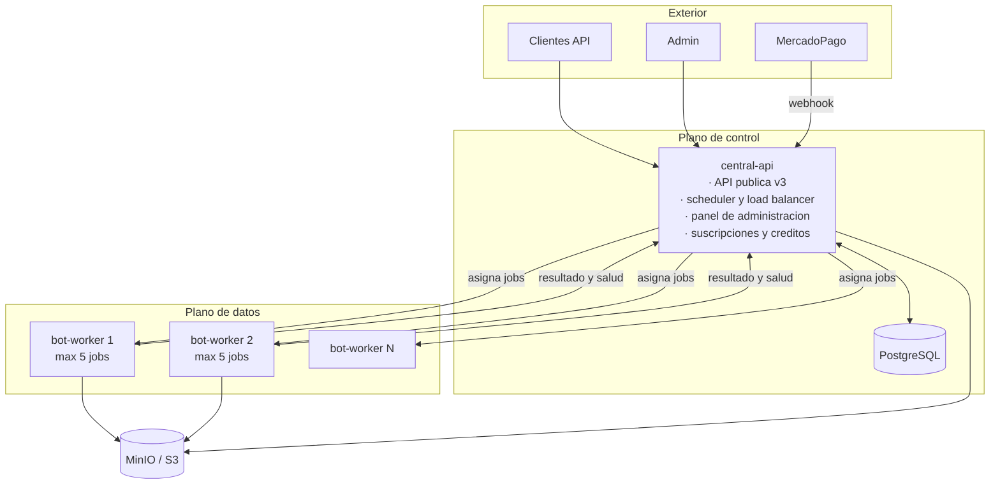
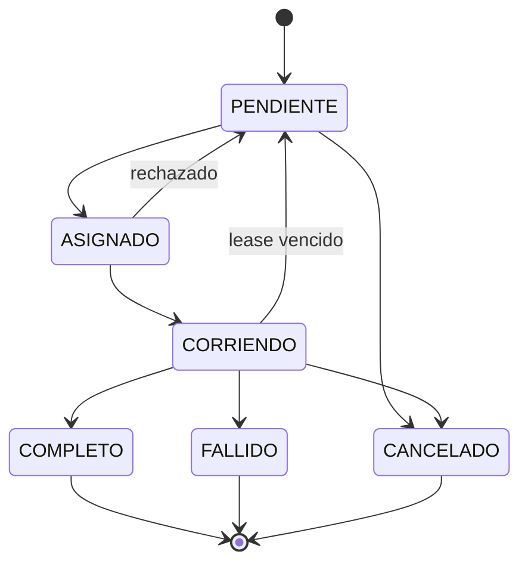

# MrBot API V3

API de automatización de trámites fiscales y previsionales argentinos (ARCA/AFIP,
ARBA, AGIP, SIFERE, SRT y otros organismos), construida como un conjunto de
microservicios.

> **Estado: implementación inicial F0-F2.** Las fundaciones, los contratos, el
> plano central, el worker y la infraestructura de desarrollo ya tienen una
> implementación verificable. El plan completo está en [`plan.md`](plan.md),
> los planes por sección en [`plans/`](plans/) y el ciclo operativo actual en
> [`plans/09-ejecucion-v3/plan.md`](plans/09-ejecucion-v3/plan.md). La V3
> sucede a la [V2](../api-bots-mrbot-v2), un monolito FastAPI + SQLite con el
> worker embebido en el proceso de la API.
>
> Las verificaciones de infraestructura y la suite de pruebas se ejecutan con:
>
> ```bash
> ./infra/verify-all.sh
> make test
> ```
>
> Ese ejercicio encontró y corrigió siete defectos reales, entre ellos una fuga
> de capacidad en la consulta de la cola y un `docker-compose` que Docker
> rechazaba por completo. Detalle en [`infra/README.md`](infra/README.md).

---

## Qué es

El sistema recibe pedidos de ejecución de "bots" (automatizaciones de navegador
que inician sesión en sitios de organismos públicos, navegan, y extraen o cargan
información), los encola, los reparte entre una flota de trabajadores, y devuelve
el resultado junto con los archivos generados.

Todas las ejecuciones son **asíncronas**: el cliente envía un pedido, recibe un
`job_id`, y consulta el estado hasta que termina.

## Arquitectura



**Dos reglas definen el diseño:**

1. **Solo la API central conoce la base de datos.** Los workers no tienen
   credenciales de PostgreSQL ni driver instalado.
2. **La API central asigna el trabajo.** Los workers no buscan trabajo: lo
   reciben. Eso es lo que permite balancear carga entre workers sanos y avisar al
   administrador cuando uno deja de responder.

## Componentes

| Componente | Directorio | Descripción |
|---|---|---|
| **central-api** | [`services/central-api/`](services/central-api/) | API pública v3, autenticación, cuotas, planificación y reparto de jobs, registro de la flota, panel de administración, suscripciones y créditos |
| **bot-worker** | [`services/bot-worker/`](services/bot-worker/) | Ejecutor puro. API secundaria privada que solo responde a la central. Corre los bots Playwright. Sin base de datos |
| **mrbot-contracts** | [`packages/mrbot-contracts/`](packages/mrbot-contracts/) | Esquemas compartidos del protocolo entre la central y los workers |
| **infra** | [`infra/`](infra/) | Imágenes, Docker Compose, PostgreSQL, despliegue |

## Estructura del repositorio

```
api-bots-mrbot-v3/
├── README.md                    # este archivo
├── plan.md                      # plan maestro de la V3
├── .research/                   # investigación sobre la V2 (insumo del plan)
├── plans/                       # planes detallados por sección
│   ├── 00-arquitectura/         # decisiones transversales, ADRs, protocolo
│   ├── 01-database/             # esquema PostgreSQL, IDs, migraciones
│   ├── 02-central-api/          # API pública, scheduler, autenticación
│   ├── 03-worker/               # API secundaria, contrato de bots, salud
│   ├── 04-billing/              # tiers, créditos, MercadoPago
│   ├── 05-admin-panel/          # panel y observabilidad de la flota
│   ├── 06-infra/                # Docker, CI/CD, secretos, despliegue
│   ├── 07-migracion/            # V2 → V3, portado de bots, cutover
│   └── 08-testing/              # estrategia de pruebas y aceptación
├── packages/mrbot-contracts/    # contratos compartidos
├── services/central-api/        # servicio central
├── services/bot-worker/         # servicio worker
└── infra/                       # infraestructura
```

Regla de dependencias: `services/*` depende de `packages/*`. `packages/*` no
depende de nada. `central-api` y `bot-worker` **no se importan entre sí**: se
comunican solo por HTTP con los esquemas de `mrbot-contracts`.

## Diferencias principales con la V2

| | V2 | V3 |
|---|---|---|
| Base de datos | SQLite, un archivo | PostgreSQL |
| Worker | embebido en la API | servicio separado, sin base de datos |
| Reparto de trabajo | el worker se auto-asigna desde la base | la central asigna al worker sano |
| Concurrencia | `MAX_BOTS` × `BROWSER_CONCURRENCY` por proceso, sin coordinar | 5 jobs por worker, tope conocido por el planificador |
| Ejecución síncrona | sí, en `/api/v1` | deprecada |
| ID de usuario | entero autoincremental | UUIDv4 |
| ID de jobs y bots | mixto | UUIDv7 en todo |
| Tablas de resultados | 28 tablas `consulta_*_logs` | `jobs` + `job_results` con `JSONB` |
| Monetización | contador de consultas mensuales | suscripciones por tier + créditos, vía MercadoPago |

Detalle completo en [`plan.md`](plan.md) §2.

## Estado de las ejecuciones



`status` indica el avance. `result` es un eje separado: `OK`, `PARCIAL` o
`ERROR`. Un job puede estar `COMPLETO` con resultado `PARCIAL`.

## Cómo levantar el entorno

El flujo reproducible está documentado en
[`plans/09-ejecucion-v3/plan.md`](plans/09-ejecucion-v3/plan.md). Para desarrollo
local:

```bash
cp .env.example .env
docker compose -f infra/compose/docker-compose.yml up --build
```

La implementación actual requiere construir las imágenes desde la raíz del
monorepo y aplicar las migraciones como job one-off antes de usar PostgreSQL.

## Uso de la API

> Contrato definido en [`plans/02-central-api/plan.md`](plans/02-central-api/plan.md).
> Los endpoints de bots están implementados como jobs asíncronos y sus schemas
> completos se pueden explorar en `GET /api/v3/bots` y `GET /api/v3/bots/{bot}`.

Consultar el catálogo y el schema de un bot:

```http
GET /api/v3/bots/ccma
X-API-Key: <clave>
```

La respuesta incluye `operaciones[].input_schema`,
`operaciones[].credentials_schema` y `operaciones[].example`. Los ejemplos usan
valores ficticios y nunca contienen credenciales reales.

Crear una ejecución con el envelope V3:

```http
POST /api/v3/bots/ccma/consultar
X-API-Key: <clave>
Idempotency-Key: <uuid opcional>
Content-Type: application/json

{
  "payload": {
    "representado_cuit": "20123456789",
    "periodo_desde": "01/2026",
    "incluir_movimientos": true,
    "incluir_pdf": true,
    "subir": true
  },
  "credentials": {
    "cuit_representante": "20123456789",
    "clave": "clave_fiscal"
  }
}
```

```json
{ "success": true, "job_id": "018f...", "status": "PENDIENTE" }
```

Los aliases históricos conservan el body plano de V1/V2. Por ejemplo, CCMA:

```http
POST /api/v3/ccma/consulta
X-API-Key: <clave>
Content-Type: application/json

{
  "cuit_representante": "20123456789",
  "clave_representante": "clave_fiscal",
  "cuit_representado": "20123456789",
  "movimientos": true,
  "pdf": true
}
```

Consultar el resultado del job:

```http
GET /api/v3/jobs/018f...
X-API-Key: <clave>
```

```json
{
  "job_id": "018f...",
  "status": "COMPLETO",
  "result": "OK",
  "bot": "mis_comprobantes",
  "operation": "consulta",
  "files": [{
    "filename": "comprobantes-2025.zip",
    "download_url": "/api/v3/jobs/018f.../artifacts/.../download",
    "size_bytes": 20480
  }],
  "data": { "schema_version": 1, "items": [] }
}
```

## Hoja de ruta

| Fase | Objetivo |
|---|---|
| F0 | Fundaciones del monorepo, contratos, Compose y CI |
| F1 | Esquema PostgreSQL y migraciones |
| F2 | Plano de control mínimo y un bot de punta a punta |
| F3 | Portado de los ~30 bots |
| F4 | Suscripciones, créditos y MercadoPago |
| F5 | Panel de administración y observabilidad de la flota |
| F6 | Endurecimiento, pruebas de carga y caos, cutover |

Detalle en [`plan.md`](plan.md) §9.

## Documentación

| Documento | Contenido |
|---|---|
| [`plan.md`](plan.md) | Plan maestro: arquitectura, invariantes, fases, riesgos |
| [`plans/00-arquitectura/plan.md`](plans/00-arquitectura/plan.md) | Decisiones transversales, ADRs, protocolo central↔worker |
| [`plans/01-database/plan.md`](plans/01-database/plan.md) | Esquema PostgreSQL, estrategia de UUID, migraciones |
| [`plans/02-central-api/plan.md`](plans/02-central-api/plan.md) | API pública, planificador y balanceo, autenticación |
| [`plans/03-worker/plan.md`](plans/03-worker/plan.md) | API secundaria, contrato de plugin de bot, salud |
| [`plans/04-billing/plan.md`](plans/04-billing/plan.md) | Tiers, cuotas, créditos, MercadoPago |
| [`plans/05-admin-panel/plan.md`](plans/05-admin-panel/plan.md) | Panel de administración y alertas de la flota |
| [`plans/06-infra/plan.md`](plans/06-infra/plan.md) | Imágenes, Compose, secretos, CI/CD |
| [`plans/07-migracion/plan.md`](plans/07-migracion/plan.md) | Migración de código, datos y clientes |
| [`plans/08-testing/plan.md`](plans/08-testing/plan.md) | Pruebas y criterios de aceptación |
| [`.research/`](.research/) | Investigación sobre la V2 que fundamenta el plan |

## Licencia

Privado. Todos los derechos reservados.
