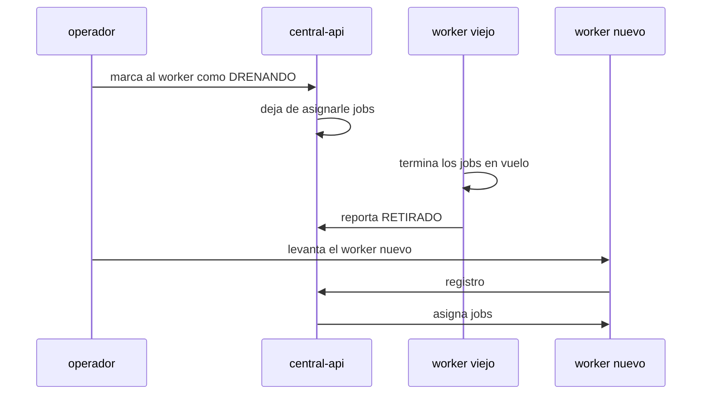

# infra

Infraestructura de la V3: imágenes, orquestación local, base de datos y
despliegue.

> **Estado: despliegue por subdirectorios implementado.** Diseño en
> [`../plans/06-infra/plan.md`](../plans/06-infra/plan.md).

---

## Contenido

```
infra/
├── README.md
├── verify-all.sh                 # punto de entrada: corre todas las verificaciones
├── check-consistency.py          # coherencia de vocabulario y rutas entre planes
├── validate-code-blocks.py       # sintaxis de los bloques de codigo de los planes
├── verify-packaging.sh           # compose y Dockerfiles contra las herramientas de Docker
├── verify-worker-isolation.sh    # el worker real sin driver PG ni secretos central
├── compose/
│   ├── docker-compose.yml        # stack completo de desarrollo
│   ├── docker-compose.prod.yml   # superposicion de produccion
│   └── .env.example              # WORKER_NODES, CENTRAL_URL, secretos por destino
├── postgres/
│   ├── verify-ddl.sh             # valida el esquema del plan contra PG 17 real
│   ├── _extract_claim.py         # extrae la consulta de cola desde el plan
│   ├── init/
│   │   ├── 01-extensions.sql     # pgcrypto opcional, sin DDL de tablas
│   │   └── README.md
│   └── backup/                   # rutina de respaldo
└── deploy/
    └── runbooks/
        ├── despliegue-worker.md  # worker con solo CENTRAL_URL mas token
        └── despliegue-central.md # central con solo la lista de IPs
```

## Despliegue por subdirectorios

Cada destino se despliega con lo minimo que necesita:

- Stack local: `docker compose -f compose/docker-compose.yml up -d
  --scale bot-worker=2` (postgres 17 mas central mas workers).
- Produccion: superposicion `docker-compose.prod.yml` con imagenes por
  digest, `WORKER_NODES` obligatorio y MinIO local desactivado.
- Worker dedicado: solo `CENTRAL_URL` mas token, ver
  [`deploy/runbooks/despliegue-worker.md`](deploy/runbooks/despliegue-worker.md).
- Central: solo la lista de IPs de workers, ver
  [`deploy/runbooks/despliegue-central.md`](deploy/runbooks/despliegue-central.md).
- Imagenes: [`../services/central-api/Dockerfile`](../services/central-api/Dockerfile)
  y [`../services/bot-worker/Dockerfile`](../services/bot-worker/Dockerfile),
  con [guia de central](../services/central-api/DEPLOY.md) y
  [guia de worker](../services/bot-worker/DEPLOY.md).

## Verificaciones

Los planes de este repositorio no son solo prosa: las partes ejecutables se
comprueban contra las herramientas reales. Un plan que no se verifica deriva,
y la deriva llega hasta la implementacion.

```bash
./infra/verify-all.sh                # todo, unos 12 segundos
./infra/verify-worker-isolation.sh   # solo el aislamiento real del worker
```

| Verificacion | Qué comprueba | Dependencias |
|---|---|---|
| `check-consistency.py` | Vocabulario de estados, rutas canónicas públicas e internas, rutas de salud, tablas del plan maestro presentes en el de base de datos, enlaces relativos, estilo | ninguna |
| `validate-code-blocks.py` | Que los 97 bloques `json`, `python`, `yaml`, `toml` y `mermaid` de los planes parseen | `pyyaml` |
| `verify-packaging.sh` | `docker compose config` sobre el compose del plan, ajustes de Playwright, y las invariantes **W-1**, **W-2**, **W-3**, **SEC-3** e **I-4** sobre el artefacto resuelto | docker, `pyyaml` |
| `verify-worker-isolation.sh` | Los archivos reales del worker (manifiesto, Dockerfile, codigo y compose de `infra/`) sin driver PG ni secretos de la central: **W-1**, **SEC-3** e **I-4** sobre el artefacto real | `pyyaml` |
| `postgres/verify-ddl.sh` | El DDL y la consulta de cola contra PostgreSQL 17 real, y las invariantes **I-1**, **I-2**, **I-3**, **S-2** | docker |

Cada verificación extrae el artefacto **del propio plan**, no de una copia. Si
alguien edita un plan y rompe la semántica, la verificación falla en vez de
seguir probando algo obsoleto.

Las cuatro son gates reales, no adornos. Se comprobó inyectando defectos a
propósito: capacidad 8 en vez de 5, `DATABASE_URL` en el worker, un puerto
publicado, un `EXISTS` quitado de la consulta de cola. En todos los casos la
verificación falló señalando el problema concreto.

### Defectos que estas verificaciones ya encontraron

| Defecto | Dónde | Consecuencia si llegaba a producción |
|---|---|---|
| La CTE de reserva incrementaba `running_jobs` con la cola vacía | `plans/01-database` §11.1.1 | Cada ciclo en vacío consumía un slot. Tras 5 ciclos el worker figuraba `SATURADO` sin ejecutar nada, degradando la flota en silencio |
| `pids_limit` junto a `deploy.resources` | `plans/06-infra` | `docker compose config` rechaza el proyecto entero. El stack no levantaba |
| `/healthz` y `/readyz` en infra vs `/health` y `/ready` en la API | `plans/06-infra` | El `HEALTHCHECK` de la imagen apuntaba a una ruta que la aplicación no expone. Contenedor siempre unhealthy |
| Tres rutas distintas para pedir URLs prefirmadas | 3 documentos | El worker y la central no se entendían |
| `status:batch` y `cancel` en la matriz de migración | `plans/07-migracion` | Un cliente migrando seguía una ruta inexistente |
| TOML con clave duplicada | `plans/00-arquitectura` | Ejemplo no copiable, `pyproject.toml` inválido |
| Vocabulario de estados divergente en 4 documentos | varios | Enumeraciones incompatibles entre servicios |

## Verificación del esquema

`postgres/verify-ddl.sh` es lo único ejecutable que ya existe en este
repositorio. Levanta un `postgres:17-alpine` efímero, extrae el DDL y la
consulta de cola directamente de
[`plans/01-database/plan.md`](../plans/01-database/plan.md), y comprueba 15
propiedades del diseño.

```bash
./infra/postgres/verify-ddl.sh     # requiere docker, tarda unos 6 segundos
```

Qué verifica hoy, sin necesidad de código de aplicación:

| Verifica | Invariante o criterio |
|---|---|
| El DDL se ejecuta sin errores en PostgreSQL 17 | base de todo lo demás |
| Las 19 tablas canónicas existen, sin faltantes ni extras | criterio 1 |
| Toda PK de `public` es `uuid` | I-2, criterios 2 y 3 |
| Cero secuencias, cero `identity`, cero `serial` | **I-1**, criterio 4 |
| `users` no tiene las columnas prohibidas | **I-3**, criterio 5 |
| Una `Idempotency-Key` repetida es rechazada | **S-2**, criterio 9 |
| `COMPLETO` sin `finished_at` es rechazado | criterio 12 |
| La base rechaza `capacity > 5` y `running_jobs > 5` | **W-2** respaldado en base |
| Claim con cola vacía no mueve el contador de slots | criterio 13, caso vacío |
| 5 ráfagas de 12 claims sin doble asignación ni sobrecapacidad | criterio 13, seguridad |
| La cola de 10 se drena entre 2 workers | criterio 13, vivacidad |
| El claim usa el índice parcial con 50.000 jobs terminales | criterio 14 |
| Un campo específico por bot es consultable por GIN `JSONB` | criterio 15 |
| La vista de flota deriva `SATURADO`, `SANO` y `CAIDO` | criterio 20 |

El script lee la consulta de claim del plan en vez de llevar una copia. Si
alguien edita el plan y rompe la semántica, la verificación falla en lugar de
seguir probando una versión obsoleta. Ya encontró un defecto real: ver
`plans/01-database/plan.md` §11.1.1.

## Stack

| Servicio | Imagen | Estado | Notas |
|---|---|---|---|
| `postgres` | `postgres:17` | stateful | Volumen persistente. Única base de datos del sistema |
| `central-api` | construida | stateless | Python slim. Sin navegador. Con driver de PostgreSQL |
| `bot-worker` | construida | stateless | Base Playwright. **Sin** driver de PostgreSQL |
| `minio` | externa o local | stateful | Almacenamiento de artefactos. Ya existe en la V2 |

## Las dos imágenes

La separación de dependencias no es cosmética, hace cumplir el invariante W-1.

| Dependencia | central-api | bot-worker |
|---|---|---|
| fastapi, uvicorn | sí | sí |
| sqlalchemy, alembic, psycopg | **sí** | **no** |
| playwright, playwright-stealth | **no** | **sí** |
| pandas, numpy, openpyxl | no | sí |
| pdfplumber, beautifulsoup4 | sí (utilidades) | sí |
| minio | sí (firma URLs) | no (usa URLs prefirmadas) |
| jinja2 | sí (panel) | no |
| mercadopago | sí | no |

Una verificación de integración continua comprueba que la imagen del worker no
tiene driver de base de datos instalado.

## Puntos críticos de Playwright en contenedores

| Ajuste | Valor | Por qué |
|---|---|---|
| `/dev/shm` | `tmpfs` en memoria, 1 GB | Sin esto Chromium se cae bajo concurrencia. Es el error más común |
| `init: true` | activado | Recoge procesos de navegador huérfanos |
| `pids_limit` | 512 | Evita que procesos descontrolados agoten el host |
| `stop_grace_period` | ≥ tiempo de drenaje | Permite terminar los jobs en vuelo antes de matar el contenedor |
| memoria | 4 GB por worker | 5 Chromium concurrentes a 300-500 MB cada uno |

## Secretos por destino

Regla: cada secreto va **solo** al servicio que lo necesita.

| Secreto | central-api | bot-worker |
|---|---|---|
| `DATABASE_URL` | sí | **nunca** |
| Clave privada RSA | sí | **nunca** |
| Credenciales de MinIO | sí | **nunca** |
| `SMTP_*` | sí | **nunca** |
| `MERCADOPAGO_*` | sí | **nunca** |
| Credenciales del panel admin | sí | **nunca** |
| Claves de resolución de captcha | no | sí |
| Configuración de proxies | no | sí |
| Token del worker | emite | consume |

## Migraciones

Alembic corre como **trabajo único**, nunca en el `CMD` del contenedor. La V2
tenía `alembic upgrade head` en el `CMD` del `Dockerfile`, lo que se rompe con
más de una réplica.

Toda migración sigue la regla expandir/contraer: agregar columna opcional,
desplegar, rellenar, y contraer en un despliegue posterior. Así un rollback de
imagen no rompe contra el esquema nuevo.

## Respaldo

| Qué | Cómo | Frecuencia | Retención |
|---|---|---|---|
| PostgreSQL | `pg_dump` al almacenamiento de objetos (`postgres/backup/`) | diaria 02:00 UTC y previa a migracion | 30 diarios, 12 mensuales, 4 anuales |
| Artefactos | política del bucket | continua | por definir |
| Claves RSA | fuera de banda, cifradas | ante rotación | permanente |

Un respaldo sin prueba de restauración no es un respaldo. El procedimiento de
restauración se prueba y se documenta.

## Despliegue

Destino inicial: Docker Compose en VPS, que es donde está hoy la V2.

Camino posterior: k3s con KEDA para autoescalar réplicas de worker según la
profundidad de la cola. Esto es compatible con la V3 siempre que quede claro el
reparto de roles:

- **KEDA decide cuántos workers existen** (autoescalado de infraestructura).
- **La API central decide qué worker ejecuta cada job** (asignación de trabajo).

Son dos responsabilidades distintas y no entran en conflicto si se mantienen
separadas.

## Actualización sin perder trabajo



## Documentos relacionados

- [`plans/06-infra/plan.md`](../plans/06-infra/plan.md) - diseño de infraestructura
- [`plans/01-database/plan.md`](../plans/01-database/plan.md) - esquema y migraciones
- [`plans/07-migracion/plan.md`](../plans/07-migracion/plan.md) - cutover desde la V2
