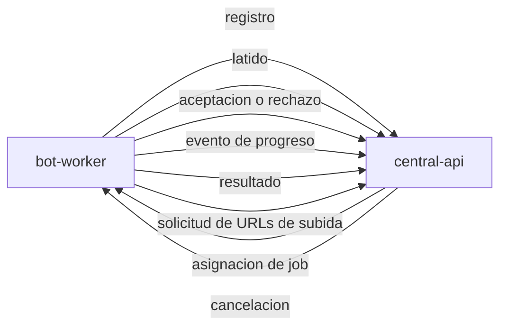

# mrbot-contracts

Paquete de contratos compartidos entre `central-api` y `bot-worker`.

> **Estado: sin implementar.** Especificación normativa del protocolo en
> [`../../plans/00-arquitectura/plan.md`](../../plans/00-arquitectura/plan.md) §5.

---

## Por qué existe

`central-api` y `bot-worker` son servicios separados que no se importan entre
sí. Se comunican por HTTP/JSON. Sin un paquete compartido, el esquema de cada
mensaje quedaría duplicado en los dos lados y divergiría en silencio.

Este paquete es la **única definición** de:

| Contenido | Detalle |
|---|---|
| Mensajes del protocolo | Modelos Pydantic de cada mensaje, en las dos direcciones |
| Enumeraciones de estado | Estados de job y de worker, y el eje `result` |
| Categorías de error | Taxonomía heredada de la disciplina de errores públicos de la V2 |
| Versión del protocolo | La constante que ambos servicios comparan |

## Regla de versionado

Un cambio incompatible en este paquete **obliga** a subir la versión del
protocolo. Un worker cuya versión de protocolo no es compatible con la central
se marca `DRENANDO` y no recibe trabajo nuevo.

Cambios compatibles: agregar un campo opcional, agregar un valor a una
enumeración que el receptor tolera.

Cambios incompatibles: quitar o renombrar un campo, cambiar un tipo, volver
obligatorio un campo opcional, cambiar la semántica de un valor existente.

## Mensajes



| Mensaje | Dirección | Propósito |
|---|---|---|
| `WorkerRegistration` | worker → central | Alta en la flota, declara capacidad y bots soportados |
| `WorkerHeartbeat` | worker → central | Salud, jobs en ejecución, jobs en cola, capacidad libre, recursos |
| `JobEnvelope` | central → worker | Sobre autocontenido con todo lo necesario para ejecutar |
| `JobAcceptance` | worker → central | Acepta o rechaza por saturación |
| `JobProgressEvent` | worker → central | Avance dentro de la ejecución |
| `JobResultReport` | worker → central | Resultado, artefactos, métricas, categoría de error |
| `JobCancellation` | central → worker | Cancelación de un job en vuelo |
| `PresignedUploadRequest` | worker → central | Pide URLs prefirmadas de subida |

## Estructura prevista

```
packages/mrbot-contracts/
├── README.md
├── pyproject.toml
└── src/mrbot_contracts/
    ├── __init__.py
    ├── version.py           # PROTOCOL_VERSION y la regla de compatibilidad
    ├── enums.py             # JobStatus, JobResult, WorkerStatus, ErrorCategory
    ├── worker.py            # registro, latido
    ├── jobs.py              # sobre, aceptacion, eventos, resultado, cancelacion
    ├── artifacts.py         # URLs prefirmadas, descriptor de artefacto
    └── errors.py            # categorias y su mapeo a HTTP
```

## Uso

```python
from mrbot_contracts import PROTOCOL_VERSION
from mrbot_contracts.enums import JobStatus, WorkerStatus
from mrbot_contracts.jobs import JobEnvelope, JobResultReport
```

## Reglas del paquete

1. No depende de ningún otro módulo del repositorio.
2. No contiene lógica de negocio, solo definiciones de datos y validación.
3. No conoce PostgreSQL, ni Playwright, ni FastAPI. Solo Pydantic.
4. Los dos servicios lo declaran como dependencia con la misma versión.

## Documentos relacionados

- [`plans/00-arquitectura/plan.md`](../../plans/00-arquitectura/plan.md) §5 - especificación del protocolo
- [`plans/00-arquitectura/plan.md`](../../plans/00-arquitectura/plan.md) §6 - este paquete
- [`plans/08-testing/plan.md`](../../plans/08-testing/plan.md) §4 - pruebas de contrato
