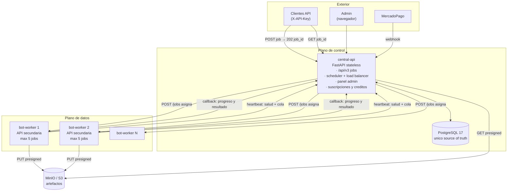
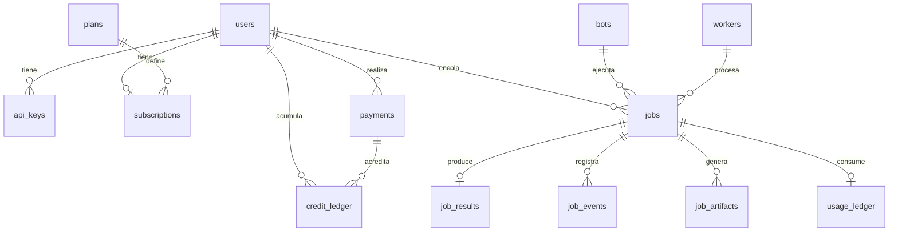
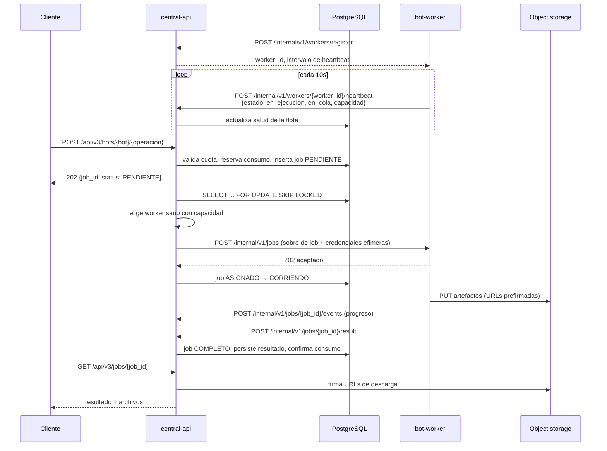
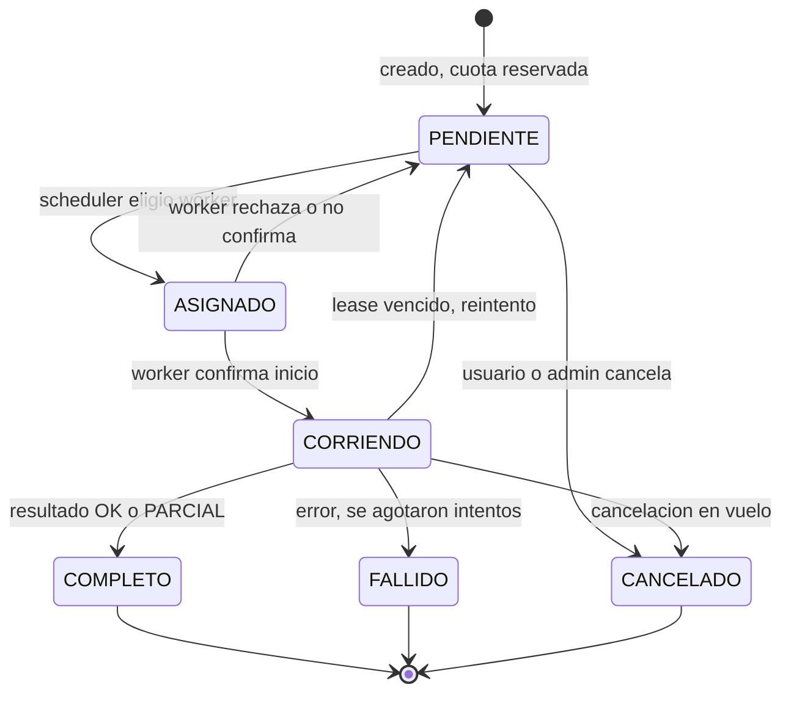
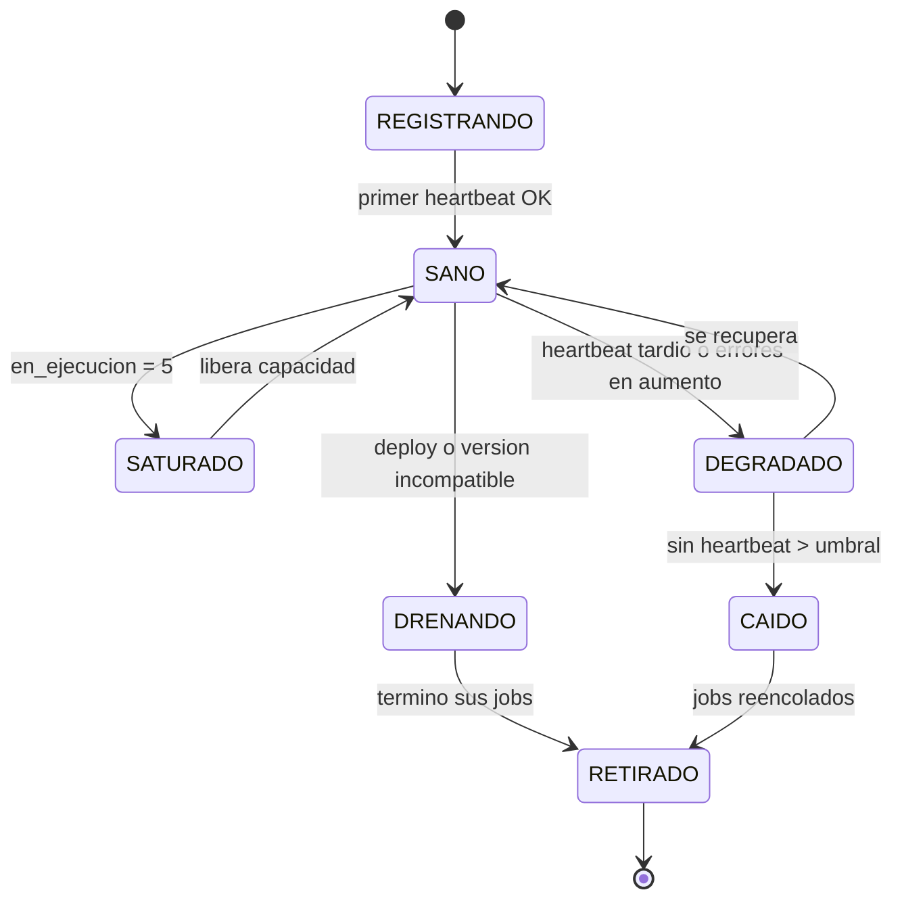

# plan.md - Borrador maestro de la V3 (MrBot API)

> **Estado:** BORRADOR. Este documento es el plan raíz. Cada sección tiene un
> plan detallado en `plans/<NN>-<seccion>/plan.md`.
> **Fecha:** 2026-09-16.
> **Origen:** V2 en `../api-bots-mrbot-v2` (~175k LOC, 59k en `app/`).
> **Investigación de base:** `.research/01..06-*.md` (4.584 líneas, generadas por
> subagentes en swarm sobre el repo V2 en modo lectura).
> **Regla operativa de este plan:** no se crean commits. Nada de este repositorio
> está versionado todavía.

---

## 0. Resumen ejecutivo

La V2 es un **monolito stateful de una sola instancia**: FastAPI + worker
embebido en el `lifespan` + SQLite, con la cola de jobs en la propia base de
datos y el worker reclamando trabajo por *polling* optimista. Funciona, y su
mejor activo es precisamente esa cola persistente con `job_id` UUIDv7 e
idempotencia por fila.

La V3 conserva el modelo de cola y de job, pero **invierte el plano de datos**:

| Eje | V2 | V3 |
|---|---|---|
| Base de datos | SQLite, un archivo por host | **PostgreSQL**, único source of truth |
| Worker | embebido en la API, misma imagen y proceso | **servicio separado**, imagen propia, API secundaria |
| Asignación de trabajo | el worker se auto-reclama jobs de la DB | **la API central asigna** (push) al worker sano |
| Acceso a DB del worker | sí (`SessionLocal()` dentro de executors) | **ninguno**. El worker no conoce la DB |
| Concurrencia | `MAX_BOTS=4` × `BROWSER_CONCURRENCY=3` por proceso, no coordinada | **5 jobs simultáneos por worker**, tope duro, conocido por el scheduler |
| Salud | `/health` 503 si el worker local no vive | el worker **reporta** salud y profundidad de cola a la central |
| Ejecución síncrona | `/api/v1` ejecuta en el hilo del request | **deprecada**. Solo async con `job_id` |
| ID de usuario | `Integer` autoincremental | **UUIDv4** |
| ID de bots/jobs | mezcla: UUIDv7 en jobs, `Integer` en los 28 logs | **UUIDv7** en todo. Cero IDs correlativos |
| Monetización | `maximas_consultas_mensuales` + contador | **suscripciones por tier + creditos, vía MercadoPago** |
| Repositorio | un solo árbol `app/` | **monorepo con subdirectorios por servicio** |

### Las cinco decisiones que definen la V3

1. **Push scheduling, no pull.** La API central es el único componente que
   conoce la cola. Elige el worker destino y le entrega el job por HTTP. Esto es
   lo que habilita "load balancer" y "informar al Admin de los workers no
   disponibles", y es un **conflicto directo** con el plan previo de la V2
   (`plan-migracion-cluster.md`), que hacía al worker reclamar de Postgres y
   escalar con KEDA leyendo la tabla. Ver `plans/00-arquitectura/plan.md` §4.
2. **El worker es un ejecutor puro.** Recibe un sobre de job autocontenido,
   ejecuta Playwright, sube artefactos a object storage con URLs prefirmadas y
   reporta el resultado. No tiene DB, no tiene modelos ORM, no tiene tabla de
   logs. Buena noticia de la investigación: **ningún módulo de `app/bot/*.py`
   toca la base de datos** (`.research/05-bots-runtime.md` §9). La deuda está en
   el `worker.py` y en un executor, no en los bots.
3. **Un solo modelo de ejecución.** Se elimina la ejecución síncrona. Las 28
   tablas `consulta_*_logs` colapsan en `jobs` + `job_results` con payload
   `JSONB`. Ver `plans/01-database/plan.md`.
4. **Facturación como servicio de primera clase.** Tiers con cuota, créditos
   como complemento al agotarse la cuota, webhooks de MercadoPago, y un
   *ledger* de consumo append-only. El cobro se **reserva al asignar** el job y
   se confirma o reembolsa al terminar. Ver `plans/04-billing/plan.md`.
5. **Monorepo con límites reales.** Cada servicio es un directorio con su
   `Dockerfile`, sus dependencias y su README. El contrato entre servicios vive
   en un paquete compartido versionado, no en imports cruzados.

---

## 1. Arquitectura objetivo



### Componentes

| Servicio | Directorio | Estado | Responsabilidad |
|---|---|---|---|
| `central-api` | `services/central-api/` | stateless | API pública v3, autenticación, cuotas, scheduler/load-balancer, registro de workers, panel admin, suscripciones y créditos, webhooks de MercadoPago |
| `bot-worker` | `services/bot-worker/` | **sin estado persistente** | API secundaria privada, ejecución de los ~30 bots Playwright, subida de artefactos, reporte de salud y resultado |
| `postgres` | `infra/postgres/` | stateful | única base de datos. Solo `central-api` se conecta |
| `object-storage` | externo | stateful | MinIO/S3 ya existente en V2, se conserva |
| `shared` | `packages/mrbot-contracts/` | librería | esquemas Pydantic del protocolo central↔worker, enums de estado, versión de protocolo |

### Lo que explícitamente NO se hace en la V3 inicial

- No hay Redis. La cola vive en Postgres con `FOR UPDATE SKIP LOCKED`. Se
  agrega Redis solo si aparece una necesidad medida (rate limit distribuido).
- No hay service mesh ni gRPC. HTTP/JSON con mTLS o token compartido.
- No hay Kubernetes en la fase 1. Docker Compose primero; k3s queda como
  fase posterior reutilizando el trabajo de `plan-migracion-cluster.md`.
- No se migran los datos históricos de los 28 logs a la nueva forma en la
  fase 1. Se congelan en un esquema `legacy` de solo lectura.

---

## 2. Qué se hereda de la V2 y qué se descarta

### Se hereda (activos reales)

| Activo V2 | Ubicación V2 | Destino V3 |
|---|---|---|
| Los ~30 bots Playwright | `app/bot/*.py` (~25k LOC) | `services/bot-worker/bots/`. **Sin acceso a DB ya hoy**, migración casi mecánica |
| Login ARCA compartido | `app/utils/arca_login.py` (672 líneas) | `services/bot-worker/runtime/arca_login.py` |
| Resolución de captcha | `app/utils/arca_captcha.py`, `capmonster.py` | worker. Las API keys de captcha son del worker, no de la central |
| Cola persistente con claim | `app/jobs/manager.py` | `central-api`, con `FOR UPDATE SKIP LOCKED` y asignación push |
| `job_id` UUIDv7 + idempotencia | `app/utils/uuid7.py`, `uq_..._idempotency` | se conserva y se extiende a todas las tablas |
| Errores públicos saneados | `app/utils/public_errors.py` + `PLAN.md` | **se conserva íntegro.** Es trabajo maduro y auditado |
| Persistencia sin URLs/secretos | `app/utils/persistence.py` | se rediseña como validación en el borde, no como mutación implícita de tipos |
| Sobre cifrado de credenciales | `app/utils/job_secrets.py` (Fernet) | se conserva el concepto, cambia el ciclo de vida |
| Transporte RSA de credenciales | `app/security/rsa_credentials.py` | se conserva. La central descifra, el worker recibe efímero |
| Helpers de object storage | `app/utils/bucket.py` (576 líneas) | se divide: worker sube, central firma |
| Tests de seguridad y paridad | `tests/` (65 archivos) | se adaptan. Los de fuga de errores y concurrencia son de alto valor |

### Se descarta (deuda técnica identificada)

| Problema V2 | Evidencia | Por qué se descarta |
|---|---|---|
| Worker embebido en el `lifespan` | `app/main.py` | impide escalar API y ejecución por separado |
| `recover_jobs_after_restart` global | `app/jobs/manager.py` | una réplica cancela los jobs de las otras. Bug crítico ya documentado |
| 28 tablas `consulta_*_logs` casi idénticas | `app/models/logs_*.py` | ~90% de columnas comunes. Un bot nuevo exige tabla + migración + modelo + registro en 4 lugares |
| IDs `Integer` autoincrementales | 29 tablas | requisito explícito V3: cero IDs correlativos |
| Registro de bots disperso en 4 lugares | `registry.py`, `v2/router.py`, `job_status.py`, `api_router.py` | un solo manifiesto declarativo por bot en V3 |
| `assert len(PLAYWRIGHT_BOTS) == 33` | `app/jobs/registry.py` | un assert de conteo en import time no es un contrato |
| Ejecución síncrona en `/api/v1` | 35 módulos de rutas | deprecada por requisito |
| Escritura de logs desde el worker | `app/jobs/worker.py:69-141` | rompe la regla de worker sin DB |
| Escritura de log desde executor | `app/jobs/executors/mis_retenciones_iva_simple.py:92-140` | idem |
| Mutación implícita de tipos en el ORM | `app/utils/persistence.py:181-199` | `NoUrlString` convierte URLs en `NULL` de forma silenciosa y destructiva |
| Credencial de registry en documentación | `readme-registry.md` | fuga ya identificada. Rotar y no replicar |
| Contador de cuota reseteado en el auth | `app/api/deps.py` (`validate_api_key`) | el reseteo mensual como efecto lateral de autenticar es frágil |
| `MAX_BOTS`/`BROWSER_CONCURRENCY` no coordinados | `app/jobs/config.py` | pico real = réplicas × concurrencia. En V3 el tope lo conoce el scheduler |

---

## 3. Requisitos explícitos del pedido, y dónde se resuelven

| # | Requisito | Plan responsable |
|---|---|---|
| R1 | Base de datos PostgreSQL | `plans/01-database/plan.md` |
| R2 | API central: usuarios + orquestador de bots + panel admin | `plans/02-central-api/plan.md`, `plans/05-admin-panel/plan.md` |
| R3 | Contenedores de bots con API secundaria que solo responde a la central | `plans/03-worker/plan.md` §3 |
| R4 | Jobs async en el worker | `plans/03-worker/plan.md` §5 |
| R5 | Workers sin base de datos | `plans/03-worker/plan.md` §2, invariante W-1 |
| R6 | Monorepo con subdirectorios, README general y por parte | §5 de este documento |
| R7 | Suscripciones con tiers de consumo máximo | `plans/04-billing/plan.md` §3 |
| R8 | Sistema de créditos (propio o complemento al agotar cuota) | `plans/04-billing/plan.md` §4 |
| R9 | MercadoPago | `plans/04-billing/plan.md` §6 |
| R10 | La central hace load balancing entre workers sanos | `plans/02-central-api/plan.md` §6 |
| R11 | La central informa al Admin de los workers no disponibles | `plans/05-admin-panel/plan.md` §4 |
| R12 | El worker reporta salud y cuántos jobs tiene en cola | `plans/03-worker/plan.md` §4 |
| R13 | Máximo 5 jobs simultáneos por worker | `plans/03-worker/plan.md` §5, invariante W-2 |
| R14 | Ejecuciones síncronas deprecadas | `plans/02-central-api/plan.md` §8 |
| R15 | Usuarios con UUIDv4 | `plans/01-database/plan.md` §3 |
| R16 | Tablas de bots/jobs con UUIDv7, cero IDs correlativos | `plans/01-database/plan.md` §3 |
| R17 | Quitar de `users`: `fecha_ultimo_reset`, `created_at`, `updated_at` | `plans/01-database/plan.md` §4 |

### Nota sobre R17 y su consecuencia funcional

`fecha_ultimo_reset` no es decorativa en la V2: es el mecanismo de reseteo
mensual de cuota, evaluado dentro de `validate_api_key`
(`app/api/deps.py`). Quitar la columna **obliga** a mover el ciclo de cuota a
la entidad de suscripción, que es donde corresponde: un período de facturación
tiene inicio y fin propios. Esto no es una pérdida, es la corrección del
modelo. Detalle en `plans/01-database/plan.md` §4 y `plans/04-billing/plan.md` §3.

`created_at`/`updated_at` de `users` se pierden como dato de auditoría. La
trazabilidad se mantiene por el *audit log* append-only, no por columnas
mutables en la fila del usuario. Se documenta como decisión consciente.

---

## 4. Invariantes del sistema

Estos son los enunciados que cualquier implementación debe cumplir, y sobre los
que se escriben los tests de aceptación.

**Identidad y datos**
- **I-1** `users.id` es UUIDv4. No existe ninguna columna `Integer` autoincremental en el esquema V3.
- **I-2** Toda PK de tablas de bots, jobs, resultados, consumo y pagos es UUIDv7.
- **I-3** `users` no tiene `fecha_ultimo_reset`, `created_at` ni `updated_at`.
- **I-4** Solo `central-api` tiene credenciales de PostgreSQL.

**Ejecución**
- **W-1** El worker no abre conexiones a base de datos. Verificable estáticamente: la imagen del worker no instala el driver de Postgres.
- **W-2** Un worker nunca ejecuta más de 5 jobs concurrentes. El tope se impone en el worker (semáforo) y se respeta en el scheduler (contabilidad).
- **W-3** El worker solo acepta requests autenticados como provenientes de la central.
- **W-4** Un job asignado a un worker que deja de reportar salud vuelve a la cola, sin intervención manual.
- **S-1** Ningún endpoint público ejecuta un bot dentro del request. Todo es `202 + job_id`.
- **S-2** Un `Idempotency-Key` repetido nunca produce dos ejecuciones.

**Dinero**
- **B-1** Todo consumo produce exactamente una entrada en el ledger. El ledger es append-only.
- **B-2** La cuota se reserva antes de asignar el job y se libera si el job no llega a ejecutarse.
- **B-3** Un webhook de MercadoPago se procesa de forma idempotente por su ID de evento.
- **B-4** El saldo de créditos nunca queda negativo por una condición de carrera.

**Seguridad**
- **SEC-1** Ninguna respuesta pública contiene selectores, URLs internas, rutas locales, trazas ni nombres de componentes. Se hereda de `public_errors.py`.
- **SEC-2** Las credenciales fiscales del usuario no se persisten en claro en ninguna tabla de resultados.
- **SEC-3** La clave privada RSA solo existe en `central-api`.

---

## 5. Estructura del monorepo

```
api-bots-mrbot-v3/
├── README.md                       # README general: qué es, arquitectura, cómo levantar todo
├── plan.md                         # este documento
├── .research/                       # investigación sobre la V2 (insumo, no contrato)
│   ├── 01-api-surface.md
│   ├── 02-jobs-workers.md
│   ├── 03-database-models.md
│   ├── 04-auth-admin-config.md
│   ├── 05-bots-runtime.md
│   └── 06-docs-tests-history.md
├── plans/                          # planes por sección
│   ├── 00-arquitectura/plan.md     # decisiones transversales, ADRs, protocolo
│   ├── 01-database/plan.md         # esquema Postgres, IDs, migraciones
│   ├── 02-central-api/plan.md      # API pública, scheduler, auth
│   ├── 03-worker/plan.md           # API secundaria, runtime de bots, salud
│   ├── 04-billing/plan.md          # tiers, créditos, MercadoPago
│   ├── 05-admin-panel/plan.md      # panel, observabilidad de workers
│   ├── 06-infra/plan.md            # Docker, Compose, CI/CD, secretos
│   ├── 07-migracion/plan.md        # V2 → V3, cutover, compatibilidad
│   └── 08-testing/plan.md          # estrategia de pruebas y criterios de aceptación
├── packages/
│   └── mrbot-contracts/            # esquemas compartidos central ↔ worker
│       └── README.md
├── services/
│   ├── central-api/
│   │   └── README.md
│   └── bot-worker/
│       └── README.md
└── infra/
    ├── compose/
    ├── postgres/
    └── README.md
```

Regla de dependencias: `services/*` puede depender de `packages/*`.
`packages/*` no depende de nada del repo. `central-api` y `bot-worker` **no se
importan entre sí**; se comunican solo por HTTP usando los esquemas de
`mrbot-contracts`.

---

## 6. Modelo de datos, vista de conjunto

Detalle completo en `plans/01-database/plan.md`. Vista resumida:



| Grupo | Tablas | Nota |
|---|---|---|
| Identidad | `users`, `api_keys`, `admin_users` | `users.id` UUIDv4. Clave API con verificador HMAC, nunca en claro |
| Catálogo | `bots`, `bot_operations` | reemplaza el registro disperso y el `assert` de conteo |
| Ejecución | `jobs`, `job_events`, `job_results`, `job_artifacts` | `jobs` reemplaza `playwright_jobs_active` + `playwright_jobs_history`. Un solo lugar, con estado terminal |
| Flota | `workers`, `worker_heartbeats` | nuevo. Es lo que habilita el load balancing y el aviso al Admin |
| Facturación | `plans`, `subscriptions`, `subscription_periods`, `usage_ledger`, `credit_ledger`, `payments`, `payment_events` | nuevo |
| Auditoría | `audit_log` | append-only, reemplaza `admin_fiscal_credential_audits` y amplía |
| Legado | esquema `legacy` | las 28 tablas `consulta_*` importadas tal cual, solo lectura |

Los 28 logs por bot se unifican: lo común (`user_id`, `job_id`, `timestamp`,
`status`, `error_message`, `archivos`, `response_data`, CUIT representante y
representado) va a columnas de `jobs`/`job_results`; lo específico de cada bot
(`periodos_error`, `despachos_exitosos`, `importaciones`, `cbtes`, etc.) va a
`job_results.payload JSONB` con un índice GIN.

---

## 7. Protocolo central ↔ worker, vista de conjunto

Detalle en `plans/00-arquitectura/plan.md` §5 y `plans/03-worker/plan.md`.



**Puntos de diseño no negociables del protocolo:**
- El sobre de job es **autocontenido**: el worker no consulta nada para ejecutar.
- Las credenciales fiscales viajan descifradas por la central dentro de un canal
  cifrado, se usan en memoria y no se escriben a disco ni se devuelven en el resultado.
- Los artefactos van por **URL prefirmada de subida** emitida por la central. El
  worker no tiene las llaves del bucket.
- El reporte de resultado es **idempotente** por `(job_id, attempt)`.
- El protocolo tiene versión explícita. Un worker con versión incompatible se
  marca `DRENANDO` y no recibe trabajo.

---

## 8. Estados

### Job



Se conserva `result` como eje separado de `status`: `OK | PARCIAL | ERROR`, tal
como en la V2 (`app/schemas/v2/job.py`). Los nombres de estado en castellano se
mantienen por compatibilidad de clientes.

### Worker



`SATURADO`, `DEGRADADO` y `CAIDO` son los tres estados que disparan aviso al
Admin (R11).

---

## 9. Fases de ejecución

Cada fase es entregable y verificable por sí sola.

| Fase | Objetivo | Entregable verificable | Plan |
|---|---|---|---|
| **F0** | Fundaciones del repo | monorepo, contratos compartidos, Compose que levanta Postgres + central + 1 worker vacío, CI que corre lint y tests | `06-infra` |
| **F1** | Esquema y datos | esquema Postgres completo con UUIDv4/v7, migraciones, semillas de tiers, esquema `legacy` importado | `01-database` |
| **F2** | Plano de control mínimo | registro de workers, heartbeat, `jobs` CRUD, scheduler push, un bot end-to-end (se propone `consulta_cuit` por ser el más simple, luego `mis_comprobantes` como piloto real) | `02-central-api`, `03-worker` |
| **F3** | Migración de bots | los ~30 bots portados al runtime del worker, con tests de contrato por bot | `03-worker`, `07-migracion` |
| **F4** | Facturación | tiers, cuota por período, créditos, ledger, MercadoPago en sandbox y luego producción | `04-billing` |
| **F5** | Panel admin | usuarios, jobs, flota de workers con alertas, suscripciones, auditoría | `05-admin-panel` |
| **F6** | Endurecimiento y cutover | pruebas de carga, caos (matar un worker con jobs en vuelo), deprecación de sync, corte de la V2 | `07-migracion`, `08-testing` |

Dependencias: F0 → F1 → F2 → {F3, F4} → F5 → F6. F3 y F4 se pueden paralelizar.

---

## 10. Riesgos principales

| Riesgo | Impacto | Mitigación |
|---|---|---|
| Portar ~25k LOC de bots introduce regresiones silenciosas | alto | test de contrato por bot antes de portarlo; conservar los tests de paridad de la V2 como red |
| La central se vuelve un SPOF del scheduling | alto | la central es stateless y se replica; el scheduler usa `SKIP LOCKED`, por lo que N réplicas no duplican asignación |
| Postgres como único punto de estado | alto | backups `pg_dump` automáticos a object storage; camino documentado a HA |
| Credenciales fiscales en tránsito hacia el worker | alto | canal cifrado, token de corta vida, credenciales solo en memoria, prohibición de loguearlas verificada por test |
| Errores de MercadoPago dejan cuota o créditos inconsistentes | alto | webhooks idempotentes, ledger append-only, conciliación periódica |
| Tope de 5 jobs por worker no alcanza con la memoria disponible | medio | Chromium consume 300-500 MB. 5 concurrentes exigen ~2.5-3 GB y `/dev/shm` en memoria. Dimensionar y documentar |
| El plan previo de la V2 (KEDA + claim desde el worker) se implementa por inercia | medio | este documento declara el conflicto de forma explícita. Ver `plans/00-arquitectura/plan.md` §4 |
| Deriva de documentación como en la V2 | bajo | README por parte, y el contrato del protocolo generado desde los esquemas |

---

## 11. Preguntas abiertas para el dueño del producto

Estas decisiones no se pueden tomar desde el código y bloquean partes del plan.

> **Cada una tiene evidencia y una propuesta por defecto en
> [`plans/ANEXO-decisiones.md`](plans/ANEXO-decisiones.md)**, construido con
> datos reales de la base de producción de la V2: 8 usuarios, 751 jobs, duración
> y tasa de éxito medidas por bot. Si se aceptan las siete propuestas, lo único
> que queda por definir son los precios, y eso recién hace falta en F4.

1. **Tiers concretos.** ¿Cuántos, qué cuota mensual y qué precio? El plan de
   facturación propone cuatro (`free`, `basico`, `pro`, `empresa`) como
   *placeholder* configurable en base de datos, no en código.
2. **Equivalencia de créditos.** ¿1 crédito = 1 ejecución de cualquier bot, o
   cada bot tiene un costo distinto? El esquema soporta costo por bot
   (`bots.costo_creditos`); hay que definir los valores.
3. **Vencimiento de créditos.** ¿Los créditos comprados caducan?
4. **Ventana de deprecación de sync.** ¿Cuánto tiempo se mantiene `/api/v1` y
   `/api/v2` en paralelo con `/api/v3` antes de apagarlos?
5. **Migración de datos históricos.** ¿Se necesita consultar los logs de la V2
   desde la V3, o basta con conservarlos en el esquema `legacy` para auditoría?
6. **Multi-tenant.** La V2 no tiene concepto de organización. ¿La V3 necesita
   que varias claves API compartan una suscripción?
7. **Destino de despliegue.** ¿Se sigue con Docker Compose en VPS, o se retoma
   el plan de k3s + KEDA de la V2 para el autoescalado de workers?

### Estado de las incógnitas técnicas

Estas siete son decisiones **de producto**. Aparte de ellas, los planes tenían
nueve puntos de MercadoPago marcados como pendientes de verificar. Siete
quedaron resueltos contra fuentes oficiales, no por suposición. Dos siguen
abiertos y **ninguno bloquea**, por los motivos que se indican:

| Incógnita | Resolución | Dónde |
|---|---|---|
| Algoritmo de firma de webhook de MercadoPago | Manifiesto `id:<data.id>;request-id:<x-request-id>;ts:<ts>;`, HMAC-SHA256 hex. Confirmado contra la documentación y el SDK oficial de Go, y comprobado ejecutándolo | `04-billing` §7.6 |
| Endpoints y estados de Suscripciones | Catálogo completo de `preapproval`, `preapproval_plan` y `authorized_payments`, con el mapeo de estados remotos a locales | `04-billing` §7.2 |
| Tópicos de notificación | `payment`, `subscription_preapproval`, `subscription_authorized_payment`. Se documenta por qué no se suscribe el cuarto | `04-billing` §7.6 |
| Deduplicación de webhooks | Campo `id` de la notificación, que no es `data.id` | `04-billing` §7.7 |
| Cabecera de idempotencia | `X-Idempotency-Key`, con clave derivada de forma determinista | `04-billing` §12 |
| Prorrateo | Lo calcula MercadoPago. La central solo decide el entitlement | `04-billing` §4 |
| Unidad monetaria | Centavos como entero, con adaptador único de conversión | `04-billing` §3.1 |
| Ventana de respuesta del webhook | 22 segundos, reintentos cada 15 minutos. Obliga a procesar de forma asíncrona | `04-billing` §7.6 |
| ¿Qué bots tienen efecto irreversible? | Nueve, con evidencia en el código V2. Cambia la política de reintento y de reembolso | `04-billing` §6.6 |

Los dos que siguen abiertos, y por qué no bloquean:

| Incógnita | Por qué sigue abierta | Por qué no bloquea |
|---|---|---|
| Secuencia exacta de Checkout API | Depende de la versión de Bricks o SDK que se elija, y esa elección todavía no se hizo | El MVP usa **Checkout Pro**, donde MercadoPago aloja el formulario. Checkout API es una alternativa posterior |
| ¿Llegan firmadas las notificaciones de Suscripciones? | No se puede saber desde la documentación: depende de la configuración de la cuenta real. La documentación dice que Suscripciones no se configura desde "Tus integraciones", que es donde se emite la clave de firma | El diseño ya exige **reconsultar** el recurso antes de mover dinero, así que no depende de la firma para ser correcto. Se agrega un segmento secreto en la URL. Comprobar en sandbox antes de F4 |

El último hallazgo tuvo consecuencias de diseño: se agregó
`bot_operations.effect_class` como columna tipada con default `'EFECTO'`, el
valor seguro. Olvidarse de clasificar una consulta cuesta un reintento que no
ocurre; olvidarse de clasificar un `Presentar` ante ARCA cuesta una presentación
duplicada.

---

## 12. Índice de planes

| Plan | Contenido | Líneas |
|---|---|---:|
| [`plans/00-arquitectura/plan.md`](plans/00-arquitectura/plan.md) | Decisiones transversales, ADRs, especificación normativa del protocolo central↔worker, análisis de conflicto con el plan previo de la V2 | 1480 |
| [`plans/01-database/plan.md`](plans/01-database/plan.md) | Esquema PostgreSQL completo con DDL, estrategia de UUIDv4/v7, unificación de las 28 tablas de logs, migraciones | 1028 |
| [`plans/02-central-api/plan.md`](plans/02-central-api/plan.md) | API pública v3, autenticación, planificador y balanceo de carga, gobierno de la flota, deprecación de sync | 2369 |
| [`plans/03-worker/plan.md`](plans/03-worker/plan.md) | API secundaria, contrato de plugin de bot, tope de 5 jobs, reporte de salud, empaquetado | 1029 |
| [`plans/04-billing/plan.md`](plans/04-billing/plan.md) | Tiers, ciclo de cuota, créditos, ledger append-only, integración con MercadoPago | 1109 |
| [`plans/05-admin-panel/plan.md`](plans/05-admin-panel/plan.md) | Panel de administración, observabilidad de la flota y alertas de workers caídos | 796 |
| [`plans/06-infra/plan.md`](plans/06-infra/plan.md) | Imágenes Docker, Compose, secretos por destino, CI/CD, despliegue y dimensionamiento | 1109 |
| [`plans/07-migracion/plan.md`](plans/07-migracion/plan.md) | Migración de código, de datos y de clientes. Portado de bots, cutover y rollback | 802 |
| [`plans/08-testing/plan.md`](plans/08-testing/plan.md) | Pirámide de pruebas, tests de contrato e invariantes, caos, criterios de aceptación | 620 |

Además:

| Documento | Contenido |
|---|---|
| [`plans/ANEXO-decisiones.md`](plans/ANEXO-decisiones.md) | Las 7 decisiones de producto con evidencia medida de la base V2 y una propuesta por defecto para cada una |

Total de los planes: 10.342 líneas. Investigación de base: 4.584 líneas. Estas cifras las verifica `infra/check-consistency.py`.
