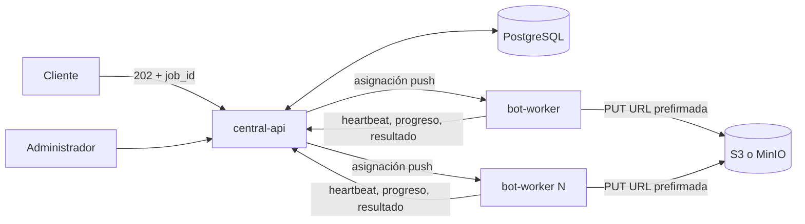
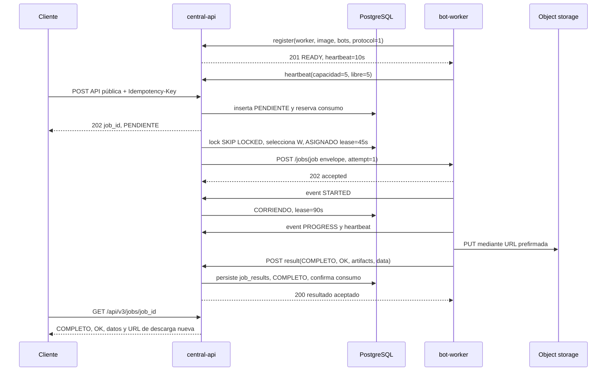
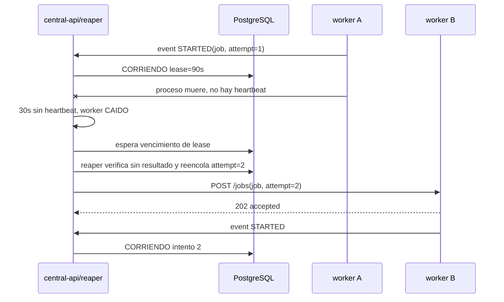
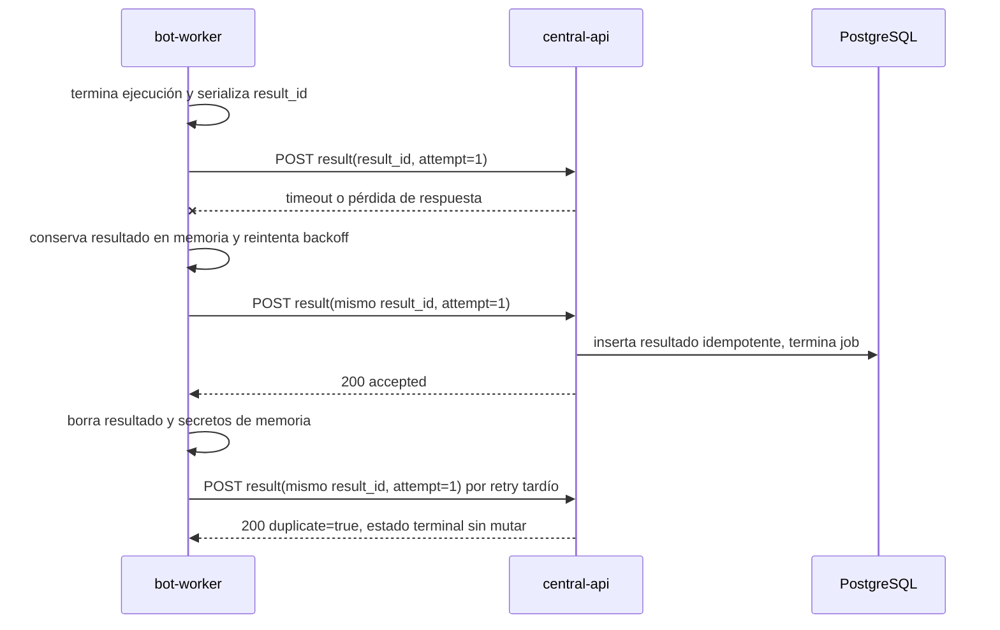
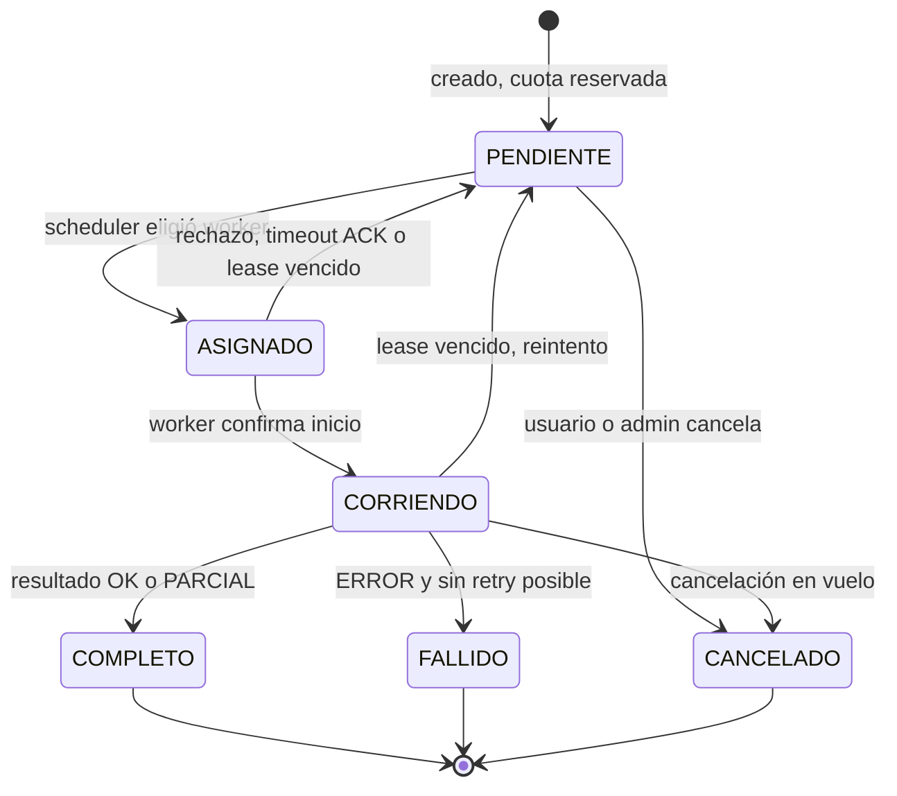

# Plan 00. Arquitectura, decisiones transversales y protocolo central-worker

> **Estado:** normativo para la implementación V3.
> **Alcance temporal:** V3 inicial, con decisiones revisables explícitamente señaladas.
> **Fuente de autoridad:** `../../plan.md`, en particular §3, §4, §5, §7 y §8.
> **Convención normativa:** las palabras DEBE, NO DEBE, DEBERÍA y PUEDE se interpretan como requisitos de implementación.

---

## 1. Objetivo y alcance de este documento

Este documento define las decisiones que deben ser idénticas en todos los servicios de MrBot API V3. Es el contrato arquitectónico transversal, no un manual de implementación de un servicio concreto.

Es dueño de los siguientes temas:

1. Las decisiones de arquitectura transversales y su registro ADR.
2. El protocolo normativo entre `central-api` y `bot-worker`.
3. El paquete compartido `packages/mrbot-contracts` que materializa ese protocolo.
4. Los límites de responsabilidad e importación del monorepo.
5. La estrategia de versionado de API, protocolo, manifiestos e imágenes.
6. El análisis de incompatibilidad y reutilización del previo `plan-migracion-cluster.md` de V2.
7. La trazabilidad de los requisitos R1 a R17 de `plan.md` §3.

Este documento **no** es dueño del detalle de rutas públicas, autenticación de clientes, DDL de PostgreSQL, reglas de facturación, implementación interna de los bots, templates del panel ni manifiestos de despliegue. Esos detalles pertenecen respectivamente a `plans/01-database`, `02-central-api`, `03-worker`, `04-billing`, `05-admin-panel`, `06-infra`, `07-migracion` y `08-testing`.

### 1.1 Resultado buscado

La V3 separa el plano de control del plano de ejecución:

- `central-api` mantiene el único estado duradero, aplica autorización, facturación, admisión, asignación y observabilidad.
- `bot-worker` ejecuta un sobre autocontenido, conserva estado solo en memoria mientras corre, sube artefactos con capacidades temporales y devuelve hechos a la central.
- PostgreSQL es accesible únicamente por la central.
- Object storage es accesible por el worker únicamente con URLs prefirmadas emitidas por la central.



### 1.2 Invariantes heredados del plan raíz

La implementación de este plan DEBE preservar literalmente los invariantes I-1 a I-4, W-1 a W-4, S-1 a S-2, B-1 a B-4 y SEC-1 a SEC-3 de `../../plan.md` §4. En particular:

- El único actor con credenciales de PostgreSQL es `central-api`.
- El worker instala y ejecuta sin driver, URL, modelos ORM ni migraciones de PostgreSQL.
- El tope efectivo es cinco trabajos simultáneos por proceso worker, impuesto tanto por el worker como respetado por el scheduler.
- Todo endpoint público que inicia ejecución responde `202 Accepted` con un `job_id` y nunca ejecuta Playwright en el request.
- Los nombres de estado de job se mantienen en castellano: `PENDIENTE`, `ASIGNADO`, `CORRIENDO`, `COMPLETO`, `FALLIDO`, `CANCELADO`.
- `result` es otra dimensión: `OK`, `PARCIAL` o `ERROR`.

---

## 2. Contexto y diagnóstico de la V2

### 2.1 Arquitectura observada

V2 es un monolito FastAPI stateful de una instancia. El `lifespan` de FastAPI crea un `WorkerManager` dentro del mismo proceso que atiende HTTP. La cola persistente es SQLite y el propio worker consulta por polling, busca la fila pendiente más antigua y la reclama con un `UPDATE` optimista. La fila activa se mueve a historial al terminar.

El diseño fue útil como primer sistema asíncrono y aporta activos reutilizables: `job_id` UUIDv7, admisión con idempotencia, normalización de resultados, cifrado de secretos de runtime y disciplina madura de errores públicos. Sin embargo, sus propiedades impiden satisfacer R1 a R17 al escalar.

### 2.2 Hallazgos factuales relevantes

| Hallazgo V2 | Evidencia resumida | Consecuencia arquitectónica |
|---|---|---|
| Monolito con worker en `lifespan` | Cada proceso FastAPI inicia `WorkerManager` | API y ejecución no escalan ni despliegan de forma independiente |
| SQLite, archivo único por host | Cola y datos residen en una base local | Réplicas no comparten una fuente de verdad ni permiten clustering seguro |
| Polling y auto-claim desde DB | Worker abre sesión, selecciona y reclama con `UPDATE` optimista | El worker conoce DB y decide asignación, contrario a R5 y R10 |
| Dos límites de concurrencia locales | `MAX_BOTS=4` y `BROWSER_CONCURRENCY=3` | El pico real es producto de réplicas y límites no coordinados |
| Recuperación global al reiniciar | Cancela filas `PENDIENTE` y `CORRIENDO` de toda la tabla | Una réplica puede cancelar el trabajo de otras |
| 28 tablas `consulta_*_logs` | Modelos casi idénticos, con datos de resultados por bot | Cada bot nuevo exige migración, modelo y mantenimiento repetido |
| Registro de bots cuadruplicado | Router V2, registry, estado de jobs y router agregado | El catálogo puede divergir entre crear, ejecutar, consultar y documentar |
| Ejecución síncrona en aproximadamente 35 módulos | Rutas V1 ejecutan bots en el request | No hay trazabilidad uniforme ni aislamiento de timeouts |
| Executors escriben logs | Abren `SessionLocal()` y persisten resultados | No pueden moverse sin cambios a un worker sin DB |
| Activo e historial son tablas separadas | Terminar copia y borra la fila activa | La historia operacional se fragmenta y complica retries y auditoría |

### 2.3 Problema, consecuencia y resolución V3

| Problema | Consecuencia | Cómo lo resuelve la V3 |
|---|---|---|
| Worker embebido en FastAPI | Un despliegue de API interrumpe capacidad de bots | Servicios e imágenes independientes, con despliegue y rollback separados |
| SQLite único | No hay estado compartido entre réplicas | PostgreSQL como único source of truth, R1 |
| Worker hace polling y claim | No hay control central de carga, prioridad o indisponibilidad | Scheduler central selecciona worker sano y hace asignación push |
| Worker tiene DB | Superficie de secretos y acoplamiento ORM excesivos | Sobre autocontenido y callbacks HTTP, sin driver Postgres en worker |
| Recuperación global | Reiniciar A puede cancelar trabajo de B | Lease por intento, heartbeat y reaper central que solo recupera asignaciones vencidas |
| Límites 4 y 3 independientes | Concurrencia impredecible y sobrecarga de Chromium | Capacidad declarada y semáforo duro de cinco jobs por worker |
| Dos tablas de job | Estado, intento y auditoría se pierden al mover filas | Tabla única `jobs`, estados terminales y eventos inmutables |
| 28 logs heterogéneos | Alto coste por bot y esquemas duplicados | `job_results` y `job_artifacts`, con payload específico JSONB |
| Catálogo disperso | Un bot puede estar expuesto sin executor o sin lectura | `bots` y manifiestos versionados como datos declarativos |
| Rutas síncronas | Bloqueo de request, semánticas heterogéneas | Deprecación completa, contrato único `202 + job_id` |
| Secretos reenviados desde DB | Riesgo de persistencia y dependencia del worker | Central descifra, entrega solo secretos efímeros en canal autenticado |
| Resultado no centralizado | La consulta depende de modelo de log por bot | La central persiste un único resultado idempotente por intento |

### 2.4 Diagnóstico conclusivo

V2 no falla por carecer de una cola. Tiene una cola persistente valiosa. Falla porque la cola mezcla propiedad de estado, decisión de asignación, ejecución y persistencia de resultados dentro de procesos intercambiables. V3 conserva el concepto de job durable e idempotente, pero invierte la relación: la central posee la cola y el worker ejecuta un mandato explícito.

---

## 3. Visión de la V3 y principios rectores

Los siguientes principios son afirmaciones comprobables, no preferencias.

1. **La central es el único componente que conoce la base de datos.** Una inspección de imagen del worker no encuentra `psycopg`, SQLAlchemy ni variables `DATABASE_URL`; una prueba de red verifica ausencia de ruta hacia PostgreSQL.
2. **El worker es función del sobre de job.** Todo dato necesario para ejecutar está en la asignación o se obtiene mediante una URL de capacidad explícita. El worker no consulta tablas ni APIs públicas para completar parámetros.
3. **Toda ejecución es asíncrona e identificada.** Toda creación pública responde `202` y UUIDv7 de job. Ninguna ruta pública importa un executor ni llama Playwright.
4. **El dinero se contabiliza como hechos append-only.** Reserva, confirmación y liberación son entradas inmutables del ledger con idempotencia. El saldo es una proyección, nunca la fuente de verdad aislada.
5. **El catálogo de bots es dato, no código de enrutamiento repetido.** Cada bot y operación tiene manifiesto y registro central con versión, contrato y compatibilidad declarada.
6. **Los contratos se comparten y versionan, no se duplican.** Cada mensaje central-worker tiene modelo Pydantic en `mrbot-contracts`; no se aceptan diccionarios ad hoc.
7. **Un servicio se puede desplegar y revertir independientemente.** Una imagen inmutable y un protocolo compatible permiten drenar workers de una versión sin detener API ni jobs en curso.
8. **Las fallas producen al menos una entrega, nunca ejecución silenciosa.** Una asignación posee lease y ACK; un resultado posee clave idempotente. Una caída puede ejecutar dos veces un efecto externo solo si el bot no es idempotente, por lo que las operaciones externas deben usar claves de idempotencia o deduplicación funcional.

### 3.1 Plano de control y plano de ejecución

La central implementa dos tareas distintas que no deben confundirse:

- **Allocación de ejecución:** decidir qué worker recibe un job concreto. Es una acción de control, basada en salud, versión, capacidad, prioridad por tier, afinidad de bot y antigüedad.
- **Autoscaling de infraestructura:** decidir cuántos pods workers existen. Es una acción de infraestructura basada en profundidad agregada de cola y métricas.

KEDA puede realizar la segunda tarea sin convertirse en asignador de ejecución. Esta separación será relevante en §4.5.

### 3.2 Modelo de entrega

El protocolo ofrece entrega **al menos una vez** entre central y worker. No promete exactamente una ejecución física de Playwright, pues una caída después de producir un efecto externo y antes de reportar resultado deja ambigüedad. La solución es:

- `job_id` estable durante todos los intentos.
- `attempt` creciente por reasignación.
- `execution_id = "{job_id}:{attempt}"` como identidad de entrega.
- clave de idempotencia propagada a integraciones cuando exista soporte.
- resultado deduplicado por `(job_id, attempt)` y transición condicional en central.

---

## 4. Análisis de conflicto con `plan-migracion-cluster.md`

### 4.1 Resumen fiel del plan previo

El plan V2 de 355 líneas proponía migrar el monolito stateful con SQLite a un cluster de workers. Sus decisiones principales fueron:

- k3s autogestionado en VPS propios, con Traefik, Kustomize y KEDA.
- PostgreSQL en un único pod StatefulSet con PVC, sin HA inicial.
- Misma imagen de aplicación y comandos distintos para API y worker.
- API stateless escalada por HPA y worker escalado por KEDA con una consulta SQL que cuenta jobs pendientes.
- Worker separado que continúa haciendo polling de PostgreSQL, reclama jobs con `FOR UPDATE SKIP LOCKED`, actualiza leases y ejecuta un reaper basado en DB.
- Jobs fijados a `app_version`, de forma que workers viejos drenan jobs antiguos y workers nuevos toman jobs nuevos.
- Migraciones con regla expand/contract, job único de Alembic y tags o digests inmutables.
- Drain ordenado con timeout de 120 segundos, reencolado y no cancelación de trabajos no terminados.
- Separación de `/health` para liveness y `/ready` para disponibilidad.

El diagnóstico V2 era correcto: SQLite bloquea el cluster, la recuperación global es un bug crítico, la concurrencia local se multiplica por réplica y el apagado vigente pierde trabajo. La incompatibilidad no es una cuestión de plataforma, sino del propietario del plano de datos.

### 4.2 Tabla de conflictos y veredicto

| Requisito V3 | Qué dijo o implicó el plan de cluster | Veredicto | Posición V3 |
|---|---|---|---|
| R1 PostgreSQL | PostgreSQL único pod con PVC | COMPATIBLE | Adoptar PostgreSQL. La postura HA se decide en infraestructura |
| R2 central con usuarios, orquestador y panel | API stateless, pero sin scheduler central explícito | PARCIAL | Central incorpora scheduler, registro y panel como funciones propias |
| R3 API secundaria del worker solo para central | Worker sin ingress y sin API de asignación | CONFLICTO DIRECTO | Exponer endpoint privado autenticado central a worker, no público |
| R4 jobs async en worker | Worker asíncrono separado | COMPATIBLE | Conservar ejecución asíncrona, cambiar fuente de asignación |
| R5 worker sin DB | Worker usa `SessionLocal`, polling, heartbeats y reaper en Postgres | CONFLICTO DIRECTO | Eliminar driver, modelos, sesiones y conectividad Postgres del worker |
| R6 monorepo por servicios | Una aplicación y una imagen con comandos distintos | PARCIAL | Monorepo sí, servicios con dependencias, Dockerfiles y README propios |
| R7 tiers | No tratado | NO CUBIERTO | Billing se realiza antes de asignar |
| R8 créditos | No tratado | NO CUBIERTO | Ledger y reserva de consumo pertenecen a central |
| R9 MercadoPago | No tratado | NO CUBIERTO | Integración de billing independiente |
| R10 central balancea workers sanos | Workers se auto-seleccionan jobs; KEDA solo escala | CONFLICTO DIRECTO | Scheduler central elige destino y persiste asignación |
| R11 admin ve workers no disponibles | Heartbeat sugerido en DB, sin modelo de visualización | PARCIAL | Heartbeat HTTP actualiza flota y panel consulta estado central |
| R12 worker informa salud y cola | Heartbeat DB propuesto, sin contrato ni profundidad | PARCIAL | Mensaje heartbeat tipado con capacidad, cola y recursos |
| R13 máximo cinco jobs por worker | Límites configurables locales, ejemplos 3 y 4 | PARCIAL | Semáforo fijo 5 y admisión central por `free_capacity` |
| R14 ejecución síncrona deprecada | Mantiene `/api/v1` y `/api/v2` | CONFLICTO DIRECTO | V3 no publica ejecución inline. Compatibilidad solo como adaptador async explícito |
| R15 usuarios UUIDv4 | No tratado, esquema heredado usa enteros | NO CUBIERTO | Invariante de DDL V3 |
| R16 UUIDv7 y cero correlativos | No tratado | NO CUBIERTO | Invariante de DDL V3 |
| R17 quitar tres columnas de users | No tratado | NO CUBIERTO | Cuota vive en períodos de suscripción, auditoría en log append-only |
| Leases y retries seguros | Lease TTL y reaper con máximo de intentos | COMPATIBLE | Reubicar lease y reaper en central, sin DB worker |
| Deploy sin cambiar job en vuelo | `app_version` y drain | COMPATIBLE | Ampliar a versión de imagen, protocolo y manifiesto |

### 4.3 Decisión: push-assignment en vez de pull-claiming

V3 elige **push-assignment**. La central bloquea de forma transaccional un job pendiente, selecciona un worker elegible y realiza `POST /internal/v1/jobs`. El worker acepta o rechaza sin consultar la DB. La central posee el lease y decide reintento o reencolado.

#### Ventajas honestas del pull

El modelo pull del plan V2 es más simple en varios aspectos:

- Un worker libre se autoabastece y el equilibrio básico aparece naturalmente.
- No requiere endpoint de asignación alcanzable desde la central.
- Si la central cae pero PostgreSQL permanece disponible, los workers podrían continuar reclamando trabajo.
- La coordinación del ACK no existe: el claim de DB y la toma de trabajo ocurren en el mismo participante.
- KEDA puede observar directamente la misma cola que consumen los workers.

En un sistema sin requisito de central como allocador y con workers confiables con DB, pull es una alternativa razonable.

#### Por qué pull no cumple V3

Pull viola tres requisitos estructurales explícitos:

1. R5 prohíbe DB en workers.
2. R10 exige que la central haga load balancing entre workers sanos.
3. R11 y R12 exigen una visión central de disponibilidad y profundidad de cada worker.

Además, push permite que la central aplique equidad entre usuarios, prioridad de tiers, aislamiento de bots, cuotas, límites por sitio externo y despliegues versionados usando una decisión única y auditable.

#### Coste y mitigación del modelo push

Push añade un modo de falla real: la central puede marcar un job asignado y perder la respuesta o la conectividad antes de saber si el worker lo recibió. No se oculta este coste. Se mitiga así:

1. La central persiste `ASIGNADO` con `lease_expires_at` antes de enviar.
2. La asignación incluye `attempt` y la clave de idempotencia de entrega.
3. El worker deduplica asignaciones por `(job_id, attempt)` durante la vida del proceso y responde el mismo ACK.
4. Si no llega un ACK antes de 15 segundos, la central no asume que no se ejecutó. Conserva la asignación hasta que venza un lease corto de 45 segundos o llegue progreso/resultado.
5. El reaper central reencola solo tras vencimiento y ausencia de actividad. La posible doble ejecución se controla con idempotencia funcional del bot y persistencia condicional de resultado.
6. Un worker debe rechazar explícitamente un sobre que no puede ejecutar antes de iniciar efectos externos.

La central caída detiene nuevas asignaciones, a diferencia de pull. Es aceptado porque la central es por definición el plano de control y porque PostgreSQL conserva trabajos pendientes. Alta disponibilidad de central es una evolución de infraestructura, no una razón para volver a entregar acceso DB a workers.

### 4.4 Elementos recuperables que se reutilizan

Se reutilizan las siguientes ideas del plan previo, cambiando el dueño cuando corresponde:

| Elemento previo | Decisión de reutilización V3 |
|---|---|
| Lease y reaper | Se conserva. Central actualiza y vence leases mediante datos de heartbeat, eventos y resultados |
| Graceful drain | Se conserva. Worker `DRENANDO` deja de aceptar asignaciones, termina o cede jobs con deadline |
| Separación health/readiness | Se conserva. Liveness es proceso vivo, readiness es capacidad para recibir una asignación compatible |
| Version pinning de jobs | Se conserva y amplía a imagen, protocolo y manifiesto de bot |
| Migraciones expand/contract | Regla obligatoria para cualquier DDL compatible con rollbacks |
| Gotcha `/dev/shm` de Playwright | Infraestructura monta memoria en `/dev/shm` con límite adecuado |
| Secret compartido entre réplicas | Se conserva para autenticación interna y rotación coordinada. No habilita DB en worker |
| Fases desplegables y reversibles | Se conserva. Cada fase tiene precondición, prueba y rollback explícito |
| Imágenes con digest | Se conserva. Nunca se programa una versión `latest` |

### 4.5 Matiz decisivo sobre KEDA

KEDA **puede** permanecer como autoscaler de infraestructura. Puede escalar réplicas de `bot-worker` a partir de una métrica de profundidad publicada por la central o, en una configuración controlada, de una consulta de solo lectura sobre `jobs` en PostgreSQL ejecutada por KEDA.

Esto no autoriza a KEDA ni al worker a asignar o reclamar jobs. La separación obligatoria es:

| Responsabilidad | Dueño |
|---|---|
| Crear, reservar, priorizar y seleccionar job | `central-api` |
| Elegir worker y emitir asignación | scheduler de `central-api` |
| Ejecutar, limitar a cinco y reportar | `bot-worker` |
| Crear o destruir réplicas según profundidad agregada | KEDA o mecanismo de infraestructura |

Así, KEDA responde «cuántos workers deberían existir» y la central responde «qué worker ejecuta este job». No hay conflicto si las responsabilidades no se mezclan.

---

## 5. Especificación normativa del protocolo central <-> worker

### 5.1 Alcance y nomenclatura

El protocolo cubre workers registrados y direccionables dentro de la red privada. Todos los endpoints tienen prefijo `/internal/v1`. No se publican mediante ingress de clientes ni comparten autenticación de usuarios.

- `central-api` aloja los endpoints de registro, heartbeat, callback, eventos, resultado y URLs prefirmadas.
- `bot-worker` aloja los endpoints de asignación y cancelación.
- Todos los cuerpos son JSON UTF-8 y se validan contra los modelos de `mrbot-contracts`.
- Las fechas usan RFC 3339 UTC con sufijo `Z`.
- UUIDv7 se representa como string canónico de UUID.
- Campos ausentes no significan `null`. Los campos opcionales se envían explícitamente como `null` cuando aplique.

### 5.2 Transporte, cabeceras y versión

El transporte es HTTPS sobre red privada. En Compose de desarrollo se permite HTTP solamente dentro de una red aislada y con `MRBOT_ALLOW_INSECURE_INTERNAL_HTTP=true`, prohibido fuera de desarrollo.

Toda request DEBE incluir:

| Cabecera | Tipo | Regla |
|---|---|---|
| `Content-Type` | string | Exactamente `application/json` salvo carga directa a S3 |
| `X-MrBot-Protocol-Version` | integer positivo | Versión mayor del protocolo usada para serializar el cuerpo |
| `X-MrBot-Request-Id` | UUIDv7 | Identidad de request para diagnóstico y deduplicación de transporte |
| `X-MrBot-Timestamp` | RFC 3339 | Hora del emisor, tolerancia máxima de reloj de 60 segundos |
| `Authorization` | string | Credencial de servicio descrita en §5.3 |

La versión inicial es `1`. Un receptor acepta una request si y solo si:

```text
request.protocol_version == receptor.PROTOCOL_VERSION
```

Cambios aditivos opcionales pueden publicarse como versión de paquete menor, pero la versión de protocolo permanece igual solo si el receptor antiguo puede ignorar el campo y el emisor no depende de él. Cambiar semántica, tipo, obligatoriedad, enum, endpoint o garantía de idempotencia requiere aumentar `PROTOCOL_VERSION`.

Ante incompatibilidad el receptor responde `426 Upgrade Required` con `code=PROTOCOL_VERSION_MISMATCH`; no procesa el mensaje y el worker queda `DRENANDO` en la central hasta actualizarse o registrar versión compatible.

### 5.3 Autenticación en ambas direcciones

La autenticación se hace en dos capas:

1. **mTLS recomendado en producción.** El certificado de cliente identifica al servicio y al entorno. La CA de workers no equivale a la CA de clientes públicos.
2. **Token HMAC rotado como capa de aplicación obligatoria.** El emisor construye `X-MrBot-Signature` fuera de `Authorization`, aunque se documenta en la misma política de autenticación.

La firma se calcula sobre:

```text
HMAC-SHA-256(
  service_secret,
  method + "\n" + path + "\n" + X-MrBot-Timestamp + "\n" +
  X-MrBot-Request-Id + "\n" + SHA-256(cuerpo_crudo)
)
```

Las cabeceras requeridas son:

| Cabecera | Central -> worker | Worker -> central |
|---|---|---|
| `Authorization` | `MrBotCentral worker_id=<id>, key_id=<kid>` | `MrBotWorker worker_id=<id>, key_id=<kid>` |
| `X-MrBot-Signature` | HMAC con secreto vigente del worker | HMAC con secreto vigente registrado por worker |

Reglas:

- El worker solo acepta rutas de control si la identidad es `MrBotCentral`, el certificado está autorizado y la firma coincide.
- La central verifica que el `worker_id` de cabecera coincide con el recurso y con el body cuando existan ambos.
- La central almacena solo la referencia de secreto o verificador cifrado. La provisión se hace por secret manager, no por el protocolo.
- Se aceptan dos `key_id` durante una ventana de rotación de 24 horas.
- Firma inválida responde `401 INVALID_SERVICE_SIGNATURE`; identidad válida pero worker revocado responde `403 WORKER_NOT_AUTHORIZED`.
- Cada `X-MrBot-Request-Id` se conserva 24 horas para detectar replay accidental. Una firma con timestamp fuera de tolerancia responde `401 STALE_REQUEST`.

Las credenciales fiscales no son autenticación del servicio. Solo existen en `credentials` del sobre, en memoria del worker, y nunca se incluyen en eventos, resultados ni logs.

### 5.4 Estados de worker y capacidad

| Estado | Puede recibir asignación | Significado |
|---|---:|---|
| `REGISTERING` | No | Registro aún no confirmado |
| `READY` | Sí | Compatible, sano, no drenando y con capacidad libre |
| `BUSY` | Sí, si `free_capacity > 0` | Ejecuta jobs pero conserva cupo |
| `FULL` | No | Cinco jobs activos o capacidad libre cero |
| `DRENANDO` | No | Despliegue, versión incompatible o apagado ordenado |
| `UNHEALTHY` | No | Heartbeat vencido, error de runtime o recursos críticos |
| `CAIDO` | No | Sin heartbeat por más de 30 segundos |

La capacidad reportada debe cumplir:

```text
0 <= running_jobs <= total_capacity <= 5
0 <= queued_jobs
free_capacity = total_capacity - running_jobs - reserved_assignments
```

`reserved_assignments` se calcula en central a partir de jobs `ASIGNADO` con lease vigente. No se confía ciegamente en una cifra de libre enviada por worker, aunque se reporta como observabilidad.

### 5.5 Catálogo de mensajes

| Mensaje | Dirección | Endpoint | Propósito |
|---|---|---|---|
| Registro de worker | worker -> central | `POST /internal/v1/workers/register` | Crear o renovar identidad de instancia |
| Heartbeat | worker -> central | `POST /internal/v1/workers/{worker_id}/heartbeat` | Publicar salud, capacidad, cola y recursos |
| Asignación de job | central -> worker | `POST /internal/v1/jobs` | Entregar sobre autocontenido de un intento |
| Aceptación o rechazo | worker -> central | Respuesta a `POST /internal/v1/jobs` | Confirmar que el sobre fue encolado o explicar por qué no |
| Evento de progreso | worker -> central | `POST /internal/v1/jobs/{job_id}/events` | Informar inicio, fase, progreso o renovación de lease |
| Resultado | worker -> central | `POST /internal/v1/jobs/{job_id}/result` | Entregar resultado terminal de un intento |
| Cancelación | central -> worker | `POST /internal/v1/jobs/{job_id}/cancel` | Solicitar cancelación cooperativa |
| Solicitud de URLs prefirmadas | worker -> central | `POST /internal/v1/jobs/{job_id}/artifacts/presign` | Obtener capacidades temporales de carga |

### 5.6 Mensaje: registro de worker

**Dirección:** worker -> central.  
**Endpoint:** `POST /internal/v1/workers/register`.  
**Propósito:** crear la instancia efímera o renovar su registro después de reiniciar. El `worker_id` es UUIDv7 generado por el worker para la vida del proceso. Un reinicio genera nuevo ID, aunque conserve nombre lógico.

```json
{
  "protocol_version": 1,
  "worker_id": "019c7e5f-3c5a-7b36-8d2e-43a2a59fd4f3",
  "instance_name": "bot-worker-7f4c9cdb8f-kp8gq",
  "started_at": "2026-09-16T06:32:19Z",
  "image": {
    "name": "registry.example/mrbot/bot-worker",
    "digest": "sha256:7f0cf1f0c9c71b1f...",
    "app_version": "2026.09.16+git.57d5878"
  },
  "supported_protocol_versions": [1],
  "supported_bots": [
    {"bot": "mis_comprobantes", "manifest_version": "3.0.0", "operations": ["consulta", "historial"]}
  ],
  "total_capacity": 5,
  "runtime": {
    "python_version": "3.13.0",
    "playwright_version": "1.55.0",
    "browser_revision": "chromium-1187"
  }
}
```

| Campo | Tipo | Explicación |
|---|---|---|
| `protocol_version` | integer | Debe ser `1`; redundante con cabecera para proteger cuerpo y diagnóstico |
| `worker_id` | UUIDv7 string | Identidad efímera de proceso, usada en asignación, lease y auditoría |
| `instance_name` | string, 1..128 | Nombre operacional de pod o instancia, no identidad autorizante |
| `started_at` | datetime UTC | Hora de inicio del proceso worker |
| `image.name` | string | Repositorio lógico de imagen |
| `image.digest` | string | Digest inmutable `sha256:<hex>` de la imagen en ejecución |
| `image.app_version` | string | Versión de aplicación compatible con jobs fijados |
| `supported_protocol_versions` | array integer | Versiones que esta imagen puede decodificar y emitir |
| `supported_bots` | array | Bot, versión de manifiesto y operaciones ejecutables |
| `total_capacity` | integer 1..5 | Tope declarado, siempre menor o igual a cinco |
| `runtime` | object | Versiones de runtime para diagnóstico y compatibilidad de Playwright |

**Respuesta `201 Created` o `200 OK`:**

```json
{
  "protocol_version": 1,
  "worker_id": "019c7e5f-3c5a-7b36-8d2e-43a2a59fd4f3",
  "registration_status": "READY",
  "heartbeat_interval_seconds": 10,
  "heartbeat_timeout_seconds": 30,
  "assignment_ack_timeout_seconds": 15,
  "lease_ttl_seconds": 90,
  "server_time": "2026-09-16T06:32:20Z"
}
```

La central rechaza con `409 WORKER_ID_CONFLICT` si el mismo `worker_id` está activo con distinto digest o nombre. El proceso debe generar otro UUIDv7, nunca apropiarse del registro previo.

### 5.7 Mensaje: heartbeat

**Dirección:** worker -> central.  
**Endpoint:** `POST /internal/v1/workers/{worker_id}/heartbeat`.  
**Cadencia:** cada 10 segundos, con jitter aleatorio de hasta un segundo.  
**Propósito:** renovar presencia, informar capacidad y transportar el conjunto de intentos que mantienen lease.

```json
{
  "protocol_version": 1,
  "worker_id": "019c7e5f-3c5a-7b36-8d2e-43a2a59fd4f3",
  "sent_at": "2026-09-16T06:32:30Z",
  "state": "BUSY",
  "running_jobs": [
    {
      "job_id": "019c7e61-67d7-7d0b-bf1e-66cb52d8e9f2",
      "attempt": 2,
      "execution_state": "RUNNING",
      "started_at": "2026-09-16T06:30:12Z",
      "last_progress_at": "2026-09-16T06:32:27Z"
    }
  ],
  "queued_jobs": 1,
  "total_capacity": 5,
  "free_capacity": 3,
  "image_version": "2026.09.16+git.57d5878",
  "image_digest": "sha256:7f0cf1f0c9c71b1f...",
  "protocol_version_supported": 1,
  "supported_bots": [
    {"bot": "mis_comprobantes", "manifest_version": "3.0.0", "operations": ["consulta", "historial"]}
  ],
  "resources": {
    "cpu_percent": 48.2,
    "memory_bytes": 1288490188,
    "memory_limit_bytes": 2147483648,
    "disk_free_bytes": 10737418240,
    "shm_free_bytes": 805306368,
    "event_loop_lag_ms": 12,
    "browser_processes": 2
  }
}
```

| Campo | Tipo | Explicación |
|---|---|---|
| `sent_at` | datetime UTC | Instante de medición del worker |
| `state` | enum worker | Estado operacional reportado |
| `running_jobs` | array de intentos | Jobs realmente iniciados que deben renovar lease |
| `running_jobs[].job_id` | UUIDv7 | Job lógico ejecutado |
| `running_jobs[].attempt` | integer >= 1 | Intento asignado por central |
| `running_jobs[].execution_state` | enum | `ACCEPTED`, `RUNNING`, `CANCELLING` o `UPLOADING`. Ver la nota de abajo: **no** es el `status` del job |
| `queued_jobs` | integer >= 0 | Sobres aceptados en cola local, aún no iniciados |
| `total_capacity` | integer 1..5 | Capacidad configurada en proceso |
| `free_capacity` | integer 0..5 | Cupos locales aún disponibles |

> **`execution_state` no es `jobs.status`.** Son dos enumeraciones distintas y
> confundirlas es un error fácil de cometer.
>
> | | `jobs.status` | `execution_state` |
> |---|---|---|
> | Dueño | central-api, persistido en PostgreSQL | worker, solo en memoria |
> | Valores | `PENDIENTE`, `ASIGNADO`, `CORRIENDO`, `COMPLETO`, `FALLIDO`, `CANCELADO` | `ACCEPTED`, `RUNNING`, `CANCELLING`, `UPLOADING` |
> | Idioma | castellano, como el resto del dominio y como en la V2 | inglés, porque es detalle interno del ejecutor y nunca se expone al cliente |
> | Visible al cliente | sí, es el contrato público | no, nunca |
> | Granularidad | ciclo de vida lógico del trabajo | fase técnica del intento dentro del worker |
>
> El worker informa `execution_state` solo para que la central pueda decidir
> sobre el lease y la cancelación con más precisión que un booleano. Un job en
> `UPLOADING` sigue estando `CORRIENDO` para el cliente. La central nunca copia
> este valor a `jobs.status`.
| `image_version`, `image_digest` | string | Versión y digest reales de la imagen |
| `protocol_version_supported` | integer | Versión activa para impedir asignar incompatibles |
| `supported_bots` | array | Catálogo ejecutable real de esa instancia |
| `resources` | object | Métricas de CPU, memoria, disco, `/dev/shm`, lag y browsers |

La central responde `200` con `drain_requested: boolean`, `cancel_requests: []` y `server_time`. Si el worker recibe `drain_requested=true`, cambia a `DRENANDO`, deja de aceptar nuevos jobs y continúa heartbeats hasta vaciarse o vencer su deadline.

### 5.8 Mensaje: asignación de job y sobre autocontenido

**Dirección:** central -> worker.  
**Endpoint:** `POST /internal/v1/jobs`.  
**Propósito:** entregar exactamente un intento listo para aceptar o rechazar. La central primero persiste estado `ASIGNADO`, worker destino, `attempt`, `assignment_id` y lease corto. No cambia a `CORRIENDO` hasta un evento `STARTED` válido.

```json
{
  "protocol_version": 1,
  "assignment_id": "019c7e63-6f6c-7a6a-850f-c1c6ec8ef1d3",
  "job_id": "019c7e61-67d7-7d0b-bf1e-66cb52d8e9f2",
  "attempt": 2,
  "bot": {
    "slug": "mis_comprobantes",
    "manifest_version": "3.0.0",
    "image_version": "2026.09.16+git.57d5878"
  },
  "operation": "consulta",
  "payload": {
    "cuit_representado": "20123456789",
    "periodo_desde": "2026-01",
    "periodo_hasta": "2026-08"
  },
  "credentials": {
    "kind": "fiscal_password",
    "values": {
      "cuit": "20111222333",
      "password": "<efimera-no-persistir>"
    },
    "expires_at": "2026-09-16T07:02:19Z"
  },
  "proxy": {
    "url": "https://proxy.internal:8443",
    "username": "ephemeral-user",
    "password": "<efimera-no-persistir>",
    "region": "ar"
  },
  "timing": {
    "assigned_at": "2026-09-16T06:32:19Z",
    "start_deadline": "2026-09-16T06:33:04Z",
    "execution_deadline": "2026-09-16T07:02:19Z",
    "timeout_seconds": 1800,
    "lease_ttl_seconds": 90
  },
  "upload_urls": [
    {
      "artifact_slot": "primary_result",
      "method": "PUT",
      "url": "https://storage.example/presigned/...",
      "headers": {"Content-Type": "application/json"},
      "expires_at": "2026-09-16T07:07:19Z",
      "max_bytes": 10485760
    }
  ],
  "callback": {
    "base_url": "https://central.internal/internal/v1",
    "events_path": "/jobs/019c7e61-67d7-7d0b-bf1e-66cb52d8e9f2/events",
    "result_path": "/jobs/019c7e61-67d7-7d0b-bf1e-66cb52d8e9f2/result",
    "presign_path": "/jobs/019c7e61-67d7-7d0b-bf1e-66cb52d8e9f2/artifacts/presign"
  },
  "idempotency_key": "job:019c7e61-67d7-7d0b-bf1e-66cb52d8e9f2:attempt:2",
  "job_protocol_version": 1
}
```

| Campo | Tipo | Explicación |
|---|---|---|
| `assignment_id` | UUIDv7 | Identidad de la decisión concreta de asignación, distinta del job |
| `job_id` | UUIDv7 | Identidad estable del trabajo solicitado por cliente |
| `attempt` | integer >= 1 | Incrementa al reencolar por lease, rechazo recuperable o retry |
| `bot.slug` | string | Clave canónica del manifiesto de bot |
| `bot.manifest_version` | semver string | Manifiesto exacto esperado por el job |
| `bot.image_version` | string | Versión de imagen autorizada para ejecutar el intento |
| `operation` | string | Operación declarada por el manifiesto |
| `payload` | JSON object | Datos validados, normalizados y sin secretos de runtime |
| `credentials` | object o null | Valores efímeros descifrados por central, exclusivamente en memoria |
| `credentials.kind` | string | Tipo de material de credencial que consume el runtime |
| `credentials.values` | object | Pares secreto-valor. Nunca se incluyen en logs o reportes |
| `credentials.expires_at` | datetime UTC | Límite para iniciar o usar credenciales |
| `proxy` | object o null | Configuración efímera de proxy. Las contraseñas tienen misma regla que credenciales |
| `timing.assigned_at` | datetime UTC | Hora de emisión de mandato |
| `timing.start_deadline` | datetime UTC | Último instante para emitir `STARTED` |
| `timing.execution_deadline` | datetime UTC | Límite absoluto de ejecución |
| `timing.timeout_seconds` | integer 1..1800 | Timeout de executor, máximo inicial 30 minutos |
| `timing.lease_ttl_seconds` | integer 30..300 | Duración de lease que se renueva por actividad |
| `upload_urls` | array | Capacidades de carga iniciales, no credenciales de bucket |
| `callback` | object | Rutas de callback que el worker debe usar |
| `idempotency_key` | string | Clave de entrega estable para `(job_id, attempt)` |
| `job_protocol_version` | integer | Versión requerida para interpretar este sobre |

Reglas del sobre:

- La central DEBE filtrar o cifrar en tránsito y nunca persistir el objeto `credentials.values` en `jobs`, `job_events`, `job_results`, logs ni trazas.
- El worker DEBE borrar referencias a secretos al terminar y NO DEBE escribirlas a `/tmp`, screenshots, artefactos ni mensajes.
- El worker DEBE validar bot, operación, versión de manifiesto, versión de imagen, deadline y disponibilidad antes de aceptar.
- Una URL prefirmada solo otorga subida de objeto y vence. El worker no recibe claves S3 ni una lista de buckets.

### 5.9 Mensaje: aceptación o rechazo

**Dirección:** worker -> central, como respuesta HTTP a la asignación.  
**Endpoint:** respuesta de `POST /internal/v1/jobs`.  
**Propósito:** confirmar que el worker persistió el sobre solo en su cola de memoria y se compromete a intentar iniciar antes del deadline. Aceptar no implica `CORRIENDO`.

```json
{
  "protocol_version": 1,
  "assignment_id": "019c7e63-6f6c-7a6a-850f-c1c6ec8ef1d3",
  "job_id": "019c7e61-67d7-7d0b-bf1e-66cb52d8e9f2",
  "attempt": 2,
  "accepted": true,
  "reason_code": null,
  "reason_detail": null,
  "queue_position": 1,
  "accepted_at": "2026-09-16T06:32:21Z"
}
```

| Campo | Tipo | Explicación |
|---|---|---|
| `accepted` | boolean | `true` si se reservó cupo de cola, `false` si no se ejecutará |
| `reason_code` | enum o null | Código de rechazo, obligatorio cuando `accepted=false` |
| `reason_detail` | string o null | Diagnóstico interno acotado, no expuesto a clientes |
| `queue_position` | integer >= 0 o null | Posición local estimada cuando se acepta |
| `accepted_at` | datetime UTC | Instante de ACK o rechazo |

`reason_code` puede ser `CAPACITY_FULL`, `DRENANDO`, `UNSUPPORTED_BOT`, `UNSUPPORTED_OPERATION`, `MANIFEST_MISMATCH`, `IMAGE_VERSION_MISMATCH`, `PROTOCOL_MISMATCH`, `DEADLINE_EXPIRED`, `INVALID_ENVELOPE` o `RUNTIME_UNAVAILABLE`.

La aceptación responde `202`. Un rechazo operativo responde `409` con cuerpo anterior. Una asignación repetida con el mismo `(job_id, attempt)` responde exactamente el resultado previo, sin insertar dos veces en cola. Si el primer ACK se perdió, este comportamiento permite reintento de transporte seguro.

### 5.10 Mensaje: evento de progreso

**Dirección:** worker -> central.  
**Endpoint:** `POST /internal/v1/jobs/{job_id}/events`.  
**Propósito:** cambiar de estado, renovar lease, ofrecer observabilidad y soportar diagnóstico sin filtrar datos públicos.

```json
{
  "protocol_version": 1,
  "event_id": "019c7e66-1192-79d7-a80a-cfdfb3c8b610",
  "job_id": "019c7e61-67d7-7d0b-bf1e-66cb52d8e9f2",
  "attempt": 2,
  "worker_id": "019c7e5f-3c5a-7b36-8d2e-43a2a59fd4f3",
  "sequence": 3,
  "event_type": "PROGRESS",
  "occurred_at": "2026-09-16T06:34:12Z",
  "stage": "consulta_portal",
  "progress_percent": 45,
  "message": "Consulta iniciada",
  "metrics": {
    "elapsed_ms": 111000,
    "browser_wait_ms": 350,
    "retries_inside_bot": 1
  }
}
```

| Campo | Tipo | Explicación |
|---|---|---|
| `event_id` | UUIDv7 | Clave idempotente del evento |
| `job_id`, `attempt`, `worker_id` | IDs | Vinculan hecho a la asignación vigente |
| `sequence` | integer >= 1 | Monótono por intento. Central ignora eventos antiguos |
| `event_type` | enum | `STARTED`, `PROGRESS`, `LEASE_RENEWAL`, `CANCELLING`, `ARTIFACT_UPLOADED` |
| `occurred_at` | datetime UTC | Hora en el worker |
| `stage` | string | Etapa funcional, no selector, URL ni detalle de navegador |
| `progress_percent` | integer 0..100 o null | Progreso estimado, nunca fuente de transición terminal |
| `message` | string 0..256 | Diagnóstico interno saneado, no se entrega directamente a cliente |
| `metrics` | object | Métricas no sensibles del intento |

`STARTED` es el único evento que transiciona `ASIGNADO -> CORRIENDO`, si coincide con worker, intento y lease vigente. `LEASE_RENEWAL`, heartbeat que contiene el intento y cualquier evento válido de job renuevan `lease_expires_at = now + 90s`. La central persiste cada evento con unicidad por `event_id` y por `(job_id, attempt, sequence)`.

### 5.11 Mensaje: resultado

**Dirección:** worker -> central.  
**Endpoint:** `POST /internal/v1/jobs/{job_id}/result`.  
**Propósito:** publicar el resultado terminal de un intento. Es la única vía mediante la que el worker pide cerrar un job.

```json
{
  "protocol_version": 1,
  "result_id": "019c7e70-b222-776c-9e6d-5834c4dde84a",
  "job_id": "019c7e61-67d7-7d0b-bf1e-66cb52d8e9f2",
  "attempt": 2,
  "worker_id": "019c7e5f-3c5a-7b36-8d2e-43a2a59fd4f3",
  "status": "COMPLETO",
  "result": "PARCIAL",
  "error_category": null,
  "internal_diagnostic": null,
  "artifacts": [
    {
      "artifact_id": "019c7e70-b239-7f49-8329-84db74110b61",
      "slot": "primary_result",
      "object_key": "jobs/019c7e61/result.json",
      "content_type": "application/json",
      "size_bytes": 1812,
      "sha256": "6c2af4c5b6..."
    }
  ],
  "data_payload": {
    "comprobantes": [{"tipo": "FA", "numero": "0001-00000001"}],
    "periodos_error": ["2026-08"]
  },
  "execution_metrics": {
    "queued_ms": 1200,
    "run_ms": 251000,
    "browser_wait_ms": 350,
    "upload_ms": 220,
    "peak_memory_bytes": 1426063360,
    "browser_restarts": 0
  },
  "finished_at": "2026-09-16T06:36:33Z"
}
```

| Campo | Tipo | Explicación |
|---|---|---|
| `result_id` | UUIDv7 | Clave idempotente de la publicación terminal |
| `status` | enum | `COMPLETO`, `FALLIDO` o `CANCELADO` |
| `result` | enum o null | `OK`, `PARCIAL` o `ERROR`. Obligatorio para COMPLETO/FALLIDO, null para CANCELADO |
| `error_category` | enum o null | Categoría pública controlada. Obligatoria si `result=ERROR` |
| `internal_diagnostic` | string o null | Diagnóstico interno saneado, máximo 4096, sin secretos, URLs, rutas o trazas |
| `artifacts` | array | Metadatos de objetos ya cargados, no URLs prefirmadas ni credenciales |
| `artifacts[].artifact_id` | UUIDv7 | Identidad de artefacto para persistencia idempotente |
| `artifacts[].object_key` | string | Clave verificable que debe corresponder a URL autorizada para el job |
| `data_payload` | object o null | Resultado específico de bot validado, persistido como JSONB |
| `execution_metrics` | object | Duraciones, memoria y contadores para operación |
| `finished_at` | datetime UTC | Final del intento según el worker |

Categorías permitidas de `error_category`:

```text
VALIDATION | AUTHENTICATION | AUTHORIZATION | DISABLED_SERVICE |
EXTERNAL_TIMEOUT | NAVIGATION | QUERY | DOWNLOAD | PROCESSING |
STORAGE | CAPTCHA | CREDENTIAL_EXPIRED | CANCELLATION | INTERNAL
```

La central traduce la categoría a respuesta pública mediante la disciplina V2 de `public_errors.py`. `internal_diagnostic` se almacena para operadores con controles de acceso, nunca se copia a respuesta pública. La central valida que cada artefacto provenga de un slot autorizado, tamaño permitido y checksum compatible antes de persistir su referencia.

La transición es condicional:

- `COMPLETO` con `OK` o `PARCIAL`: `CORRIENDO -> COMPLETO`.
- `FALLIDO` con `ERROR`: `CORRIENDO -> FALLIDO` cuando no procede retry.
- `CANCELADO` con `result=null`: `CORRIENDO -> CANCELADO` si la central había solicitado o autorizado cancelación.
- Un resultado de intento antiguo se guarda solo como evento diagnóstico y responde `409 STALE_ATTEMPT`; no sobrescribe el intento vigente.

### 5.12 Mensaje: cancelación

**Dirección:** central -> worker.  
**Endpoint:** `POST /internal/v1/jobs/{job_id}/cancel`.  
**Propósito:** pedir cancelación cooperativa para un intento asignado o corriendo.

```json
{
  "protocol_version": 1,
  "cancellation_id": "019c7e75-a3b4-7ab1-95bd-01ba86110f3e",
  "job_id": "019c7e61-67d7-7d0b-bf1e-66cb52d8e9f2",
  "attempt": 2,
  "reason": "ADMIN_REQUEST",
  "requested_at": "2026-09-16T06:37:00Z",
  "grace_seconds": 30
}
```

| Campo | Tipo | Explicación |
|---|---|---|
| `cancellation_id` | UUIDv7 | Idempotencia de solicitud de cancelación |
| `job_id`, `attempt` | IDs | Intento concreto a cancelar |
| `reason` | enum | `USER_REQUEST`, `ADMIN_REQUEST`, `DEADLINE_EXCEEDED`, `DRAIN_TIMEOUT`, `SYSTEM_RETRY` |
| `requested_at` | datetime UTC | Momento de autoridad central |
| `grace_seconds` | integer 0..60 | Tiempo máximo para cleanup cooperativo |

Respuesta:

```json
{
  "protocol_version": 1,
  "cancellation_id": "019c7e75-a3b4-7ab1-95bd-01ba86110f3e",
  "job_id": "019c7e61-67d7-7d0b-bf1e-66cb52d8e9f2",
  "attempt": 2,
  "accepted": true,
  "state": "CANCELLING"
}
```

El ACK no terminaliza el job. Worker emite `CANCELLING` y luego resultado `CANCELADO`, o reporta resultado normal si ya pasó el punto de cancelación segura. La central trata la cancelación repetida como idempotente.

### 5.13 Mensaje: solicitud de URLs prefirmadas

**Dirección:** worker -> central.  
**Endpoint:** `POST /internal/v1/jobs/{job_id}/artifacts/presign`.  
**Propósito:** obtener una capacidad temporal adicional cuando la asignación inicial no conoce todos los artefactos.

```json
{
  "protocol_version": 1,
  "request_id": "019c7e79-142d-7074-b83e-172809c2d76f",
  "job_id": "019c7e61-67d7-7d0b-bf1e-66cb52d8e9f2",
  "attempt": 2,
  "artifacts": [
    {
      "artifact_slot": "screenshot_error",
      "filename": "error-1.png",
      "content_type": "image/png",
      "max_bytes": 5242880,
      "sha256": null
    }
  ]
}
```

| Campo | Tipo | Explicación |
|---|---|---|
| `request_id` | UUIDv7 | Idempotencia de solicitud de capacidad |
| `artifacts` | array 1..20 | Artefactos que se desean cargar |
| `artifact_slot` | string | Nombre funcional permitido por manifiesto o política de error |
| `filename` | string | Nombre sanitizado, sin path ni caracteres de traversal |
| `content_type` | string | MIME permitido |
| `max_bytes` | integer | Límite solicitado, sujeto al máximo de la central |
| `sha256` | string o null | Checksum anticipado cuando ya se conoce |

Respuesta `200` devuelve el mismo `request_id` y una lista de `artifact_slot`, `url`, `method`, `headers`, `expires_at`, `max_bytes` y `object_key`. Repetir `request_id` durante 10 minutos devuelve la misma concesión si sigue válida o una concesión renovada marcada `renewed=true` si expiró sin carga.

### 5.14 Idempotencia por mensaje

| Mensaje | Clave de idempotencia | Regla de repetición |
|---|---|---|
| Registro | `worker_id + image_digest` | Renovar registro, no crear worker duplicado |
| Heartbeat | `worker_id + sent_at` o request ID | Reemplazar snapshot si llega igual, ignorar timestamps anteriores |
| Asignación | `(job_id, attempt)` y `assignment_id` | Worker devuelve mismo ACK y no duplica cola |
| Evento | `event_id` y `(job_id, attempt, sequence)` | Insertar una sola vez, ignorar secuencias menores |
| Resultado | `result_id` y `(job_id, attempt)` | Misma respuesta terminal, nunca duplicar `job_results` o ledger |
| Cancelación | `cancellation_id` | Mismo ACK, no cancelar dos veces |
| Presign | `request_id` | Devolver concesión anterior válida |

La idempotencia de transporte no sustituye la idempotencia de dominio. Para operaciones con impacto externo, el runtime debe usar `job_id` o `execution_id` como clave de deduplicación cuando el proveedor lo permita.

### 5.15 Timeouts, reintentos y reaper

| Operación | Timeout de request | Reintento | Límite | Efecto al agotar |
|---|---:|---|---:|---|
| Registro | 5 s | backoff 1, 2, 4, 8 s | indefinido mientras inicia | Worker no queda READY |
| Heartbeat | 3 s | siguiente tick, más backoff hasta 30 s | indefinido | Central marca CAIDO a los 30 s |
| Asignación HTTP | 15 s | una repetición con mismo sobre a los 3 s | 2 envíos | Job queda ASIGNADO hasta lease de 45 s |
| ACK de inicio | 45 s desde asignación | reaper | 1 intento actual | Reencolar o fallar según máximos |
| Evento/progreso | 5 s | backoff exponencial 1..30 s | hasta resultado o lease | Heartbeat también renueva lease |
| Lease de ejecución | 90 s | renovación por heartbeat/evento | continua | Reaper reclama y reencola tras vencimiento |
| Resultado | 10 s | backoff 1, 2, 4, 8, 16, 30 s | hasta 15 min o 20 intentos | Worker conserva resultado en memoria y sigue reportando; reaper no cierra antes de 15 min adicional |
| Cancelación | 5 s | 3 reintentos | 20 s total | Central deja job cancel-requested, lease/reaper decide |
| Presign | 5 s | 3 reintentos | 20 s total | Worker finaliza con `STORAGE` si es imprescindible |

Reglas adicionales:

- `JOB_MAX_ATTEMPTS` inicial es 3. Un intento que vence lease sin resultado incrementa `attempt` y retorna a `PENDIENTE` con backoff de 30, 120 y 300 segundos.
- Un job cuyo intento excedió tres intentos termina `FALLIDO` con categoría `INTERNAL` y diagnóstico `system_lease_exhausted`, sin exponer ese literal al cliente.
- El reaper se ejecuta en `central-api`, con exclusión mutua basada en transacción PostgreSQL y `FOR UPDATE SKIP LOCKED`. Nunca corre en worker.
- Antes de reencolar, el reaper verifica `lease_expires_at < now`, worker offline o intento no presente en heartbeat reciente, y que no exista resultado terminal válido.
- La central libera o ajusta la reserva de consumo conforme al plan de billing. Un reintento automático del mismo job no produce una segunda reserva.

### 5.16 Respuestas de error y semántica

Todas las respuestas de error internas tienen esta forma. Los detalles nunca se reflejan directamente en API pública.

```json
{
  "protocol_version": 1,
  "error": {
    "code": "CAPACITY_FULL",
    "message": "El worker no dispone de capacidad para la asignación",
    "retryable": true,
    "request_id": "019c7e7c-bc5a-735a-8dcd-58b75e3f9ef4"
  }
}
```

| HTTP | Código | Semántica y acción del emisor |
|---:|---|---|
| 400 | `INVALID_ENVELOPE` | Error de contrato. No reintentar sin corregir central |
| 401 | `INVALID_SERVICE_SIGNATURE`, `STALE_REQUEST` | Autenticación o replay. Renovar reloj o secreto, no repetir ciegamente |
| 403 | `WORKER_NOT_AUTHORIZED` | Worker revocado o ruta no permitida. Marcar DRENANDO |
| 404 | `WORKER_NOT_FOUND`, `JOB_NOT_FOUND` | Registro perdido o recurso incorrecto. Re-registrar o investigar |
| 409 | `CAPACITY_FULL`, `DRENANDO`, `STALE_ATTEMPT` | Conflicto operacional. Scheduler elige otro worker o ignora intento viejo |
| 410 | `LEASE_EXPIRED` | Asignación o URL vencida. No ejecutar ni subir. Solicitar reasignación o presign |
| 422 | `UNSUPPORTED_BOT`, `MANIFEST_MISMATCH` | Imagen no elegible. Corregir catálogo o versión |
| 426 | `PROTOCOL_VERSION_MISMATCH` | Actualizar imagen o usar pool compatible |
| 429 | `RATE_LIMITED` | Reintentar según `Retry-After` |
| 500 | `INTERNAL_CONTROL_ERROR` | Fallo central/worker. Reintento según política |
| 503 | `RUNTIME_UNAVAILABLE` | Worker no listo, central elige otro |

### 5.17 Secuencias normativas

#### Camino feliz



#### Falla: worker muere a mitad de job



La posibilidad de que A haya causado un efecto externo antes de morir se trata como entrega al menos una vez. El bot debe deduplicar por `job_id` si el sistema externo permite clave de idempotencia.

#### Falla: el reporte de resultado falla y se reintenta



### 5.18 Máquina de estados y autoridad

La máquina de estado del plan raíz es vinculante:



| Transición | Actor que la propone | Actor que la persiste | Precondición |
|---|---|---|---|
| Crear -> PENDIENTE | API pública | central | Auth, idempotencia y reserva de consumo válidas |
| PENDIENTE -> ASIGNADO | scheduler | central | Worker READY elegible y capacidad reservada |
| ASIGNADO -> CORRIENDO | evento `STARTED` | central | Misma asignación, worker, intento y lease vigente |
| ASIGNADO -> PENDIENTE | worker/reaper | central | Rechazo recuperable o falta de inicio |
| CORRIENDO -> COMPLETO | resultado | central | `OK` o `PARCIAL`, intento vigente |
| CORRIENDO -> FALLIDO | resultado/reaper | central | `ERROR` sin retry o máximo alcanzado |
| CORRIENDO -> PENDIENTE | reaper | central | Lease vencido, sin resultado terminal válido |
| Cualquier cancelable -> CANCELADO | central | central | Autoridad usuario/admin/sistema y reglas de cancelación |

---

## 6. Paquete de contratos compartidos

### 6.1 Responsabilidad de `packages/mrbot-contracts`

`mrbot-contracts` es una librería Python sin acceso a DB, HTTP, variables de entorno, secrets, FastAPI, ORM ni código de bots. Es la fuente ejecutable del protocolo. Contiene:

- Modelos Pydantic de cada request y response de §5.
- Enums de estados de job, worker, resultado, eventos y categorías de error.
- Constante `PROTOCOL_VERSION`.
- Validadores sintácticos de UUIDv7, semver, digests, paths seguros y payloads limitados.
- Tipos comunes de artefactos, imagen, runtime, versiones y errores internos.
- Fixtures JSON de compatibilidad y JSON Schema generado para pruebas de contrato.

No contiene:

- Modelos SQLAlchemy o migraciones.
- Clientes HTTP, scheduler, lógica de reintento o firma HMAC.
- Secrets reales, provisión de certificados o configuración de infraestructura.
- Imports desde `services/central-api` ni `services/bot-worker`.

### 6.2 Estructura propuesta

```text
packages/mrbot-contracts/
├── pyproject.toml
├── README.md
├── src/mrbot_contracts/
│   ├── __init__.py
│   ├── version.py
│   ├── enums.py
│   ├── common.py
│   ├── errors.py
│   ├── worker.py
│   ├── jobs.py
│   ├── artifacts.py
│   └── schemas.py
└── tests/
    ├── fixtures/v1/
    ├── test_json_schema.py
    ├── test_roundtrip.py
    └── test_backward_compatibility.py
```

### 6.3 Boceto de código

```python
# packages/mrbot-contracts/src/mrbot_contracts/version.py
PROTOCOL_VERSION = 1
PACKAGE_VERSION = "1.0.0"

# packages/mrbot-contracts/src/mrbot_contracts/enums.py
from enum import StrEnum

class JobStatus(StrEnum):
    PENDIENTE = "PENDIENTE"
    ASIGNADO = "ASIGNADO"
    CORRIENDO = "CORRIENDO"
    COMPLETO = "COMPLETO"
    FALLIDO = "FALLIDO"
    CANCELADO = "CANCELADO"

class JobResult(StrEnum):
    OK = "OK"
    PARCIAL = "PARCIAL"
    ERROR = "ERROR"

class WorkerState(StrEnum):
    REGISTERING = "REGISTERING"
    READY = "READY"
    BUSY = "BUSY"
    FULL = "FULL"
    DRENANDO = "DRENANDO"
    UNHEALTHY = "UNHEALTHY"
    CAIDO = "CAIDO"

# packages/mrbot-contracts/src/mrbot_contracts/jobs.py
from datetime import datetime
from pydantic import BaseModel, ConfigDict, Field
from .enums import JobResult, JobStatus
from .version import PROTOCOL_VERSION

class ProtocolMessage(BaseModel):
    model_config = ConfigDict(extra="forbid")
    protocol_version: int = Field(default=PROTOCOL_VERSION, ge=1)

class JobAssignment(ProtocolMessage):
    assignment_id: str
    job_id: str
    attempt: int = Field(ge=1)
    bot: "BotTarget"
    operation: str = Field(min_length=1, max_length=128)
    payload: dict[str, object]
    credentials: "EphemeralCredentials | None"
    proxy: "ProxyConfig | None"
    timing: "Timing"
    upload_urls: list["PresignedUpload"]
    callback: "CallbackRoutes"
    idempotency_key: str = Field(min_length=1, max_length=256)
    job_protocol_version: int = Field(ge=1)

class JobResultReport(ProtocolMessage):
    result_id: str
    job_id: str
    attempt: int = Field(ge=1)
    worker_id: str
    status: JobStatus
    result: JobResult | None
    error_category: "ErrorCategory | None"
    internal_diagnostic: str | None = Field(default=None, max_length=4096)
    artifacts: list["ArtifactDescriptor"]
    data_payload: dict[str, object] | None
    execution_metrics: "ExecutionMetrics"
    finished_at: datetime
```

El boceto omite modelos auxiliares por brevedad. La implementación debe tiparlos, usar `extra="forbid"` y declarar límites de tamaño para impedir que un payload de worker se convierta en vector de agotamiento de memoria.

### 6.4 Versionado y consumo

Ambos servicios declaran dependencia explícita y acotada:

`services/central-api/pyproject.toml`:

```toml
[project]
name = "central-api"
dependencies = [
    "mrbot-contracts>=1.0.0,<2.0.0",
]
```

`services/bot-worker/pyproject.toml`:

```toml
[project]
name = "bot-worker"
dependencies = [
    "mrbot-contracts>=1.0.0,<2.0.0",
]
```

El rango es idéntico a propósito. Si los dos servicios pudieran resolver
versiones distintas del paquete de contratos, el protocolo dejaría de tener una
sola definición y volveríamos al problema que este paquete existe para evitar.
La igualdad de rango se verifica en CI.

Reglas:

1. La versión del paquete sigue SemVer.
2. Una corrección de validación o documentación sin cambio de wire format es patch.
3. Un campo opcional nuevo que receptores pueden ignorar es minor, con fixtures de compatibilidad.
4. Cambiar tipo, enum, semántica, obligatoriedad, endpoint o garantía de entrega exige bump de `PROTOCOL_VERSION` y major del paquete.
5. Un job guarda la versión de protocolo y de paquete o manifiesto requerida al crearse. El scheduler no lo asigna a worker incompatible.
6. Central y worker se prueban contra fixtures congeladas de cada versión admitida.

---

## 7. Registro de ADRs

### 7.1 Índice

| Número | Decisión | Estado | Resumen |
|---|---|---|---|
| ADR-001 | PostgreSQL como única base de datos | Aceptada | PostgreSQL es el único source of truth operacional |
| ADR-002 | Asignación push desde la central | Aceptada | Central asigna a workers, no hay claim autónomo |
| ADR-003 | Worker sin acceso a base de datos | Aceptada | Worker ejecuta sobres y callbacks HTTP únicamente |
| ADR-004 | Monorepo con servicios independientes | Aceptada | Un repo, límites de compilación, importación y despliegue reales |
| ADR-005 | UUIDv4 para usuarios y UUIDv7 para resto | Aceptada | Cero IDs correlativos en entidades V3 |
| ADR-006 | Tabla única de jobs | Aceptada | Estados terminales en una fila, eventos y resultados relacionados |
| ADR-007 | Catálogo de bots como datos | Aceptada | Manifiestos y tablas sustituyen registros Python duplicados |
| ADR-008 | `job_results` JSONB unifica 28 logs | Aceptada | Datos comunes normalizados y payload específico JSONB |
| ADR-009 | Deprecación total de ejecución síncrona | Aceptada | Toda ejecución entra por cola async con job ID |
| ADR-010 | Una imagen de worker con todos los bots | Aceptada | Menos pools y scheduling de compatibilidad en V3 inicial |
| ADR-011 | Máximo cinco jobs concurrentes por worker | Aceptada | Semáforo duro y capacidad conocida por central |
| ADR-012 | HTTP/JSON en lugar de gRPC o broker | Aceptada, revisar | Protocolos simples y depurables para V3 inicial |
| ADR-013 | Sin Redis inicial | Aceptada, revisar | PostgreSQL resuelve estado, locking y cola al comienzo |
| ADR-014 | Se conserva disciplina de errores públicos V2 | Aceptada | Diagnóstico interno separado de mensaje público saneado |

### ADR-001: PostgreSQL como única base de datos

**Contexto.** SQLite en un archivo por host impide compartir cola, locks y estado entre réplicas. V2 también usa tablas separadas y registros de flota inexistentes.

**Decisión.** PostgreSQL es la única base de datos operacional de V3. Solo `central-api` recibe sus credenciales y ejecuta migraciones mediante un proceso único de infraestructura.

**Consecuencias.** Habilita transacciones de admisión, reserva de consumo, `FOR UPDATE SKIP LOCKED`, JSONB, índices GIN y reaper central. Introduce operación de backups, pooling, migraciones y una dependencia stateful crítica.

**Alternativas descartadas.** SQLite replicado o en volumen compartido no ofrece semántica ni operación apropiada. Una DB por worker rompe el source of truth. Redis como fuente primaria no conserva las garantías relacionales requeridas para dinero y jobs.

### ADR-002: asignación push desde la central en lugar de claim desde worker

**Contexto.** El cluster plan V2 hacía pull desde PostgreSQL. R10 exige que la central balancee y R5 prohíbe DB en worker.

**Decisión.** Scheduler de `central-api` elige worker y envía un sobre mediante HTTP autenticado. La central persiste estado, lease, intento y reaper.

**Consecuencias.** Se habilitan equidad, prioridad de tiers, observabilidad de workers y control de versiones. Se añade el caso de ACK perdido, mitigado por assignment lease, deduplicación `(job_id, attempt)` y reaper.

**Alternativas descartadas.** Pull con DB en worker contradice requisitos. Broker de mensajes se posterga por ADR-012, pero no cambia la propiedad central del scheduler si se adopta después.

### ADR-003: el worker no accede a la base de datos

**Contexto.** V2 executors usan sesiones ORM para leer jobs y escribir 28 logs. Eso acopla ejecución a datos y multiplica credenciales de alto privilegio.

**Decisión.** Worker no instala driver PostgreSQL, no recibe `DATABASE_URL`, no contiene modelos de DB ni puede abrir conectividad a Postgres. Recibe datos en envelope y reporta a API central.

**Consecuencias.** Executors se adaptan para devolver `data_payload`, artefactos y error tipado. La central es responsable de validación y persistencia. Se reduce blast radius de un worker comprometido.

**Alternativas descartadas.** DB read-only no basta, porque permite inferencia y rompe W-1. Escritura directa de resultados rompe transacción y autoridad central.

### ADR-004: monorepo con servicios independientes

**Contexto.** Se necesita evolución coordinada de bots, central, contratos, schema e infraestructura sin volver a imports cruzados de monolito.

**Decisión.** Un monorepo contiene `services/central-api`, `services/bot-worker`, `packages/mrbot-contracts` e `infra`. Cada servicio tiene dependencias, Dockerfile, tests y README propios.

**Consecuencias.** Cambios atómicos de protocolo son más simples y CI puede detectar impacto. Independencia no significa duplicar código ni permitir imports entre servicios.

**Alternativas descartadas.** Multirepo añade publicación y sincronización antes de que el equipo lo necesite. Monolito modular no ofrece imágenes ni rollback independientes.

### ADR-005: UUIDv4 para usuarios y UUIDv7 para el resto

**Contexto.** V2 mezcla enteros autoincrementales con UUIDv7. R15 y R16 exigen explícitamente la nueva política.

**Decisión.** `users.id` es UUIDv4. PK de bots, operaciones, jobs, resultados, eventos, workers, ledgers, pagos y artefactos es UUIDv7. No se crean secuencias de PK.

**Consecuencias.** UUIDv7 conserva orden temporal aproximado en índices de alta escritura. UUIDv4 protege contra inferencia secuencial de usuarios. Hay mayor tamaño de índices que con enteros.

**Alternativas descartadas.** Enteros correlativos y UUIDv1 son incompatibles con requisitos y exposición operacional. UUIDv7 para users no sigue el requisito explícito.

### ADR-006: tabla única de jobs en lugar de activo más historial

**Contexto.** V2 mueve y borra una fila activa al terminar. Esto rompe idempotencia de largo plazo y disocia intento, evento y resultado.

**Decisión.** `jobs` conserva una fila por job con estado actual y datos de asignación. `job_events` registra hechos y `job_results` conserva el resultado terminal o por intento según DDL final.

**Consecuencias.** Se simplifican consultas, auditoría, retries y cancelación. Requiere índices por estado, creación, usuario y worker, además de política de retención.

**Alternativas descartadas.** Mantener dos tablas reintroduce copias y carreras de movimiento. Tabla por intento no sustituye identidad estable de job.

### ADR-007: catálogo de bots como datos en lugar de código generado

**Contexto.** V2 duplica registro en cuatro lugares y usa un assert de cantidad de bots. Agregar un bot obliga a modificar rutas, registry, persistencia y estado.

**Decisión.** La central mantiene `bots` y `bot_operations`; los manifests versionados declaran entradas, operaciones, schema, artefactos y compatibilidad. El worker anuncia qué manifests puede ejecutar.

**Consecuencias.** Se valida asignación y documentación desde una autoridad. Cambios de catálogo se versionan y auditan. Requiere una herramienta de carga y validación de manifest.

**Alternativas descartadas.** Registro Python único mejora V2 pero sigue requiriendo release de código para cambios de catálogo y no resuelve negociación worker-central.

### ADR-008: unificación de 28 logs en `job_results` con JSONB

**Contexto.** Los logs V2 tienen aproximadamente 90% de columnas comunes, pero obligan a modelos y migraciones por bot. Algunos almacenan secretos de forma insegura.

**Decisión.** Datos comunes viven en `jobs`, `job_results` y `job_artifacts`; datos específicos viven en `job_results.payload JSONB`. Los históricos V2 quedan en esquema `legacy` solo lectura durante la fase inicial.

**Consecuencias.** Un bot nuevo no exige tabla de log. Consultas analíticas específicas requieren índices JSONB selectivos y validación de payload contra schema de operación. Debe prohibirse cualquier secreto en JSONB.

**Alternativas descartadas.** Una tabla por bot perpetúa deuda. EAV puro pierde validación y rendimiento. Columnas genéricas ilimitadas son peor que JSONB tipado por manifiesto.

### ADR-009: deprecación total de ejecución síncrona

**Contexto.** V2 tiene aproximadamente 35 módulos de rutas que ejecutan dentro del request. R14 exige deprecación.

**Decisión.** Todo inicio de bot usa el modelo asíncrono. La API V3 devuelve `202`, `job_id`, estado y enlaces de consulta. Compatibilidad de V1/V2, si existe durante migración, se implementa como adaptador que crea job y no como ejecución inline.

**Consecuencias.** Clientes deben hacer polling o usar futura notificación. Se unifican timeouts, cuotas, cancelación, resultados y auditoría.

**Alternativas descartadas.** Mantener inline para bots rápidos crea dos sistemas de facturación y seguridad. Esperar la terminación de job desde la ruta sigue consumiendo recursos HTTP y no es V3 async real.

### ADR-010: una sola imagen de worker con todos los bots

**Contexto.** El scheduling por pools especializados aumenta combinaciones de imagen, cold starts y superficie operativa. Los bots actuales comparten runtime Playwright.

**Decisión.** V3 inicial construye una imagen `bot-worker` con todos los bots y browsers requeridos. El worker declara catálogo para validación y version pinning.

**Consecuencias.** Operación y despliegue simples. Imagen mayor y blast radius de vulnerabilidad mayor. La central conserva filtro de bots como base para separar pools después si recursos o dependencias lo justifican.

**Alternativas descartadas.** Imagen por bot reduce tamaño puntual, pero multiplicaría CI, digest pinning, deployment y capacidad ociosa antes de contar con métricas.

### ADR-011: tope de cinco jobs concurrentes por worker

**Contexto.** V2 combina dos semáforos no coordinados de 4 y 3. Chromium consume memoria y `/dev/shm` bajo carga.

**Decisión.** `total_capacity` máximo es 5. Worker impone semáforo de cinco sobre trabajos completos. Central nunca asigna sobre capacidad libre computada.

**Consecuencias.** El límite es defendible y observable. Infraestructura debe dimensionar CPU, memoria y `/dev/shm` para cinco browsers o reducir `total_capacity` sin excederlo. El máximo no autoriza automáticamente cinco browser launches si un bot usa subprocesos internos.

**Alternativas descartadas.** Límite ilimitado o solo central no protege ante carrera o bug. Límite por browser separado reintroduce ambigüedad.

### ADR-012: HTTP/JSON en lugar de gRPC o cola de mensajes

**Contexto.** Se necesita protocolo bidireccional de control entre dos servicios, con diagnóstico fácil en Compose y compatibilidad con Pydantic.

**Decisión.** V3 inicial usa HTTPS HTTP/JSON, callbacks y URLs prefirmadas. No incorpora gRPC, RabbitMQ, Kafka, NATS ni Redis como transporte de jobs.

**Consecuencias.** Menos infraestructura, trazabilidad sencilla y contract tests directos. Push requiere endpoint worker y manejo explícito de ACK perdido. JSON añade overhead pequeño frente al coste de Playwright.

**Alternativas descartadas.** gRPC ofrece streaming y contratos Protobuf, pero agrega toolchain y debugging sin necesidad medida. Broker desacopla entregas, pero añade operación, DLQ, orden y duplicación con la tabla jobs.

**Revisar cuando.** Reabrir ADR si más de 100 workers, p95 de callbacks supera 500 ms sostenido, la central necesita conexión saliente a workers no direccionables, o se requiere buffering durable independiente por incidentes comprobados.

### ADR-013: sin Redis en la versión inicial

**Contexto.** Se suele introducir Redis para colas, locks, cache o rate limit, pero PostgreSQL ya es fuente transaccional necesaria por jobs, consumo y pagos.

**Decisión.** No desplegar Redis en V3 inicial. Scheduler, locking, reaper, idempotencia y estado persistente usan PostgreSQL. Los límites de worker se imponen localmente y en central.

**Consecuencias.** Menos superficie operativa y menos doble fuente de verdad. Operaciones de alta frecuencia deben indexarse y medirse cuidadosamente. No se pretende usar Postgres como bus de streaming masivo.

**Alternativas descartadas.** Redis como segunda cola duplica semánticas de lease y ledger. Redis como lock distribuido no es necesario con transacciones de asignación.

**Revisar cuando.** Reabrir ADR si métricas demuestran contención de locks, rate limiting distribuido exigido, cache de lectura con p95 inaceptable o volumen de eventos que degrade PostgreSQL pese a índices, partición y tuning.

### ADR-014: disciplina de errores públicos de V2

**Contexto.** V2 desarrolló `public_errors.py` y pruebas que prohíben filtrar selectores, URLs, rutas, trazas o detalles Playwright. El protocolo añade diagnósticos internos que no deben romper esta protección.

**Decisión.** Se conservan categorías públicas saneadas, allowlist de errores de negocio y separación estricta entre `internal_diagnostic` y respuesta de cliente.

**Consecuencias.** Los operadores conservan contexto restringido y los clientes reciben mensajes estables. Los contracts y tests deben detectar secretos, URLs, rutas y trazas en reportes de worker.

**Alternativas descartadas.** Devolver `str(exception)` es inseguro. Ocultar todo sin categoría rompe utilidad y compatibilidad de manejo por clientes.

---

## 8. Límites de servicios y reglas de dependencia

### 8.1 Responsabilidades permitidas y prohibidas

| Componente | Puede hacer | No puede hacer |
|---|---|---|
| `central-api` | API pública, auth, DB, cuotas, ledger, scheduler, workers, presign, admin, callbacks | Ejecutar Playwright o importar bots/executors del worker |
| `bot-worker` | Validar sobre, ejecutar bot, semáforo, runtime Playwright, subir con URL, callbacks | Conectarse a Postgres, importar ORM, aceptar cliente público, emitir presigned URLs por cuenta propia |
| `mrbot-contracts` | Tipos, enums, validadores de wire protocol, schemas JSON | Configurar servicios, abrir red, leer env, depender de servicios |
| `infra` | Compose, K8s, secretos referenciados, redes, observabilidad | Contener lógica de dominio o duplicar contracts |
| Bot/manifiesto | Definir operación, schemas funcionales y capacidades | Decidir cuotas, crear rutas públicas o escribir DB |

### 8.2 Reglas de importación

```text
services/central-api  ---> packages/mrbot-contracts
services/bot-worker   ---> packages/mrbot-contracts
services/*            ---> librerías externas permitidas
packages/mrbot-contracts ---> librerías de tipos permitidas

services/central-api -X-> services/bot-worker
services/bot-worker  -X-> services/central-api
packages/*           -X-> services/*
```

Reglas obligatorias:

1. Un servicio no importa módulos Python del otro, ni usando paths relativos, ni editables, ni copiando archivos internos.
2. Compartir una función requiere clasificarla. Si expresa contrato, va a `mrbot-contracts`. Si expresa dominio de central, permanece en central. Si expresa runtime de bot, permanece en worker.
3. No se crea `packages/common` genérico. Es el patrón que oculta dependencia y recrea monolito.
4. El CI ejecuta una prueba de grafo de imports y falla ante referencias `services.central_api` desde worker o inversas.
5. Los Docker build contexts y `pyproject.toml` de cada servicio solo instalan su código y `mrbot-contracts`, nunca el árbol completo de otro servicio como dependencia runtime.
6. La comunicación entre servicios se verifica mediante HTTP real contra schemas publicados, no invocando funciones internas en tests de integración.

### 8.3 Resistencia a la tentación de código compartido

La pregunta no es «podemos reutilizar este módulo», sino «qué contrato estable estamos dispuestos a soportar». Un helper compartido de negocio acopla releases aunque se esconda en un paquete. Por eso:

- Duplicación pequeña y local de adaptadores HTTP está permitida.
- Duplicación de modelos wire está prohibida.
- Lógica de login Playwright puede ser reutilizada entre bots dentro del worker, pero no desde central.
- Lógica de firma de URL queda en central. Worker solo conoce respuesta tipada.
- Si una abstracción necesita imports de DB y Playwright, está mal ubicada y debe separarse por boundary.

---

## 9. Estrategia de versionado

### 9.1 API pública

La API pública usa prefijo `/api/v3`. Cambios incompatibles generan `/api/v4`, no cambios silenciosos de shape. Un endpoint de ejecución nunca vuelve a ser síncrono. Los esquemas OpenAPI se publican y se comparan en CI para detectar ruptura.

### 9.2 Protocolo central-worker

`PROTOCOL_VERSION` es entero mayor. La cabecera y cuerpo la incluyen. La central mantiene pools por versión compatible. Un worker que reporta versión distinta entra `DRENANDO` y no recibe nueva asignación.

Compatibilidad:

| Cambio | Paquete | Protocol version | Despliegue |
|---|---|---:|---|
| Corrección sin wire change | patch | igual | cualquiera |
| Campo opcional ignorable | minor | igual | central primero, luego worker |
| Campo obligatorio, enum nuevo exigido o cambio semántico | major | +1 | pool paralelo y drain |
| Endpoint cambiado | major | +1 | pool paralelo y contract tests |

### 9.3 Manifiestos de bots

Cada manifest usa SemVer y declara `slug`, operaciones, schema de input, schema de resultado, artefactos permitidos, timeout máximo y versión mínima de protocolo. Un cambio de validación compatible es minor. Cambiar significado de un campo o resultado es major. El job guarda `bot_manifest_version` al crearse.

### 9.4 Imágenes

Las imágenes usan tag legible y digest inmutable. El scheduler decide por digest o `app_version` aprobado, no por `latest`. Una imagen worker declara los bots y manifests que contiene durante registro.

### 9.5 Protección de job durante despliegue

Se adopta la idea V2 de `app_version` pinning y se adapta:

```text
job.created_image_version
job.required_worker_image_digest o app_version
job.protocol_version
job.bot_manifest_version
job.attempt
```

Al crear un job, central fija versión de protocolo, manifest y conjunto de imagen compatible. Durante deploy:

1. Se publica imagen nueva por digest y se registra pool nuevo.
2. Central acepta ambos pools solo para jobs cuyas versiones correspondan.
3. Workers antiguos pasan a `DRENANDO`, no aceptan trabajos nuevos y terminan asignaciones existentes.
4. Jobs pendientes de versión antigua se mantienen hasta tener worker compatible. No se cancelan automáticamente a los 15 minutos como proponía el plan V2 sin una política explícita.
5. Si la versión debe retirarse por seguridad, la central revalida que un manifest nuevo es compatible o falla el job de forma explícita y ajusta la reserva de consumo.
6. Después del drain y retención operacional, se retira pool antiguo. Las migraciones siguen expand/contract.

La frase operativa es: un deploy nunca cambia la semántica de un job en vuelo. Un rollback vuelve a habilitar digest anterior y no toca resultados ya terminales.

---

## 10. Matriz de trazabilidad de requisitos

| Req. | Requisito de `plan.md` §3 | Decisión o sección que lo resuelve | Prueba de aceptación |
|---|---|---|---|
| R1 | PostgreSQL | ADR-001, §8.1, plan DB | Compose inicia Postgres, central persiste job y worker no puede conectarse |
| R2 | Central: usuarios, orquestador, admin | §3.1, §5, límites §8 | E2E crea usuario, job y worker visible desde panel central |
| R3 | API secundaria worker solo central | §5.1 a §5.3, ADR-012 | Request sin mTLS/HMAC a worker recibe 401 o 403; central autenticada logra asignar |
| R4 | Jobs async en worker | §3 principio 3, §5.8, ADR-009 | POST público da 202 de inmediato y Playwright corre solo en worker |
| R5 | Worker sin DB | §1.2, ADR-003, §8 | Imagen no tiene driver ni `DATABASE_URL`; NetworkPolicy bloquea Postgres |
| R6 | Monorepo y README por parte | ADR-004, §8.2 | CI valida árbol, README raíz y READMEs de servicios y paquete |
| R7 | Suscripciones con tiers | §3 principio 4, límites central | Test reserva cuota de período de suscripción antes de ASIGNADO |
| R8 | Créditos | §3 principio 4, §5.15 | Test de concurrencia no deja saldo negativo y produce ledger único |
| R9 | MercadoPago | Límite central §8.1 | Webhook idempotente por evento acredita o actualiza suscripción una vez |
| R10 | Central balancea workers sanos | §3.1, §4.3, §5.4 | Con tres workers, central asigna por capacidad, versión y salud sin polling DB worker |
| R11 | Admin informa workers no disponibles | §5.4, heartbeat §5.7 | Al faltar tres heartbeats, panel expone worker CAIDO y último visto |
| R12 | Worker reporta salud y cola | §5.7 | Heartbeat actualiza capacidad, cola, recursos e intentos visibles centralmente |
| R13 | Máximo cinco jobs por worker | ADR-011, §5.4, §5.15 | Enviar seis asignaciones produce como máximo cinco ejecutando y sexto se mantiene pendiente |
| R14 | Síncrono deprecado | ADR-009, §9.1 | Análisis de rutas no encuentra executor en API pública, todas retornan 202 |
| R15 | Usuarios UUIDv4 | ADR-005 | Migración y test de schema verifican `users.id` UUIDv4 sin secuencia |
| R16 | Bots/jobs UUIDv7, cero correlativos | ADR-005 | Test DDL rechaza PK serial y verifica UUIDv7 en entidades requeridas |
| R17 | Quitar tres columnas de users | `plan.md` nota R17, ADR-001 | Introspección de `users` no encuentra fechas prohibidas y cuota vive en período |

---

## 11. Riesgos arquitectónicos y decisiones pendientes

### 11.1 Riesgos y mitigaciones

| Riesgo | Probabilidad | Impacto | Mitigación y señal de alerta |
|---|---:|---:|---|
| ACK de asignación perdido produce ambigüedad | Media | Alta | Lease, reaper, intentos y deduplicación. Alertar `assigned_without_started > 0` |
| Efecto externo duplicado tras muerte | Media | Alta | Idempotencia por job en bot y reconciliación funcional. Documentar bots no idempotentes |
| PostgreSQL es SPOF inicial | Media | Alta | Backups probados, restore drill, monitoreo y ruta a HA en infra |
| Sobrecarga Chromium o `/dev/shm` | Media | Alta | Capacidad máxima cinco, límites de pod y métricas `shm_free_bytes` |
| Cambio de protocolo bloquea drain | Media | Media | Pools paralelos, fixtures de compatibilidad y no retirar imagen hasta cola drenada |
| Secretos en reportes o artefactos | Baja | Crítica | Sanitizador recursivo, tests estáticos, logs estructurados y revisión de screenshots |
| Central scheduler se convierte en cuello | Media | Media | Métricas de lock, asignación y p95. Escalar API y revisar ADR-012/013 con datos |
| Catálogo y worker divergen | Media | Media | Registro anuncia manifest y scheduler filtra compatibilidad antes de enviar |
| Reaper demasiado agresivo | Baja | Alta | Lease de 90 s, historial de eventos, resultados idempotentes y alertas de reintentos |
| Drenado excede deadline | Media | Media | `DRENANDO`, grace period de infraestructura y reencolado controlado |

### 11.2 Decisiones pendientes explícitas

| Tema | Decisión pendiente | Dueño | Criterio para cerrar |
|---|---|---|---|
| HA PostgreSQL | Pod único inicial, réplica o servicio gestionado | Infra | RTO/RPO y presupuesto definidos, restore drill exitoso |
| mTLS de producción | CA, issuer, rotación y política de certificados | Infra/Security | Entorno prod con autenticación de doble capa probada |
| Reachability de worker | Ingress privado, mTLS mesh o conexión reversa futura | Infra | Topología k3s definida sin exponer worker al público |
| Prioridad de tiers | Algoritmo exacto de fairness y aging | Central/Billing | Simulación que evita starvation y respeta tier |
| Retención de eventos/artefactos | TTL y borrado conforme a auditoría | DB/Billing | Requisito legal y coste de storage acordados |
| Operaciones no idempotentes | Inventario y estrategia por bot | Worker | Cada manifest declara capacidad de retry segura |
| Escalado KEDA | Fuente de métrica, mínimo y máximo | Infra | Prueba de 50 jobs y capacidad real de VPS |
| Redis o broker | Necesidad demostrada | Arquitectura | Se cumple alguno de los gatillos ADR-012/013 |

### 11.3 Criterio de salida de arquitectura

Este plan está listo para pasar a implementación cuando los planes de servicios adopten sin contradicción:

1. El protocolo y las transiciones de §5.
2. Los límites de dependencia de §8.
3. El pinning y drain de §9.
4. Las pruebas trazables de §10.

Cualquier cambio que contradiga un ADR aceptado requiere un ADR nuevo que indique qué tests, migraciones, contratos y estrategia de despliegue cambian. No se permiten excepciones locales que reintroduzcan DB en worker, ejecución síncrona o imports cruzados.
