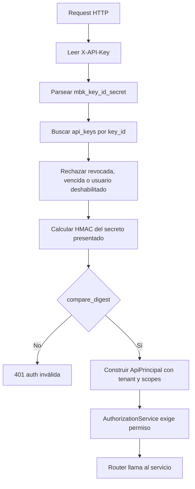
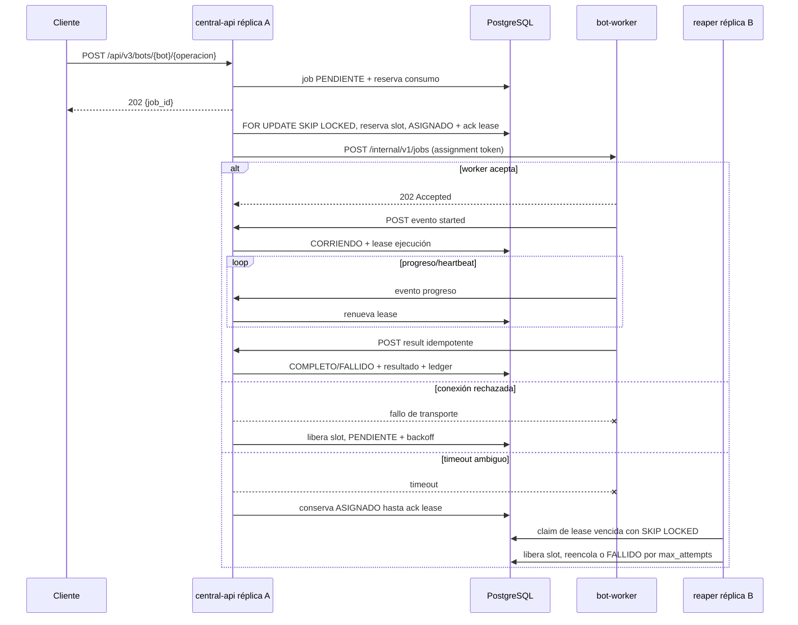

# Plan de implementación: `central-api` V3

> **Estado:** plan de implementación.
>
> **Ámbito:** `services/central-api/`.
>
> **Responsable arquitectónico:** API pública, plano de control y datos, scheduler, flota, facturación y montaje del panel.
>
> **No cubre:** la implementación visual del panel, que se detalla en `plans/05-admin-panel/plan.md`, ni el runtime de Playwright, que se detalla en `plans/03-worker/plan.md`.

---

## 1. Objetivo y alcance

### 1.1 Objetivo

`central-api` será el único servicio adyacente al estado persistente de MrBot API V3.

Posee PostgreSQL como fuente única de verdad.

Posee la cola durable de jobs.

Decide cuándo un job puede entrar, reservar consumo y ser asignado.

Mantiene el inventario, salud y capacidad de los workers.

Monta el panel administrativo bajo el mismo dominio y política de autenticación.

Expone la API pública V3.

Firma accesos temporales a object storage.

Recibe webhooks de facturación y delega las reglas monetarias a `plans/04-billing/plan.md`.

El servicio debe poder tener múltiples réplicas sin cambiar la semántica de la cola.

Por lo tanto, una réplica es desechable y no posee estado de scheduler en memoria que sea autoridad.

### 1.2 Límites de responsabilidad

| Responsabilidad | `central-api` | `bot-worker` | Contrato relevante |
|---|---:|---:|---|
| PostgreSQL | Sí, único cliente de aplicación | No | I-4, W-1 |
| Crear y consultar jobs | Sí | No | API `/api/v3/jobs` |
| Ejecutar Playwright | No | Sí | `POST /internal/v1/jobs` |
| Elegir worker | Sí | No | scheduler push |
| Límite de 5 ejecuciones | Cuenta y respeta | Impone con semáforo | W-2 |
| Credencial RSA privada | Sí | No | SEC-3 |
| Credenciales fiscales | Descifra y entrega efímeramente | Usa solo en memoria | SEC-2 |
| Bucket S3/MinIO | Firma URLs y valida metadatos | Solo usa URLs prefirmadas | protocolo §7 |
| Facturación y ledger | Sí | No | B-1 a B-4 |
| Panel administrativo | Lo monta | No | R2, R11 |
| Estado de flota | Persiste y alerta | Reporta | R10, R11, R12 |

El worker es un ejecutor puro y no debe importar modelos ORM de la central.

El worker tampoco debe conocer `DATABASE_URL` ni instalar un driver de PostgreSQL.

La central no debe importar implementaciones de bots.

Ambos servicios solo comparten esquemas versionados desde `packages/mrbot-contracts`.

### 1.3 Invariantes que este servicio debe hacer cumplir

| Invariante | Obligación concreta de la central |
|---|---|
| I-4 | Mantener `DATABASE_URL` y migraciones fuera de cualquier imagen/configuración del worker. |
| S-1 | Nunca importar ni invocar un bot desde un router público. Todo comando de bot persiste y responde `202 + job_id`. |
| S-2 | Persistir y reutilizar la identidad de idempotencia en una restricción única, incluso después de un estado terminal. |
| W-2 | No asignar a un worker sin slot, y reconciliar slots mediante heartbeat y leases. |
| W-4 | Reencolar jobs con lease vencido sin requerir reinicio ni acción humana. |
| B-2 | Reservar consumo antes de asignar y liberarlo cuando no pueda llegar a ejecutarse. |
| SEC-1 | Aplicar el sanitizador de errores en toda frontera pública. |
| SEC-3 | Cargar la clave RSA privada exclusivamente en este proceso. |

### 1.4 Decisiones de alcance inicial

La fase F2 entrega registro de workers, heartbeat, jobs, scheduler push y un bot piloto.

El piloto recomendado sigue siendo `consulta_cuit` para probar contratos sencillos.

El segundo piloto debe ser `mis_comprobantes`, porque valida credenciales, browser, artefactos y resultados reales.

La central no introduce Redis en F2.

PostgreSQL resuelve la exclusión mutua de cola con `FOR UPDATE SKIP LOCKED`.

Un rate limiter distribuido externo queda diferido hasta tener métricas que justifiquen Redis o un gateway especializado.

---

## 2. Estructura interna del servicio

### 2.1 Árbol propuesto

```text
services/central-api/
├── pyproject.toml
├── Dockerfile
├── README.md
├── alembic.ini
├── migrations/
│   └── versions/
├── src/central_api/
│   ├── main.py
│   ├── settings.py
│   ├── api/
│   │   └── v3/
│   │       ├── router.py
│   │       ├── bots.py
│   │       ├── jobs.py
│   │       ├── account.py
│   │       ├── uploads.py
│   │       ├── utilities.py
│   │       └── dependencies.py
│   ├── internal/
│   │   ├── router.py
│   │   ├── workers.py
│   │   ├── job_events.py
│   │   ├── job_results.py
│   │   ├── uploads.py
│   │   └── dependencies.py
│   ├── admin/
│   │   ├── router.py
│   │   ├── auth.py
│   │   ├── views.py
│   │   └── notifications.py
│   ├── scheduler/
│   │   ├── loop.py
│   │   ├── claim.py
│   │   ├── selector.py
│   │   ├── dispatcher.py
│   │   ├── reaper.py
│   │   └── circuit_breaker.py
│   ├── domain/
│   │   ├── enums.py
│   │   ├── jobs.py
│   │   ├── workers.py
│   │   ├── bots.py
│   │   ├── identities.py
│   │   └── artifacts.py
│   ├── services/
│   │   ├── job_service.py
│   │   ├── job_query_service.py
│   │   ├── bot_catalogue_service.py
│   │   ├── admission_service.py
│   │   ├── worker_registry_service.py
│   │   ├── worker_event_service.py
│   │   ├── artifact_service.py
│   │   ├── api_key_service.py
│   │   ├── authorization_service.py
│   │   ├── utility_service.py
│   │   └── idempotency_service.py
│   ├── repositories/
│   │   ├── jobs.py
│   │   ├── workers.py
│   │   ├── bots.py
│   │   ├── api_keys.py
│   │   ├── users.py
│   │   ├── artifacts.py
│   │   ├── audit.py
│   │   └── unit_of_work.py
│   ├── models/
│   │   ├── base.py
│   │   ├── job.py
│   │   ├── job_event.py
│   │   ├── job_result.py
│   │   ├── job_artifact.py
│   │   ├── worker.py
│   │   ├── api_key.py
│   │   └── audit_log.py
│   ├── schemas/
│   │   ├── public/
│   │   ├── internal/
│   │   ├── admin/
│   │   ├── catalogue.py
│   │   └── errors.py
│   ├── security/
│   │   ├── api_keys.py
│   │   ├── principals.py
│   │   ├── permissions.py
│   │   ├── rsa_credentials.py
│   │   ├── worker_auth.py
│   │   ├── oidc.py
│   │   └── secret_redaction.py
│   ├── billing/
│   │   ├── facade.py
│   │   ├── reservation.py
│   │   └── entitlements.py
│   ├── observability/
│   │   ├── logging.py
│   │   ├── metrics.py
│   │   ├── tracing.py
│   │   ├── health.py
│   │   └── alerts.py
│   └── registry/
│       ├── bot_manifest.py
│       ├── input_models.py
│       └── loader.py
└── tests/
    ├── api/
    ├── internal/
    ├── scheduler/
    ├── security/
    ├── repositories/
    └── contract/
```

### 2.2 Propósito de cada paquete

| Paquete | Propósito | No debe hacer |
|---|---|---|
| `api` | Adaptadores HTTP públicos V3, autenticación de cliente, parsing y respuestas. | Consultar ORM o ejecutar lógica de scheduling. |
| `internal` | Adaptadores HTTP privados para workers autenticados. | Exponer rutas en OpenAPI público. |
| `admin` | Montar endpoints, sesiones y notificaciones que consumirá el panel. | Mezclar reglas visuales con servicios de jobs. |
| `scheduler` | Reclamar, ordenar, seleccionar worker, despachar, reintentar y reaper. | Ser fuente de verdad en memoria. |
| `domain` | Enums, políticas puras y transiciones legales de dominio. | Depender de FastAPI, SQLAlchemy o HTTP. |
| `services` | Casos de uso transaccionales y coordinación entre repositorios. | Construir respuestas FastAPI. |
| `repositories` | Consultas y mutaciones persistentes de una agregación. | Conocer headers o modelos Pydantic públicos. |
| `models` | Mapeo ORM SQLAlchemy a tablas propias de V3. | Contener decisiones de negocio o serialización pública. |
| `schemas` | DTOs Pydantic de bordes HTTP y contratos internos. | Volverse modelo persistente. |
| `security` | Autenticación, autorización, criptografía de borde y redacción. | Facturar o asignar workers. |
| `billing` | Fachada tipada hacia planes, cuotas, créditos y ledger. | Implementar reglas duplicadas del plan 04. |
| `observability` | Logs, métricas, tracing, health y alertas operativas. | Alterar estado de negocio para “arreglar” métricas. |
| `registry` | Manifiesto único de bots, operaciones, esquemas y costos. | Crear routers por bot. |

### 2.3 Regla de capas

La dependencia permitida es:

```text
router -> service -> repository -> ORM/modelo
                     service -> billing facade
scheduler -> service/repository -> ORM/modelo
```

Un router puede convertir un `Request` en un schema Pydantic.

Un router puede pedir un `Principal` a una dependencia de seguridad.

Un router debe llamar a un servicio y mapear su resultado a una respuesta.

Un router no puede crear una `Session`, llamar `select(Job)` ni usar `session.commit()`.

Un servicio abre una unidad de trabajo o recibe una unidad de trabajo explícita.

Un repositorio contiene SQLAlchemy o SQL preciso y devuelve entidades o DTOs internos.

Las transiciones de estado pasan por métodos de dominio validados, no por strings asignados libremente.

La única excepción explícita es la ruta de `health`, que no necesita acceder a la base para liveness.

### 2.4 Motivo de esta separación

V2 no tiene esta frontera.

Los routers V2 llamaban directamente al manager de jobs y al ORM.

La fábrica `app/api/v2/factory.py` mezcla parsing, normalización de CUIT, protección de secretos, almacenamiento de multipart, límites de cola, persistencia, cancelación y proyección del resultado.

Esa fábrica tiene aproximadamente 1024 líneas.

Como consecuencia, un cambio de transporte puede romper la cola o la persistencia.

También hace muy difícil probar políticas de admisión sin arrancar FastAPI y una base de datos.

En V3, `JobService.create()` será testeable contra repositorios de prueba.

El router V3 solo resolverá el modelo de entrada y llamará `JobService.submit()`.

---

## 3. API pública V3

### 3.1 Principio de diseño

La V3 expone una sola superficie genérica de jobs y un catálogo de bots.

Sustituye 33 routers V2 generados por bot por recursos estables.

El cliente crea trabajo bajo el recurso de dominio `bots`.

El cliente consulta, cancela y lista bajo el recurso global `jobs`.

El catálogo describe operaciones, esquema, costo y disponibilidad sin fabricar rutas Python.

### 3.2 Justificación basada en V2

`app/api/v2/factory.py` tiene 1024 líneas y genera el mismo triplete por bot.

El triplete V2 es un `POST` de creación, un `POST` de cancelación y un `GET` de estado.

El registro de bots está duplicado en `app/jobs/registry.py`.

También está duplicado en `app/api/v2/router.py`.

También está duplicado en `app/api/v2/job_status.py` para resolver el modelo de log.

Agregar un bot obliga a tocar como mínimo router, registry de ejecución, modelo/log y resolución de estado.

En la práctica toca cuatro o más archivos, además de tests y migración.

La fábrica además deriva rutas partiéndolas con `rsplit('/', 1)`.

Esa codificación de semántica en strings produce aliases y excepciones difíciles de auditar.

En V3 un manifiesto declarativo es la única fuente para catálogo, validación, elegibilidad de worker y costo.

El manifiesto no contiene una clase ORM por bot.

Los resultados específicos se persisten en `job_results.payload` como documento versionado.

### 3.3 Convenciones generales

La raíz pública es `/api/v3`.

Los identificadores de job son UUIDv7 serializados en minúsculas canónicas.

Los identificadores de usuario no se exponen como IDs correlativos.

Todos los tiempos son RFC 3339 en UTC con sufijo `Z`.

El header `X-API-Key` autentica clientes programáticos.

`Idempotency-Key` es obligatorio para toda creación de job de cliente.

Una misma clave de idempotencia solo puede reutilizarse con el mismo `bot`, `operacion` y hash canónico de payload.

Reutilizarla con otro payload devuelve conflicto y nunca crea otro trabajo.

Las respuestas incluyen `X-Correlation-ID`.

Los endpoints de lectura de jobs no consumen cuota.

### 3.4 Tabla de superficie

| Método y ruta | Autorización | Resultado normal | Propósito |
|---|---|---:|---|
| `POST /api/v3/bots/{bot}/{operacion}` | `jobs:create` y bot habilitado | 202 | Crear job genérico. |
| `GET /api/v3/jobs/{job_id}` | dueño, soporte autorizado o admin | 200 | Estado y resultado de un job. |
| `POST /api/v3/jobs/{job_id}/cancelar` | dueño con `job:cancel` o admin | 200 | Solicitar cancelación. |
| `POST /api/v3/jobs/estado:lote` | dueño | 200 | Estados en lote, máximo 200. |
| `GET /api/v3/jobs` | dueño | 200 | Listado propio por cursor UUIDv7. |
| `GET /api/v3/bots` | cliente autenticado | 200 | Catálogo visible y disponibilidad. |
| `GET /api/v3/bots/{bot}` | cliente autenticado | 200 | Detalle y operaciones de un bot. |
| `GET /api/v3/mi/cuenta` | cliente autenticado | 200 | Plan, período, consumo y saldo. |
| `POST /api/v3/uploads` | cliente con operación multipart | 201 | Solicitar URL de carga temporal. |
| `GET /api/v3/utilidades/...` | según utilidad | 200 | Utilidades sin bot, ver §8. |
| `GET /health` | público, infraestructura | 200 o 503 | Liveness del proceso. |
| `GET /ready` | público, infraestructura | 200 o 503 | Readiness de dependencias requeridas. |

La ruta `POST /api/v3/uploads` es auxiliar para aportar archivos a un futuro job.

No ejecuta bots, no crea un job y no consume la cuota del bot.

### 3.5 Crear un job

```http
POST /api/v3/bots/mis_comprobantes/consulta
X-API-Key: mbk_01J..._secreto-aleatorio
Idempotency-Key: 018f7b5d-3f14-7a52-a2be-4ca64a0e0fe1
Content-Type: application/json
```

```json
{
  "cuit_representante": "20123456789",
  "cuit_representado": "20987654321",
  "periodo_desde": "2026-08",
  "periodo_hasta": "2026-08",
  "clave_encriptada": "Base64-RSA-OAEP-SHA256"
}
```

La central resuelve el manifiesto `mis_comprobantes/consulta`.

Valida el cuerpo con el modelo Pydantic específico.

Desencripta y extrae credenciales antes de persistir el payload protegido.

Calcula el hash canónico de payload sin incluir material secreto en claro.

En la misma unidad transaccional verifica idempotencia, admite contra backpressure y crea el job `PENDIENTE`.

La reserva monetaria inicial es creada por la fachada de billing en esa misma transacción lógica.

```http
HTTP/1.1 202 Accepted
Location: /api/v3/jobs/0198f7fa-1f0b-7c1d-a981-bb4e6cd77564
X-Correlation-ID: 9d0e0f47-8269-450f-92d7-6f55553474b6
```

```json
{
  "success": true,
  "job_id": "0198f7fa-1f0b-7c1d-a981-bb4e6cd77564",
  "status": "PENDIENTE"
}
```

Si la misma solicitud idempotente ya creó el job, responde el mismo cuerpo y `202`.

Si la clave es igual pero el fingerprint no coincide, responde `409` con error público `idempotency_conflict`.

### 3.6 Consultar estado y mantener compatibilidad

La proyección de `GET /api/v3/jobs/{job_id}` conserva explícitamente la forma V2 `JobStatusResponse`.

Esto protege a clientes que ya consumen el contrato de polling.

La forma exacta a conservar es:

```json
{
  "job_id": "0198f7fa-1f0b-7c1d-a981-bb4e6cd77564",
  "status": "COMPLETO",
  "result": "OK",
  "bot": "mis_comprobantes",
  "operation": "consulta",
  "created_at": "2026-09-16T06:01:03Z",
  "started_at": "2026-09-16T06:01:05Z",
  "finished_at": "2026-09-16T06:01:23Z",
  "cancel_reason": null,
  "cancelled_by": null,
  "error": null,
  "files": [
    {
      "name": "comprobantes.zip",
      "url": "https://storage.example/...firma-temporal...",
      "size": 18240
    }
  ],
  "data": {
    "schema_version": 1,
    "comprobantes": []
  }
}
```

Los campos son siempre presentes y pueden ser `null` o listas vacías según estado.

`status` conserva los nombres castellanos `PENDIENTE`, `ASIGNADO`, `CORRIENDO`, `COMPLETO`, `FALLIDO` y `CANCELADO`.

V2 no tenía `ASIGNADO` ni `FALLIDO`, por lo que el adaptador V2 debe mapearlos cuidadosamente si se habilita durante la migración.

`result` es un eje distinto y usa `OK`, `PARCIAL`, `ERROR` o `null`.

Para `FALLIDO`, `result` será `ERROR`.

Los artefactos públicos nunca incluyen bucket ni object key.

La URL es de descarga prefirmada, corta y generada al leer.

Si el artefacto fue borrado por retención, `url` es `null` y el dato estructurado explica `estado: "EXPIRADO"` dentro de metadata aprobada.

Nunca se reutiliza el sentinel V2 de texto humano dentro de un campo URL.

### 3.7 Cancelar un job

```http
POST /api/v3/jobs/0198f7fa-1f0b-7c1d-a981-bb4e6cd77564/cancelar
X-API-Key: mbk_01J..._secreto-aleatorio
Content-Type: application/json
```

```json
{
  "motivo": "El período solicitado era incorrecto"
}
```

Para `PENDIENTE`, la transacción cambia directamente a `CANCELADO`, anula la reserva y libera cualquier slot reservado.

Para `ASIGNADO`, marca `cancel_requested_at`, envía un comando interno de cancelación si el worker ya fue contactado y espera un ack o el reaper.

Para `CORRIENDO`, registra una solicitud cooperativa de cancelación y la entrega al worker.

La cancelación no promete revertir efectos externos ya iniciados por un portal.

Una respuesta exitosa devuelve el `JobStatusResponse` actualizado.

```json
{
  "job_id": "0198f7fa-1f0b-7c1d-a981-bb4e6cd77564",
  "status": "CANCELADO",
  "result": null,
  "bot": "mis_comprobantes",
  "operation": "consulta",
  "created_at": "2026-09-16T06:01:03Z",
  "started_at": null,
  "finished_at": "2026-09-16T06:01:08Z",
  "cancel_reason": "El período solicitado era incorrecto",
  "cancelled_by": "user",
  "error": null,
  "files": [],
  "data": null
}
```

### 3.8 Estado en lote

`POST /api/v3/jobs/estado:lote` preserva la semántica de `/api/v2/jobs/status:batch`.

Acepta como máximo 200 IDs.

No consume cuota ni créditos.

No revela existencia de jobs de otro usuario.

Cada ítem tiene resultado o error propio para evitar que un ID inválido invalide el lote.

```json
{
  "job_ids": [
    "0198f7fa-1f0b-7c1d-a981-bb4e6cd77564",
    "0198f80a-428a-7912-a575-405145542eae",
    "no-es-un-uuid"
  ]
}
```

```json
{
  "items": [
    {
      "job_id": "0198f7fa-1f0b-7c1d-a981-bb4e6cd77564",
      "status": "CORRIENDO",
      "result": null,
      "bot": "mis_comprobantes",
      "operation": "consulta",
      "created_at": "2026-09-16T06:01:03Z",
      "started_at": "2026-09-16T06:01:05Z",
      "finished_at": null,
      "cancel_reason": null,
      "cancelled_by": null,
      "error": null,
      "files": [],
      "data": null
    },
    {
      "job_id": "0198f80a-428a-7912-a575-405145542eae",
      "error": {
        "error_code": "not_found",
        "message": "Job no encontrado"
      }
    },
    {
      "job_id": "no-es-un-uuid",
      "error": {
        "error_code": "validation",
        "message": "Identificador de job inválido"
      }
    }
  ]
}
```

El máximo de 200 se valida antes de consultar la base.

Un lote de 201 elementos devuelve `400` de validación sin procesar parcialmente.

El endpoint hace una sola consulta por conjunto cuando todos los UUID son válidos.

La proyección de archivos puede firmarse en paralelo con un límite de concurrencia para evitar N llamadas costosas sin tope.

### 3.9 Listado propio por cursor UUIDv7

`GET /api/v3/jobs` lista solamente jobs del principal autenticado.

Soporta filtros `status`, `bot`, `operacion`, `created_from`, `created_to` y `result`.

Usa `limit` entre 1 y 100, con default 50.

Usa `cursor` opaco que contiene el UUIDv7 de borde y una firma de integridad.

No usa offsets porque se degradan y se vuelven inestables cuando entran trabajos nuevos.

El orden por defecto es `job_id DESC`, que preserva orden temporal práctico de UUIDv7.

Cuando se filtra por fecha, la consulta conserva un desempate por `job_id`.

```http
GET /api/v3/jobs?status=COMPLETO&bot=mis_comprobantes&limit=2
X-API-Key: mbk_01J..._secreto-aleatorio
```

```json
{
  "items": [
    {
      "job_id": "0198f80a-428a-7912-a575-405145542eae",
      "status": "COMPLETO",
      "result": "OK",
      "bot": "mis_comprobantes",
      "operation": "consulta",
      "created_at": "2026-09-16T06:04:02Z",
      "started_at": "2026-09-16T06:04:04Z",
      "finished_at": "2026-09-16T06:04:20Z",
      "cancel_reason": null,
      "cancelled_by": null,
      "error": null,
      "files": [],
      "data": null
    }
  ],
  "next_cursor": "eyJ2IjoxLCJqb2JfaWQiOiIwMTk4...firma",
  "has_more": true
}
```

El listado omite `data` completo por defecto para evitar respuestas grandes.

Puede incluir `include=data` solo para resultados terminales y con un límite menor de 20.

La documentación OpenAPI debe declarar este comportamiento de tamaño.

### 3.10 Catálogo de bots

`GET /api/v3/bots` permite a clientes descubrir capacidades sin depender de rutas generadas.

Cada item declara identificador estable, display name, disponibilidad, costo y operaciones.

```json
{
  "items": [
    {
      "id": "portal_iva_carga",
      "nombre": "Portal IVA: carga",
      "estado": "HABILITADO",
      "costo_creditos": 3,
      "operaciones": [
        {
          "id": "carga",
          "modo": "job",
          "costo_creditos": 3,
          "input_schema_ref": "/api/v3/bots/portal_iva_carga#operaciones/carga/input-schema",
          "requiere_archivos": true,
          "campos_archivo": [
            "ventas_txt_1",
            "ventas_txt_2",
            "compras_txt_1",
            "compras_txt_2",
            "apertura_csv"
          ]
        }
      ]
    }
  ]
}
```

`GET /api/v3/bots/{bot}` entrega el JSON Schema del modelo Pydantic de cada operación.

```json
{
  "id": "vep",
  "nombre": "Volante Electrónico de Pago",
  "estado": "HABILITADO",
  "operaciones": [
    {
      "id": "carga",
      "modo": "job",
      "costo_creditos": 1,
      "input_schema": {
        "$schema": "https://json-schema.org/draft/2020-12/schema",
        "type": "object",
        "properties": {
          "archivo_txt_key": {
            "type": "string",
            "description": "Object key temporal emitido por /uploads"
          }
        },
        "required": ["archivo_txt_key"]
      }
    }
  ]
}
```

El OpenAPI también publica los modelos concretos como componentes.

La ruta genérica declara `oneOf` y una extensión `x-mrbot-operation-schema` que apunta al componente exacto.

La documentación generada se valida en CI contra el manifiesto.

### 3.11 Validación por bot sin routers por bot

El registro interno se indexa por la tupla normalizada `(bot, operacion)`.

Cada entrada contiene el modelo Pydantic de entrada, versión, costo, capacidades de worker y política de archivos.

```python
@dataclass(frozen=True)
class OperationDefinition:
    bot: str
    operation: str
    input_model: type[BaseModel]
    result_schema_version: int
    credit_cost: int
    required_worker_capabilities: frozenset[str]
    upload_fields: tuple[UploadField, ...]
    timeout_seconds: int
```

El router genérico primero normaliza y valida los path parameters contra IDs exactos del catálogo.

Luego resuelve la definición desde `OperationRegistry`.

Luego invoca `input_model.model_validate_json(raw_body)`.

Los errores Pydantic se convierten a la categoría pública `validation` sin eco de secretos o cuerpo crudo.

El servicio recibe un DTO normalizado y no sabe que provino de HTTP.

No se permite importar arbitrariamente una clase por un nombre que venga del cliente.

El registro se carga al arrancar y falla el startup si hay IDs duplicados, schema inválido o capability inexistente.

### 3.12 Archivos de entrada: carga directa prefirmada

V2 aceptaba multipart proxificado por la API para `portal_iva_carga`.

Sus campos nombrados incluían ocho slots de Portal IVA.

V2 aceptaba `archivo_txt` para `vep` y `vep_alias`.

La propuesta V3 recomendada es carga directa a object storage con URL prefirmada.

El cliente pide un ticket a `POST /api/v3/uploads` indicando bot, operación, campo, nombre, tamaño y content type.

La central valida que el campo exista en la definición del catálogo y que el tamaño/tipo respeten la política.

La central crea un objeto temporal asociado a usuario, operación esperada, expiración y checksum opcional.

La central retorna una URL `PUT` prefirmada y un `object_key` opaco temporal.

```json
{
  "bot": "portal_iva_carga",
  "operacion": "carga",
  "campo": "ventas_txt_1",
  "filename": "ventas-agosto.txt",
  "content_type": "text/plain",
  "size_bytes": 48123,
  "sha256": "3a7bd3e2360a3d80..."
}
```

```json
{
  "upload_id": "0198f84d-967f-7315-9e4b-0be10f4cc80f",
  "object_key": "uploads/0198f84d-967f-7315-9e4b-0be10f4cc80f",
  "upload_url": "https://storage.example/...firma...",
  "expires_at": "2026-09-16T06:20:00Z",
  "required_headers": {
    "Content-Type": "text/plain"
  }
}
```

El `POST` de job referencia los object keys emitidos, nunca paths locales ni URLs arbitrarias.

```json
{
  "cuit_representante": "20123456789",
  "archivo_ventas_txt_1_key": "uploads/0198f84d-967f-7315-9e4b-0be10f4cc80f"
}
```

La central verifica en transacción que cada objeto pertenezca al principal, no esté vencido, se haya confirmado y sea compatible con ese campo.

Tras asociarlo a un job, el objeto temporal queda inmovilizado y no puede reutilizarse por otra cuenta.

Esta alternativa evita que el proceso central copie bytes grandes y se convierta en cuello de botella.

También permite escalar API y transferencia de archivos por separado.

Reduce exposición de memoria, timeout y superficie multipart de FastAPI.

La alternativa de proxy multipart solo se conserva como adaptador V2 temporal.

El proxy agrega doble tráfico, mantiene workers HTTP ocupados, dificulta reintentos y replica el fallo V2 de crear job antes de que la carga termine.

No se debe aceptar un job hasta que todas sus referencias de upload estén verificadas.

---

## 4. Autenticación y autorización

### 4.1 Principal y frontera de seguridad

La autenticación pública termina antes de cualquier servicio de dominio.

La dependencia `require_api_principal` extrae `X-API-Key`.

La dependencia devuelve un `ApiPrincipal` inmutable con `user_id`, tenant, key_id, scopes y límites aplicables.

El router no acepta `user_id` desde el cliente.

Toda consulta por job aplica el scope del principal a nivel repositorio, no solo en el router.

### 4.2 Formato V3 de API key

El formato recomendado es:

```text
mbk_<key_id>_<secreto>
```

`key_id` es un identificador público aleatorio, por ejemplo UUIDv7 codificado sin guiones o base32.

`secreto` tiene al menos 256 bits generados con CSPRNG.

El prefijo permite encontrar una sola fila sin enviar email.

El secreto nunca se persiste en claro.

La tabla `api_keys` contiene `id`, `user_id`, `key_id`, `verifier_hmac`, `scopes`, `created_at`, `expires_at`, `revoked_at`, `last_used_at` y metadata de rotación.

El índice único se aplica sobre `key_id`.

El verificador conserva el concepto maduro de V2 en `app/utils/api_keys.py`.

Se calcula `HMAC-SHA-256(server_secret, secreto exacto)`.

El nombre de algoritmo y la versión del secreto forman parte del valor almacenado para permitir rotación del secreto de verificación.

### 4.3 Camino desde header hasta principal autenticado



V2 exigía conjuntamente `X-API-Key` y `Email`.

El email era un selector para buscar la fila `users.mail` antes de verificar el HMAC.

No debe mantenerse en V3 como requisito normal.

Es redundante, expone un identificador personal en cada request y crea errores asimétricos de `400` versus `401`.

El `key_id` embebido es un selector no secreto diseñado para ese lookup.

Un key ID no otorga autenticación sin el secreto.

Una key con formato inválido recibe el mismo `401` público que una key desconocida para evitar oráculos innecesarios.

### 4.4 Verificación y resistencia a timing

La fila se busca por `key_id` indexado.

Incluso si no existe una fila, el proceso ejecuta una comparación contra un verificador dummy del mismo largo.

La comparación de verificadores usa `hmac.compare_digest`.

No se compara la clave original ni se usa `==` sobre secretos.

La respuesta pública para toda falla de credencial es idéntica en contenido y tiempo aproximado.

Los logs internos pueden distinguir `key_not_found`, `key_revoked`, `key_expired` y `verifier_mismatch`, sin guardar el secreto presentado.

### 4.5 Rotación y revocación

Una cuenta puede tener varias API keys activas en paralelo.

Esto permite rotar sin caída de integraciones.

La emisión muestra el secreto una sola vez y registra un audit event.

Una rotación crea una nueva fila y fija una fecha de gracia para la anterior.

La revocación marca `revoked_at` y hace que la autenticación falle de inmediato.

No se borra la fila porque es evidencia de auditoría y permite explicar tráfico posterior.

`last_used_at` se actualiza asincrónicamente o con muestreo para no convertir cada auth en cuello de escritura.

La política inicial limita a cinco claves activas por usuario, configurable por plan.

La administración de keys requiere permisos explícitos y una razón auditada cuando se revoca una key ajena.

### 4.6 Autenticación de administradores

V2 usaba HTTP Basic con un único usuario y contraseña de entorno.

También construía manualmente una cookie HMAC de ocho horas.

V3 no usa HTTP Basic ni credenciales globales de entorno como identidad durable.

El panel usa OIDC Authorization Code con PKCE contra el proveedor corporativo.

La sesión web es una cookie `HttpOnly`, `Secure`, `SameSite=Lax` con identificador aleatorio de sesión server-side o token cifrado corto y rotado.

Los administradores requieren MFA según el proveedor de identidad.

El callback mapea `subject` OIDC a `admin_users` y roles de base de datos.

Para despliegue inicial sin IdP, se permite un proveedor local de emergencia solamente si está activado explícitamente.

Ese proveedor almacena contraseña con Argon2id, exige MFA TOTP y nunca toma `ADMIN_PASSWORD` como usuario global de operación.

La cuenta bootstrap se crea una vez y su secreto se rota o destruye según procedimiento de infraestructura.

### 4.7 Roles y permisos

V2 solo distinguía usuario y administrador global.

V3 implementa RBAC con permisos evaluables por acción.

| Rol | Permisos principales | Límites |
|---|---|---|
| `api_client` | `jobs:create`, `jobs:read_own`, `jobs:cancel_own`, `account:read` | Solo tenant y jobs propios. |
| `tenant_admin` | Gestionar miembros y API keys de su tenant | No administra flota ni facturación global. |
| `support_read` | `jobs:read_any`, `users:read`, `fleet:read` | Sin ver secretos, sin cancelar. |
| `support_operator` | Lo anterior y `jobs:cancel_any`, `workers:drain` | Requiere auditoría y motivo. |
| `billing_manager` | `billing:read`, `billing:adjust` | No accede a credenciales fiscales. |
| `security_admin` | `api_keys:revoke_any`, `audit:read`, políticas | No ejecuta ajustes monetarios por defecto. |
| `super_admin` | Administración integral | Uso excepcional, MFA fuerte y auditoría. |

Los permisos se guardan como datos, no como `if username == ...`.

El catálogo puede exigir permisos adicionales por bot si hay capacidades restringidas.

La autorización se evalúa después de autenticar y antes de cargar datos sensibles.

Cada denegación administrativa genera un evento de auditoría.

### 4.8 Autenticación interna de workers

Los endpoints `/internal/v1` no aceptan API keys de clientes.

El worker presenta mTLS y un token de servicio de corta vida emitido durante registro.

El token tiene audiencia `central-api-internal`, worker ID, versión de protocolo, expiración y nonce.

La central vincula el certificado o identidad de workload al `worker_id` registrado.

Un worker no puede reportar eventos o resultados para otro worker.

No se comparte el secreto HMAC de API keys con workers.

---

## 5. Cuotas, rate limiting y backpressure

### 5.1 Separar conceptos

Cuota es la capacidad comercial por período o créditos.

Rate limiting es la frecuencia de requests por ventana temporal.

Concurrencia por usuario es la cantidad de jobs no terminales permitidos.

Backpressure de cola es el máximo durable admitido en estado `PENDIENTE` o `ASIGNADO`.

Cada mecanismo tiene mensaje, métrica y política de retry distinta.

No se debe usar un contador mensual para limitar abuso por segundo.

No se debe usar un 429 de cola llena como si fuera falta de saldo.

### 5.2 Punto de reserva de consumo

Las reglas de dinero pertenecen a `plans/04-billing/plan.md`.

`central-api` llama a la fachada `BillingReservationService` durante admisión del job.

La reserva ocurre después de validar entrada e idempotencia y antes de confirmar el job como admisible.

La reserva y la inserción del job se confirman en una transacción de PostgreSQL.

El ledger contiene una referencia única al job y al intento de reserva.

La reserva se confirma cuando el resultado terminal representa ejecución cobrada según la política de billing.

Se libera cuando el job se cancela antes de empezar, se rechaza en entrega o falla de manera no cobrable.

La liberación es idempotente por job y tipo de transición.

### 5.3 Fallo V2 que no se repite

V2 reseteaba el contador mensual dentro de `validate_api_key` en `app/api/deps.py`.

Eso convierte autenticar en una mutación de negocio.

Un `GET` de estado podía alterar consumo mensual indirectamente.

Una solicitud autenticada fallida podía disparar reset sin relación con facturación.

V3 no actualiza cuota, período ni ledger en el camino de autenticación.

El cálculo de período reside en billing y es explícito, UTC y testeable.

`GET /api/v3/mi/cuenta` solo lee el estado calculado y no lo “arregla”.

### 5.4 Rate limiting de requests

La política inicial usa un token bucket por `key_id` y una defensa secundaria por IP.

Se implementa en gateway o middleware con un almacenamiento que sobreviva a réplicas.

Si no existe Redis en F2, se usa una tabla PostgreSQL de ventanas discretas solo para una política conservadora y medida.

La adopción de Redis queda condicionada a una métrica de contención y no es requisito arquitectónico inicial.

Se definen buckets separados para creación de jobs, polling de estados, carga de tickets y login admin.

El polling tiene límite más alto que creación, pero no ilimitado.

Una respuesta de rate limit usa `429`, `Retry-After`, `RateLimit-Limit`, `RateLimit-Remaining` y `RateLimit-Reset`.

La falta de cuota comercial también usa `429`, pero con `error_code: quota_exhausted` y sin simular una ventana de tasa.

### 5.5 Límite de concurrencia por usuario

Cada plan define `max_active_jobs`.

Se consideran activos `PENDIENTE`, `ASIGNADO` y `CORRIENDO`.

La admisión lo impone en la misma transacción que inserta el job.

La estrategia preferida usa una fila `user_job_limits` por usuario y período con contador `active_jobs`.

La transacción bloquea la fila con `SELECT ... FOR UPDATE`, compara con el límite, incrementa e inserta job.

Una transición a terminal decrementa el contador exactamente una vez mediante condición de estado.

El reaper no puede decrementar al reencolar porque el job permanece activo.

Este contador evita `COUNT(*)` costoso y elimina la carrera count-then-insert.

Un job idempotente existente no incrementa el contador de nuevo.

### 5.6 Backpressure global y por usuario

V2 configuraba `MAX_PENDING_JOBS=500` global y el mismo default por usuario.

V2 hacía `COUNT` antes de insertar.

Dos requests concurrentes podían observar 499 y ambos insertar, superando el límite.

V3 no usa count-then-insert como autoridad.

Se crea una fila singleton `queue_admission_limits` con `pending_jobs` y límites configurados.

Durante admisión se bloquea esa fila con `FOR UPDATE`.

Se bloquea además la fila de límite por usuario.

Se verifica `pending_jobs < max_pending_jobs` y `user_pending_jobs < max_pending_jobs_per_user`.

Se incrementan ambos contadores e inserta job en una única transacción.

Cuando el scheduler cambia `PENDIENTE` a `ASIGNADO`, decrementa los contadores pending de forma condicional en la misma transacción.

Cuando un job asignado vuelve a pendiente, los incrementa otra vez verificando límites.

Si no hay cupo al reencolar, el job conserva prioridad de recuperación y usa un estado interno de reintento bloqueado que no se pierde.

No se descarta un job ya admitido por backpressure posterior.

Los contadores se reconcilian periódicamente contra `jobs` y alertan si hay divergencia.

### 5.7 Orden de admisión

1. Autenticar API key y construir principal.
2. Autorizar `jobs:create` para el bot/operación.
3. Resolver y validar schema.
4. Verificar referencias de archivos temporales.
5. Buscar idempotencia persistente y comparar fingerprint.
6. Bloquear límites de concurrencia y de cola.
7. Reservar consumo mediante billing.
8. Insertar job `PENDIENTE`, evento y registro de idempotencia.
9. Confirmar transacción.
10. Despertar al scheduler de forma best-effort mediante `NOTIFY` o evento local.
11. Responder `202`.

El scheduler puede descubrir el job por polling aunque falle el aviso.

La respuesta nunca espera a que un worker acepte.

---

## 6. Scheduler y load balancer, R10

### 6.1 Rol y modelo de ejecución

El scheduler vive dentro de cada réplica de `central-api` como tarea supervisada.

No es un proceso líder único.

N réplicas pueden reclamar diferentes trabajos sin duplicar asignación.

PostgreSQL es la autoridad de exclusión mutua.

La tarea usa `LISTEN/NOTIFY` para reaccionar rápido a nuevas filas y un polling de seguridad cada segundo.

Un fallo de `NOTIFY` nunca bloquea la entrega porque existe polling.

El loop solo considera jobs `PENDIENTE` cuyo `next_attempt_at` sea nulo o haya vencido.

### 6.2 Claim transaccional con `SKIP LOCKED`

El scheduler no mantiene un lock de base mientras realiza HTTP al worker.

Primero reclama y marca el job `ASIGNADO` en una transacción corta.

En esa misma transacción reserva un slot lógico del worker elegido.

Luego hace el POST al worker fuera de la transacción.

La consulta base para seleccionar un job elegible es:

```sql
WITH candidate AS (
    SELECT j.id
    FROM jobs AS j
    JOIN users AS u ON u.id = j.user_id
    LEFT JOIN user_scheduler_state AS us ON us.user_id = j.user_id
    WHERE j.status = 'PENDIENTE'
      AND (j.next_attempt_at IS NULL OR j.next_attempt_at <= now())
      AND j.cancel_requested_at IS NULL
    ORDER BY
      j.tier_priority DESC,
      COALESCE(us.active_assignments, 0) ASC,
      j.created_at ASC,
      j.id ASC
    FOR UPDATE SKIP LOCKED
    LIMIT 1
)
SELECT j.*
FROM jobs AS j
JOIN candidate AS c ON c.id = j.id;
```

`FOR UPDATE SKIP LOCKED` evita que dos réplicas bloqueen o tomen la misma fila pendiente.

La elección de worker debe suceder dentro de la misma transacción, tras cargar workers elegibles y bloquear el candidato de worker.

La reserva final debe actualizar tanto job como slot bajo condiciones de versión/estado.

```sql
WITH selected_worker AS (
    SELECT w.id
    FROM workers AS w
    WHERE w.id = :worker_id
      AND w.status = 'SANO'
      AND w.protocol_min_version <= :protocol_version
      AND w.protocol_max_version >= :protocol_version
      AND w.running_jobs + w.reserved_slots < w.capacity
    FOR UPDATE
), assigned AS (
    UPDATE jobs AS j
    SET status = 'ASIGNADO',
        worker_id = (SELECT id FROM selected_worker),
        assignment_token = :assignment_token,
        assignment_attempt = j.assignment_attempt + 1,
        assigned_at = now(),
        lease_expires_at = now() + make_interval(secs => :ack_lease_seconds),
        next_attempt_at = NULL
    WHERE j.id = :job_id
      AND j.status = 'PENDIENTE'
      AND EXISTS (SELECT 1 FROM selected_worker)
    RETURNING j.id
)
UPDATE workers AS w
SET reserved_slots = reserved_slots + 1,
    updated_at = now()
WHERE w.id = (SELECT id FROM selected_worker)
  AND EXISTS (SELECT 1 FROM assigned)
RETURNING w.id;
```

La implementación verifica que ambas actualizaciones devuelvan exactamente una fila.

Si el worker ya no tiene slot o cambió de estado, la transacción no cambia el job y el loop busca otro candidato.

La reserva tiene caducidad y siempre es reconciliada contra los jobs `ASIGNADO` y `CORRIENDO` del mismo worker.

### 6.3 Orden de los jobs y equidad

El orden no es FIFO global ciego.

Primero ordena por prioridad de tier definida en billing.

Dentro de una misma prioridad ordena por menor cantidad de assignments activos del usuario.

Luego usa antigüedad y UUIDv7 como desempate estable.

Este esquema evita que un usuario que inunda la cola consuma todos los slots del tier.

La cuota y `max_active_jobs` hacen la defensa dura.

La métrica `active_assignments` brinda justicia adicional mientras un job apenas se está asignando.

La política debe documentar que un plan premium puede adelantar a otro, pero no monopolizar workers sanos.

Se aplica un máximo de dos asignaciones consecutivas por usuario en un ciclo cuando hay otros usuarios elegibles de igual tier.

Esa regla se guarda en la consulta o estado durable breve, nunca solo en un dict local de una réplica.

### 6.4 Estrategias de selección de worker consideradas

| Estrategia | Ventaja | Problema | Decisión |
|---|---|---|---|
| Round-robin | Simple y predecible. | Ignora jobs en curso y capacidad desigual. | No recomendada. |
| Least-loaded | Distribuye por carga reportada. | Requiere datos de heartbeat frescos. | Base recomendada. |
| Ponderada por capacidad | Respeta máquinas con distinta capacidad. | Puede concentrar todo en el worker grande. | Complemento de least-loaded. |
| Afinidad de bot | Reutiliza browser/sesión caliente. | Puede crear hot spots y sesgos. | Desempate opcional controlado. |
| Prioridad de tier por worker | Da preferencias premium. | Mezcla política comercial con salud de flota. | No recomendada. |

La prioridad de suscripción se resuelve al ordenar jobs, no al elegir worker.

El worker se elige exclusivamente por salud, soporte, capacidad y carga.

### 6.5 Algoritmo recomendado

La recomendación es least-loaded normalizado por capacidad, con afinidad como desempate pequeño.

El filtro fuerte elimina workers que no son `SANO`.

También elimina `SATURADO`, `DEGRADADO`, `CAIDO` y `DRENANDO`.

Exige que el worker anuncie soporte para `(bot, operacion)` y versión del contrato compatible.

Exige `running_jobs + reserved_slots < capacity`.

El puntaje principal es `(running_jobs + reserved_slots) / capacity`.

El desempate usa menor número absoluto de jobs, luego afinidad reciente del bot y finalmente hash estable de `job_id + worker_id`.

El hash estable evita que múltiples réplicas favorezcan permanentemente el primer UUID del índice.

```python
def select_worker(job: Job, workers: list[Worker]) -> Worker | None:
    candidates = [
        worker
        for worker in workers
        if worker.status == WorkerStatus.SANO
        and worker.supports(job.bot, job.operation, PROTOCOL_VERSION)
        and worker.running_jobs + worker.reserved_slots < worker.capacity
        and worker.last_heartbeat_at >= utcnow() - timedelta(seconds=15)
    ]

    if not candidates:
        return None

    def score(worker: Worker) -> tuple[float, int, int, int]:
        normalized_load = (worker.running_jobs + worker.reserved_slots) / worker.capacity
        absolute_load = worker.running_jobs + worker.reserved_slots
        affinity_penalty = 0 if worker.has_warm_affinity(job.bot) else 1
        stable_tie_break = stable_hash(job.id, worker.id)
        return (normalized_load, absolute_load, affinity_penalty, stable_tie_break)

    return min(candidates, key=score)
```

La afinidad no puede saltarse capacidad ni salud.

La afinidad no debe reservar un browser state por cliente ni conservar credenciales fiscales.

Solo puede representar que el runtime de ese bot está caliente.

### 6.6 Bucle del scheduler

```python
async def scheduler_loop(replica_id: str) -> None:
    while not shutdown_requested():
        await wait_for_notification_or_timeout(seconds=1)

        for _ in range(settings.scheduler_batch_size):
            claimed = await claim_next_job_and_reserve_worker(replica_id)
            if claimed is None:
                break

            dispatch_result = await dispatch_to_worker(claimed)
            await handle_dispatch_result(claimed, dispatch_result)
```

`claim_next_job_and_reserve_worker()` usa la transacción de §6.2.

#### Un claim vacío no significa una cola vacía

Esta distinción está comprobada empíricamente contra PostgreSQL 17 en
`plans/01-database/plan.md` §13.0. `FOR UPDATE SKIP LOCKED` es **deliberadamente
no bloqueante**: si otra réplica ya tiene bloqueada la fila candidata, esta la
saltea y puede volver con las manos vacías aunque haya trabajo pendiente. Eso
es justamente lo que evita el efecto convoy y la razón por la que se eligió
sobre `FOR UPDATE` a secas.

La medición: 12 claims concurrentes contra una cola de 10 jobs y dos workers de
capacidad 5 asignan, según la contención del momento, entre 9 y 10 jobs en una
sola pasada. La cola se drena siempre, pero **no necesariamente en la primera
vuelta**.

Por eso el `break` de arriba es incorrecto tal cual: interpreta contención como
cola vacía y puede dejar el bucle dormido un intervalo completo con trabajo
pendiente. El bucle correcto distingue los dos casos:

```python
async def scheduler_loop(replica_id: str) -> None:
    while not shutdown_requested():
        await wait_for_notification_or_timeout(seconds=1)

        empty_rounds = 0
        for _ in range(settings.scheduler_batch_size):
            claimed = await claim_next_job_and_reserve_worker(replica_id)

            if claimed is None:
                # Un claim vacio tiene dos causas posibles y se distinguen
                # mirando la cola, no asumiendo.
                if not await has_schedulable_work():
                    break            # cola realmente vacia: dormir
                empty_rounds += 1
                if empty_rounds >= settings.scheduler_max_empty_rounds:
                    break            # contencion sostenida: ceder el turno
                continue             # contencion puntual: reintentar ya

            empty_rounds = 0
            dispatch_result = await dispatch_to_worker(claimed)
            await handle_dispatch_result(claimed, dispatch_result)
```

`has_schedulable_work()` es un `EXISTS` barato sobre el índice parcial
`ix_jobs_queue_pending`, cuyo costo medido es de 3 buffers y 0,12 ms con 50.000
jobs terminales en la tabla. No es un `count(*)`.

`scheduler_max_empty_rounds` evita que una réplica gire en vacío quemando CPU
cuando la contención es alta y otras réplicas están absorbiendo la cola. Ceder
el turno es correcto: el trabajo no se pierde, lo toma otra réplica.

Consecuencia para las pruebas, que vale para todo test de este scheduler:

| Propiedad | Qué afirma | Cómo se prueba |
|---|---|---|
| Seguridad | Nunca dos workers reciben el mismo job, nunca se excede la capacidad del worker, el contador de slots nunca se desalinea del conteo real | Se verifica tras **cada** ráfaga. Debe valer en todo momento |
| Vivacidad | La cola termina drenada | Se verifica al final, permitiendo varias pasadas |

Una prueba que exija drenar la cola en una sola ráfaga es intermitente y acaba
desactivada. La distinción no es pedantería: es la diferencia entre una suite
que el equipo respeta y una que ignora.

`dispatch_to_worker()` envía el sobre autocontenido a la URL interna registrada del worker.

El scheduler limita sus propios POST simultáneos con `SCHEDULER_DISPATCH_CONCURRENCY`.

Esto evita que una gran cola produzca una tormenta de conexiones.

El procesamiento de una respuesta no confía en un body no autenticado.

Cada request incluye `assignment_token`, `job_id`, `assignment_attempt` y versión de protocolo.

### 6.7 Sobre de asignación

```json
{
  "protocol_version": "1.0",
  "job_id": "0198f7fa-1f0b-7c1d-a981-bb4e6cd77564",
  "assignment_attempt": 2,
  "assignment_token": "tok_efimero_firmado",
  "bot": "portal_iva_carga",
  "operation": "carga",
  "payload": {
    "cuit_representante": "20123456789",
    "archivo_ventas_txt_1_key": "uploads/0198f84d-967f-7315-9e4b-0be10f4cc80f"
  },
  "credentials": {
    "clave_representante": "solo-en-memoria"
  },
  "artifact_upload_policy": {
    "request_upload_url_endpoint": "/internal/v1/jobs/{job_id}/artifacts/presign"
  },
  "lease_seconds": 60,
  "deadline_at": "2026-09-16T06:31:03Z"
}
```

El logger debe redaccionar por schema el nodo `credentials` y campos sensibles del payload.

El worker nunca persiste este sobre a disco.

La central puede recuperar el payload protegido para reintento y vuelve a construir un sobre nuevo.

Cada intento obtiene token de asignación diferente.

### 6.8 Resultado de asignación

| Respuesta o evento | Interpretación | Acción de central |
|---|---|---|
| `202 Accepted` | Worker aceptó el sobre y reservó slot local. | Mantener `ASIGNADO`, renovar ack lease corta, esperar evento `started`. |
| `409 Conflict` con `saturated` | El worker ya no tiene slot. | Liberar slot lógico, degradar precisión de carga, reencolar sin incrementar intento de ejecución. |
| `409 Conflict` con `duplicate_assignment` | Hubo retry de red y el worker conoce token. | Mantener `ASIGNADO`, consultar/esperar eventos. |
| `400` schema/protocol | Contrato no compatible. | Liberar slot, marcar `DEGRADADO` o `DRENANDO`, reencolar. |
| `401` o `403` interno | Identidad interna incorrecta. | Abrir circuito, marcar `DEGRADADO`, alertar seguridad, no reintentar contra ese worker. |
| timeout HTTP | Resultado ambiguo. | No reencolar inmediatamente, conservar `ASIGNADO` hasta vencer ack lease. |
| conexión rechazada/DNS | No hubo entrega confirmada. | Liberar slot, sumar fallo, reencolar con backoff. |
| `5xx` | Worker no disponible temporalmente. | Liberar slot, sumar fallo, reencolar con backoff. |

Un timeout puede ocurrir después de que el worker aceptó el job.

Reencolar inmediatamente tras timeout podría provocar duplicación externa.

Por eso la central conserva el assignment hasta una confirmación, evento o vencimiento de ack lease.

El worker debe deduplicar `job_id + assignment_attempt + assignment_token`.

### 6.9 Reintentos, backoff y circuito por worker

Los fallos de entrega no son fallos del bot.

El job conserva `assignment_attempt` y `execution_attempt` separados.

La primera métrica diagnostica transporte y la segunda ejecuciones que empezaron.

El backoff de reencolado por entrega es exponencial con jitter:

```text
min(2^assignment_attempt segundos, 60 segundos) + jitter de 0 a 1000 ms
```

Un rechazo por saturación usa 1 a 3 segundos de jitter y no penaliza como fallo de red.

Un error de contrato o autenticación no se reintenta contra el mismo worker.

El circuito de un worker usa una ventana móvil de 60 segundos.

Tres fallos consecutivos de entrega o más de 20% de fallos en cinco intentos lo marcan `DEGRADADO`.

Cinco fallos de entrega en 120 segundos lo marcan `CAIDO` operativamente hasta un heartbeat saludable y revisión del circuito.

En `DEGRADADO` no recibe nuevos jobs, pero puede terminar los jobs que ya reporta.

Un heartbeat sano no borra instantáneamente el historial de fallos.

El circuito pasa a semiabierto después de 30 segundos y permite un único probe controlado.

Dos heartbeats correctos y un dispatch exitoso devuelven `SANO`.

### 6.10 Lease, eventos y reaper

Al marcar `ASIGNADO`, se fija una ack lease corta, default 20 segundos.

El worker debe emitir `started` al iniciar el job.

Al recibirlo, la central transiciona `ASIGNADO -> CORRIENDO`, incrementa `execution_attempt` y fija lease de ejecución, default 60 segundos.

Cada heartbeat del worker y cada evento de progreso de ese job renuevan `lease_expires_at` hasta `now + 60 s`.

El worker debe emitir progreso al menos cada 20 segundos durante jobs largos.

Un reporte de resultado terminal también renueva implícitamente y cierra el job de forma idempotente.

El reaper corre cada 5 segundos en todas las réplicas.

También usa `FOR UPDATE SKIP LOCKED` para que un vencimiento sea procesado por una sola réplica.

Para `ASIGNADO` sin ack al vencer la lease, libera slot lógico y reencola con backoff conservador.

Para `CORRIENDO` con lease vencida, libera slot, registra evento `lease_expired` y reencola si no agotó intentos.

El default `MAX_EXECUTION_ATTEMPTS` es 3, configurable por operación para casos seguros.

Al exceder intentos, el job pasa a `FALLIDO`, `result=ERROR`, se confirma o libera la reserva según política billing y registra diagnóstico interno.

El reaper no llama `recover_jobs_after_restart`.

V2 usaba `recover_jobs_after_restart` global y cancelaba todos los jobs pendientes o corriendo.

En un despliegue con réplicas, una instancia podía cancelar globalmente jobs de otra, un bug crítico documentado por la investigación.

Las leases convierten ese comportamiento en recuperación selectiva, continua y por job.

### 6.11 Reaper SQL de referencia

```sql
WITH expired AS (
    SELECT id
    FROM jobs
    WHERE status IN ('ASIGNADO', 'CORRIENDO')
      AND lease_expires_at < now()
    ORDER BY lease_expires_at ASC
    FOR UPDATE SKIP LOCKED
    LIMIT :batch_size
)
SELECT j.*
FROM jobs AS j
JOIN expired AS e ON e.id = j.id;
```

Para cada fila bloqueada, el servicio valida que no llegó un resultado terminal concurrente.

Luego actualiza con condición sobre versión de fila o `status` actual.

La transición de reintento incrementa `execution_attempt` solo si el job había llegado a `CORRIENDO`.

El job reencolado pierde `worker_id`, `assignment_token` y lease anterior.

El evento conserva worker anterior, motivo y número de intento para auditoría.

### 6.12 Secuencia de asignación y fallo



### 6.13 Consistencia entre capacidad declarada y realidad

El scheduler calcula slots con `running_jobs + reserved_slots`.

El worker reporta `en_ejecucion`, `en_cola_local` y `capacidad` en heartbeats.

La central compara esos valores con jobs asignados y reservas propias.

Una diferencia sostenida por dos heartbeats crea métrica `worker_slot_drift` y estado `DEGRADADO`.

El worker conserva el tope duro de cinco con un semáforo, aun si la central comete un error.

Una configuración de `capacity > 5` enviada por worker se rechaza como incompatible con W-2 en la V3 inicial.

---

## 7. Registro y gobierno de la flota

### 7.1 Superficie interna expuesta por central

| Método y ruta interna | Emisor | Propósito |
|---|---|---|
| `POST /internal/v1/workers/register` | Worker nuevo | Registrar identidad, endpoint, capacidades y versión. |
| `POST /internal/v1/workers/{worker_id}/heartbeat` | Worker registrado | Publicar salud, capacidad y carga. |
| `POST /internal/v1/jobs/{job_id}/events` | Worker asignado | Confirmar inicio, progreso, cancelación o diagnóstico controlado. |
| `POST /internal/v1/jobs/{job_id}/result` | Worker asignado | Reportar resultado terminal idempotente. |
| `POST /internal/v1/jobs/{job_id}/artifacts/presign` | Worker asignado del job | Solicitar URL prefirmada adicional para un artefacto de salida. La ruta lleva el `job_id` a propósito: autoriza contra la asignación concreta, no de forma global. Especificación normativa en `plans/00-arquitectura/plan.md` §5. |
| `POST /internal/v1/jobs/{job_id}/cancel-ack` | Worker asignado | Confirmar comando de cancelación cooperativa. |

Estas rutas no se publican en la especificación OpenAPI pública.

Se documentan en el contrato versionado `mrbot-contracts`.

Se protegen con mTLS y token de servicio, no con obscuridad de red solamente.

### 7.2 Registro de worker

```json
{
  "protocol_version": "1.0",
  "instance_nonce": "c0e5d2d7-f37c-4c28-a94b-3b24a33cf793",
  "advertised_url": "https://worker-03.internal:8443",
  "capacity": 5,
  "capabilities": [
    "mis_comprobantes/consulta",
    "portal_iva_carga/carga",
    "vep/carga"
  ],
  "build_version": "3.0.0+git.abc123",
  "region": "ar-bue-1"
}
```

`instance_nonce` cambia en cada inicio de proceso.

No se permite que una instancia nueva secuestre silenciosamente el ID de otra viva.

Si el certificado de workload corresponde a un worker previamente conocido, la central crea una nueva sesión de worker o marca la anterior `RETIRADO` de forma transaccional.

La central verifica que `advertised_url` sea HTTPS interno permitido y no una URL arbitraria pública.

También verifica que `capacity == 5` en la fase inicial.

La compatibilidad se evalúa contra rango de protocolo soportado por central.

Un worker con versión incompatible queda `DRENANDO` y recibe una respuesta con `accepted: false`, mínimo y máximo compatible.

```json
{
  "worker_id": "0198f8dc-429c-7459-9744-a5245aa4138c",
  "accepted": true,
  "heartbeat_interval_seconds": 10,
  "lease_renewal_seconds": 20,
  "protocol_version": "1.0",
  "service_token": "token-corto-firmado"
}
```

El token no reemplaza mTLS.

Se rota al registrar y expira en minutos, no días.

### 7.3 Heartbeat

```json
{
  "timestamp": "2026-09-16T06:15:10Z",
  "status": "SANO",
  "capacity": 5,
  "en_ejecucion": 2,
  "en_cola_local": 0,
  "assignment_tokens": [
    "hash-token-1",
    "hash-token-2"
  ],
  "capabilities_hash": "sha256:...",
  "runtime": {
    "browser_slots_used": 2,
    "memory_rss_bytes": 1824538624
  }
}
```

La central persiste una muestra compacta en `worker_heartbeats`.

Actualiza una proyección actual en `workers` con `last_heartbeat_at`, carga y estado.

No persiste secretos ni payloads de jobs en heartbeat.

El worker reporta la cola local aunque la central no debe permitir una cola local larga.

Un valor mayor que cero indica trabajo aceptado pendiente de arranque y se monitorea.

### 7.4 Estados de worker y umbrales

| Estado | Condición de entrada | Elegible para nuevos jobs | Acción |
|---|---|---:|---|
| `REGISTRANDO` | Registro aceptado sin primer heartbeat válido. | No | Esperar heartbeat hasta 20 s. |
| `SANO` | Heartbeat válido en ≤15 s, errores bajo umbral y capacidad disponible. | Sí | Participa en selector. |
| `SATURADO` | `en_ejecucion + reservas >= 5`, con heartbeat fresco. | No | Esperar liberación, alertar capacidad si persiste. |
| `DEGRADADO` | Heartbeat de 15 a 45 s, drift, 3 fallos de asignación en 60 s o error rate >20%. | No | No asignar, permitir terminar existentes. |
| `CAIDO` | Sin heartbeat >45 s o 5 fallos de entrega en 120 s. | No | Reaper recupera jobs y abre incidente. |
| `DRENANDO` | Deploy solicitado, mantenimiento o protocolo incompatible. | No | Terminar jobs activos, retirar al llegar a cero. |
| `RETIRADO` | Drenado o reemplazado. | No | Retener historial y cerrar sesión. |

El intervalo nominal es 10 segundos.

Un heartbeat entre 15 y 45 segundos no significa muerte, pero impide nuevas asignaciones.

A los 45 segundos se considera `CAIDO` para scheduling.

Estos umbrales son parámetros de configuración, no constantes esparcidas.

El dashboard muestra los umbrales activos junto con el estado.

### 7.5 Manejo de transición de estado

La transición se calcula de forma determinista en `WorkerHealthService`.

Solo se notifica si cambia el estado efectivo o si persiste un incidente más allá de un recordatorio configurado.

Un heartbeat no puede cambiar `DRENANDO` a `SANO` sin una operación explícita de undrain.

Un protocolo incompatible fuerza `DRENANDO` aunque el proceso responda saludable.

Cuando un worker pasa a `CAIDO`, se identifican sus jobs `ASIGNADO` y `CORRIENDO`.

Los jobs no se cambian en masa a cancelados.

Se dejan expirar o se adelanta controladamente su lease y el reaper los procesa con sus límites de reintento.

### 7.6 Aviso al administrador, R11

`SATURADO`, `DEGRADADO` y `CAIDO` generan eventos de flota.

El plan de panel en `plans/05-admin-panel/plan.md` define su UI y canales humanos.

Este servicio es responsable de crear la notificación durable y deduplicada.

El evento contiene worker ID, estado anterior, estado nuevo, razón, tiempos, jobs afectados y correlation ID.

La notificación no expone secretos de red, URLs internas ni payloads de clientes.

Las alertas iniciales se entregan a la cola/notificador de admin y a métricas.

Un `CAIDO` abre severidad alta.

Un `DEGRADADO` abre severidad media.

Un `SATURADO` sostenido más de cinco minutos abre aviso de capacidad, no de caída.

La recuperación a `SANO` cierra el incidente correspondiente y conserva audit trail.

### 7.7 Eventos de job recibidos del worker

| Tipo | Estado esperado | Transición o efecto |
|---|---|---|
| `started` | `ASIGNADO` | `CORRIENDO`, incrementar intento de ejecución y lease. |
| `progress` | `CORRIENDO` | Renovar lease y guardar progreso saneado. |
| `warning` | `CORRIENDO` | Guardar evento interno sin cambiar estado. |
| `cancelled` | `ASIGNADO` o `CORRIENDO` | `CANCELADO`, liberar reserva según política. |
| `failed_prestart` | `ASIGNADO` | Reencolar o fallar según clasificación. |
| `heartbeat_hint` | `ASIGNADO` o `CORRIENDO` | Renovar lease si token y attempt coinciden. |

Cada evento lleva `job_id`, `assignment_attempt`, `assignment_token`, `event_id` UUIDv7 y timestamp.

La tabla `job_events` impone unicidad sobre `worker_id, event_id`.

Un evento duplicado responde éxito idempotente sin duplicar transición.

Un evento con token de intento antiguo se responde `409 stale_assignment` y no altera el job actual.

### 7.8 Reporte de resultado

```json
{
  "event_id": "0198f907-7975-70d8-b06c-42d25898c562",
  "assignment_attempt": 2,
  "assignment_token": "tok_efimero_firmado",
  "result": "OK",
  "data": {
    "schema_version": 1,
    "comprobantes": []
  },
  "artifacts": [
    {
      "upload_id": "0198f91b-bc01-77e9-a8d2-8cedef875d49",
      "name": "resultado.zip",
      "content_type": "application/zip",
      "size_bytes": 18240,
      "sha256": "..."
    }
  ],
  "error": null,
  "finished_at": "2026-09-16T06:16:12Z"
}
```

La central valida el resultado contra schema de salida o envelope canónico del manifiesto.

Persiste `job_results` y `job_artifacts` en una transacción.

Confirma el consumo mediante billing en la misma unidad de trabajo aplicable.

Después marca el job `COMPLETO` si `result` es `OK` o `PARCIAL`.

Un resultado `ERROR` puede producir `FALLIDO` o una reejecución según clasificación de error y presupuesto de intentos.

El endpoint es idempotente por `(job_id, assignment_attempt)`.

Un segundo resultado idéntico responde 200 con el estado ya persistido.

Un segundo resultado distinto para la misma tupla es conflicto crítico, se audita y abre alerta.

### 7.9 Presign de artefactos de salida

El worker solicita a la central una URL prefirmada limitada a job, intento, content type, tamaño máximo y expiración corta.

La central verifica que el worker sea el dueño de la asignación viva.

El object key final se construye centralmente, por ejemplo `jobs/{job_id}/{attempt}/{artifact_id}`.

El worker no recibe credenciales permanentes de MinIO/S3.

Al informar resultado, la central comprueba metadata del objeto antes de exponerlo.

---

## 8. Deprecación de ejecuciones síncronas, R14 y S-1

### 8.1 Regla

S-1 afirma que ningún endpoint público ejecuta un bot dentro del request.

Un bot Playwright, navegación ARCA, carga a portal o automatización equivalente siempre se modela como job.

La respuesta de creación siempre es `202` con `job_id`.

La regla no prohíbe toda operación síncrona.

Prohíbe específicamente ejecutar bots públicos en el ciclo request-response.

### 8.2 Realidad V2

V2 mantiene aproximadamente 35 módulos de rutas bajo `/api/v1`.

Sus rutas de ejecución realizan trabajo en línea, incluso cuando el handler Python sea `async def`.

Esperan el bot antes de responder HTTP.

V2 también conserva wrappers no-job bajo `/api/v2`.

No se deben renombrar utilidades ligeras como bots solo para cumplir una frase de arquitectura.

### 8.3 Ejecuciones legacy que deben migrar a jobs

Las siguientes familias V1 son ejecuciones de bot y deben convertirse a `POST /api/v3/bots/{bot}/{operacion}`:

| Familia V1 | Operaciones de ejecución a convertir |
|---|---|
| Mis Comprobantes | `consulta`, `solicitar_consulta`, `historial`. |
| CCMA | `consulta`. |
| SIPER | `consulta`. |
| SCT | `consulta`, `compensaciones/consulta`. |
| Portal IVA | `consulta`, `carga` con archivos. |
| RCEL | `consulta`. |
| Hacienda | `consulta`. |
| Liquidación Granos | `consulta`. |
| Libros IVA | `consulta`. |
| Facturómetro | `consulta`. |
| Certificado MiPyME | `consulta`. |
| MOA | `consulta`. |
| Aportes en Línea | `consulta`. |
| Declaración en Línea | `consulta`. |
| Mis Facilidades | `consulta`. |
| Mis Retenciones | `consulta`. |
| Mis Retenciones IVA Simple | `consulta`. |
| Retenciones/Percepciones IIBB Misiones | `consulta`. |
| Retenciones/Percepciones IIBB AGIP | `consulta`. |
| Retenciones/Percepciones IIBB ARBA | `consulta`. |
| Pago Devoluciones | `consulta`. |
| SIFERE | `consulta`. |
| SRT | `alicuotas/consulta` y cualquier navegación asociada. |
| VEP | `carga`, `pagos/consulta`, `ccma` si invocan browser o portal. |
| Controladores Fiscales | `carga`. |

Los endpoints `/logs` no son ejecuciones y se sustituyen gradualmente por `GET /api/v3/jobs` con filtros.

Los endpoints de estado tampoco son ejecuciones y continúan síncronos como lectura.

### 8.4 Wrappers V2 que deben volverse jobs

`/api/v2/scrapping/f2002/extraer`, `/scrapping/f731/extraer` y `/scrapping/f931/extraer` deben clasificarse por su implementación.

Si automatizan sitios, login o browser, pasan a jobs de bot.

La presunción de implementación es que son scraping de trabajo no determinista y deben ser jobs.

`/api/v2/vep/zip` debe revisarse por costo de CPU y tamaño de archivo.

Si produce ZIP o procesa Excel con tamaño no trivial, debe ser job de utilidad asíncrona para no agotar workers HTTP.

`/api/v2/vep/txt` puede quedar síncrono solamente si es render puro, pequeño y con presupuesto de CPU estricto.

No debe usar Playwright ni filesystem persistente.

### 8.5 Utilidades legítimamente síncronas

Las siguientes funciones no son ejecución de bot si cumplen sus precondiciones:

| Endpoint V2 | Clasificación V3 | Decisión |
|---|---|---|
| `POST /api/v2/rcel/procesar_pdf` | Extracción local de texto de PDF. | Mantener síncrono como `utilidades/rcel/extraer-texto` con límite de tamaño y timeout. |
| `POST /api/v2/procesar-pem/convertir` | Conversión determinista de PEM. | Mantener síncrono como `utilidades/pem/convertir`, sin persistir material sensible. |
| `GET /api/v2/apoc/consulta/{cuit}` | Lookup en base de CUITs apócrifos. | Mantener síncrono como `utilidades/apoc/{cuit}` si es consulta local/indexada. |
| `POST /api/v2/consulta_cuit/individual` | Consulta externa sin browser. | Mantener síncrono como `utilidades/cuit/individual` con timeout corto y rate limit. |
| `POST /api/v2/consulta_cuit/masivo` | Consulta externa de lote. | Mantener síncrono solo para lote pequeño, o job de utilidad para lote grande. |
| `POST /api/v2/vep/txt` | Renderización de TXT. | Mantener síncrono si no llama a portal y el input es acotado. |
| `GET /api/v2/vep/modelo` | Lectura de archivo estático. | Mantener como descarga síncrona con cache. |

Estas utilidades viven fuera del sistema de bots y no contradicen S-1.

S-1 no es una prohibición de computación síncrona, sino de ejecución pública de bots.

Las utilidades tienen budgets explícitos de 5 segundos, tamaño de payload y concurrencia HTTP.

Si superan regularmente esos budgets, se reclasifican a `utility_job` asíncrono sin llamarlas bots.

La API no arrastra los response models V2 defectuosos, como el modelo request usado como response en Consulta CUIT.

### 8.6 Mecanismo de deprecación

La deprecación se ejecuta por fases y con fecha pública de corte.

Cada respuesta V1 o V2 legacy agrega:

```http
Deprecation: true
Sunset: Wed, 31 Mar 2027 00:00:00 GMT
Link: </api/v3/bots/mis_comprobantes/consulta>; rel="successor-version"
Warning: 299 - "La ruta /api/v2/... está obsoleta y se retirará el 31-03-2027"
```

La fecha exacta debe aprobarla producto y quedar configurada una vez, no hardcodeada por ruta.

El body agrega un campo `warnings` solo si no rompe clientes conocidos.

La central registra métricas de llamadas legacy por tenant, key ID, ruta y versión.

El panel administra una vista de clientes que aún llaman legacy, sin revelar API keys.

Se envían avisos proactivos a owners con ventanas de 90, 60, 30 y 7 días.

El corte se prueba primero en sandbox o allowlist de clientes voluntarios.

### 8.7 Shim de compatibilidad y riesgos

Puede existir una fachada temporal `/api/v2` que traduzca creación a job V3.

La fachada recibe el contrato V2, crea el job V3 y devuelve `202` con ID V3 compatible.

No debe hacer polling interno hasta completar para responder como endpoint síncrono.

Ese polling recrearía la violación de S-1, consumiría conexiones y ocultaría cambios de semántica.

El shim puede adaptar los endpoints V2 job-oriented hacia la superficie global V3.

El shim debe tener límite de vida, métricas y tests de contrato.

Sus riesgos son divergencia de schemas, multipart proxy, semántica de idempotencia V2 más débil y códigos de error históricos inconsistentes.

No se deben propagar esos defectos al core V3.

---

## 9. Observabilidad

### 9.1 Logs estructurados

Todo log se emite JSON estructurado.

Campos mínimos: `timestamp`, `level`, `service`, `environment`, `correlation_id`, `request_id`, `event` y `message` seguro.

Si existe job se agregan `job_id`, `bot`, `operation`, `attempt` y `worker_id`.

Si existe principal se registra `user_id` o tenant pseudonimizado y `key_id`, nunca la API key.

Los secretos fiscales, sobres de credenciales, URLs prefirmadas, body crudo y headers de autorización se redaccionan antes de serializar.

Los logs de error interno contienen categoría, stage y clase de excepción, pero no llegan al cliente.

### 9.2 Correlación distribuida

La central acepta `X-Correlation-ID` válido o genera UUIDv7 para cada request.

Lo devuelve en toda respuesta.

Al asignar un job, agrega correlation ID al sobre interno y genera trace parent OpenTelemetry.

Los eventos de worker conservan ese contexto.

El registro de resultado asocia la misma correlación, aunque llegue minutos después.

Un admin puede navegar desde job a eventos y alertas usando ese ID.

### 9.3 Métricas

V2 tiene `app/jobs/metrics.py` como punto de partida conceptual.

V2 calculaba profundidad, latencia de cola y duración leyendo todo el historial en memoria.

V3 expone métricas Prometheus u OpenTelemetry agregables sin cargar todas las filas históricas.

| Métrica | Tipo | Etiquetas | Uso |
|---|---|---|---|
| `mrbot_queue_depth` | gauge | `status`, `tier` | Presión por estado. |
| `mrbot_queue_oldest_age_seconds` | gauge | `tier` | Detectar starvation. |
| `mrbot_job_assignment_latency_seconds` | histogram | `bot`, `operation`, `tier` | Creado a aceptación de worker. |
| `mrbot_job_queue_latency_seconds` | histogram | `bot`, `operation`, `tier` | Creado a inicio. |
| `mrbot_job_duration_seconds` | histogram | `bot`, `operation`, `result` | Inicio a terminal. |
| `mrbot_job_terminal_total` | counter | `bot`, `operation`, `status`, `result` | Éxito, cancelación y fallo. |
| `mrbot_job_retry_total` | counter | `reason`, `bot` | Reintentos por lease/transporte. |
| `mrbot_worker_running_jobs` | gauge | `worker_id`, `region` | Ocupación real. |
| `mrbot_worker_saturation_ratio` | gauge | `worker_id`, `region` | Carga/capacidad. |
| `mrbot_worker_state_total` | gauge | `state` | Conteo de salud. |
| `mrbot_worker_assignment_failures_total` | counter | `worker_id`, `reason` | Circuit breaker. |
| `mrbot_scheduler_claim_total` | counter | `outcome` | Contención y vacíos. |
| `mrbot_admission_rejection_total` | counter | `reason`, `bot` | Cuota, rate, cola, concurrencia. |
| `mrbot_api_request_duration_seconds` | histogram | `route`, `method`, `status` | Salud HTTP. |

No se usa `user_id` ni `job_id` como etiqueta de métrica por cardinalidad.

El panel consulta agregados, no ejecuta scans sin límite de `jobs`.

### 9.4 Trazas

Se trazan admisión, reserva de billing, claim, selección de worker, dispatch, evento, resultado y presign.

El payload de traza no contiene credenciales, números completos de CUIT ni URL firmada.

Los atributos usan IDs de bot, operación, resultado y hashes o IDs internos permitidos.

La retención de trazas respeta política de privacidad.

### 9.5 Health y readiness

`GET /health` es liveness del proceso.

Responde `200` si el proceso FastAPI puede aceptar requests y el event loop no está en shutdown.

No consulta worker local, PostgreSQL, MinIO ni MercadoPago.

Esto permite reiniciar o escalar central-api independientemente de workers.

V2 devolvía `503` en `/health` si su worker embebido estaba muerto.

Ese comportamiento bloqueaba el escalado independiente y desaparece en V3.

`GET /ready` es readiness de la réplica para tráfico útil.

Verifica conectividad y query simple a PostgreSQL.

Verifica que migración de esquema esperada esté aplicada.

Verifica que configuración criptográfica requerida se cargó, incluyendo clave RSA privada si se habilitan operaciones que la necesitan.

Verifica acceso de firma a object storage cuando la API tiene uploads o resultados activos.

No falla por ausencia temporal de workers, porque la API puede aceptar jobs en cola mientras no exceda backpressure.

Expone `workers_healthy=0` como métrica y estado detallado interno, no como falta de readiness de HTTP.

---

## 10. Errores públicos, SEC-1

### 10.1 Requisito no negociable

Se preserva literalmente la disciplina de `app/utils/public_errors.py` de V2.

Esto es una exigencia SEC-1, no una sugerencia estética.

Nunca se usa `str(exc)` en una respuesta pública.

Nunca se devuelve una traza, selector Playwright, URL interna, URL prefirmada, ruta local, nombre de tabla, host, llave, password, request body crudo ni causa interna.

La excepción original se registra internamente con `job_id`, bot, operación, stage, correlation ID y traceback protegido.

### 10.2 Categorías

Las categorías V2 que se mantienen son:

| Categoría | Mensaje público de clase | Diagnóstico interno obligatorio |
|---|---|---|
| `validation` | Datos de entrada inválidos. | Campos permitidos y regla fallida. |
| `authentication` | Credenciales inválidas. | Motivo de verifier sin secreto. |
| `additional_validation` | No se pudo validar la solicitud. | Regla de dominio. |
| `service_not_enabled` | Servicio temporalmente no disponible. | Bot, estado del catálogo o worker pool. |
| `external_timeout` | El servicio externo no respondió a tiempo. | Host lógico, timeout y stage. |
| `navigation` | No se pudo completar la navegación requerida. | Bot, etapa y detalle interno. |
| `query` | No se encontró la información solicitada. | Fuente y selector interno. |
| `download` | No se pudo obtener el archivo solicitado. | Artefacto y storage error. |
| `processing` | No se pudo procesar la solicitud. | Parser, versión y stage. |
| `storage` | No se pudo guardar o recuperar la información. | Bucket lógico y operación. |
| `unexpected` | Ocurrió un error interno. | Excepción, traceback y contexto. |

Los batch errors `not_found` e `internal` siguen siendo valores públicos permitidos por item.

El sanitizador elimina claves estructurales peligrosas como `traceback`, `exception`, `request`, `response`, `raw_input`, `cause` y `debug`.

El sanitizador permite metadata de negocio aprobada como `error_code`, campos inválidos, job ID y estado.

### 10.3 Mapeo HTTP

El mapeo sigue la disciplina observada en `app/api/deps.py` y los handlers V2.

| Caso/categoría | HTTP | Código público | Nota |
|---|---:|---|---|
| Payload o path inválido | 400 | `validation` | La V3 normaliza errores de negocio antes de Pydantic 422. |
| Schema HTTP inválido no normalizado | 422 | `validation` | Sin eco de `input` crudo. |
| API key ausente, inválida, vencida o revocada | 401 | `authentication` | No distingue el motivo al cliente. |
| Principal autenticado sin permiso | 403 | `forbidden` | No expone política interna. |
| Job ajeno o inexistente | 404 | `not_found` | Evita enumeración por ownership. |
| Consulta sin resultado | 404 | `query` | Solo para utilidad o dominio que lo represente. |
| Idempotencia con payload diferente | 409 | `idempotency_conflict` | Devuelve el conflicto seguro. |
| Cola llena, cuota agotada o rate limit | 429 | específico | Incluye `Retry-After` cuando aplica. |
| Bot o servicio no habilitado | 503 | `service_not_enabled` | Coincide con mapeo V2. |
| Dependencia externa vencida | 504 | `external_timeout` | Coincide con mapeo V2. |
| Error no clasificado | 500 | `unexpected` | Correlation ID para soporte. |

La V2 tenía `400` para datos inválidos, `401` auth, `503` servicio no habilitado, `504` timeout externo y `404` query no encontrada.

Esos códigos se preservan donde corresponden para migración de clientes.

### 10.4 Envelope público

```json
{
  "detail": {
    "error_code": "external_timeout",
    "message": "El servicio externo no respondió a tiempo.",
    "correlation_id": "9d0e0f47-8269-450f-92d7-6f55553474b6",
    "job_id": "0198f7fa-1f0b-7c1d-a981-bb4e6cd77564"
  }
}
```

El `job_id` solo se incluye si ya es conocido y pertenece al principal o es visible por permiso.

El cliente puede citar `correlation_id` a soporte.

Soporte usa ese ID internamente para buscar diagnóstico, no para pedir secretos al cliente.

---

## 11. Configuración de `central-api`

### 11.1 Reglas

La configuración se carga mediante `pydantic-settings` tipado y validado al arranque.

Los secretos provienen de secret manager o variables inyectadas, nunca se escriben en logs.

Los defaults de seguridad son cerrados.

Un valor requerido sin default detiene readiness con diagnóstico interno seguro.

La tabla siguiente contiene solo configuración de la central.

### 11.2 Variables de entorno

| Variable | Tipo | Default | Propósito |
|---|---|---|---|
| `ENVIRONMENT` | enum `development|staging|production` | `development` | Etiquetas, políticas de seguridad y logs. |
| `CENTRAL_API_HOST` | string | `0.0.0.0` | Bind del servidor HTTP. |
| `CENTRAL_API_PORT` | entero | `8000` | Puerto HTTP. |
| `CENTRAL_API_PUBLIC_URL` | URL HTTPS | requerido en prod | Base URL para enlaces, callbacks y CORS. |
| `DATABASE_URL` | DSN PostgreSQL secreto | requerido | Conexión exclusiva a PostgreSQL, I-4. |
| `DATABASE_POOL_SIZE` | entero positivo | `10` | Pool SQLAlchemy por réplica. |
| `DATABASE_MAX_OVERFLOW` | entero no negativo | `10` | Overflow del pool. |
| `DATABASE_POOL_TIMEOUT_SECONDS` | entero positivo | `30` | Espera máxima de pool. |
| `DB_STATEMENT_TIMEOUT_MS` | entero positivo | `30000` | Límite de queries no scheduler. |
| `CORS_MODE` | enum | `disabled` | Política CORS. |
| `CORS_ALLOWED_ORIGINS` | CSV de URLs | vacío | Orígenes permitidos cuando aplica. |
| `CORS_ALLOW_CREDENTIALS` | booleano | `false` | Cookies CORS, solo allowlist. |
| `API_KEY_HMAC_SECRET` | secreto | requerido | Raíz HMAC de verificadores de API key. |
| `API_KEY_HMAC_PREVIOUS_SECRETS` | CSV secretos | vacío | Verificación transitoria para rotar raíz HMAC. |
| `API_KEY_PREFIX` | string | `mbk` | Prefijo de API keys emitidas. |
| `API_KEY_MAX_ACTIVE_PER_USER` | entero | `5` | Límite de keys activas por cuenta. |
| `IDEMPOTENCY_RETENTION_DAYS` | entero positivo | `90` | Retención de registros de idempotencia terminales. |
| `IDEMPOTENCY_SIGNING_SECRET` | secreto | requerido | Firma de cursor y tokens de idempotencia si aplica. |
| `RSA_PRIVATE_KEY_PATH` | ruta | requerido si RSA activo | Clave privada RSA, solo central, SEC-3. |
| `RSA_PUBLIC_KEY_PATH` | ruta | derivada | Material público a publicar. |
| `RSA_KEY_ID` | string | derivado de PEM | Identificador de clave pública. |
| `JOB_SECRET_ENVELOPE_KEY` | secreto/KMS ref | requerido | Cifrado de payload persistido con credenciales. |
| `INTERNAL_JWT_SIGNING_KEY` | secreto/KMS ref | requerido | Tokens cortos central↔worker. |
| `INTERNAL_JWT_ISSUER` | string | `mrbot-central-api` | Issuer de tokens de servicio. |
| `INTERNAL_MTLS_CA_PATH` | ruta | requerido en prod | CA para identidades de worker. |
| `WORKER_PROTOCOL_VERSION` | semver | `1.0` | Versión interna emitida. |
| `WORKER_HEARTBEAT_INTERVAL_SECONDS` | entero | `10` | Intervalo anunciado a workers. |
| `WORKER_DEGRADED_AFTER_SECONDS` | entero | `15` | Umbral de degradación. |
| `WORKER_DOWN_AFTER_SECONDS` | entero | `45` | Umbral de caída. |
| `WORKER_ACK_LEASE_SECONDS` | entero | `20` | Lease de asignación antes de `started`. |
| `JOB_LEASE_SECONDS` | entero | `60` | Lease de ejecución renovable. |
| `JOB_PROGRESS_MAX_SILENCE_SECONDS` | entero | `20` | Máximo recomendado sin progreso. |
| `MAX_EXECUTION_ATTEMPTS` | entero | `3` | Intentos máximos por defecto. |
| `SCHEDULER_ENABLED` | booleano | `true` | Activa scheduler en esta réplica. |
| `SCHEDULER_POLL_INTERVAL_MS` | entero | `1000` | Polling de seguridad. |
| `SCHEDULER_BATCH_SIZE` | entero | `20` | Claims por vuelta. |
| `SCHEDULER_MAX_EMPTY_ROUNDS` | entero | `3` | Claims vacíos consecutivos con cola no vacía antes de ceder el turno. Existe porque `SKIP LOCKED` puede devolver vacío por contención y no por falta de trabajo. Ver §6.6. |
| `SCHEDULER_DISPATCH_CONCURRENCY` | entero | `20` | POST internos simultáneos máximos. |
| `SCHEDULER_REAPER_INTERVAL_SECONDS` | entero | `5` | Frecuencia de reaper. |
| `MAX_PENDING_JOBS` | entero | `500` | Backpressure global durable inicial. |
| `MAX_PENDING_JOBS_PER_USER` | entero | `50` | Backpressure por usuario, más seguro que default V2. |
| `DEFAULT_MAX_ACTIVE_JOBS_PER_USER` | entero | `3` | Concurrencia activa inicial de usuario. |
| `UPLOAD_MAX_BYTES` | entero | `52428800` | Tamaño máximo de carga directa global. |
| `UPLOAD_URL_TTL_SECONDS` | entero | `900` | Expiración de URL prefirmada de entrada. |
| `ARTIFACT_DOWNLOAD_URL_TTL_SECONDS` | entero | `300` | Expiración de descarga firmada. |
| `OBJECT_STORAGE_ENDPOINT` | URL | requerido | Endpoint S3/MinIO usado para firmar. |
| `OBJECT_STORAGE_REGION` | string | `us-east-1` | Región compatible S3. |
| `OBJECT_STORAGE_BUCKET` | string | requerido | Bucket de artefactos V3. |
| `OBJECT_STORAGE_ACCESS_KEY` | secreto | requerido | Credencial de firma, solo central. |
| `OBJECT_STORAGE_SECRET_KEY` | secreto | requerido | Secreto de firma, solo central. |
| `OBJECT_STORAGE_USE_SSL` | booleano | `true` | TLS hacia object storage. |
| `SMTP_SERVER` | host | vacío | SMTP para avisos de cuenta/admin. |
| `SMTP_PORT` | entero | `587` | Puerto SMTP STARTTLS. |
| `SMTP_USER` | secreto/string | vacío | Cuenta SMTP. |
| `SMTP_PASSWORD` | secreto | vacío | Credencial SMTP. |
| `SMTP_FROM` | email | vacío | Remitente de notificaciones. |
| `SMTP_REQUIRE_TLS` | booleano | `true` | Exigir TLS SMTP. |
| `MERCADOPAGO_ACCESS_TOKEN` | secreto | vacío en F2 | Token de API MercadoPago. |
| `MERCADOPAGO_WEBHOOK_SECRET` | secreto | vacío en F2 | Validación de webhooks MercadoPago. |
| `MERCADOPAGO_PUBLIC_KEY` | string | vacío en F2 | Checkout público si aplica. |
| `OIDC_ISSUER_URL` | URL | requerido para admin | Proveedor de identidad admin. |
| `OIDC_CLIENT_ID` | string | requerido para admin | Cliente OIDC. |
| `OIDC_CLIENT_SECRET` | secreto | requerido para admin | Secreto OIDC confidencial. |
| `ADMIN_SESSION_SECRET` | secreto | requerido | Firma/cifrado de sesión web. |
| `ADMIN_ALLOWED_EMAILS` | CSV emails | vacío | Allowlist bootstrap opcional. |
| `OTEL_EXPORTER_OTLP_ENDPOINT` | URL | vacío | Exportador de trazas/métricas. |
| `PROMETHEUS_ENABLED` | booleano | `true` | Exponer endpoint de métricas interno. |
| `LOG_LEVEL` | enum | `INFO` | Nivel de logs estructurados. |
| `SENTRY_DSN` | URL | vacío | Reporte de excepciones saneado opcional. |
| `LEGACY_SUNSET_AT` | RFC 3339 | requerido al habilitar shim | Fecha única de deprecación V1/V2. |

### 11.3 Secretos que la central necesita y el worker no debe tener

| Material | Razón de central | Prohibición para worker |
|---|---|---|
| `DATABASE_URL` | La central posee tablas, cola, ledger y auditoría. | W-1 e I-4 prohíben DB y driver Postgres. |
| Clave RSA privada | Descifra credenciales entrantes de clientes. | SEC-3 impide que el worker la posea. |
| `OBJECT_STORAGE_ACCESS_KEY` y `OBJECT_STORAGE_SECRET_KEY` | Firma URLs limitadas de upload y download. | El worker usa solo URLs prefirmadas. |
| SMTP | Envía avisos de cuenta, billing e incidentes admin. | No es responsabilidad de ejecución. |
| Tokens y webhook secret MercadoPago | Procesa pagos y eventos financieros. | El worker no toma decisiones monetarias. |
| Secreto HMAC de API keys | Verifica clientes y emite keys. | No debe autenticar clientes. |
| Credenciales OIDC y sesión admin | Identifica personas del panel. | No monta panel ni sesiones humanas. |
| KMS/envelope key de payload persistido | Protege jobs guardados en la DB. | Solo recibe credencial efímera en memoria. |

Las configuraciones de proxy, captcha, browser y proveedores exclusivos de bots pertenecen a `bot-worker`.

No deben mezclarse con el environment de central-api.

---

## 12. Criterios de aceptación

1. `services/central-api` existe con los paquetes definidos y sin imports desde `services/bot-worker`.

2. Los routers públicos no importan modelos ORM ni crean sesiones de SQLAlchemy.

3. Un test estático falla si aparece `select(`, `Session`, `commit(` o `execute(` en módulos `api/v3` fuera de dependencias permitidas.

4. `POST /api/v3/bots/{bot}/{operacion}` valida payload con el modelo registrado y devuelve `202` con `job_id` UUIDv7.

5. Una operación inexistente no crea job y devuelve error público de validación o recurso no habilitado sin detalles internos.

6. `GET /api/v3/jobs/{job_id}` conserva exactamente los campos V2 `job_id`, `status`, `result`, `bot`, `operation`, `created_at`, `started_at`, `finished_at`, `cancel_reason`, `cancelled_by`, `error`, `files` y `data`.

7. Un usuario no puede obtener ni inferir el job de otro usuario por GET, lote o listado.

8. `POST /api/v3/jobs/estado:lote` acepta 200 IDs, devuelve errores por item y no genera entradas de consumo.

9. Un lote de 201 IDs devuelve `400` sin consultar resultados parciales.

10. `GET /api/v3/jobs` pagina por cursor UUIDv7 estable y nunca usa offset para la ruta normal.

11. `GET /api/v3/bots` y `GET /api/v3/bots/{bot}` publican costo, disponibilidad y schema de entrada provenientes del mismo manifiesto usado por validación.

12. Agregar un bot requiere una entrada de manifiesto, implementación worker y tests, pero no crear router, factory ni modelo ORM por bot.

13. Los uploads de Portal IVA y VEP se realizan con URL prefirmada y el job solo acepta object keys temporales emitidas al mismo principal.

14. Un upload no confirmado, vencido, de otro usuario o para otro campo hace fallar admisión antes de crear job.

15. La autenticación pública acepta una API key `mbk_<key_id>_<secret>` sin header `Email`.

16. La verificación usa HMAC y `compare_digest`, y los secretos de API key no se guardan ni loguean en claro.

17. Una cuenta puede tener dos API keys activas, rotar una y revocar la antigua sin invalidar la nueva.

18. Una key revocada o vencida recibe `401` genérico y no puede crear ni leer recursos.

19. El panel admin autentica con OIDC y MFA, y no depende de HTTP Basic ni de una contraseña global de entorno.

20. Los roles impiden que `support_read` cancele jobs y que `billing_manager` acceda a credenciales fiscales.

21. Autenticar un request de lectura no muta cuota, período ni ledger.

22. La admisión reserva consumo, límite de concurrencia y cupo de cola de forma transaccional.

23. Una prueba con N creaciones concurrentes no supera `MAX_PENDING_JOBS`, `MAX_PENDING_JOBS_PER_USER` ni `max_active_jobs`.

24. La reserva de consumo se libera exactamente una vez cuando un job se cancela antes de iniciar.

25. Dos réplicas de central ejecutando scheduler no asignan el mismo job a dos workers en pruebas de concurrencia.

26. El claim usa `SELECT ... FOR UPDATE SKIP LOCKED` y el HTTP al worker ocurre después de confirmar la transacción corta.

27. El selector nunca elige worker `SATURADO`, `DEGRADADO`, `CAIDO` o `DRENANDO`.

28. El selector solo elige worker compatible con bot, operación, protocolo y slot disponible.

29. El orden de jobs prioriza tier y evita más de dos asignaciones consecutivas al mismo usuario cuando exista otro elegible de igual tier.

30. El worker informa capacidad 5 y la central no reserva un sexto slot para ese worker.

31. Un `202` de worker deja el job `ASIGNADO` hasta el evento `started`, y luego pasa a `CORRIENDO`.

32. Un `409 saturated` libera el slot lógico y reencola sin perder el job.

33. Un timeout de dispatch no duplica entrega de inmediato y se resuelve al vencer ack lease o recibir evento válido.

34. Tres fallos consecutivos de asignación degradan el worker y cinco en 120 segundos lo retiran del selector.

35. Un heartbeat o progreso válido renueva lease de un job en ejecución.

36. Al vencer una lease, el reaper reencola selectivamente el job y aumenta intentos según estado.

37. Al alcanzar `MAX_EXECUTION_ATTEMPTS`, el job llega a `FALLIDO` con `result=ERROR` y diagnóstico solo interno.

38. Reiniciar una réplica central no cancela ni modifica globalmente jobs asignados a workers vivos.

39. Un resultado interno duplicado para `(job_id, assignment_attempt)` no crea dos resultados ni dos movimientos de ledger.

40. Un worker de protocolo incompatible queda `DRENANDO` y no recibe trabajo.

41. `SATURADO`, `DEGRADADO` y `CAIDO` generan una notificación durable y deduplicada visible para el panel admin.

42. La ruta `/health` devuelve 200 aunque no haya worker disponible, si el proceso está vivo.

43. La ruta `/ready` falla si PostgreSQL o migraciones requeridas no están listas, pero no por falta temporal de workers.

44. Logs, métricas y trazas incluyen correlation ID y job ID cuando aplica, sin API keys, credenciales, URLs firmadas ni payloads secretos.

45. Se exponen profundidad de cola, latencia de asignación, duración por bot, saturación de workers y tasa de fallos por bot.

46. Las respuestas públicas no contienen `str(exc)`, trazas, selectores, rutas locales, URLs internas ni nombres de componentes.

47. Los mapeos conservan 400 para validación, 401 para auth, 503 para servicio no habilitado, 504 para timeout externo y 404 para query no encontrada cuando aplique.

48. Cada endpoint V1/V2 que ejecute bot emite `Deprecation`, `Sunset`, `Link` y warning durante la ventana de transición.

49. El panel puede identificar por key ID y tenant qué clientes aún invocan rutas legacy, sin exponer la clave secreta.

50. Ningún endpoint público ejecuta Playwright, login ARCA o un bot dentro del request, verificable mediante tests de integración y revisión estática.

51. Las utilidades síncronas aprobadas tienen timeout, límite de tamaño, rate limit y prueba que demuestra ausencia de browser y acceso a cola.

52. La imagen de central contiene credenciales de Postgres y firmas de storage solo mediante secretos inyectados.

53. La imagen del worker no contiene `DATABASE_URL`, clave RSA privada, tokens MercadoPago, SMTP ni credenciales permanentes del bucket.

54. La documentación OpenAPI y catálogo se validan en CI contra el manifiesto de bots.

55. Las pruebas de caos incluyen matar un worker durante un job, perder respuesta `202`, vencer lease y reiniciar una réplica central, verificando que no se cancelen globalmente jobs de otros workers.

---

## 13. Orden de implementación sugerido

1. Crear settings, paquete de modelos base, unidad de trabajo y health/readiness.

2. Implementar repositorios de `jobs`, `workers`, `api_keys` y audit con migraciones de `plans/01-database`.

3. Implementar manifiesto de bot y catálogo con un modelo piloto.

4. Implementar autenticación API key V3 y authorization service.

5. Implementar admisión transaccional, idempotencia, cuotas y backpressure con billing fake de pruebas.

6. Implementar GET job, lote, listado y proyección de respuesta compatible V2.

7. Implementar registro, heartbeat y autenticación interna de worker.

8. Implementar scheduler claim, selector least-loaded, dispatch y reservas de slots.

9. Implementar eventos, resultados, presigned artifacts, leases y reaper.

10. Implementar métricas, tracing, alertas de flota y montaje mínimo de admin.

11. Añadir carga directa prefirmada para Portal IVA y VEP.

12. Implementar utilidades síncronas clasificadas y la fachada legacy con telemetría de deprecación.

13. Ejecutar pruebas de concurrencia, contrato y caos antes de habilitar más bots.
