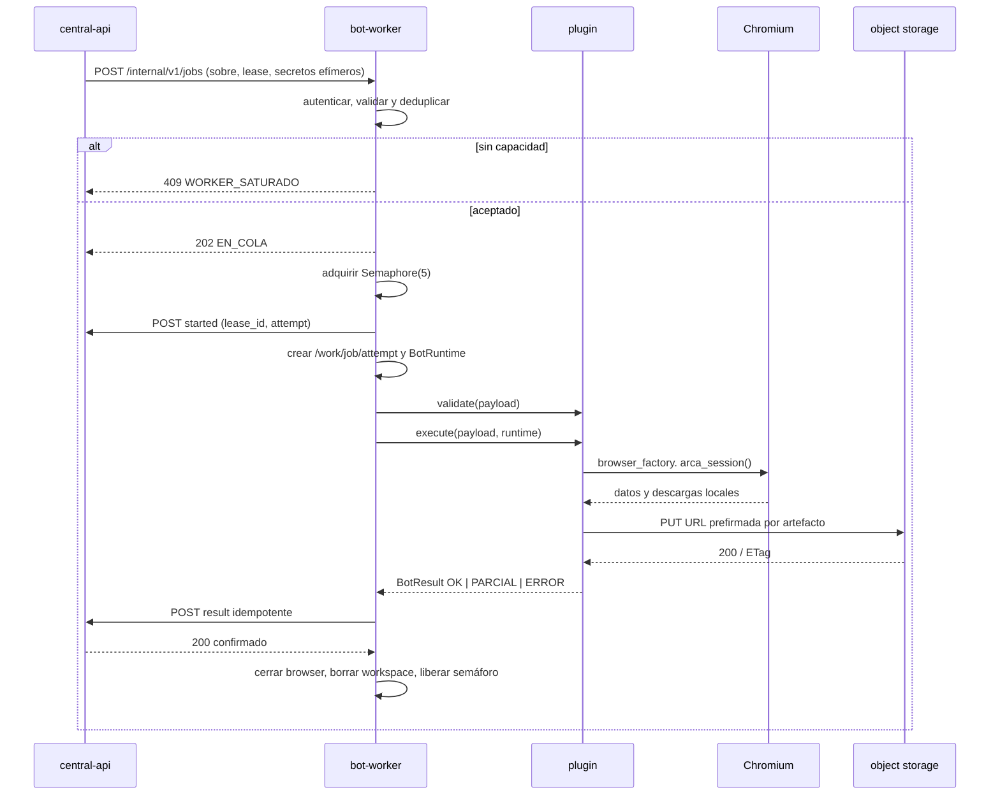
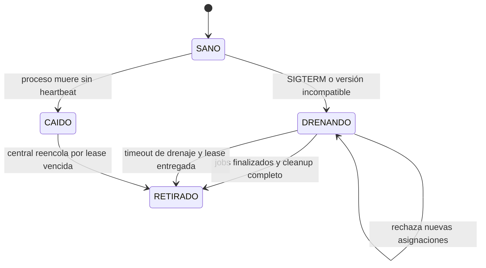

# Plan de implementación: `bot-worker` V3
> **Estado:** plan de diseño para F2 y F3.
> **Servicio:** `services/bot-worker/`.
> **Propósito:** ejecutar bots y reportar hechos al plano de control.
> **No crea commits.**
---
## 1. Objetivo y alcance
El `bot-worker` es el ejecutor remoto, efímero y sin estado persistente de MrBot API V3. Recibe un sobre de trabajo autocontenido desde `central-api`, ejecuta un plugin de bot dentro de límites de recursos, sube los artefactos a destinos ya autorizados y comunica progreso, resultado y salud a la central.
El worker pertenece al plano de datos. No es una réplica de la API pública, no conoce usuarios ni cuotas y no decide qué trabajo ejecutar. La central conserva la cola, PostgreSQL, la reserva y confirmación de consumo, la idempotencia de cliente, el estado canónico del job, las URL de descarga y los mensajes públicos.
### 1.1 Responsabilidades incluidas
1. Registrar su identidad y manifiesto de capacidades ante la central.
2. Exponer una API interna, privada, para recibir asignaciones y cancelaciones.
3. Enviar *heartbeats* y eventos de ejecución hacia la central.
4. Validar el sobre, versión de protocolo, `lease_id`, bot, operación y esquema.
5. Mantener una cola local acotada y ejecutar como máximo cinco jobs a la vez.
6. Crear y eliminar un espacio de trabajo aislado por `(job_id, attempt)`.
7. Construir el contexto de runtime que usan los plugins.
8. Lanzar, cerrar y contabilizar Playwright, Chromium y sus procesos hijos.
9. Subir artefactos solamente mediante URL prefirmadas entregadas en el sobre.
10. Convertir fallas locales en categorías técnicas seguras para la central.
11. Cooperar con cancelación, agotamiento de plazo y drenaje de despliegue.
### 1.2 Responsabilidades explícitamente excluidas
| Responsabilidad | Dueño V3 | Razón |
|---|---|---|
| PostgreSQL, ORM, migraciones y modelos | `central-api` | Una única fuente de verdad y W-1. |
| Selección de worker y balanceo | `central-api` | El scheduler ve la flota completa. |
| Reserva, confirmación o reembolso de créditos | `central-api` | Es una transacción de negocio durable. |
| Autenticación de clientes y panel admin | `central-api` | El worker no tiene usuarios ni sesiones. |
| Firmar URL de descarga o acceso al bucket | `central-api` | El worker no debe tener llaves del object storage. |
| Decidir mensajes públicos | `central-api` | Conserva SEC-1 y `public_errors.py`. |
| Persistir cookies, perfiles o credenciales | nadie en el worker | SEC-2, SEC-3 y ejecución efímera. |
### 1.3 Límites de la primera versión
- Se implementa HTTP/JSON, no gRPC ni service mesh.
- Se despliega inicialmente una imagen con todos los plugins productivos.
- La cola local solo absorbe asignaciones confirmadas durante milisegundos. No sustituye la cola durable de PostgreSQL.
- Los dos módulos sin Playwright, `apoc` y `consulta_cuit`, no se portan a esta cola de navegador. Van a la central o a un worker liviano separado.
- La central asigna por *push*. El worker no hace *polling* de jobs ni consulta una tabla de trabajos.
---
## 2. Invariantes del worker
Las invariantes W-1 a W-4 provienen del plan maestro. Son condiciones de aceptación, no recomendaciones de estilo. Cada una tiene una prueba automatizada y una observación operativa asociada.
| ID | Invariante | Implementación obligatoria | Verificación |
|---|---|---|---|
| W-1 | El worker no abre conexiones a base de datos. | No incluir DSN, driver, ORM, modelos ni sesión. Los plugins solo reciben `BotRuntime`. | Estática y de imagen, detallada abajo. |
| W-2 | Un worker nunca ejecuta más de 5 jobs concurrentes. | `asyncio.Semaphore(5)` rodea la vida completa del job, y admisión rechaza al estar lleno. | Prueba de concurrencia, métricas y rechazo `409`. |
| W-3 | El worker solo acepta requests autenticados como provenientes de la central. | Bearer de worker rotativo, red privada y validación constante antes de toda ruta interna. | Pruebas de 401/403 y prueba de red sin ingreso público. |
| W-4 | Un job asignado a un worker que deja de reportar salud vuelve a la cola sin intervención manual. | *Heartbeats*, `lease_id`, vencimiento y reconciliación en la central. | Prueba de caos que mata el worker y observa `CORRIENDO → PENDIENTE`. |
### 2.1 W-1: prohibición total de base de datos
El worker no instala `psycopg`, `psycopg2`, `asyncpg`, `sqlalchemy`, `alembic` ni un cliente de PostgreSQL. Tampoco recibe `DATABASE_URL`, `SessionLocal`, modelos ni una función de persistencia. Es incorrecto conservar un parámetro `db=None` por compatibilidad, porque mantiene una frontera ambigua e invita a importar código V2 que escribe las tablas `consulta_*_logs`.
La verificación estática consta de cuatro barreras:
1. El `requirements-worker.txt` y el `uv.lock` se inspeccionan para confirmar que no contienen `psycopg`, `psycopg2`, `asyncpg`, `sqlalchemy` ni `alembic`.
2. Durante el build, `python -c 'import importlib.util; ...'` falla el build si cualquiera de esos módulos está disponible en la imagen final.
3. Un test recorre el grafo de imports de `services/bot-worker` y `packages/mrbot-contracts`, usando AST. Falla si encuentra `Import` o `ImportFrom` de `sqlalchemy`, `psycopg*`, `asyncpg`, `alembic`, `app.db`, `SessionLocal`, `app.models` o `models.logs_`.
4. Un test de integración ejecuta un plugin de referencia en un contenedor sin `DATABASE_URL` y verifica que no se abre ningún socket TCP hacia el puerto 5432 ni se intenta resolver una cadena de conexión.
El tercer punto debe probar el **grafo de módulos importado**, no solo hacer una búsqueda de texto. El test importa cada módulo del worker en un proceso aislado, registra `sys.modules` y falla si aparece alguno de los paquetes prohibidos. Así cubre imports dinámicos accidentales de adaptadores V2.
```python
# tests/test_no_database_dependency.py
FORBIDDEN_PREFIXES = (
    "sqlalchemy", "alembic", "psycopg", "asyncpg",
    "app.db", "app.models", "app.jobs.worker",
)

def test_worker_image_has_no_db_modules(worker_python):
    for module in ("sqlalchemy", "alembic", "psycopg", "psycopg2", "asyncpg"):
        assert worker_python.find_spec(module) is None, module


def test_import_graph_has_no_database_imports(import_worker_modules):
    imported = import_worker_modules()
    assert not [m for m in imported if m.startswith(FORBIDDEN_PREFIXES)]
```
### 2.2 W-2: capacidad local verificable
La admisión reserva un permiso antes de encolar una tarea local. El contador `en_ejecucion` incluye las tareas que ya recibieron permiso, incluso si todavía están preparando credenciales o esperando que arranque Chromium. Esto evita que el scheduler crea que existe capacidad libre durante un pico de arranques.
La prueba crea seis sobres bloqueados con un `asyncio.Event`. Cinco deben confirmar inicio y el sexto debe recibir `409 WORKER_SATURADO`. Al liberar los cinco, el máximo registrado de ejecuciones simultáneas debe ser exactamente cinco nunca seis. Se repite con cancelación y con una excepción de lanzamiento para probar el `finally` que libera el permiso.
### 2.3 W-3: origen autenticado
Cada endpoint, incluido `/health` salvo su liveness deliberadamente anónima, valida la identidad de servicio. Las rutas de asignación, cancelación, estado y manifiesto no admiten claves de clientes, cookies de administrador ni una red pública. La autenticación se comprueba antes de deserializar un payload grande.
Las pruebas cubren token ausente, formato inválido, token expirado, token de otro worker, token rotado durante el período de gracia y una petición desde una red no permitida. La inspección de Compose verifica que no hay `ports:` publicado para el worker y que únicamente `central-api` comparte la red interna de control.
### 2.4 W-4: pérdida, lease y reencolado
El worker informa un `heartbeat` cada diez segundos y cada resultado lleva `worker_id`, `lease_id`, `attempt` y una clave idempotente. La central considera perdida una lease cuando no hay heartbeat ni extensión dentro del TTL acordado. No acepta un resultado tardío de un worker que ya no posee esa lease.
La prueba de caos inicia un job de lectura, mata el contenedor con `SIGKILL`, espera el TTL, comprueba que la central libera o recompone la reserva de capacidad y deja el job `PENDIENTE` con `attempt + 1`. Luego otro worker lo acepta. Para bots con efecto externo, el scheduler respeta la clase de idempotencia y puede marcar `REQUIERE_REVISION` en vez de reintentar ciegamente.
---
## 3. API secundaria del worker
### 3.1 Por qué expone API y también hace *push*
Las dos direcciones resuelven necesidades distintas y son complementarias.
- El **push de heartbeat** evita que la central tenga que hacer *polling* de N workers para conocer liveness y ocupación. Cada worker empuja información con cadencia, jitter y lease, aun si la central no le asigna trabajo.
- La **API expuesta por el worker** permite que la central entregue un sobre de trabajo en el instante de selección, solicite cancelación y consulte detalle diagnóstico bajo demanda. No hay que esperar el próximo heartbeat para asignar.
- `GET /internal/v1/health` permite a la plataforma local comprobar proceso vivo sin convertir al scheduler en un sondeador masivo.
La API se escucha solamente en la red privada de datos. `EXPOSE 8000` documenta el puerto dentro de Docker, pero Compose no publica `8000` al host ni hay Ingress, LoadBalancer o regla de firewall de Internet para este servicio.
### 3.2 Convenciones comunes
| Elemento | Decisión |
|---|---|
| Prefijo | `/internal/v1`. No es API pública ni se versiona junto a `/api/v3`. |
| Codificación | JSON UTF-8, `Content-Type: application/json`. |
| Identificadores | `job_id` UUIDv7, `worker_id` UUIDv7, `lease_id` UUIDv7. |
| Fechas | RFC 3339 con zona UTC, por ejemplo `2026-09-16T06:30:49Z`. |
| Autenticación | `Authorization: Bearer <worker-token>` salvo liveness. |
| Correlación | `X-Request-Id` opcional, propagado sin secretos. |
| Versión | `protocol_version` obligatoria en sobre y respuestas relevantes. |
| Errores | `{code, message, request_id}`. `message` no incluye secretos, URLs internas, selectores ni stack trace. |
| Idempotencia | `Idempotency-Key` o identidad natural documentada por endpoint. |
El `worker-token` identifica la relación central→worker. No se confunde con una clave de cliente ni con la clave de registro Docker. La central mantiene el hash del token en su propia base, nunca en la del worker porque el worker no tiene una.
### 3.3 `POST /internal/v1/jobs`
**Finalidad.** Entregar una asignación ya reservada, autocontenida y limitada a una lease. La central no debe marcar el job `CORRIENDO` por esta respuesta. La respuesta `202` significa solamente que el worker lo aceptó en su cola local. El worker reporta `started` a la central justo antes de ejecutar.
| Campo | Especificación |
|---|---|
| Método y ruta | `POST /internal/v1/jobs` |
| Auth | Bearer de worker válido, origen de red de control permitido. |
| Idempotencia | Clave natural `(job_id, attempt, lease_id)`. Repetir el mismo sobre devuelve el mismo acuse y no crea una segunda tarea. Sobres con mismo `job_id` pero otra lease reciben `409`. |
| Éxito | `202 Accepted`. |
| Saturación | `409 Conflict`, código `WORKER_SATURADO`. |
| Validación | `422` para esquema, versión, bot u operación incompatibles. |
| Seguridad | `401` sin token, `403` token no autorizado para este worker. |
Solicitud completa:
```json
{
  "protocol_version": "1.0",
  "job_id": "0198f9e2-8d8d-7b42-a3ea-6c66fc8d65c1",
  "attempt": 1,
  "lease_id": "0198f9e2-8dd5-7cad-8929-f2015d3d775e",
  "lease_expires_at": "2026-09-16T07:00:00Z",
  "plugin": "siper",
  "plugin_version": "3.0.0",
  "operation": "consultar",
  "deadline_at": "2026-09-16T06:55:00Z",
  "idempotency_key": "sched:0198f9e2-8d8d-7b42-a3ea-6c66fc8d65c1:1",
  "payload": {"cuit_representado": "20123456789"},
  "credentials": {"cuit_representante": "20987654321", "clave": "<plaintext TLS>"},
  "proxy_profile": {"mode": "sticky", "country": "ar"},
  "artifact_uploads": [
    {
      "artifact_id": "0198f9e2-8e2e-7e44-813a-7a568ecc12d1",
      "name_hint": "resultado.xlsx",
      "put_url": "https://storage.example/presigned-redacted",
      "object_key": "jobs/0198f9e2/1/resultado.xlsx",
      "max_bytes": 52428800,
      "content_types": ["application/vnd.openxmlformats-officedocument.spreadsheetml.sheet"]
    }
  ],
  "callback": {"base_url": "https://central-api.internal", "result_path": "/internal/v1/jobs/0198f9e2-8d8d-7b42-a3ea-6c66fc8d65c1/result"}
}
```
`credentials` es plaintext solo dentro de TLS autenticado y memoria del proceso. No se registra el cuerpo en middleware, trazas, auditoría ni logs. En el código, la estructura se representa como objeto de secreto con `repr=False`.
Respuesta `202`:
```json
{
  "accepted": true,
  "job_id": "0198f9e2-8d8d-7b42-a3ea-6c66fc8d65c1",
  "attempt": 1,
  "lease_id": "0198f9e2-8dd5-7cad-8929-f2015d3d775e",
  "local_state": "EN_COLA",
  "queue_position": 0,
  "accepted_at": "2026-09-16T06:31:02Z",
  "protocol_version": "1.0"
}
```
Respuesta `409`:
```json
{
  "code": "WORKER_SATURADO",
  "message": "El worker no tiene capacidad disponible.",
  "capacity": 5,
  "en_ejecucion": 5,
  "en_cola": 0,
  "retry_after_seconds": 5
}
```
### 3.4 `GET /internal/v1/jobs`
**Finalidad.** Vista interna bajo demanda de los jobs conocidos localmente. No es fuente de verdad para clientes ni para recuperación. Solo incluye el intento actual y se purga al finalizar el período de retención en memoria.
| Campo | Especificación |
|---|---|
| Método y ruta | `GET /internal/v1/jobs?state=EN_COLA,CORRIENDO` |
| Auth | Bearer obligatorio. |
| Idempotencia | Natural de GET. |
| Éxito | `200 OK`. |
| Filtros | `state`, `limit` entre 1 y 100, `cursor` opaco opcional. |
| Fallas | `401`, `403`, `422` para filtros inválidos. |
```json
{
  "items": [
    {
      "job_id": "0198f9e2-8d8d-7b42-a3ea-6c66fc8d65c1",
      "attempt": 1,
      "lease_id": "0198f9e2-8dd5-7cad-8929-f2015d3d775e",
      "plugin": "siper",
      "operation": "consultar",
      "local_state": "CORRIENDO",
      "accepted_at": "2026-09-16T06:31:02Z",
      "started_at": "2026-09-16T06:31:03Z",
      "deadline_at": "2026-09-16T06:55:00Z"
    }
  ],
  "next_cursor": null,
  "en_ejecucion": 1,
  "en_cola": 0
}
```
Nunca devuelve `payload`, credenciales, URL prefirmadas, cookies, rutas locales o resultados de negocio. La central ya posee el sobre y el resultado canónico.
### 3.5 `POST /internal/v1/jobs/{job_id}/cancel`
**Finalidad.** Pedir la cancelación cooperativa de un intento que pertenece a la lease indicada. Es una solicitud, no una garantía de que se pudo deshacer un efecto remoto ya ejecutado.
| Campo | Especificación |
|---|---|
| Método y ruta | `POST /internal/v1/jobs/{job_id}/cancel` |
| Auth | Bearer obligatorio. |
| Idempotencia | `(job_id, attempt, lease_id, cancel_request_id)`. Repetir devuelve el mismo estado. |
| Éxito | `202 Accepted` si se señaló la cancelación. `200 OK` si ya estaba cancelado o terminal. |
| Ausente | `404` si el worker no conoce ese intento. |
| Conflicto | `409` si `lease_id` no coincide. |
| Errores | `401`, `403`, `422`. |
```json
{
  "attempt": 1,
  "lease_id": "0198f9e2-8dd5-7cad-8929-f2015d3d775e",
  "cancel_request_id": "0198f9e3-0a94-77f3-ae0b-05ac5dc9d905",
  "reason": "cancelado_por_usuario",
  "requested_at": "2026-09-16T06:35:00Z"
}
```
```json
{
  "job_id": "0198f9e2-8d8d-7b42-a3ea-6c66fc8d65c1",
  "local_state": "CANCELANDO",
  "accepted": true
}
```
### 3.6 `GET /internal/v1/health`
**Finalidad.** Liveness de proceso. Debe ser mínimo y sin dependencias externas: no consulta central, bucket, DNS, Playwright ni sistema de archivos de trabajo.
| Campo | Especificación |
|---|---|
| Método y ruta | `GET /internal/v1/health` |
| Auth | Ninguna, pero solamente accesible en loopback o red privada de plataforma. |
| Idempotencia | Natural de GET. |
| Éxito | `200 OK` si el proceso acepta eventos. |
| Respuesta | `{ "status": "ok" }`. |
| Prohibición | No usar esta ruta para decidir capacidad o salud del scheduler. |
No responde `503` porque CapMonster, ARCA o el bucket estén caídos. Eso sería una sonda de disponibilidad y produciría reinicios destructivos de trabajos en vuelo.
### 3.7 `GET /internal/v1/status`
**Finalidad.** Salud detallada de diagnóstico para la central, monitoreo interno y operaciones. Es autenticada porque expone versiones y métricas de proceso.
| Campo | Especificación |
|---|---|
| Método y ruta | `GET /internal/v1/status` |
| Auth | Bearer obligatorio. |
| Idempotencia | Natural de GET. |
| Éxito | `200 OK`. |
| Errores | `401`, `403`. |
```json
{
  "worker_id": "0198f9e1-c54c-7c1f-acf8-32384d0e9817",
  "state": "SANO",
  "accepting_jobs": true,
  "en_ejecucion": 2,
  "en_cola": 1,
  "capacity": 5,
  "available_capacity": 2,
  "protocol_version": "1.0",
  "image_version": "3.0.0+git.abc123",
  "image_digest": "sha256:...",
  "bots_supported": ["siper@3.0.0", "hacienda@3.0.0"],
  "resources": {
    "memory_available_bytes": 4294967296,
    "memory_current_bytes": 1610612736,
    "shm_available_bytes": 805306368,
    "chromium_processes": 2,
    "pids_current": 94,
    "pids_limit": 512,
    "cpu_count": 4
  },
  "counters_since_start": {
    "jobs_completed": 31,
    "jobs_failed": 2,
    "jobs_cancelled": 1,
    "chromium_crashes": 0
  },
  "uptime_seconds": 9123,
  "observed_at": "2026-09-16T06:31:04Z"
}
```
### 3.8 `GET /internal/v1/bots`
**Finalidad.** Entregar el manifiesto generado desde los plugins incluidos en esa imagen. La central usa esta respuesta al registrar o diagnosticar una imagen, no para aceptar una asignación incompatible por intuición.
| Campo | Especificación |
|---|---|
| Método y ruta | `GET /internal/v1/bots` |
| Auth | Bearer obligatorio. |
| Idempotencia | Natural de GET. |
| Éxito | `200 OK`. |
| Errores | `401`, `403`. |
```json
{
  "protocol_version": "1.0",
  "image_version": "3.0.0+git.abc123",
  "bots": [
    {
      "nombre": "siper",
      "version": "3.0.0",
      "operaciones": ["consultar"],
      "timeout_por_defecto_seconds": 600,
      "requiere_credenciales_fiscales": true,
      "requiere_proxy": false,
      "requiere_captcha": false,
      "costo_creditos_sugerido": 1
    }
  ]
}
```
---
## 4. Autenticación y aislamiento de red, W-3
### 4.1 Alternativas evaluadas
| Asignaciones firmadas (Ed25519) por la central, verificadas por el worker | Sin secretos pre-compartidos ni entorno: solo la central puede ordenar ejecuciones; revocable por drenaje/retiro y auditable. | Requiere pin de la clave pública en el registro. | **Recomendada para V3 inicial.** |
| Opción | Ventajas | Costos y riesgos | Decisión |
|---|---|---|---|
| Bearer compartido por worker, emitido al registrar | Simple en Docker Compose, revocable, fácil de rotar y auditar en la central. | Debe protegerse como secreto y depende de aislamiento de red/TLS. | Reemplazada por asignaciones firmadas (el Bearer del registro queda solo para worker→central). |
| mTLS por worker | Identidad criptográfica mutua, reduce reutilización de token, excelente para clusters. | PKI, emisión, revocación, rotación de certificados y depuración más complejas. | Evolución cuando haya k3s o requisitos de alto aislamiento. |
| Token único global | Fácil inicialmente. | No permite revocar un worker comprometido sin detener toda la flota. | Prohibida. |
| IP allowlist solamente | Cero secreto de aplicación. | IP no autentica proceso, falla con NAT y no protege movimiento lateral. | Prohibida como único control. |
### 4.2 Diseño recomendado
Cada worker arranca con un secreto de bootstrap de un solo uso, montado por el orquestador. Se registra mediante `POST /internal/v1/workers/register` de la central y recibe `worker_id`, token Bearer aleatorio de 256 bits, fecha de vencimiento y parámetros de heartbeat. La central almacena solo un verificador HMAC del token y su período de validez.
El token se monta en archivo secreto de solo lectura o variable inyectada por el orquestador. No se escribe en `.env`, no se imprime, no se adjunta a excepciones y no se pasa a plugins. El cliente HTTP del runtime centraliza el header y aplica redacción de `Authorization`.
La red tiene dos zonas:
1. `control_internal`: `central-api` y `bot-worker`. Aquí viven asignación, cancelación, status y callbacks. No hay puerto publicado al host.
2. `egress_bots`: salida solo a organismos, proveedores de proxy, CapMonster y URL prefirmadas. Su política se restringe por manifiesto cuando sea posible.
Nunca se expone un worker a Internet. Una URL pública permitiría a terceros consumir Chromium, forzar navegación a sitios hostiles, ensayar bot payloads o obtener metadatos de versión. Un reverse proxy público, un Ingress y un `ports: "8000:8000"` contradicen W-3 incluso si existe Bearer.
### 4.3 Rotación de token
La central emite un token nuevo antes de `expires_at` y acepta el token previo durante una ventana máxima de cinco minutos. El worker conserva ambos en memoria, prueba el nuevo para enviar heartbeat y, una vez confirmado, destruye la referencia al anterior. La rotación se puede entregar como respuesta de heartbeat firmada por la central o por reinicio controlado con el secreto actualizado.
Una revocación urgente marca el worker `DRENANDO` o `CAIDO` según corresponda, niega asignaciones futuras y fuerza su retiro. El token no representa un usuario, no contiene cuotas, no necesita lookup local y no exige que el worker tenga una base de datos de usuarios.
### 4.4 Camino a mTLS
En el paso a mTLS, cada worker recibe un certificado de cliente de corta vida y la central valida CA, SAN `worker_id`, vencimiento y revocación. Se mantiene el `lease_id` del protocolo, pues mTLS autentica el canal pero no resuelve resultados tardíos de un intento ya reemplazado. Bearer puede mantenerse como defensa en profundidad durante migración, pero no se deben introducir ambos como requisitos permanentes sin necesidad operacional.
---
## 5. Salud, profundidad de cola y R12
### 5.1 Cadencia de heartbeat
El intervalo nominal es **10 segundos**, conforme al bosquejo del plan maestro. Cada envío suma jitter uniforme aleatorio de ±2 segundos. El primer heartbeat se envía inmediatamente tras registro y después de cualquier transición importante: aceptación, inicio, finalización, cancelación, entrada a drenaje o recuperación de conectividad.
El cliente usa timeout de conexión y lectura de 3 segundos. Tras falla, reintenta con retroceso exponencial limitado a 2, 5 y 10 segundos, sin bloquear ejecución del job. El próximo heartbeat normal reanuda al recuperar. La central usa TTL de 30 segundos, equivalente a tres intervalos nominales, antes de declarar `CAIDO`.
### 5.2 Payload completo
```json
{
  "protocol_version": "1.0",
  "worker_id": "0198f9e1-c54c-7c1f-acf8-32384d0e9817",
  "instance_id": "container-6f089a",
  "sequence": 1832,
  "sent_at": "2026-09-16T06:31:10Z",
  "state": "SANO",
  "accepting_jobs": true,
  "capacity": 5,
  "en_ejecucion": 3,
  "en_cola": 1,
  "reserved_assignments": 0,
  "available_capacity": 1,
  "oldest_queued_age_seconds": 4,
  "running": [
    {
      "job_id": "0198f9e2-8d8d-7b42-a3ea-6c66fc8d65c1",
      "attempt": 1,
      "lease_id": "0198f9e2-8dd5-7cad-8929-f2015d3d775e",
      "started_at": "2026-09-16T06:30:42Z",
      "deadline_at": "2026-09-16T06:55:00Z"
    }
  ],
  "image": {
    "version": "3.0.0+git.abc123",
    "digest": "sha256:...",
    "playwright_version": "1.62",
    "chromium_revision": "pinned-by-base-image"
  },
  "resources": {
    "memory_available_bytes": 4294967296,
    "memory_current_bytes": 1610612736,
    "memory_limit_bytes": 6442450944,
    "shm_available_bytes": 805306368,
    "shm_total_bytes": 1073741824,
    "chromium_processes": 3,
    "pids_current": 135,
    "pids_limit": 512,
    "cpu_count": 4
  },
  "counters_since_start": {
    "jobs_completed": 31,
    "jobs_failed": 2,
    "jobs_cancelled": 1,
    "chromium_crashes": 0
  },
  "uptime_seconds": 9123,
  "bots_manifest_hash": "sha256:..."
}
```
### 5.3 Definición exacta de contadores
- **`en_ejecucion`** es el número de tareas que poseen un permiso del semáforo. Incluye `PREPARANDO`, `CORRIENDO`, `SUBIENDO` y `REPORTANDO`. No se libera hasta que se ejecuta el `finally` de limpieza y reporte terminal.
- **`en_cola`** es el número de sobres aceptados y aún sin permiso del semáforo. En régimen normal debe ser cero porque la central no sobreasigna. Existe para carreras entre POST simultáneos, drenaje y diagnóstico.
- **`reserved_assignments`** cuenta sobres validados cuya tarea aún no se insertó en la cola. Evita que dos POST concurrentes vean la misma capacidad libre.
- **`available_capacity`** es `max(0, 5 - en_ejecucion - en_cola - reserved)`. La central también lleva su propia contabilidad y usa el menor valor seguro.
### 5.4 Qué hace la central
Al recibir el heartbeat, la central actualiza `workers.last_heartbeat_at`, guarda un registro append-only de `worker_heartbeats`, renueva las leases de los jobs indicados y recalcula estado de flota. No toma el conteo como autoridad absoluta, porque puede llegar fuera de orden. `sequence` debe ser monotónica por proceso y los payloads antiguos se conservan como telemetría pero no retroceden el estado.
| Condición | Estado central | Acción |
|---|---|---|
| Heartbeat reciente, capacidad > 0 | `SANO` | Elegible para scheduler. |
| `en_ejecucion = 5` o capacidad 0 | `SATURADO` | No asignar, no alertar como caída. |
| Heartbeat reciente con errores recurrentes o recursos críticos | `DEGRADADO` | Reducir o detener asignaciones y alertar Admin. |
| Sin heartbeat por más de 30 s | `CAIDO` | Expirar leases y reencolar según política. |
| `accepting_jobs=false` | `DRENANDO` | No asignar, esperar trabajos o vencimiento. |
Se reportan memoria disponible, uso y límite cgroup, `/dev/shm` libre y total, procesos Chromium vivos, PID actual/límite, uptime y conteos de completados, fallidos y cancelados desde el arranque. Son los indicadores mínimos que permiten distinguir caída de red, saturación, fuga de procesos y riesgo de OOM.
---
## 6. Tope de cinco jobs, W-2 y R13
### 6.1 Mecanismo de admisión
La capacidad se impone dentro del worker con `asyncio.Semaphore(5)`. El valor máximo es una constante de seguridad, no un valor ampliable por variable de environment. `WORKER_CONCURRENCY` puede reducirse de 5 a 1 para un host pequeño, pero un valor mayor que 5 debe rechazar el arranque por configuración inválida.
La admisión mantiene un candado corto para revisar deduplicación y reservar la capacidad. Si no hay permiso disponible ni lugar en la cola local acotada, responde `409 WORKER_SATURADO`. No acepta infinitamente para responder `202` y ocultar la saturación a la central.
```python
class JobSupervisor:
    HARD_MAX_CONCURRENCY = 5

    def __init__(self, configured: int) -> None:
        if not 1 <= configured <= self.HARD_MAX_CONCURRENCY:
            raise ValueError("WORKER_CONCURRENCY debe estar entre 1 y 5")
        self._semaphore = asyncio.Semaphore(configured)
        self._running: dict[tuple[str, int], asyncio.Task[None]] = {}

    async def accept(self, envelope: JobEnvelope) -> Acceptance:
        async with self._admission_lock:
            if envelope.key in self._running:
                return Acceptance.duplicate(envelope)
            if self._semaphore.locked():
                raise WorkerSaturated()
            task = asyncio.create_task(self._run_with_permit(envelope))
            self._running[envelope.key] = task
            return Acceptance.accepted(envelope)

    async def _run_with_permit(self, envelope: JobEnvelope) -> None:
        async with self._semaphore:
            try:
                await self._run_job(envelope)
            finally:
                self._running.pop(envelope.key, None)
```
La implementación real reserva de forma atómica para que el intervalo entre `locked()` y `async with` no acepte seis solicitudes. Puede usar un contador de reservas bajo `_admission_lock` o un `BoundedSemaphore.acquire_nowait()` adaptado. El ejemplo ilustra la forma, no reemplaza esa condición de carrera.
### 6.2 Por qué V3 unifica los límites V2
V2 tenía dos límites locales y no coordinados:
| Límite V2 | Default | Qué limitaba | Problema |
|---|---:|---|---|
| `MAX_BOTS` | 4 | Tareas de jobs por `WorkerManager`. | Una tarea podía consumir cupo esperando navegador. |
| `BROWSER_CONCURRENCY` | 3 | Secciones que lanzaban browser por event loop. | Era otro semáforo, no coordinaba réplicas ni todos los caminos. |
Ambos eran por proceso y event loop. Con dos réplicas podían existir hasta ocho tareas y seis permisos de navegador. Además, algunos bots generan contextos o procesos extra para PDF. El scheduler no conocía ninguna de esas cifras.
V3 colapsa el contrato de capacidad visible a un número significativo: **cinco jobs simultáneos por worker**. Todo job browser posee el permiso durante su vida completa y cada plugin declara `browser_instances_max`. Para el arranque, el límite de browser se alinea con la capacidad de jobs, no existe una segunda cola oculta. Si un bot requiere más de un browser, su manifiesto consume más unidades de capacidad o se envía a un pool especializado en una fase posterior.
### 6.3 Matemática de recursos
La investigación estima Chromium en **300 a 500 MB por instancia**. Cinco instancias requieren aproximadamente:
| Concepto | Cálculo | Presupuesto |
|---|---:|---:|
| Chromium mínimo | 5 × 300 MB | 1.5 GB |
| Chromium conservador | 5 × 500 MB | 2.5 GB |
| Python, Playwright, parsing, buffers y SO | margen | 0.8 a 1.5 GB |
| Descargas y exportación temporal | margen | 0.5 a 1 GB |
| Total práctico | no sumar solo RSS ideal | 4 a 5 GB mínimo operativo |
El riesgo no es solo RAM. `/dev/shm` debe ser memory-backed y dimensionado. El plan V2 de cluster ya señalaba que Chromium puede caer bajo concurrencia sin suficiente memoria compartida. Un `/dev/shm` Docker de 64 MB es insuficiente para una carga de cinco navegadores. También se requiere `init: true` o `tini` para recolectar hijos, y `pids_limit` explícito, con V2 usando 512 como referencia.
**Recomendación concreta inicial por contenedor de capacidad 5:**
| Recurso | Recomendación | Motivo |
|---|---:|---|
| Límite de memoria | 6 GiB | Da margen sobre 2.5 a 3 GB de Chromium y proceso Python. |
| Reserva de memoria | 5 GiB | Evita colocación optimista en host compartido. |
| `/dev/shm` | `tmpfs`, 1 GiB | Base para Chromium concurrente. |
| CPU | 4 vCPU reservadas, límite 6 | Navegación, parsing y XLSX son CPU bursty. |
| PID | 512 | Protege contra árbol Chromium descontrolado. |
| Volumen `/work` | efímero, 5 GiB | Descargas y ZIP/XLSX aislados. |
```yaml
services:
  bot-worker:
    image: docker.abp.net.ar/abustosp/mrbot-worker:3.0.0
    init: true
    shm_size: 1gb
    pids_limit: 512
    mem_limit: 6g
    mem_reservation: 5g
    cpus: "6"
    volumes:
      - type: tmpfs
        target: /work
        tmpfs:
          size: 5368709120
```
Si el host no puede sostener cinco, no se infringe W-2 reduciendo `WORKER_CONCURRENCY` a 1, 2, 3 o 4. Se configura un valor menor, se publica esa capacidad en registro y heartbeat y la central asigna en consecuencia. No se mantiene `5` en status mientras se restringe Chromium por detrás. Antes de subir el valor deben ejecutarse pruebas por familia de bot, con proxy y sitios similares a producción, midiéndose RSS, `/dev/shm`, PIDs y tiempos p95.
---
## 7. Contrato de plugin de bot
Este contrato es la frontera de migración de F3. Sustituye el executor V2 `execute(request_data, job_id, user_id, db)` y elimina de raíz la posibilidad de abrir `SessionLocal()` o persistir `consulta_*_logs` desde un bot.
### 7.1 Manifiesto declarativo
Cada plugin expone exactamente un `BotManifest` inmutable. El registro de la imagen se genera leyendo los manifiestos, no contando módulos ni manteniendo cuatro listas como V2.
```python
from __future__ import annotations

from dataclasses import dataclass
from typing import Any, Literal

@dataclass(frozen=True)
class BotManifest:
    nombre: str
    version: str
    operaciones: tuple[str, ...]
    esquema_entrada: dict[str, Any]
    artefactos_produce: tuple["ArtifactSpec", ...]
    timeout_por_defecto_seconds: int
    requiere_credenciales_fiscales: bool
    requiere_proxy: bool
    requiere_captcha: bool
    costo_creditos_sugerido: int
    idempotency_class: Literal["LECTURA", "CONTINUACION", "CARGA", "EFECTO"]
    browser_instances_max: int
    hosts_permitidos: tuple[str, ...]

@dataclass(frozen=True)
class ArtifactSpec:
    nombre: str
    content_types: tuple[str, ...]
    max_bytes: int
    obligatorio: bool
```
| Campo | Regla |
|---|---|
| `nombre` | Identificador canónico en `snake_case`, por ejemplo `mis_comprobantes`. |
| `version` | SemVer del plugin. Cambiar esquema o semántica requiere aumento compatible. |
| `operaciones` | Operaciones admitidas. Las variantes de Mis Comprobantes son operaciones explícitas. |
| `esquema_entrada` | JSON Schema o referencia Pydantic serializada, sin credenciales. |
| `artefactos_produce` | Nombre lógico, MIME permitido, máximo y obligatoriedad. |
| `timeout_por_defecto_seconds` | Valor conservador por familia, acotado por deadline del sobre. |
| `requiere_credenciales_fiscales` | Obliga a que la central adjunte bundle efímero, no a leer env. |
| `requiere_proxy` | Declara necesidad, no revela usuario o contraseña de proxy. |
| `requiere_captcha` | Declara que puede usar el proveedor configurado. |
| `costo_creditos_sugerido` | Semilla para catálogo central. La decisión de cobro sigue siendo central. |
| `idempotency_class` | Informa reintentos seguros, continuación, carga o efecto externo. Ver la correspondencia con `bot_operations.effect_class` abajo. |
| `browser_instances_max` | Protege capacidad real y permite pools futuros. |
| `hosts_permitidos` | Entrada para egress policy y pruebas de red. |

#### `idempotency_class` y `bot_operations.effect_class`

Son dos niveles de granularidad del mismo hecho y no deben divergir. El
manifiesto declara cuatro clases porque el worker necesita el matiz operativo.
La base guarda dos porque el scheduler solo necesita responder una pregunta:
**¿puedo reintentar esto solo?**

| `idempotency_class` del manifiesto | `effect_class` en base | ¿Reintento automático? |
|---|---|---|
| `LECTURA` | `CONSULTA` | Sí. Releer es inofensivo |
| `CONTINUACION` | `CONSULTA` | Sí. Retoma un trabajo ya iniciado sin duplicar el acto |
| `CARGA` | `EFECTO` | No. Verificar estado remoto primero |
| `EFECTO` | `EFECTO` | No. Verificar estado remoto primero |

La derivación la hace la central al registrar el bot en el catálogo, no el
worker. La regla es explícita: cualquier clase distinta de `LECTURA` y
`CONTINUACION` se guarda como `EFECTO`. Si aparece una clase nueva en el
manifiesto que la central no conoce, se guarda como `EFECTO`, que es el valor
seguro. Nunca se infiere `CONSULTA` por defecto.

El motivo está documentado en `plans/04-billing/plan.md` §6.6 con la evidencia
del código V2: `controladores_fiscales` hace clic en `Presentar`, `rcel` emite
factura electrónica, `vep_ccma` genera un VEP. Reintentar cualquiera de esos a
ciegas produce un duplicado ante el organismo.
### 7.2 Contexto inyectado por el worker
La propuesta de investigación se convierte en decisión obligatoria. Los efectos laterales viven en `BotRuntime`; los plugins no reciben el request FastAPI, la configuración global, un objeto ORM ni el cliente HTTP de la central.
```python
from dataclasses import dataclass
from pathlib import Path
from typing import Protocol, Mapping, Any

@dataclass
class FiscalCredentials:
    cuit_representante: str
    clave: str

@dataclass
class BotRuntime:
    job_id: str
    work_dir: Path
    deadline: "DeadlineBudget"
    credentials: FiscalCredentials | None
    proxy: "ProxyConfig | None"
    artifact_store: "ArtifactStore"
    event_sink: "EventSink"
    browser_factory: "BrowserFactory"
    cancellation: "CancellationToken"

class BotPlugin(Protocol):
    manifest: BotManifest

    async def validate(self, payload: Mapping[str, Any]) -> Any:
        ...

    async def execute(self, payload: Any, runtime: BotRuntime) -> "BotResult":
        ...
```
| Miembro | Garantía del worker | Uso permitido por plugin |
|---|---|---|
| `job_id` | UUIDv7 correlacionable, no es secreto. | Nombre lógico de evento, nunca ruta arbitraria. |
| `work_dir` | Directorio único bajo `/work`, propiedad del usuario no root. | Leer/escribir solo descendientes validados. |
| `deadline` | Deriva de `deadline_at`, nunca aumenta. | Ajustar waits, abortar antes de iniciar pasos largos. |
| `credentials` | Solo memoria, `None` si manifiesto no las requiere. | Login, sin serializar ni interpolar en errores. |
| `proxy` | Configuración ya construida y sensible con `repr` oculto. | Pasar a `browser_factory`, no reconstruir desde env. |
| `artifact_store` | Solo URLs prefirmadas y slots declarados en sobre. | Subir un archivo producido, obtener `ArtifactRef`. |
| `event_sink` | Callback autenticado con lease y secuencia. | Emitir progreso seguro y estructurado. |
| `browser_factory` | Aplica perfil, proxy, tracing seguro y contabilidad. | `async with` para abrir contexto y página. |
| `cancellation` | Se dispara por API, deadline o SIGTERM. | Consultar y cooperar entre pasos. |
### 7.3 Protocolo `execute()` y resultado
`validate()` recibe únicamente payload de negocio y falla temprano con un error de validación categorizado. `execute()` recibe el payload validado y un runtime completo. Es asíncrono y retorna siempre `BotResult` tipado. No retorna una string ni un diccionario ambiguo que pueda interpretarse accidentalmente como éxito, problema presente en V2 para retornos no dict.
```python
from dataclasses import dataclass, field
from typing import Any, Literal

@dataclass(frozen=True)
class BotError:
    category: str
    internal_diagnostic: str
    retryable: bool

@dataclass
class BotResult:
    result: Literal["OK", "PARCIAL", "ERROR"]
    data: dict[str, Any]
    artifacts: list["ArtifactRef"] = field(default_factory=list)
    errors: list[BotError] = field(default_factory=list)
    warnings: list[str] = field(default_factory=list)
    metrics: dict[str, int | float | str | bool] = field(default_factory=dict)
```
- `OK` significa que todos los resultados solicitados se produjeron.
- `PARCIAL` significa que se obtuvieron datos o artefactos útiles, pero hay elementos fallidos enumerados en `errors` o `warnings`.
- `ERROR` significa que no hay resultado de negocio confiable. Puede contener artefactos de diagnóstico solamente si el manifiesto los permite y fueron saneados.
- `CANCELADO` no forma parte del eje de resultado. Es un estado del job informado por el supervisor. Un plugin que detecta cancelación debe lanzar `JobCancelled`, no inventar `result="CANCELADO"`.
Errores esperados se expresan mediante excepciones tipadas: `InvalidInputError`, `CredentialsRejectedError`, `CaptchaUnsolvableError`, `TargetUnavailableError`, `BrowserCrashedError`, `ArtifactUploadError`, `DeadlineExceededError` y `JobCancelled`. El supervisor las normaliza. Excepciones desconocidas se capturan en el borde, se clasifican como `INTERNAL` sin filtrar su texto y conservan el stack solo en observabilidad interna protegida.
### 7.4 Prohibiciones duras
| Prohibición | Razón | Prueba |
|---|---|---|
| No DB, ORM ni `SessionLocal`. | W-1 y una sola fuente de verdad. | AST, grafo de módulos e imagen mínima. |
| No `os.getcwd()` para construir rutas. | Depende del CWD de contenedor y facilita escapes. | Linter AST y test con CWD aleatorio. |
| No leer `os.environ` durante lógica de negocio. | Secretos y proxy se inyectan, configuración reproducible. | Linter contra `os.getenv/environ` en `bots/`. |
| No bucket/key arbitrario. | Evita sobrescribir objetos de otros jobs. | `ArtifactStore` solo acepta `artifact_id` permitido. |
| No escribir fuera de `work_dir`. | Aislamiento y limpieza garantizada. | `safe_path` y test de traversal `../../`. |
| No loguear credenciales, token, cookies o URL firmadas. | SEC-1, SEC-2 y secretos efímeros. | Captura de logs con canarios secretos. |
| No devolver paths locales, HTML crudo o selectores. | Los clientes no deben ver detalles internos. | Contrato JSON y sanitizador. |
| No abrir Chromium directamente. | Conteo, cierre y perfil uniforme. | Prohibir import de `async_playwright` en plugins nuevos. |
Los adaptadores de bots V2 pueden contener Playwright temporalmente durante F3, pero se encapsulan detrás de `browser_factory` antes de declararse portados. Un plugin no puede desactivar `headless`, proxy, tiempos o limpieza con flags libres del cliente. Esas decisiones vienen del manifiesto y política de runtime.
### 7.5 Ejemplo completo: plugin `siper`
```python
from __future__ import annotations

from dataclasses import dataclass
from typing import Any, Mapping
from pydantic import BaseModel, Field

class SiperInput(BaseModel):
    cuit_representado: str = Field(pattern=r"^\d{11}$")
    incluir_detalle: bool = False

class SiperPlugin:
    manifest = BotManifest(
        nombre="siper",
        version="3.0.0",
        operaciones=("consultar",),
        esquema_entrada=SiperInput.model_json_schema(),
        artefactos_produce=(),
        timeout_por_defecto_seconds=600,
        requiere_credenciales_fiscales=True,
        requiere_proxy=False,
        requiere_captcha=True,
        costo_creditos_sugerido=1,
        idempotency_class="LECTURA",
        browser_instances_max=1,
        hosts_permitidos=("www.afip.gob.ar", "api.capmonster.cloud"),
    )

    async def validate(self, payload: Mapping[str, Any]) -> SiperInput:
        return SiperInput.model_validate(payload)

    async def execute(self, payload: SiperInput, runtime: BotRuntime) -> BotResult:
        if runtime.credentials is None:
            raise CredentialsRejectedError("El plugin requiere credenciales")

        await runtime.cancellation.raise_if_cancelled()
        await runtime.event_sink.progress(
            phase="LOGIN", percent=10, message="Iniciando sesión fiscal"
        )

        async with runtime.browser_factory.arca_session(
            credentials=runtime.credentials,
            proxy=runtime.proxy,
            deadline=runtime.deadline,
            cancellation=runtime.cancellation,
        ) as session:
            await session.login()
            await runtime.cancellation.raise_if_cancelled()
            await runtime.event_sink.progress(
                phase="CONSULTA", percent=45, message="Consultando SIPER"
            )
            page = await session.open_service("SIPER")
            profile = await page.query_siper(
                cuit=payload.cuit_representado,
                include_detail=payload.incluir_detalle,
                timeout_ms=runtime.deadline.remaining_ms(maximum=30_000),
            )

        await runtime.cancellation.raise_if_cancelled()
        await runtime.event_sink.progress(
            phase="FINALIZANDO", percent=90, message="Normalizando resultado"
        )
        return BotResult(
            result="OK",
            data={"cuit": payload.cuit_representado, "perfil": profile},
            metrics={"browser_launches": 1, "captcha_used": False},
        )
```
El ejemplo no lee environment, no utiliza `cwd`, no construye key de bucket, no instancia `async_playwright`, no imprime `runtime.credentials` y no contiene una sesión de base de datos. `arca_session()` cierra contexto, browser y driver al salir incluso si se cancela el bloque.
---
## 8. Ciclo de vida de un job en el worker
### 8.1 Secuencia detallada
1. La central escoge un worker `SANO` con capacidad y crea una lease durable.
2. Envía `POST /internal/v1/jobs` con sobre autocontenido y token Bearer.
3. El middleware autentica antes de registrar body o construir objetos de secreto.
4. El supervisor valida UUIDs, lease no vencida, versión, plugin, operación, esquema, límites de artefacto y compatibilidad de manifiesto.
5. Deduplica por `(job_id, attempt, lease_id)`. Una repetición entrega el mismo acuse y no inicia otra ejecución.
6. Si no hay capacidad devuelve `409`; si acepta, registra estado local `EN_COLA`.
7. Cuando obtiene permiso del semáforo, cambia a `PREPARANDO` y emite `started` idempotente a la central con la lease.
8. Deserializa el bundle de credenciales solo en memoria y crea `/work/<job>/<n>` con permisos `0700`.
9. Construye `BotRuntime`, crea token de cancelación y selecciona el plugin exacto.
10. Invoca `validate()`, aplica deadline total y abre browser mediante la factory.
11. El plugin emite progreso seguro. Cada wait usa presupuesto restante.
12. El plugin genera datos y archivos dentro de `work_dir` solamente.
13. `ArtifactStore` comprueba tamaño y MIME, calcula SHA-256 y sube por PUT a la URL prefirmada asociada. No conoce access key del bucket.
14. El supervisor compone el resultado `OK`, `PARCIAL` o `ERROR`, con diagnóstico interno y referencias de artefactos sin paths locales.
15. Reporta resultado a la central con reintento de transporte, `lease_id` y clave idempotente. Si el callback falla, conserva la tarea y reintenta hasta que expire la lease, sin volver a ejecutar el plugin.
16. En todo caso, cierra browser y contextos, borra workspace, descarta referencias a credenciales y libera semáforo dentro de `finally`.
17. La central persiste resultado canónico, confirma o compensa consumo y expone al cliente mensajes saneados y URL de descarga recién firmadas.
### 8.2 Diagrama

### 8.3 Invariantes de cleanup
La limpieza se implementa en una pila `AsyncExitStack` que se registra antes de lanzar Chromium. No depende de que `execute()` devuelva correctamente. El `finally` se ejecuta por resultado, excepción, timeout, `CancelledError` y `SIGTERM` durante drenaje. Si un crash de proceso impide el cleanup, el volumen `/work` es efímero y se elimina al destruir el contenedor. No se usa un volumen compartido persistente para workspaces.
---
## 9. Credenciales en el worker, SEC-2 y SEC-3
### 9.1 Flujo decidido
La clave privada RSA existe solamente en `central-api` o su KMS equivalente. El cliente cifra la clave fiscal con la clave pública. La central descifra usando RSA-OAEP, valida la solicitud, la mantiene únicamente mientras arma la asignación y envía el plaintext dentro de un canal TLS autenticado hacia el worker. El worker retiene el bundle únicamente en memoria para ese job.
No se persiste plaintext ni envelope de credenciales en `jobs`, `job_results`, eventos, logs, archivos, estado local o object storage. El resultado no contiene `clave`, `clave_encriptada`, cookie, storage state ni header de autorización.
### 9.2 Qué se conserva y qué cambia respecto de V2
V2 `app/utils/job_secrets.py` detecta campos sensibles, los encapsula bajo `__mrbot_runtime_values__` y usa Fernet con `JOB_SECRETS_KEY`, o fallbacks `SECRET_KEY` y `API_KEY_HMAC_SECRET`. V2 luego restaura los secretos antes del executor. Ese concepto de envelope cifrado en reposo es útil **en la central**, pero el worker no debe llevar `JOB_SECRETS_KEY`: no persiste jobs ni necesita descifrar una carga guardada.
V2 `app/security/rsa_credentials.py` y el flujo de API poseen o consumen la materialización RSA. En V3 se trasladan definitivamente a la central. La imagen worker no contiene `MRBOT_KEYS_DIR`, PEM privado, clave RSA, `JOB_SECRETS_KEY` ni fallbacks de seguridad históricos. Esto vuelve verificable SEC-3 por contenido de imagen y configuración de despliegue.
| Aspecto | V2 | V3 central | V3 worker |
|---|---|---|---|
| RSA privada | Sistema de archivos de proceso. | KMS o secreto exclusivo de central. | Ausente. |
| Envelope Fernet | Job persistido y restaurado en worker embebido. | Puede proteger datos en reposo si el diseño lo requiere. | No instalado ni necesario. |
| Plaintext de clave | Puede llegar a logs `consulta_*`. | Nunca en resultado ni logs. | Solo memoria del job. |
| Persistencia | SQLite y tablas por bot. | Datos sanos y metadata de job. | Ninguna. |
### 9.3 Mecanismo concreto
- El modelo `FiscalCredentials` usa `dataclass(repr=False)` y no implementa serialización JSON.
- El middleware HTTP marca `credentials` como campo sensible y excluye request body de logs, tracing y error pages.
- Se crea una única referencia en el closure del runner. Tras completar, `credentials = None` y se elimina el objeto del contexto. Python no permite garantizar borrado físico de memoria, pero se minimiza vida, copias y alcance.
- El plugin recibe objeto tipado. Nunca recibe el sobre crudo ni un dict que pueda reenviar accidentalmente por un callback.
- Se deshabilita tracing Playwright que incluya headers, formularios o storage state salvo diagnóstico explícito saneado.
### 9.4 Pruebas de seguridad
1. Un test inyecta un canario único como clave fiscal y captura stdout, stderr, logs estructurados, eventos, resultado, artefactos y payload de callback. El canario no debe aparecer en ningún byte fuera de la función fake de login.
2. Un test inspecciona imagen y configuración efectiva: no existen `MRBOT_KEYS_DIR`, archivos `.pem`, `JOB_SECRETS_KEY`, `DATABASE_URL` ni clave RSA privada.
3. Un test provoca excepción desde plugin y verifica que el diagnostic interno almacenado por la central está redactado y que el público no contiene canario.
4. Un test de upload busca el canario en todos los archivos permitidos y falla si un screenshot, HAR, JSON o ZIP lo contiene.
5. Un test de contrato intenta devolver `runtime.credentials` dentro de `data` y el validador de resultado lo rechaza antes del callback.
---
## 10. Artefactos mediante URL prefirmadas
### 10.1 Decisión y contraste con V2
La central emite URL de subida prefirmadas por artefacto esperado. El worker posee una capacidad puntual para hacer `PUT` a un objeto concreto, no credenciales de bucket. Así se limita alcance, vencimiento, tamaño y tipo, y se puede revocar una asignación sin entregar `MINIO_MRBOT_ACCESS_KEY` a cada contenedor.
En V2 los bots y executors llamaban `app/utils/bucket.py` y subían directamente con `MINIO_MRBOT_ACCESS_KEY` y `MINIO_MRBOT_SECRET_KEY`. El helper devolvía un `object_key` y podía usar buckets arbitrarios configurados por env. Ese modelo no es aceptable para un executor puro porque una toma de worker comprometería el bucket completo.
### 10.2 Flujo
1. La central valida manifest y estima slots de artefacto antes de asignar.
2. Genera key bajo namespace canónico `jobs/{job_id}/{attempt}/{artifact_id}`.
3. Firma `PUT` con TTL corto, por ejemplo 15 minutos, `Content-Type`, máximo de tamaño y metadatos obligatorios si el proveedor lo soporta.
4. Incluye en el sobre solo los slots necesarios. El worker no puede solicitar nombres nuevos directamente al bucket.
5. El plugin escribe en `work_dir`, pide `artifact_store.upload(artifact_id, path)`.
6. El store valida ruta, tamaño, MIME declarado, calcula SHA-256 y realiza PUT.
7. El worker reporta key, nombre visible, tamaño, checksum, MIME y `artifact_id`.
8. La central verifica metadata con el proveedor, persiste `job_artifacts` y firma URL de **descarga** solo cuando el cliente autorizado consulta el job.
### 10.3 Límites y tipos
| Regla | Decisión |
|---|---|
| Tamaño por artefacto | El sobre fija `max_bytes`. Valor por defecto 50 MiB, ampliable por manifiesto y política central. |
| Tamaño total por job | 250 MiB iniciales, validado antes y después de uploads. |
| Nombre | La central conserva `display_name` saneado. La key no deriva de filename del cliente. |
| MIME | Se permite solo intersección de manifest y slot. Se valida extensión más detección básica de contenido. |
| Checksum | SHA-256 hexadecimal obligatorio, calculado desde archivo local antes de upload. |
| URL prefirmada | TTL 15 min para PUT. Se renueva por callback a central, nunca con credenciales S3. |
| Paths | Solo archivos regulares bajo `work_dir`, sin symlinks. |
Respuesta de artefacto incluida en resultado:
```json
{
  "artifact_id": "0198f9e2-8e2e-7e44-813a-7a568ecc12d1",
  "object_key": "jobs/0198f9e2/1/0198f9e2-8e2e-7e44-813a-7a568ecc12d1",
  "name": "siper.xlsx",
  "size_bytes": 24819,
  "content_type": "application/vnd.openxmlformats-officedocument.spreadsheetml.sheet",
  "sha256": "b6f6f..."
}
```
La respuesta de cliente no recibe `object_key`. Recibe URL de descarga temporal firmada por la central, igual que la disciplina V2 de no entregar key cruda.
---
## 11. Errores y reintentos
El worker clasifica una falla y produce un diagnostic interno redactado. La central decide estado, mensaje público, consumo y reintento. Se conserva la disciplina de `app/utils/public_errors.py`: no exponer selectores, URLs internas, rutas locales, stack trace, nombres de proveedor ni secretos.
| Categoría | Ejemplo | ¿Reintentar? | Quién decide/ejecuta | ¿Consume cuota? |
|---|---|---|---|---|
| `ENVELOPE_INVALID` | Lease vencida, schema inválido, plugin ausente. | No con el mismo sobre. | Central corrige/reencola solo si es error transitorio de asignación. | No, liberar reserva. |
| `CREDENTIALS_REJECTED` | Sitio fiscal rechaza CUIT/clave. | No automático. | Central terminaliza y solicita acción del usuario. | No para fallo de autenticación. |
| `CAPTCHA_UNSOLVABLE` | CapMonster agota intentos o CAPTCHA cambia. | Sí, limitado si es lectura y presupuesto permite. | Central, máximo configurado. | No en primer fallo, política explícita para reintentos. |
| `TARGET_UNAVAILABLE` | ARCA, AGIP o SIFERE 5xx/timeout de sitio. | Sí, con backoff si operación es lectura. | Central crea intento nuevo. | No hasta éxito o política de intento definida. |
| `DEADLINE_EXCEEDED` | Deadline global agotado. | Depende de clase de idempotencia. | Central. | No por defecto. |
| `CHROMIUM_CRASHED` | Driver cerrado, proceso perdido. | Sí para lectura con browser nuevo. | Central, luego de diagnosticar salud. | No. |
| `WORKER_OOM` | Contenedor OOMKilled o memoria crítica. | Sí solo lectura en otro worker con capacidad. | Central al expirar lease. | No. |
| `ARTIFACT_UPLOAD_FAILED` | PUT prefirmado expira o checksum no coincide. | Sí, reintento de upload, nunca reejecución del bot. | Worker mientras conserve artefacto, luego central. | Resultado no se confirma hasta completar. |
| `CANCELLATION_REQUESTED` | Usuario, admin o drenaje solicita parar. | No automático. | Central confirma terminalidad. | Liberar o reembolsar reserva. |
| `INTERNAL` | Excepción no clasificada. | Solo tras evaluación de clase y máximo. | Central. | No por defecto. |

Estas son **categorías de error**, no estados de job. Se escriben en inglés
porque son códigos internos del protocolo que la central traduce a un mensaje
público, y nunca llegan al cliente tal cual. La categoría de cancelación se
llama `CANCELLATION_REQUESTED` y no `CANCELLED` justamente para no confundirse
con el estado `CANCELADO` de `jobs.status`, que es lo que sí ve el cliente. Un
worker que reporta `CANCELLATION_REQUESTED` no decide la terminalidad: la
central es la que pasa el job a `CANCELADO`.
Los reintentos de red del **reporte de resultado** son distintos de reintentar un bot. Un reporte se reintenta con misma `(job_id, attempt, lease_id)` y misma clave idempotente. Ejecutar otra vez el plugin por un `502` del callback está prohibido.
Para `CARGA` y `EFECTO`, como Portal IVA, Controladores Fiscales o generación de VEP, la central no reintenta sin verificar estado remoto. Un reintento podría duplicar importación, presentación o comprobante. El manifiesto informa esa clase y la central mantiene una operación durable para revisión.
---
## 12. Cancelación y drenaje
### 12.1 Cancelación en vuelo
La central envía `POST /internal/v1/jobs/{job_id}/cancel` con lease y attempt. El worker marca el `CancellationToken`, deja de iniciar pasos nuevos, reduce waits, cierra page/context/browser mediante la factory y borra el workspace. El plugin coopera llamando `await cancellation.raise_if_cancelled()` entre login, navegación, paginación, download, parsing y upload.
Si el plugin está dentro de un await no interrumpible, el supervisor cancela la tarea tras un plazo corto y fuerza cierre de browser. Luego reporta `cancelled` idempotente. El estado central es `CANCELADO` solo cuando recibe acuse válido o vence la lease y aplica su política. Nunca se afirma que se revirtió una acción remota ya completada.
### 12.2 Drenaje en SIGTERM
Al recibir `SIGTERM`:
1. El proceso cambia estado a `DRENANDO` y `accepting_jobs=false`.
2. Deja de aceptar `POST /jobs` nuevos con `409 WORKER_DRENANDO`.
3. Envía heartbeat inmediato `DRENANDO` con jobs en vuelo y deadline de apagado.
4. Espera hasta `WORKER_DRAIN_TIMEOUT_SECONDS` para que terminen jobs seguros.
5. Al vencer, solicita cancelación cooperativa, cierra browsers y reporta estado de cada job antes de salir.
6. Libera recursos, borra workspaces y termina. La central reencola solo tras lease vencida o reporte categorizado, no al primer SIGTERM.
Esto corrige el bug V2 donde el shutdown del `WorkerManager` cancelaba tareas y la recuperación de arranque movía indiscriminadamente `PENDIENTE` y `CORRIENDO` a `CANCELADO`, perdiendo trabajo. V3 no ejecuta recuperación global desde cada réplica y nunca marca jobs de otros workers como cancelados por arrancar.

---
## 13. Empaquetado e imagen
### 13.1 Decisión: una imagen con todos los bots inicialmente
Se recomienda **una imagen versionada con todos los plugins productivos** en V3 inicial. Playwright, Chromium, librerías del sistema, login ARCA, CAPTCHA, proxy, pandas y parsing PDF constituyen una base pesada y compartida. Los plugins son comparativamente pequeños. Crear imagen por bot multiplica una matriz de cerca de 30 builds, pruebas, tags, CVEs, manifests y rutas de scheduler sin resolver una necesidad aún medida.
La imagen se basa en:
```dockerfile
FROM docker.abp.net.ar/abustosp/bb:py3.14.7-pw1.62
```
El tag debe fijarse además por digest inmutable en CI. Se publica `image_version`, digest, versión de Playwright y hash de manifiesto en `/status` y heartbeat.
### 13.2 Dependencias del worker
| Necesita worker | No necesita worker, es de central |
|---|---|
| FastAPI y Uvicorn para API interna mínima. | SQLAlchemy, Alembic, `psycopg`, `asyncpg`. |
| Pydantic y `pydantic-settings`. | Drivers DB y modelos ORM. |
| Playwright provisto por base y `playwright-stealth` si se conserva. | Rutas públicas, admin Jinja y autenticación de cliente. |
| `cryptography` para TLS o validación, no RSA privada. | RSA privada, `MRBOT_KEYS_DIR`, `JOB_SECRETS_KEY`. |
| `requests` o `httpx` para CapMonster y callbacks. | SDK MinIO y access/secret key. |
| pandas, numpy, openpyxl, pdfplumber, BeautifulSoup, aiofiles. | SMTP, MercadoPago, billing y templates de email. |
| `openssl` solo si el flujo de plugin realmente convierte PEM. | Migraciones, SQLite, `reporte/`, logs por bot V2. |
La imagen no copia `bots_dev/`, `app/api/routes`, `app/jobs/worker.py`, `app/models`, `alembic/`, `reporte/`, volumen SQLite ni `mrbot-keys`. Corre como usuario no root, tiene `/work` escribible efímero, stdout estructurado e init para recolectar hijos Chromium.
### 13.3 Migración futura a imágenes por bot o grupo
Se habilita división cuando un plugin requiera browser diferente, dependencia de sistema especial, memoria muy superior, egress particular o aislamiento adicional. La primera evolución preferida es por **grupo**: `arca-standard`, `provinciales`, `heavy-exports` y `side-effects`. Cada imagen conserva el mismo protocolo y manifiesto. La central enruta por `bots_supported`, versión y capacidades.
Un bot con Chromium distinto se mueve a imagen propia sin cambiar `BotRuntime`. El catálogo central marca `required_image_family`. Se evita que una nueva versión de navegador de un bot fuerce liberar la imagen completa de treinta plugins.
---
## 14. Configuración del worker
El worker no tiene variables de entorno ni secretos en reposo: su config entra
por CLI (`python -m bot_worker --central-url ... --advertised-url ...`), valida
al arranque y falla si ve secretos en el entorno. Todo dato sensible u operativo
lo provisiona la central por asignación sellada; el token de servicio y la clave
de verificación llegan en el registro, en memoria.
| Flag CLI | Tipo | Default | Propósito |
|---|---|---:|---|
| `--central-url` | URL HTTP(S) | requerido | Base de registro, heartbeat y callbacks. |
| `--advertised-url` | URL http(s)://ip:port | requerido | URL propia que la central usa para contactarlo. |
| (sin token pre-compartido) | - | - | Token de servicio y clave de verificación provisionados en el registro, en memoria. |
| `WORKER_ID` | UUIDv7 | asignado | Identidad persistida por orquestador, no por DB local. |
| `WORKER_CONCURRENCY` | int 1..5 | `5` | Capacidad local, jamás mayor a cinco. |
| `WORKER_LOCAL_QUEUE_LIMIT` | int 0..5 | `0` | Cola efímera adicional permitida. |
| `HEARTBEAT_INTERVAL_SECONDS` | int | `10` | Cadencia nominal de heartbeat. |
| `HEARTBEAT_JITTER_SECONDS` | int | `2` | Jitter simétrico. |
| `WORKER_DRAIN_TIMEOUT_SECONDS` | int | `120` | Tiempo máximo de drenaje SIGTERM. |
| `JOB_DEFAULT_TIMEOUT_SECONDS` | int | `1800` | Límite superior si manifiesto no define menor. |
| `CALLBACK_TIMEOUT_SECONDS` | int | `3` | Timeout de conexión y lectura a central. |
| `WORK_DIR` | path absoluta | `/work` | Raíz efímera de workspaces. |
| `ARCA_SOLVE_CAPTCHA` | bool | `true` | Habilita solucionador ARCA. |
| `ARCA_CAPMONSTER_API_KEY` | secreto | opcional | Credencial para CAPTCHA de imagen ARCA. |
| `ARCA_CAPMONSTER_TIMEOUT_SECONDS` | int | `60` | Timeout de tarea de imagen. |
| `ARCA_CAPMONSTER_POLL_SECONDS` | int | `3` | Poll de CapMonster ARCA. |
| `ARCA_CAPMONSTER_MAX_ATTEMPTS` | int | `5` | Intentos máximos por CAPTCHA. |
| `SRT_CAPMONSTER_API_KEY` | secreto | opcional | Credencial para reCAPTCHA de SRT. |
| `SRT_CAPMONSTER_TIMEOUT_SECONDS` | int | `180` | Timeout reCAPTCHA. |
| `SRT_CAPMONSTER_POLL_SECONDS` | int | `5` | Poll reCAPTCHA. |
| `SERVER_PROXY` | bool | `false` | Habilita configuración de proxy. |
| `PROXY_MODE` | enum | `standard` | `standard`, `rotating`, `sticky` o `datacenter`. |
| `PROXY_HOST` | host | opcional | Endpoint de proxy. |
| `PROXY_USERNAME` | secreto | opcional | Usuario de proxy. |
| `PROXY_PASSWORD` | secreto | opcional | Contraseña de proxy. |
| `PROXY_COUNTRY` | string | `ar` | Sufijo o región solicitada. |
| `PROXY_PORT_MIN` | int | opcional | Inicio de rango proxy. |
| `PROXY_PORT_MAX` | int | opcional | Fin de rango proxy. |
| `LOG_LEVEL` | enum | `INFO` | Nivel de logs estructurados, siempre con redacción. |
| `IMAGE_VERSION` | string | requerido en release | Versión visible en status. |
Ejemplo mínimo de configuración de despliegue:
```yaml
bot-worker:
  environment:
    CENTRAL_API_URL: https://central-api.internal
    WORKER_CONCURRENCY: "3"
    HEARTBEAT_INTERVAL_SECONDS: "10"
    WORK_DIR: /work
    SERVER_PROXY: "true"
    PROXY_MODE: sticky
    PROXY_COUNTRY: ar
    ARCA_SOLVE_CAPTCHA: "true"
  secrets:
    - worker_token
    - arca_capmonster_api_key
    - proxy_username
    - proxy_password
```
### 14.1 Variables que el worker no debe recibir
| Prohibida | Motivo |
|---|---|
| `DATABASE_URL` | W-1. |
| `MINIO_MRBOT_ACCESS_KEY`, `MINIO_MRBOT_SECRET_KEY` | Usa URL prefirmada, no bucket credentials. |
| `MINIO_URL`, buckets `MINIO_BUCKET_*` | Las keys y destinos los decide la central por asignación. |
| `SMTP_*`, `CONTEXT_SSL` | El worker no envía correo. |
| `MRBOT_KEYS_DIR`, PEM RSA privada, `JOB_SECRETS_KEY` | SEC-3 y credenciales solo de central. |
| `API_KEY_HMAC_SECRET`, `SECRET_KEY`, `ADMIN_*` | No autentica clientes ni administra usuarios. |
| `MERCADOPAGO_*` | No factura ni cobra. |
| `ALEMBIC_*`, SQLite, historial de jobs | No migra ni persiste estado. |
---
## 15. Catálogo de bots a portar, insumo F3
La complejidad es estimada para el portado al contrato, no calidad funcional del bot. Los alias no se cuentan como plugin independiente. `apoc` y `consulta_cuit` se listan para decidir su reubicación, no para llevarlos al worker de Chromium.
| Nombre | Organismo | Operaciones | Complejidad | Notas de portado |
|---|---|---|---|---|
| `apoc` | APOC local | consulta CUIT | baja | No Playwright. Mover a central o worker liviano. |
| `aportes_en_linea` | ARCA | consulta, importación | media | Archivo histórico y XLS de salida. |
| `retper_iibb_arba` | ARBA | retenciones/percepciones | media | Alias V2 `arba`, descarga CSV/XLS. |
| `portal_iva_carga` | ARCA Portal IVA | carga | alta | Seis inputs, efecto externo, verificación postacción. |
| `ccma` | ARCA CCMA | resumen, movimientos, PDF | media | Artefacto opcional PDF. |
| `certificado_mipyme` | ARCA Registro PyME | descarga certificado | baja | Un artefacto, migración piloto razonable. |
| `sct_compensaciones` | ARCA SCT | compensaciones, exportación | media | Nombre de módulo difiere del key. |
| `mis_comprobantes` | ARCA | consulta y descarga | alta | ZIP/CSV/JSON, gran volumen. |
| `mis_comprobantes_solicitar` | ARCA | solicitud async | alta | Requiere continuación segura, no cookies en resultado. |
| `mis_comprobantes_historial` | ARCA | historial y descarga | alta | Continuación, reemplazar `cookies_header`. |
| `consulta_cuit` | Fuente local/externa | uno o muchos CUIT | baja | No Playwright. Fuera de browser worker. |
| `consulta_pagos_vep` | ARCA SETI/VEP | consulta pagos | media | CSV, naming relacionado con VEP. |
| `controladores_fiscales` | ARCA | carga PEM, constancias | alta | Efecto externo, PEM y PDFs. |
| `declaracion_en_linea` | ARCA | DDJJ, VEP, PDFs | alta | Contexto extra y muchos exports. |
| `facturometro` | ARCA Monotributo | consulta facturación | baja | Lectura, buen candidato temprano. |
| `hacienda` | ARCA Hacienda y Carne | liquidaciones y XLSX | alta | 1932 LOC, PDF múltiple y consolidación. |
| `libros_portal_iva` | ARCA Portal IVA | libros, DDJJ | alta | Rango de períodos, CSV/PDF. |
| `liquidacion_granos` | ARCA | LPG/LSG, certificados | alta | Tablas, PDFs y XLSX por tabla. |
| `mis_facilidades` | ARCA | planes, cuotas, obligaciones | alta | Contexto extra para PDFs. |
| `mis_retenciones` | ARCA SIRE | retenciones por impuesto | media | Ya usa limiter V2, CSV múltiple. |
| `mis_retenciones_iva_simple` | ARCA SIRE | IVA Simple | media | Variante de flujo restringido. |
| `moa` | ARCA MOA | despachos aduana | media | Lotes y CSV. |
| `pago_devoluciones` | ARCA | pagos/devoluciones | media | Errores por sección y export. |
| `portal_iva` | ARCA Portal IVA | importar, borrar, descargar | alta | Efectos externos y archivos de entrada. |
| `rcel` | ARCA RECEL | PDFs comprobantes | media | Rango de fechas y PDF masivo. |
| `retper_iibb_agip` | AGIP CABA | retenciones/percepciones | media | Gateway de email y portal provincial. |
| `retper_iibb_misiones` | ATM Misiones | retenciones/percepciones | alta | CAPTCHA y headers de sesión. |
| `sct` | ARCA SCT | vencimientos, deuda, DDJJ | media | Eje de output estructurado y archivos. |
| `sifere` | Convenio Multilateral | consulta y reportes | media | Jurisdicciones y XLSX. |
| `siper` | ARCA SIPER | perfil/riesgo | baja | Lectura, candidato de contrato inicial. |
| `srt` | SRT | alícuotas por CUIT | media | reCAPTCHA y lote CUIT. |
| `vep_archivo` | ARCA VEP | generar desde archivo | alta | Efecto externo, ZIP/PDF. |
| `vep_ccma` | ARCA CCMA/VEP | selección y generación VEP | alta | Efecto y PDF opcional. |
Orden de F3 recomendado: primero `siper` o `certificado_mipyme` para validar contrato, después `mis_comprobantes` como piloto real de artefactos y continuación, y finalmente las clases `CARGA` y `EFECTO` con verificación postacción.
---
## 16. Criterios de aceptación
1. La imagen worker no instala `psycopg`, `psycopg2`, `asyncpg`, `sqlalchemy` ni `alembic`, y la prueba de grafo de módulos no encuentra imports DB.
2. El contenedor worker arranca sin `DATABASE_URL`, sin acceso a PostgreSQL y sin modelos de central, y puede ejecutar el plugin de referencia.
3. Seis asignaciones concurrentes producen cinco `202` y una `409 WORKER_SATURADO`. La métrica máxima de jobs en ejecución nunca supera cinco.
4. Un job repetido con igual `(job_id, attempt, lease_id)` no se ejecuta dos veces y devuelve respuesta idempotente consistente.
5. `POST /internal/v1/jobs` valida versión de protocolo, lease, bot, operación, esquema y slots de artefacto antes de reservar recursos.
6. `GET /health` devuelve `200` sin depender de central, bucket, Chromium o DNS.
7. `GET /status` expone en ejecución, en cola, capacidad, versiones, bots, memoria disponible, `/dev/shm` libre, Chromium vivos, uptime y contadores de arranque.
8. `GET /bots` se genera desde manifiestos de la imagen y contiene versión, operaciones, esquema, artefactos, timeout, requisitos y costo sugerido.
9. El worker envía heartbeat cada 10 s con jitter de ±2 s e informa transición de estado inmediatamente. La central marca `CAIDO` tras TTL de 30 s.
10. Una prueba de caos mata un worker en job de lectura y la central reencola por lease vencida, sin operador y sin aceptar un resultado tardío de la lease vieja.
11. Peticiones sin token reciben `401`; token no autorizado recibe `403`; la red de despliegue no publica puerto de worker ni crea Ingress público.
12. La rotación de token admite período de gracia acotado y revocar un worker no exige rotar token de toda la flota.
13. El worker no contiene RSA privada, `MRBOT_KEYS_DIR`, `JOB_SECRETS_KEY`, credenciales MinIO, SMTP, MercadoPago ni configuración admin.
14. Un canario de credencial no aparece en logs, excepciones, eventos, resultados, artefactos, workspace ni callbacks, incluso ante error forzado.
15. Los plugins no pueden importar DB, leer environment durante negocio, usar `os.getcwd`, escribir fuera de `work_dir` ni subir a keys arbitrarias.
16. Un plugin retorna `BotResult` tipado. Retornos ambiguos o `CANCELADO` como eje de resultado fallan la validación de contrato.
17. Cada artefacto se sube por URL prefirmada, respeta MIME y tamaño, reporta key, nombre, tamaño y SHA-256. La imagen no tiene access key de bucket.
18. Una falla del callback reintenta solamente el reporte idempotente y nunca vuelve a ejecutar el bot ya completado.
19. Cada categoría de error de la tabla tiene prueba de clasificación, retryabilidad, responsable y efecto de cuota. La respuesta pública no filtra diagnóstico interno.
20. Cancelar un job en vuelo dispara token cooperativo, cierra browser, limpia workspace y notifica a la central con lease válida.
21. `SIGTERM` entra a `DRENANDO`, rechaza nuevas asignaciones, conserva o reporta trabajos en vuelo y no reproduce el bug V2 de marcar indiscriminadamente trabajo perdido como `CANCELADO`.
22. La imagen usa la base Playwright `docker.abp.net.ar/abustosp/bb:py3.14.7-pw1.62` fijada por digest, corre como no root, tiene init, límites PID, `/dev/shm` y `/work` efímero configurados.
23. Con capacidad cinco, el manifiesto y despliegue documentan al menos 6 GiB RAM, 1 GiB `/dev/shm`, 512 PIDs y 5 GiB de workspace, o una capacidad menor explícitamente publicada si el host no alcanza.
24. Se prueba cada plugin portado con contrato de runtime simulado y con suite de integración controlada. Ningún plugin V2 se declara migrado mientras conserve escritura de logs o dependencia de DB.
---
## 17. Entregables de implementación por fase
| Fase | Entregable worker | Evidencia de cierre |
|---|---|---|
| F2-a | Paquete `mrbot-contracts`, schemas de sobre, resultado y heartbeat. | Tests de serialización y compatibilidad de versión. |
| F2-b | API interna, auth Bearer, registro, heartbeat y supervisor vacío. | Compose privado y prueba 401/403/409. |
| F2-c | `siper` o `certificado_mipyme` bajo `BotRuntime`. | Job end-to-end, artefacto si aplica y cleanup. |
| F2-d | Lease, callbacks idempotentes, cancelación y drenaje. | Caos SIGKILL/SIGTERM y reencolado. |
| F3 | Portado progresivo de catálogo. | Una ficha de contrato y test por plugin. |
| F6 | Pruebas de carga y ajuste de capacidad real. | RSS, SHM, PID, timeout y p95 por familia medidos. |
Este orden permite que la arquitectura de ejecución se pruebe con un bot pequeño antes de transportar los aproximadamente 25 mil LOC de automatizaciones V2.
