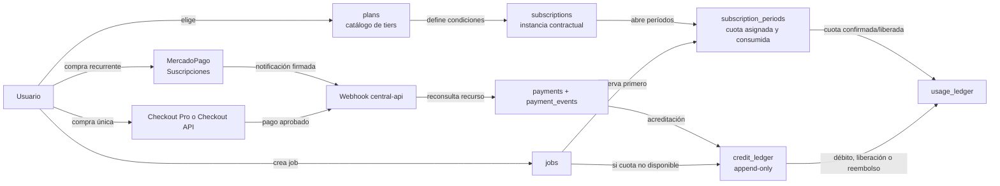
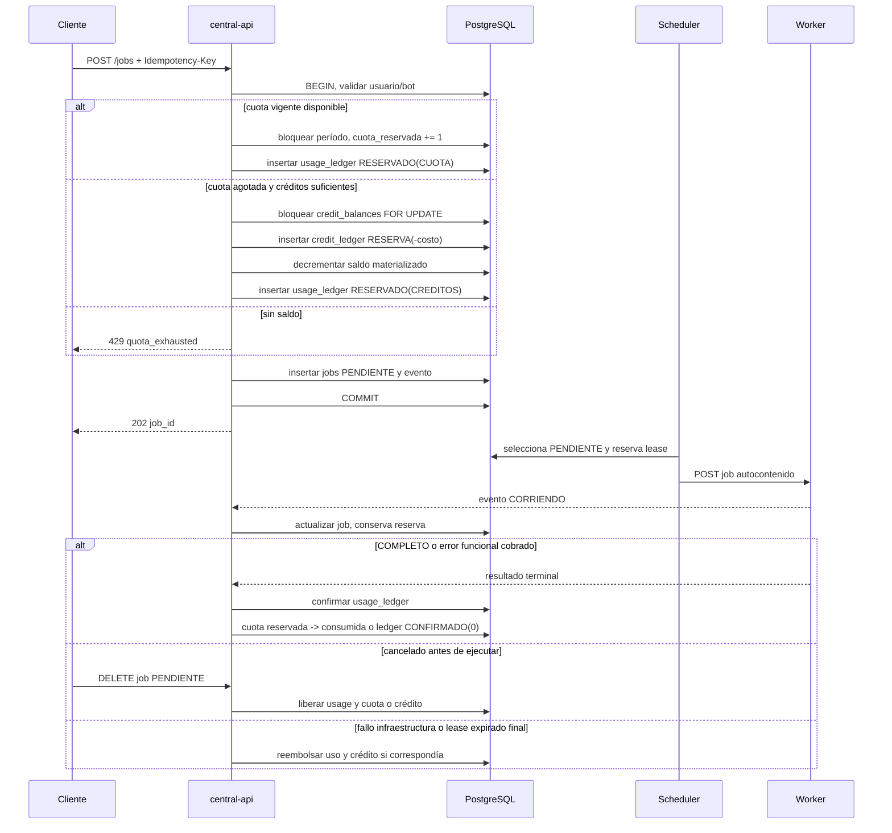

# Plan 04: Facturación, cuotas, créditos y MercadoPago
> **Estado:** plan de implementación para F4.
>
> **Ámbito:** `central-api` y PostgreSQL. El `bot-worker` no conoce precios,
> planes, cuotas, créditos, pagos ni credenciales de MercadoPago.
>
> **Fuente de verdad:** `plan.md`, en particular las invariantes B-1 a B-4,
> los estados de job de §8, la fase F4 y las preguntas de §11.
---

## 1. Objetivo y alcance
La V3 incorpora facturación como un dominio explícito y transaccional. Debe permitir vender suscripciones recurrentes y créditos prepago, asignar una cuota por período, cobrar de forma consistente la ejecución de bots y conservar una auditoría verificable de cada movimiento de valor.
La implementación resuelve R7, R8 y R9 del plan raíz:
| Requisito | Resultado de este plan |
|---|---|
| R7 | Catálogo de tiers en `plans`, suscripción activa y cuota por período. |
| R8 | Créditos prepago como complemento de cuota y producto independiente. |
| R9 | Cobros mediante MercadoPago con webhooks idempotentes y conciliación. |
### 1.1 Punto de partida V2
La V2 **no tiene código de billing**. La investigación `.research/04-auth-admin-config.md` §10 confirma que no hay SDK de MercadoPago, token, webhook, checkout, entidad de pago, factura, suscripción, plan, precio ni lógica de entitlement. Los únicos controles comerciales son columnas mutables de `users`:
| Columna V2 | Significado actual | Destino V3 |
|---|---|---|
| `maximas_consultas_mensuales` | Límite entero mensual, default 20. | `subscription_periods.cuota_asignada`. |
| `consultas_realizadas` | Contador mensual mutable. | Reserva/confirmación por período y `usage_ledger`. |
| `fecha_ultimo_reset` | Fecha usada para reset perezoso en autenticación. | Se elimina. La reemplaza `subscription_periods`. |
No se debe simular una migración de pagos históricos porque no existen en V2. La migración inicial puede crear el catálogo `free`, asignar una suscripción inicial donde corresponda o crear un período gratuito según la decisión de producto. No debe inferir dinero, créditos ni pagos desde los contadores V2 sin una decisión y evidencia de negocio explícitas.
### 1.2 Dentro del alcance
1. Esquema transaccional para planes, suscripciones, períodos, uso, créditos,
pagos y eventos del proveedor.
2. Admisión atómica de jobs contra cuota y créditos.
3. Reserva, confirmación, liberación y devolución según el ciclo de vida del
job de `plan.md` §8.
4. Compra única de créditos y suscripción recurrente por MercadoPago.
5. Webhook validado, reconsulta al proveedor, idempotencia y conciliación.
6. API de autoservicio para clientes y acciones administrativas auditadas.
7. Métricas, alertas, pruebas de concurrencia y procedimientos operativos.
### 1.3 Fuera del alcance inicial
- Emisión fiscal electrónica, facturas, IVA, retenciones, libros contables o
ERP. Son dominios separados y requieren definición legal y de producto.
- Almacenamiento de tarjetas, CVV, PAN, cuentas bancarias o datos sensibles de
medio de pago.
- Cobro dentro del worker o mediante una comunicación worker → MercadoPago.
- Facturación por organización multi-tenant. El modelo debe conservar
`user_id` como dueño mientras la pregunta 6 de `plan.md` §11 siga abierta.
- Precio definitivo, equivalencia final crédito-ejecución, vencimiento y
política comercial. Esas decisiones se listan en §13.
### 1.4 Invariantes que implementa
| Invariante | Diseño verificable |
|---|---|
| B-1 | Cada reserva, confirmación, liberación o devolución de uso deja una entrada inmutable. Cada consumo de créditos deja exactamente una fila en `credit_ledger`. |
| B-2 | La reserva se hace al crear el job, antes de que el scheduler lo asigne a un worker. Un job que no ejecuta libera el recurso. |
| B-3 | `payment_events.provider_event_id` es único por proveedor. Procesar dos veces el mismo evento no duplica saldo ni estado. |
| B-4 | El débito de créditos toma bloqueo de fila de saldo por usuario y verifica disponibilidad en la misma transacción. |
---

## 2. Modelo conceptual
### 2.1 Las tres entidades de producto
**PLAN** es una definición de catálogo administrada en base de datos. Describe un tier comercial reusable, por ejemplo `free` o `pro`, su cuota, concurrencia, bots habilitados, prioridad, precio y moneda. No pertenece a un usuario y no contiene consumo mutable.
**SUSCRIPCIÓN** es la instancia temporal de un usuario en un plan. Vincula al usuario con un `plan`, registra el estado contractual y el identificador de la suscripción remota de MercadoPago. Sus períodos concretos viven en `subscription_periods`, no en el contador de `users`.
**CRÉDITOS** son saldo prepago, independiente de una suscripción. Se compran en paquetes o se otorgan por ajuste y se gastan cuando no hay cuota disponible. El saldo se deriva del libro mayor append-only `credit_ledger`, nunca de un campo `users.creditos` modificable.
### 2.2 Regla de precedencia
La regla central es: **primero cuota del período, luego créditos como overflow o top-up**. Cuando se admite una ejecución, la central intenta reservar una unidad de la cuota vigente. Si la cuota está agotada, intenta reservar el costo del bot en créditos. Si tampoco alcanza, rechaza la creación del job.
Los créditos también se venden de forma autónoma. Un cliente con plan `free`, sin suscripción de pago o incluso sin período de cuota utilizable puede comprar créditos y ejecutar mientras tenga saldo y esté habilitado.
No se mezclan ambas fuentes para una misma ejecución en la primera versión. Un job queda asociado a `fuente_cobro = CUOTA | CREDITOS` desde la reserva hasta su resultado. Esta regla simplifica la reversión, el soporte y la auditoría.
### 2.3 Flujo de entidades y dinero



La flecha de un pago aprobado a `credit_ledger` no se ejecuta desde el navegador ni desde el payload de un webhook. Solo la ejecuta una transacción de la central después de reconsultar a MercadoPago, verificar que el recurso remoto es cobrable y aplicar idempotencia local.
### 2.4 Separación entre entitlement y dinero
Un plan habilita condiciones de servicio, no es un pago. Una suscripción puede estar activa por un período ya pagado, en prueba o concedido por soporte. Un pago puede existir sin acreditar créditos hasta confirmarse. Un crédito puede existir por ajuste administrativo sin una compra.
Esta separación evita conclusiones incorrectas, por ejemplo asumir que una `subscription` activa implica que todos sus cobros se aprobaron, o que un pago pendiente ya habilita consumo. Los estados remotos del proveedor y el entitlement local se correlacionan, pero no se sustituyen mutuamente.
---

## 3. Tiers de suscripción
### 3.1 Catálogo en `plans`, no en código
Los tiers viven en la tabla `plans` porque precio, cuota y oferta cambian por decisión comercial. Codificarlos como constantes obligaría a desplegar servicios para cambiar un precio, impediría auditar qué condiciones aceptó cada cliente y haría difícil mantener versiones históricas.
Una suscripción debe almacenar una instantánea de las condiciones económicas y de entitlement relevantes al abrir un período. Cambiar una fila de `plans` debe afectar solo altas o renovaciones futuras, nunca reescribir el derecho ya asignado a un período existente.

```sql
CREATE TABLE plans (
    id uuid PRIMARY KEY,
    code text NOT NULL UNIQUE,
    nombre text NOT NULL,
    activo boolean NOT NULL DEFAULT true,
    cuota_mensual_ejecuciones integer NOT NULL CHECK (cuota_mensual_ejecuciones >= 0),
    concurrencia_maxima_jobs integer NOT NULL CHECK (concurrencia_maxima_jobs >= 0),
    bots_habilitados jsonb NOT NULL,
    prioridad_cola smallint NOT NULL CHECK (prioridad_cola BETWEEN 0 AND 100),
    precio_menor bigint NOT NULL CHECK (precio_menor >= 0),
    moneda char(3) NOT NULL DEFAULT 'ARS',
    intervalo text NOT NULL CHECK (intervalo IN ('month')),
    version integer NOT NULL DEFAULT 1,
    creado_en timestamptz NOT NULL DEFAULT now(),
    retirado_en timestamptz NULL
);
```

`precio_menor` se expresa en **centavos de ARS**, como entero. Nunca usar `float`
para importes.

La razón de fijar centavos y no pesos: la API de MercadoPago recibe y devuelve
`transaction_amount` como número decimal en unidades de la moneda, por ejemplo
`100.50`. Guardar pesos enteros perdería los centavos que el proveedor sí maneja,
y guardar un decimal en la base invita a que alguien use `float` en el camino. Un
entero de centavos es exacto, comparable y ordenable.

La conversión vive en un único adaptador, nunca dispersa por el código:

```python
from decimal import Decimal

def a_monto_mp(centavos: int) -> Decimal:
    # Centavos -> decimal de la API. Decimal, jamas float.
    return Decimal(centavos) / Decimal(100)

def desde_monto_mp(monto: Decimal | str) -> int:
    # Decimal de la API -> centavos. Se acepta str porque el JSON puede
    # traerlo asi y convertirlo a float perderia precision.
    return int((Decimal(str(monto)) * 100).to_integral_value())
```

Regla de contraste obligatoria: al reconsultar un pago, comparar el importe
devuelto contra el esperado en centavos. Una diferencia no se ignora ni se
redondea, se marca como discrepancia de conciliación (§7.10).
### 3.2 Catálogo placeholder
Los importes y límites de esta tabla son deliberadamente simbólicos. No son una propuesta de precios ni un compromiso de producto. La pregunta 1 de `plan.md` §11 define los números reales.
| Código | Cuota mensual de ejecuciones | Concurrencia máxima de jobs del usuario | Bots habilitados | Prioridad en cola | Precio | Moneda |
|---|---:|---:|---|---:|---:|---|
| `free` | `PENDIENTE_Q1` | `PENDIENTE_Q1` | subconjunto gratuito | menor | `0` | ARS |
| `basico` | `PENDIENTE_Q1` | `PENDIENTE_Q1` | catálogo básico | media | `PENDIENTE_Q1` | ARS |
| `pro` | `PENDIENTE_Q1` | `PENDIENTE_Q1` | catálogo completo | alta | `PENDIENTE_Q1` | ARS |
| `empresa` | `PENDIENTE_Q1` | `PENDIENTE_Q1` | catálogo completo y acuerdos | máxima | `PENDIENTE_Q1` | ARS |
### 3.3 Significado de cada palanca
| Palanca | Se aplica en | Semántica | No debe confundirse con |
|---|---|---|---|
| Cuota mensual | Admisión de job | Cantidad de ejecuciones que el período puede confirmar. | Rate limit por minuto. |
| Concurrencia de usuario | Scheduler | Máximo de jobs no terminales ejecutándose o asignados para el usuario. | Tope W-2 de cinco jobs por worker. |
| Bots habilitados | Endpoint de creación | Lista o regla de operaciones que el plan permite. | El costo en créditos de un bot. |
| Prioridad de cola | Selección del scheduler | Peso u orden relativo entre jobs ya admisibles. | Garantía de tiempo de respuesta. |
| Precio y moneda | Checkout recurrente | Importe del plan para nuevas altas o renovaciones. | Saldo de créditos. |
La prioridad no puede permitir que un usuario exceda su concurrencia, la capacidad global de workers ni las reservas de dinero. El scheduler debe elegir primero por elegibilidad y límites duros, luego ordenar por prioridad y antigüedad para evitar inanición de los planes inferiores.
### 3.4 Retiro y versionado de planes
No se elimina un plan referenciado. Para discontinuarlo se establece `activo = false` y `retirado_en`; deja de ofrecerse en altas y cambios, pero sigue siendo legible en facturas, períodos y auditoría. Una modificación material crea una nueva versión o nuevo `code`, según la política comercial.
El `plan_id` de `subscription_periods` y los campos snapshot de cuota, prioridad y precio preservan qué se otorgó. La página “mi plan” puede mostrar el catálogo actual y las condiciones efectivas del período por separado.
---

## 4. Ciclo de facturación y cuota
### 4.1 `subscription_periods` reemplaza `users.fecha_ultimo_reset`
La V3 elimina `users.fecha_ultimo_reset` por I-3. No se debe reconstruir esa columna bajo otro nombre ni reiniciar consumo como efecto colateral de `validate_api_key`. En V2, `app/api/deps.py` comprobaba año y mes UTC al autenticar y reseteaba `consultas_realizadas`; ese patrón es frágil porque un usuario inactivo no rota, mezcla autenticar con facturar y no representa períodos contractuales.
Cada período es una fila explícita:

```sql
CREATE TABLE subscription_periods (
    id uuid PRIMARY KEY,
    subscription_id uuid NOT NULL REFERENCES subscriptions(id),
    user_id uuid NOT NULL REFERENCES users(id),
    plan_id uuid NOT NULL REFERENCES plans(id),
    inicio timestamptz NOT NULL,
    fin timestamptz NOT NULL,
    cuota_asignada integer NOT NULL CHECK (cuota_asignada >= 0),
    cuota_reservada integer NOT NULL DEFAULT 0 CHECK (cuota_reservada >= 0),
    cuota_consumida integer NOT NULL DEFAULT 0 CHECK (cuota_consumida >= 0),
    estado text NOT NULL CHECK (estado IN ('ABIERTO', 'CERRADO', 'ANULADO')),
    plan_snapshot jsonb NOT NULL,
    creado_en timestamptz NOT NULL DEFAULT now(),
    cerrado_en timestamptz NULL,
    CHECK (inicio < fin),
    CHECK (cuota_reservada + cuota_consumida <= cuota_asignada)
);
CREATE UNIQUE INDEX uq_subscription_period_active
ON subscription_periods (subscription_id)
WHERE estado = 'ABIERTO';
CREATE INDEX ix_subscription_periods_user_open
ON subscription_periods (user_id, inicio, fin)
WHERE estado = 'ABIERTO';
```

La tabla requerida contiene `inicio`, `fin`, `cuota_asignada` y `cuota_consumida`. `cuota_reservada` se añade porque B-2 exige distinguir una unidad prometida a un job todavía no ejecutado de una unidad confirmada. Sin esa columna se sobreasignaría cuota o se perdería una cancelación.
### 4.2 Apertura de un período
Un proceso programado de billing abre períodos para suscripciones que tengan un ciclo que comienza. También puede abrirlo el manejador transaccional de una renovación confirmada, pero únicamente como consecuencia del cambio de estado de suscripción, no del login de un cliente.
Pasos de apertura:
1. Bloquear la `subscription` por PK para serializar renovación, cambio y baja.
2. Verificar estado local habilitante y, para planes pagos, evidencia de cobro
confirmada o regla de gracia aprobada.
3. Confirmar que no existe período abierto por el índice parcial.
4. Copiar desde el plan las condiciones aplicables a `plan_snapshot`.
5. Crear `subscription_periods` con cuota asignada, reserva y consumo en cero.
6. Emitir evento de auditoría `subscription_period.opened`.
7. Publicar métrica, pero solo después del commit mediante outbox si existe.
El proceso es idempotente. Si dos instancias de `central-api` disparan la misma tarea, el bloqueo y el índice único dejan una única fila abierta.
### 4.3 Cierre de un período
Un **scheduled task** de la central cierra los períodos cuyo `fin <= now()`. No lo cierra la autenticación ni la llamada pública de “ver mi consumo”. Debe correr con frecuencia configurada, por ejemplo cada pocos minutos, y tener un comando manual seguro para recuperación operativa.
Al cerrar:
1. Tomar bloqueo de la fila de período y de sus jobs con reservas activas.
2. No permitir nuevas reservas de cuota en el período vencido.
3. Resolver reservas de jobs en curso según §6. Un job iniciado antes del fin
conserva su fuente de cobro hasta estado terminal.
4. Marcar el período `CERRADO`, grabar `cerrado_en` y abrir el siguiente cuando
la suscripción siga elegible.
5. No modificar `cuota_consumida` histórica ni reutilizar sobrantes salvo que la
política de producto defina explícitamente rollover.
El cierre retrasado no puede crear una ventana de consumo gratis. La admisión consulta `inicio <= now() < fin` y `estado = ABIERTO`, por lo que un período vencido no acepta reservas aunque el cron todavía no haya marcado el cierre.
### 4.4 Usuario sin suscripción
Un usuario sin suscripción activa no dispone de cuota recurrente. Puede:
- Comprar créditos y crear jobs contra esos créditos, si está habilitado y el
bot está comercialmente disponible para compra standalone.
- Crear una suscripción `free` si producto define que todos los usuarios reciben
cuota gratuita. Es la opción recomendada para evitar semánticas implícitas.
- Ser rechazado por falta de fondos si no tiene créditos y no existe período.
No se debe tratar la ausencia de suscripción como una cuota ilimitada ni recrear el default V2 de 20 consultas por una lectura de `users`.
### 4.5 Zona horaria y límites de período
Todos los instantes se almacenan como `timestamptz` y se comparan en UTC. La política de calendario comercial se calcula en `America/Argentina/Buenos_Aires`, no usando el mes UTC. Por ejemplo, un período mensual que comienza el día 1 a las 00:00 locales debe persistir sus límites UTC equivalentes, incluyendo cambios históricos de offset que pudiera tener la zona.
La API puede devolver ambos: instant UTC canónico y representación local con IANA zone. Los jobs ya cobrados se atribuyen al período asociado por `period_id`, no por recálculo de fecha al consultar. Las tareas deben usar una librería de zonas IANA, por ejemplo `zoneinfo`, y tener pruebas de borde de mes y horario de verano histórico.
### 4.6 Prorrateo por cambio de plan
El prorrateo es una regla de producto y de proveedor, no una división informal en
el código. La central debe recibir el importe y estado autoritativos que exponga
MercadoPago para una modificación de suscripción.

MercadoPago **sí** soporta prorrateo y cambio de calendario de forma nativa, todo
por `PUT /preapproval/{id}`: importe (`auto_recurring.transaction_amount`),
estado, día fijo de cobro para frecuencia mensual, y monto prorrateado por
suscripción. Ver el detalle de endpoints en §7.2.

La decisión de diseño que se deriva: **el prorrateo lo calcula MercadoPago, no la
central.** La central envía el cambio, reconsulta `GET /preapproval/{id}` y toma
el importe resultante como autoritativo. Calcular el prorrateo por nuestra cuenta
produciría dos cifras que tarde o temprano difieren, y la del proveedor es la que
se le cobra al usuario.

Lo que sí decide la central es el **entitlement**, que es una cuestión distinta
del dinero:

| Caso | Dinero (MercadoPago) | Entitlement (central) |
|---|---|---|
| Upgrade | Prorrateo del proveedor | Cuota nueva **inmediata**, se amplía el período abierto |
| Downgrade | Prorrateo del proveedor | Cuota nueva **al próximo período**. No se reduce una cuota ya entregada |
| Pausa | Sin cobro | El período abierto se respeta hasta su fin |
| Cancelación | Sin cobro futuro | El período abierto se respeta hasta su fin |

La asimetría entre upgrade y downgrade es deliberada: quitar cuota ya pagada a
mitad de período es hostil y genera soporte, mientras que dar la cuota nueva
enseguida en un upgrade es lo que el usuario acaba de comprar.
Política propuesta para entitlement, independiente del mecanismo de cobro:
| Cambio | Efecto de precio | Efecto de cuota | Aplicación recomendada |
|---|---|---|---|
| Upgrade | Cobrar diferencia prorrateada o pago adicional confirmado. | Aumentar disponibilidad desde el cambio sin borrar uso ya confirmado. | Inmediata tras confirmación de pago. |
| Downgrade | No reembolsar automáticamente salvo decisión comercial. | No revocar jobs ya reservados. | Al siguiente período. |
| Cambio gratis → pago | Cobro inicial confirmado. | Abrir o reemplazar entitlement según período. | Inmediata, tras pago. |
| Pago → free | Sin nuevo cobro. | Mantener período ya adquirido y luego abrir free si aplica. | Al fin de período. |
Para un upgrade dentro de un período se puede crear un período de ajuste o actualizar la cuota del período bajo transacción con un `usage_ledger` de ajuste. Se recomienda el **período de ajuste** porque conserva trazabilidad de qué entitlement se otorgó y evita modificar silenciosamente una cuota ya auditada.
### 4.7 Estados de suscripción
La tabla `subscriptions` debe separar el estado local del estado textual remoto. Un conjunto mínimo local es `PENDIENTE`, `ACTIVA`, `PAST_DUE`, `CANCELADA`, `EXPIRADA` y `SUSPENDIDA`. La admisión por cuota requiere `ACTIVA` y un período vigente. Los créditos no se invalidan por `CANCELADA`, excepto si una obligación legal o fraude exige retención y queda auditada.
---

## 5. Sistema de créditos
### 5.1 Ledger append-only
`credit_ledger` es un libro mayor de movimientos. No existe `users.credit_balance` como fuente de verdad. Toda fila tiene importe firmado y causa explícita:
| Tipo de movimiento | Signo habitual | Motivo |
|---|---:|---|
| `COMPRA` | positivo | Pago de paquete confirmado. |
| `RESERVA` | negativo | Bloqueo del costo al crear un job. |
| `LIBERACION_RESERVA` | positivo | Job no ejecutado, reserva anulada. |
| `CONSUMO_CONFIRMADO` | `0` | Reclasifica una reserva ya debitada, sin volver a cambiar saldo. |
| `AJUSTE` | positivo o negativo | Corrección autorizada de soporte. |
| `REEMBOLSO` | positivo | Restitución por error o devolución comercial aprobada. |
| `VENCIMIENTO` | negativo | Retiro de créditos expirados. |
| `CHARGEBACK_REVERSAL` | negativo | Revocación asociada a disputa aprobada, sujeta a política. |
La reserva se modela como un débito para que el saldo disponible sea inequívoco. La confirmación es una fila de importe cero que enlaza la reserva con el job finalizado y satisface trazabilidad B-1 sin debitar dos veces. Alternativamente puede haber dos dimensiones, `saldo` y `reservado`, pero se recomienda el modelo anterior por ser más fácil de auditar y de no sobregirar.

```sql
CREATE TABLE credit_ledger (
    id uuid PRIMARY KEY,
    user_id uuid NOT NULL REFERENCES users(id),
    amount integer NOT NULL,
    movimiento text NOT NULL CHECK (movimiento IN (
        'COMPRA', 'RESERVA', 'LIBERACION_RESERVA', 'CONSUMO_CONFIRMADO',
        'AJUSTE', 'REEMBOLSO', 'VENCIMIENTO', 'CHARGEBACK_REVERSAL'
    )),
    job_id uuid NULL REFERENCES jobs(id),
    payment_id uuid NULL REFERENCES payments(id),
    referencia_ledger_id uuid NULL REFERENCES credit_ledger(id),
    idempotency_key text NOT NULL,
    vence_en timestamptz NULL,
    metadata jsonb NOT NULL DEFAULT '{}'::jsonb,
    creado_en timestamptz NOT NULL DEFAULT now(),
    CHECK (amount <> 0 OR movimiento = 'CONSUMO_CONFIRMADO'),
    UNIQUE (user_id, idempotency_key)
);
CREATE INDEX ix_credit_ledger_user_created
ON credit_ledger (user_id, creado_en DESC);
CREATE UNIQUE INDEX uq_credit_ledger_job_reserva
ON credit_ledger (job_id)
WHERE movimiento = 'RESERVA';
```

`metadata` no admite secretos de pago, tarjeta ni payload completo del webhook. Guarda referencias mínimas, versión de precio, razón de ajuste y actor auditado. El payload remoto cifrado, si se retiene por soporte, debe tener acceso limitado y una política de retención separada.
### 5.2 Saldo derivado y rendimiento
El saldo lógico es:

```sql
SELECT COALESCE(SUM(amount), 0) AS saldo_disponible
FROM credit_ledger
WHERE user_id = $1;
```

Un `SUM` simple con el índice por usuario es correcto pero puede crecer sin límite y no provee por sí mismo serialización de débitos concurrentes. Un snapshot periódico reduce lectura, pero complica el cálculo de disponibilidad al momento de cobrar y puede quedar atrasado. Un trigger que mantenga solo una columna de saldo no es suficiente si se consulta sin bloqueo, y hace menos transparente el ledger.
Se recomienda una tabla proyección de una fila por usuario, mantenida **en la misma transacción** que inserta el ledger y bloqueada con `SELECT FOR UPDATE`:

```sql
CREATE TABLE credit_balances (
    user_id uuid PRIMARY KEY REFERENCES users(id),
    saldo_disponible integer NOT NULL DEFAULT 0 CHECK (saldo_disponible >= 0),
    actualizado_en timestamptz NOT NULL DEFAULT now()
);
```

Es una proyección materializada transaccional, no la fuente de verdad. El ledger sigue siendo autoritativo y permite reconstrucción y auditoría. La actualización puede implementarse en el servicio de dominio, no con trigger opaco, para que cada operación tenga un caso de uso explícito y sea testeable. Un job diario recalcula `SUM(amount)` por usuario, compara contra `credit_balances` y alerta o reconstruye bajo procedimiento controlado si hay deriva.
### 5.3 No permitir saldo negativo bajo concurrencia
Al reservar créditos:
1. Comenzar transacción `READ COMMITTED` o más fuerte según la implementación.
2. Crear `credit_balances` con `INSERT ... ON CONFLICT DO NOTHING` si no existe.
3. Ejecutar `SELECT ... FOR UPDATE` sobre la fila del usuario.
4. Comprobar `saldo_disponible >= bots.costo_creditos`.
5. Insertar `credit_ledger` `RESERVA` con llave de idempotencia del job.
6. Ejecutar `UPDATE credit_balances SET saldo_disponible = saldo_disponible - costo`.
7. Insertar uso reservado y job, y confirmar una sola transacción.
El `CHECK (saldo_disponible >= 0)` es defensa adicional, no reemplazo del bloqueo. Dos transacciones que lean sin bloqueo podrían creer que existe saldo; el bloqueo serializa la decisión. Un `UPDATE ... WHERE saldo_disponible >= :costo RETURNING` también es válido si se usa como operación condicional única, pero se mantiene el bloqueo cuando se debe elegir atómicamente entre cuota y créditos.
### 5.4 Costo por bot
`bots.costo_creditos` es entero no negativo. El costo se toma al reservar y se copia a `usage_ledger.costo_creditos_snapshot`; cambiar la definición del bot no altera el costo histórico. El costo cero es admisible para bots promocionales, pero aun así debe pasar por el control de habilitación y concurrencia.
| Caso | Fuente de cobro | Unidades |
|---|---|---:|
| Bot de costo 1 sin cuota | Créditos | 1 |
| Bot de costo 5 con cuota disponible | Cuota | 1 ejecución, no 5 créditos |
| Bot de costo 5 sin cuota | Créditos | 5 |
| Bot de costo 0 sin cuota | Créditos | 0, registrar uso si política lo exige |
La pregunta 2 de `plan.md` §11 debe decidir si todos los bots cuestan uno o si se usa diferenciación. El esquema soporta ambos sin migración.
### 5.5 Vencimiento y orden de consumo
El vencimiento de créditos es **pendiente de producto**. Si se adopta, cada lote acreditado debe registrar `vence_en` y el servicio debe reservar primero el lote que vence antes. Un simple saldo agregado no basta para respetar FIFO por vencimiento. En ese caso se debe añadir `credit_lots` o referencias de lote en el ledger.
Hasta que exista esa decisión, se recomienda créditos no vencibles y un saldo único. No implementar vencimientos ficticios ni asumir que MercadoPago controla la expiración de un saldo interno.
---

## 6. Reserva, confirmación y reembolso de consumo
### 6.1 Modelo de uso por job
`usage_ledger` representa el derecho de ejecución, separado del dinero. Cada job tiene una sola reserva identificable e idempotente:

```sql
CREATE TABLE usage_ledger (
    id uuid PRIMARY KEY,
    user_id uuid NOT NULL REFERENCES users(id),
    job_id uuid NOT NULL REFERENCES jobs(id),
    subscription_period_id uuid NULL REFERENCES subscription_periods(id),
    fuente_cobro text NOT NULL CHECK (fuente_cobro IN ('CUOTA', 'CREDITOS')),
    estado text NOT NULL CHECK (estado IN ('RESERVADO', 'CONFIRMADO', 'LIBERADO', 'REEMBOLSADO')),
    costo_creditos_snapshot integer NOT NULL DEFAULT 0 CHECK (costo_creditos_snapshot >= 0),
    reservado_en timestamptz NOT NULL DEFAULT now(),
    confirmado_en timestamptz NULL,
    liberado_en timestamptz NULL,
    motivo text NULL,
    UNIQUE (job_id)
);
```

La fila evita buscar inferencias entre el job y el ledger de créditos. La fuente de cobro queda congelada. `subscription_period_id` es obligatorio cuando la fuente es `CUOTA` y nulo cuando es `CREDITOS`, implementado mediante un `CHECK`.
### 6.2 Momento de reserva
El plan maestro establece B-2 y el diagrama de §7: la central valida cuota, reserva consumo e inserta `jobs.PENDIENTE`, luego responde `202`. Esta es la única política válida para V3. No se reserva al autenticar ni cuando el worker reclama trabajo.
La transacción de creación del job debe:
1. Validar usuario habilitado, plan o disponibilidad standalone, bot y operación.
2. Aplicar límites de concurrencia y cola del usuario.
3. Bloquear período abierto o proyección de créditos según corresponda.
4. Reservar cuota o insertar movimiento `RESERVA` de créditos.
5. Insertar `usage_ledger` `RESERVADO` con `job_id` definitivo.
6. Insertar `jobs` en `PENDIENTE` y su evento inicial.
7. Confirmar y devolver el `job_id`.
La inserción debe ser idempotente respecto de `Idempotency-Key` del endpoint de jobs. Una repetición devuelve el job y su reserva originales, sin crear un segundo débito ni incrementar cuota.
### 6.3 Matriz de estados y cobro
| Estado del job | ¿Puede ejecutar? | Estado de uso | Acción sobre cuota/créditos |
|---|---|---|---|
| `PENDIENTE` | No aún. | `RESERVADO` | Retener una unidad o costo. |
| `ASIGNADO` | Aún no confirmado por worker. | `RESERVADO` | Mantener la reserva. |
| `CORRIENDO` | Sí. | `RESERVADO` hasta resultado final. | Mantener. |
| `COMPLETO` | Terminó. | `CONFIRMADO` | Convertir reserva en consumo. |
| `FALLIDO` por error de negocio | Intentó ejecutar. | `CONFIRMADO` por defecto. | Cobrar, salvo política específica por bot. |
| `FALLIDO` por infraestructura | No hay resultado confiable. | `REEMBOLSADO` propuesto. | Liberar cuota o acreditar créditos. |
| `CANCELADO` desde `PENDIENTE` | No. | `LIBERADO` | Liberar siempre. |
| `CANCELADO` desde `CORRIENDO` | Sí, al menos parcialmente. | `CONFIRMADO` por defecto. | No reembolsar automáticamente. |
| Lease vencido y reintento | Puede haber ejecutado. | `RESERVADO` | Mantener hasta resultado terminal o deduplicación. |
### 6.4 Secuencia transaccional



### 6.5 Cancelación antes y durante ejecución
Si un job se cancela mientras está `PENDIENTE`, no llegó a usar capacidad del bot. La central cambia el job a `CANCELADO`, hace la liberación y registra el motivo en una sola transacción. Si el scheduler ya tomó lease, el cambio debe usar control de versión o bloqueo para impedir que asigne un job cancelado.
Si un job se cancela mientras está `CORRIENDO`, la solicitud de cancelación se propaga al worker, pero ya hubo uso de navegador, proxy, CAPTCHA y posiblemente resultado parcial. Se propone no reembolsar de forma automática. Debe reflejarse claramente en la API como “cancelación solicitada, cobro confirmado si inició”. Una excepción de soporte puede emitir `REEMBOLSO` auditado.
### 6.6 Fallo de infraestructura y lease vencido
Un worker muerto o una lease vencida no prueba que el bot no se haya ejecutado. Por eso se debe intentar reencolar con el mismo `job_id`, número de intento y reserva existente antes de decidir el resultado final. El worker y la central mantienen idempotencia por `(job_id, attempt)` conforme el plan maestro.
Si se agotan los reintentos y la clasificación es `INFRASTRUCTURE_ERROR`, se recomienda reembolsar. Es la opción favorable al usuario ante una falla que el sistema no puede atribuir a su solicitud. La devolución de créditos se realiza con movimiento `REEMBOLSO` referenciando la reserva, y la cuota se reduce de `cuota_reservada` sin incrementar `cuota_consumida`.
Si hay evidencia de que el bot ejecutó una acción externa irreversible, el job no se puede reintentar a ciegas. Debe pasar a revisión, conservar la reserva y aplicar una política explícita de `UNKNOWN_OUTCOME`.

#### Qué bots tienen efecto externo, verificado en el código de la V2

La pregunta ya no queda abierta. Varios bots **sí** ejecutan actos
irreversibles contra organismos públicos, no solo consultas. Evidencia directa:

| Bot | Evidencia en la V2 | Acto irreversible |
|---|---|---|
| `controladores_fiscales` | `app/bot/controladores_fiscales_bot.py:226-228` hace clic en el botón `Presentar` | **Presentación ante ARCA.** No se deshace |
| `vep_ccma` | `app/bot/vep_ccma_bot.py:629-637` hace clic en `GENERAR VEP O QR` | Genera un volante de pago con identificador propio |
| `vep`, `vep_archivo` | Generación de VEP | Ídem |
| `portal_iva_carga` | Importa libros de IVA | Carga de datos fiscales del período |
| `rcel` | Emisión de comprobantes | **Emite factura electrónica.** Solo se revierte con nota de crédito |
| `declaracion_en_linea` | Presentación de declaración | Presentación formal |
| `mis_facilidades` | Adhesión a plan de pagos | Compromiso de pago |
| `sct_compensaciones` | Compensación de saldos | Movimiento contable ante el organismo |
| `pago_devoluciones` | Gestión de devoluciones | Trámite formal |

Esto cambia dos cosas del diseño, y ninguna es opcional:

1. **La clase de idempotencia es un campo obligatorio del manifiesto del bot.**
   Cada operación declara si es `CONSULTA` (relectura segura) o `EFECTO`
   (irreversible). La central **no reintenta** una operación `EFECTO` sin
   verificación previa del estado remoto, aunque el lease haya vencido y aunque
   el worker haya muerto. Reintentar a ciegas un `Presentar` puede producir una
   presentación duplicada ante ARCA, que es un problema del contribuyente, no
   un error técnico recuperable.
2. **La política de reembolso se invierte para `EFECTO`.** En una operación
   `CONSULTA` fallida por infraestructura se reembolsa, porque nada ocurrió del
   otro lado. En una `EFECTO` con resultado desconocido **no** se reembolsa
   automáticamente: el acto pudo haberse consumado. El job pasa a
   `UNKNOWN_OUTCOME`, se conserva la reserva, se notifica al Admin y un humano
   decide tras verificar en el organismo.

| Clase | Reintento automático | Reembolso ante fallo de infraestructura | Estado si el resultado es desconocido |
|---|---|---|---|
| `CONSULTA` | Sí, hasta `max_attempts` | Sí | `FALLIDO` con reembolso |
| `EFECTO` | **No.** Requiere verificación del estado remoto | No automático | `UNKNOWN_OUTCOME`, reserva retenida, revisión humana |

La lista de arriba es el insumo para poblar `bot_operations.manifest` en la
fase F3. Cada bot portado debe declarar su clase antes de habilitarse, y el
valor por defecto ante la ausencia del campo debe ser `EFECTO`, que es la
opción segura: es preferible no reintentar una consulta que duplicar una
presentación.
### 6.7 Contraste con V2
V2 reservaba la cuota en `acquire_next_pending_job`, al momento en que el worker reclamaba el trabajo. Esto dejaba la admisión de jobs separada del cobro. Además, la docstring de `app/jobs/manager.py` documenta que cancelar un job corriendo no reembolsa cuota. La V3 adelanta la reserva a la creación del job, registra cada transición de uso y distingue cancelación previa de cancelación en vuelo.
---

## 7. Integración con MercadoPago
### 7.1 Límite de integración
MercadoPago es el proveedor de cobro. La fuente de verdad de un pago es el recurso obtenido de su API autenticada con el Access Token, no una URL de retorno, una afirmación del cliente ni el JSON inicial del webhook.
La integración reside solo en `central-api`. Los workers no reciben `MERCADOPAGO_ACCESS_TOKEN`, ni clave pública, ni identificadores de pago que les permitan mutar entitlement.
### 7.2 Productos aplicables
| Caso de uso | Producto MercadoPago | Recurso local | Flujo |
|---|---|---|---|
| Compra única de paquete de créditos | Checkout Pro, preferido inicialmente | `payments` tipo `CREDIT_PACK` | La central crea preferencia, redirige al checkout alojado y acredita solo tras verificación. |
| Compra única integrada | Checkout API, opcional | `payments` tipo `CREDIT_PACK` | El cliente usa componentes/tokenización de MP y la central crea/confirma el pago. |
| Suscripción recurrente | Suscripciones: `preapproval` o `preapproval_plan` | `subscriptions` y `payments` recurrentes | La central crea o asocia la suscripción remota y habilita períodos solo según estado verificado. |
**Checkout Pro** es la opción recomendada para el MVP de créditos: MercadoPago aloja el formulario y la central crea una preferencia con `external_reference` propia, ítems y URLs de retorno. El navegador se redirige a `init_point` o sandbox equivalente. El retorno es solo experiencia de usuario, no acreditación.
**Checkout API** permite una experiencia embebida con componentes de MercadoPago como Bricks y tokenización. Requiere diseñar el frontend, tratamiento del token de medio de pago y controles adicionales. El sistema no debe recibir PAN/CVV ni persistir tokens de tarjeta. Para no ampliar superficie de cumplimiento, el MVP puede limitarse a Checkout Pro y dejar Checkout API como alternativa técnica.
**Suscripciones** usan `preapproval` para la suscripción de un cliente y
`preapproval_plan` para un plan reutilizable. El catálogo interno `plans` sigue
siendo autoritativo para entitlement. La correspondencia plan local ↔
identificador remoto se versiona.

Endpoints confirmados contra la referencia oficial de la API de Suscripciones:

| Operación | Método y ruta | Uso en la V3 |
|---|---|---|
| Crear suscripción | `POST /preapproval` | Alta de un usuario en un tier de pago |
| Consultar suscripción | `GET /preapproval/{id}` | **Reconsulta obligatoria** tras cada webhook |
| Buscar suscripciones | `GET /preapproval/search` | Conciliación periódica |
| Actualizar suscripción | `PUT /preapproval/{id}` | Cambio de importe, estado, medio de pago, fecha de cobro, prorrateo |
| Crear plan | `POST /preapproval_plan` | Espejar un tier local en MercadoPago |
| Actualizar plan | `PUT /preapproval_plan/{id}` | Cambio de precio o prueba gratuita |
| Consultar factura | `GET /authorized_payments/{id}` | Resolver `subscription_authorized_payment` |
| Buscar facturas | `GET /authorized_payments/search` | Conciliar cobros recurrentes por `preapproval_id` |
| Consultar pago | `GET /v1/payments/{id}` | **Reconsulta obligatoria** tras un webhook `payment` |
| Buscar pagos | `GET /v1/payments/search` | Conciliación. Cubre solo los últimos 12 meses |

Operaciones de gestión, todas por `PUT /preapproval/{id}`:

| Acción | Campos a enviar | Equivalente en la V3 |
|---|---|---|
| Cambiar importe | `auto_recurring.transaction_amount` y `auto_recurring.currency_id` | Cambio de tier con el mismo ciclo |
| Cancelar | `status: "cancelled"` | Baja del usuario |
| Pausar | `status: "paused"` | Suspensión por impago o a pedido |
| Reactivar | `status: "authorized"` | Alta tras regularizar |
| Cambiar día de cobro | parámetros de fecha de facturación, solo frecuencia mensual | Alinear el período local con el remoto |
| Prorrateo | parámetros de prorrateo por suscripción | Ver §4 sobre cambio de plan |
| Prueba gratuita | `free_trial` con `frequency` y `frequency_type`, por `PUT /preapproval_plan/{id}` | Período de prueba, si el producto lo define |

Estados de `preapproval` que el adaptador debe mapear: `pending`, `authorized`,
`paused`, `cancelled`. El mapeo a los estados locales de `subscriptions`
(`PENDIENTE`, `ACTIVA`, `PAUSADA`, `CANCELADA`, `VENCIDA`) no es una
correspondencia uno a uno y esa asimetría es deliberada:

| Estado remoto | Estado local | Nota |
|---|---|---|
| `pending` | `PENDIENTE` | Aún sin autorizar. **No habilita cuota** |
| `authorized` | `ACTIVA` | Habilita la apertura de períodos |
| `paused` | `PAUSADA` | No abre períodos nuevos. El período abierto se respeta hasta su fin |
| `cancelled` | `CANCELADA` | Terminal |
| sin equivalente remoto | `VENCIDA` | Local. El período terminó y no hubo renovación. MercadoPago no emite este estado |

MercadoPago reintenta automáticamente un cobro rechazado. Un `paused` remoto no
implica de por sí que el usuario deba perder el acceso ya pagado: el corte lo
decide el fin del período local, no el estado remoto.
### 7.3 Credenciales y configuración
| Secreto/configuración | Ubicación permitida | Uso |
|---|---|---|
| Access Token de MercadoPago | Secret manager y proceso `central-api` únicamente. | Crear preferencias, pagos, suscripciones y reconsultar recursos. |
| Public Key de MercadoPago | Configuración pública del frontend si se usa Checkout API. | Inicializar SDK o Bricks en navegador. No autentica operaciones del backend. |
| Webhook secret | Secret manager de `central-api` únicamente. | Verificar firma de notificaciones. |
| Modo `sandbox`/`production` | Configuración validada por ambiente. | Elegir credenciales, URLs y controles de seguridad. |
El Access Token es secreto y **nunca** se envía al navegador, cliente API, repositorio, log, worker ni error. La Public Key es publicable para el caso de Checkout API, pero no debe usarse como sustituto del Access Token. Checkout Pro puede no necesitar Public Key en la interfaz propia.
Se deben declarar variables separadas y fail-closed, por ejemplo `MP_ENVIRONMENT`, `MP_ACCESS_TOKEN`, `MP_WEBHOOK_SECRET`, `MP_PUBLIC_KEY` y `MP_BASE_URL`. Nunca seleccionar producción por un default implícito.
### 7.4 Flujo de compra única de créditos
1. Cliente autenticado solicita un paquete publicado `credit_products`.
2. Central valida precio, moneda y paquete en el catálogo local, no desde el
request del cliente.
3. Central genera `payments` local `PENDIENTE` con UUIDv7 y
`external_reference` no adivinable.
4. Central crea una preferencia Checkout Pro con Access Token, descripción,
importe esperado, moneda ARS y `external_reference`.
5. Central guarda el ID remoto de preferencia y devuelve URL de checkout.
6. Cliente completa o abandona checkout.
7. Webhook notifica un evento. Central verifica firma, registra evento y
reconsulta el pago remoto por API.
8. Si el recurso reconsultado está aprobado y coincide con la referencia, monto,
moneda y destinatario esperados, marca el pago `APROBADO` y acredita una vez.
9. La API de estado permite al cliente consultar sin depender de la redirección.
Para Checkout API el paso 4 se sustituye por creación de intención o pago siguiendo el SDK vigente. El backend mantiene el mismo `payments` local e idempotencia. El frontend usa Public Key y los componentes de MP. La secuencia exacta de Checkout API depende de la versión de Bricks o SDK que se elija y se define al momento de implementarla. No bloquea F4: el MVP usa Checkout Pro, donde MercadoPago aloja el formulario y la V3 no toca datos de tarjeta.
### 7.5 Flujo de suscripción recurrente
1. Cliente selecciona un `plans.code` activo que tenga precio mayor a cero.
2. Central crea `subscriptions` local `PENDIENTE` y correlación remota.
3. Central crea el `preapproval` individual o redirige al flujo de autorización
asociado al `preapproval_plan`, según integración aprobada.
4. La UI muestra “pendiente de confirmación” y no concede cuota paga todavía.
5. Las notificaciones de suscripción y de pago autorizado entran por webhook.
6. Central reconsulta el recurso remoto, persiste estado normalizado y abre o
renueva período solo cuando la regla de negocio considere el cobro válido.
7. Cancelar en MrBot solicita cancelación o pausa remota cuando API lo permita y
marca la baja local programada al fin del período ya pagado.
No usar solo el estado de `preapproval` como recibo de cada ciclo. Registrar los pagos recurrentes observables en `payments`, conservar sus IDs remotos y ligar el período habilitado al cobro o a una política de gracia explícita.
### 7.6 Webhooks e IPN
Se implementa endpoint HTTPS público, por ejemplo `POST /api/v3/billing/webhooks/mercadopago`. IPN puede coexistir como mecanismo legado si la cuenta o producto lo exige, pero el diseño prefiere Webhooks firmados y procesados asíncronamente. No exponer el endpoint a autenticación de usuario.
Notificaciones relevantes esperadas:
| Tema/evento | Uso local | Acción posterior |
|---|---|---|
| `payment` | Compra única, pago recurrente, reembolso o disputa. | Reconsultar el pago por ID y actualizar `payments`. |
| `subscription_preapproval` | Cambio de ciclo, pausa, cancelación o estado de suscripción. | Reconsultar `preapproval` y actualizar `subscriptions`. |
| `subscription_authorized_payment` | Cobro autorizado de una suscripción. | Reconsultar el recurso y registrar pago/período. |
Los tres tópicos de la tabla están confirmados contra la documentación oficial de
MercadoPago Argentina. Existe un cuarto, `subscription_preapproval_plan`, que
notifica altas y cambios del **plan** remoto. No se suscribe: el catálogo
autoritativo de planes es la tabla local `plans`, y un cambio del plan remoto no
debe alterar el entitlement de un período ya abierto. Si en el futuro se
administran planes desde el panel de MercadoPago, habrá que suscribirlo y
reconciliar.

Dos advertencias operativas de la documentación oficial que condicionan el diseño:

1. **Las suscripciones no se pueden configurar desde "Tus integraciones".** La
   documentación lo dice de forma explícita: ese método de configuración no está
   disponible para integraciones de Suscripciones ni de QR. Los webhooks de
   suscripción se configuran con `notification_url` **al crear el recurso**. Esto
   tiene una consecuencia incómoda y hay que asumirla: la clave secreta de firma
   se emite desde "Tus integraciones", así que hay que verificar en la cuenta real
   si las notificaciones de suscripción llegan firmadas. Si no llegan firmadas, la
   defensa es la reconsulta obligatoria de §7.8, que ya es la regla, más una URL
   de notificación con un segmento secreto de alta entropía.
2. **Los pagos de prueba no generan notificaciones.** La única forma de probar la
   recepción es el botón de simulación del panel. El plan de pruebas no debe
   suponer que un pago con credenciales de test dispara un webhook.

#### Algoritmo de validación de la firma

Confirmado contra la documentación oficial y contra el SDK oficial de Go
(`github.com/mercadopago/sdk-go/pkg/webhook`). No es una reconstrucción propia.

El encabezado `x-signature` llega con la forma `ts=<timestamp>,v1=<hash hex>`. El
manifiesto que se firma es:

```text
id:<data.id>;request-id:<x-request-id>;ts:<ts>;
```

Reglas exactas, todas verificadas:

| Regla | Detalle |
|---|---|
| Origen de `data.id` | El parámetro `data.id` de la **query string**, no del cuerpo |
| Normalización | Si `data.id` trae alfanuméricos en mayúscula, se pasa a minúscula antes de firmar |
| Campos ausentes | Si falta `data.id` o `x-request-id`, se **omite el par completo** del manifiesto, no se deja vacío |
| Separador | Cada par termina en `;`, incluido el último |
| Algoritmo | HMAC-SHA256 con la clave secreta de la aplicación, digest en **hexadecimal** |
| Comparación | En tiempo constante. Nunca `==` sobre cadenas |
| Versión | Se acepta `v1`. Si aparece otra versión, se rechaza y se alerta: significa que MercadoPago migró |
| Tolerancia de `ts` | Opcional pero recomendada. Rechazar notificaciones con deriva mayor a la ventana configurada mitiga replay |

```python
import hashlib
import hmac

def build_manifest(data_id: str | None, request_id: str | None, ts: str) -> str:
    parts = []
    if data_id:
        parts.append(f"id:{data_id.lower()};")
    if request_id:
        parts.append(f"request-id:{request_id};")
    parts.append(f"ts:{ts};")
    return "".join(parts)

def is_authentic(x_signature: str, x_request_id: str | None,
                 data_id: str | None, secret: str) -> bool:
    fields = dict(
        piece.split("=", 1) for piece in x_signature.split(",") if "=" in piece
    )
    ts, received = fields.get("ts", "").strip(), fields.get("v1", "").strip()
    if not ts or not received:
        return False
    expected = hmac.new(
        secret.encode(),
        build_manifest(data_id, x_request_id, ts).encode(),
        hashlib.sha256,
    ).hexdigest()
    return hmac.compare_digest(received, expected)
```

Comprobado durante la redacción de este plan: con secreto `test_secret_key`,
`data.id=ABC123XYZ` y `ts=1704908010`, el manifiesto resultante es
`id:abc123xyz;request-id:<uuid>;ts:1704908010;`. La validación acepta la firma
correcta y rechaza secreto alterado, `data.id` alterado y `ts` alterado.

#### Respuesta y reintentos

| Aspecto | Valor oficial | Consecuencia de diseño |
|---|---|---|
| Respuesta esperada | `200` o `201` | Cualquier otro código cuenta como no entregado |
| Ventana de respuesta | **22 segundos** | El handler **solo** valida firma, persiste el evento crudo y responde. El procesamiento va a una tarea aparte. Reconsultar a MercadoPago dentro del handler puede agotar la ventana |
| Reintento | Cada 15 minutos, luego con intervalo creciente | La idempotencia de §7.7 no es opcional: se van a recibir duplicados |
| Firma inválida | - | Responder `401` y no procesar |
### 7.7 `payment_events` e idempotencia B-3

```sql
CREATE TABLE payment_events (
    id uuid PRIMARY KEY,
    provider text NOT NULL CHECK (provider = 'mercadopago'),
    provider_event_id text NOT NULL,
    tipo text NOT NULL,
    provider_resource_id text NULL,
    x_request_id text NULL,
    firma_valida boolean NOT NULL,
    recibido_en timestamptz NOT NULL DEFAULT now(),
    procesado_en timestamptz NULL,
    estado_proceso text NOT NULL CHECK (estado_proceso IN ('RECIBIDO', 'PROCESADO', 'REINTENTAR', 'RECHAZADO')),
    error_sanitizado text NULL,
    payload_hash text NOT NULL,
    UNIQUE (provider, provider_event_id)
);
```

El cuerpo de la notificación trae un campo `id` que es el **identificador de la
notificación**, distinto de `data.id`, que es el identificador del recurso. Ese
campo `id` es el valor que va a `payment_events.provider_event_id`.

```json
{
  "id": 12345,
  "live_mode": true,
  "type": "payment",
  "date_created": "2015-03-25T10:04:58.396-04:00",
  "user_id": 44444,
  "api_version": "v1",
  "action": "payment.created",
  "data": { "id": "999999999" }
}
```

| Campo | Qué es | Uso en la V3 |
|---|---|---|
| `id` | ID de la notificación | **Clave de idempotencia** en `payment_events` |
| `type` | Tópico | Enrutamiento al manejador |
| `action` | Evento concreto, por ejemplo `payment.created` | Distinguir alta de actualización |
| `data.id` | ID del recurso remoto | Reconsulta y firma del manifiesto |
| `live_mode` | Producción o prueba | **Rechazar** si no coincide con el entorno |
| `user_id` | Vendedor | Verificar que es la cuenta propia |

Un mismo recurso genera varias notificaciones con `id` distinto: la creación y
cada actualización de estado. Esa es la razón por la que la deduplicación va por
`id` de notificación y **no** por `data.id`: deduplicar por recurso perdería la
transición de `pending` a `approved`, que es justamente la que acredita.

Nunca deduplicar por el JSON completo ni por hora de llegada. Si algún tópico
llegara sin `id`, la clave compuesta de respaldo es
`(provider, type, action, data.id, date_created)`, y esa situación debe alertar,
porque significa que el contrato cambió.
Procesamiento:
1. Validar la firma antes de cambiar cualquier saldo o entitlement.
2. Insertar el evento con `ON CONFLICT DO NOTHING` por ID de evento.
3. Si ya existe como procesado, devolver 200 rápidamente.
4. Encolar o ejecutar el procesador bajo bloqueo por recurso remoto.
5. Reconsultar MercadoPago mediante Access Token.
6. Validar correlación, importe, moneda, collector/cuenta y estado esperado.
7. Actualizar `payments`, `subscriptions` y ledger en una transacción local.
8. Marcar evento `PROCESADO` después de commit, conservando error saneado si falla.
La respuesta HTTP debe ser rápida. Si la reconsulta tarda o MercadoPago está caído, guardar `REINTENTAR`, devolver una respuesta que provoque reintento según la política documentada del proveedor y ejecutar un job con backoff. No ejecutar dos acreditaciones por reintentos.
### 7.8 Nunca confiar en el payload del webhook
El payload de notificación es un aviso para buscar un recurso, no una orden de acreditar dinero. Puede estar incompleto, duplicado, desactualizado, ser manipulado si falla una capa de validación o llegar fuera de orden. La central siempre hace `GET` autenticado al recurso de MercadoPago y compara:
- ID remoto y `external_reference` con el pago/suscripción local.
- Estado remoto normalizado, por ejemplo aprobado, pendiente o reembolsado.
- Importe, moneda, cantidad de ítems y cuenta cobradora esperados.
- Identidad del comprador cuando sea contractual y disponible.
- Reembolso, contracargo o cancelación posterior.
Si la correlación falla, no acreditar. Dejar el evento en revisión o `REINTENTAR`, alertar y conservar las referencias mínimas necesarias para soporte.
### 7.9 Sandbox y producción
Sandbox y producción tienen credenciales, usuarios de prueba, URLs de callback, webhooks y posiblemente identificadores de productos distintos. Deben estar separados por configuración y, preferentemente, por cuentas/recursos aislados.
| Aspecto | Sandbox | Producción |
|---|---|---|
| Credenciales | Test Access Token y Public Key. | Credenciales productivas en secret manager. |
| Compradores | Usuarios de prueba de MercadoPago. | Usuarios reales. |
| Webhook | URL de entorno no productivo verificable. | HTTPS público, firmado y monitoreado. |
| Datos | Ficticios, sin soporte comercial real. | Mínima retención y auditoría. |
| Catálogo remoto | IDs de prueba separados. | IDs aprobados para cuenta productiva. |
El arranque debe fallar si `MP_ENVIRONMENT=production` usa un endpoint no HTTPS, credenciales de test o configuración webhook incompleta. Los logs incluyen solo IDs truncados o hash de correlación, jamás credenciales ni medios de pago.
### 7.10 Conciliación periódica
Un job programado consulta pagos y eventos de suscripción en MercadoPago por ventana solapada, por ejemplo desde la última marca de agua menos varias horas. Compara recursos remotos contra `payments` y `payment_events` locales.
| Hallazgo | Acción automática | Escalamiento |
|---|---|---|
| Pago remoto aprobado sin fila local | Crear incidente de conciliación, reintentar correlación por referencia. No acreditar a ciegas. | Alerta alta para soporte/finanzas. |
| Fila local pendiente, pago remoto aprobado | Procesar como si fuera webhook y acreditar idempotentemente. | Métrica de webhook perdido. |
| Local aprobado, remoto rechazado | Congelar revisión y no borrar ledger. | Incidente crítico. |
| Importe o moneda diferentes | No modificar saldo automáticamente. | Revisión humana obligatoria. |
| Reembolso/contracargo remoto | Aplicar procedimiento §7.12. | Alerta alta. |
La reconciliación debe guardar cada corrida, intervalo, totales y discrepancias para auditoría. Una discrepancia no se “arregla” editando una fila del ledger. Se emiten movimientos compensatorios aprobados y se documenta la causa.
### 7.11 Fallos de orden y entrega
| Falla | Comportamiento requerido |
|---|---|
| Webhook llega antes de que se guarde `payments` | Persistir evento, reintentar correlación con backoff. El `external_reference` permite asociarlo luego. |
| Webhook llega dos o más veces | `UNIQUE(provider, provider_event_id)` y transacción idempotente impiden doble acreditación. |
| Webhook no llega | Conciliación periódica detecta el pago remoto y procesa el estado verificado. |
| Webhook llega fuera de orden | Reconsulta estado actual y aplica transición válida, no toma el orden de llegada como verdad. |
| Cliente vuelve desde checkout pero no pagó | Mostrar estado local pendiente. La URL de retorno no acredita. |
| Timeout al crear preferencia | Usar idempotency key propia y buscar/recuperar antes de crear otra. |
### 7.12 Reembolso, disputa y chargeback después de consumir créditos
Un reembolso o chargeback puede aparecer después de que los créditos se gastaron. No se puede alterar retrospectivamente el ledger ni asumir que hay saldo para revertir. La política propuesta es:
1. Registrar el evento remoto y marcar `payments` como `REEMBOLSADO` o
`EN_DISPUTA` después de reconsulta.
2. Crear una obligación o ajuste de contracargo auditado vinculado al pago.
3. Si hay saldo de créditos disponible, debitar hasta el importe de créditos
asociado, bajo el bloqueo de saldo.
4. Si el usuario ya consumió todo, no hacer `credit_balances` negativo. Suspender
nuevas compras/ejecuciones pagas, marcar cuenta para revisión y dejar la diferencia como deuda operativa, no como saldo negativo oculto.
5. Solo soporte financiero autorizado resuelve el caso mediante ajuste y trazas.
Esta regla preserva B-4 y evita castigar silenciosamente una ejecución ya realizada. La respuesta comercial y legal a disputas debe ser aprobada por producto y asesoría fiscal antes de operar en producción.
---

## 8. API de facturación
Todos los endpoints públicos se alojan en `central-api`, bajo `/api/v3`. Las respuestas usan IDs UUID, montos enteros con moneda explícita y timestamps UTC. Los cambios de pago devuelven un estado local, nunca prometen que un redirect implica acreditación inmediata.
### 8.1 Endpoints de usuario
| Método | Path | Auth | Efecto |
|---|---|---|---|
| `GET` | `/api/v3/billing/plan` | Usuario | Devuelve suscripción, plan efectivo, período vigente, cuota asignada/reservada/consumida y renovación. |
| `GET` | `/api/v3/billing/usage` | Usuario | Lista uso y reservas del usuario, filtrable por período y job. |
| `GET` | `/api/v3/billing/credits/balance` | Usuario | Devuelve saldo derivado, proyección, últimos movimientos y vencimientos si aplican. |
| `GET` | `/api/v3/billing/credit-products` | Usuario | Lista paquetes de créditos actualmente comprables. |
| `POST` | `/api/v3/billing/credit-checkouts` | Usuario + `Idempotency-Key` | Crea pago local y preferencia/flujo de MercadoPago para un paquete. |
| `GET` | `/api/v3/billing/payments/{payment_id}` | Usuario dueño | Consulta estado local y correlación de una compra. |
| `POST` | `/api/v3/billing/subscription-changes` | Usuario + `Idempotency-Key` | Solicita alta o upgrade y devuelve flujo/pending state. |
| `POST` | `/api/v3/billing/subscription/cancel` | Usuario | Programa cancelación al final del período o solicita baja remota según producto. |
| `GET` | `/api/v3/billing/invoices` | Usuario | **Futuro**, solo si existe dominio fiscal. No exponer mientras no se implemente. |
Los endpoints de lectura deben aplicar autorización por `user_id`. Un usuario no puede usar IDs de pago o job para enumerar datos ajenos. Las rutas de compra validan el `credit_product_id` y plan contra catálogo local, nunca precio o cantidad arbitraria desde el body.
### 8.2 Endpoints de administración
| Método | Path | Auth | Efecto |
|---|---|---|---|
| `POST` | `/api/v3/admin/billing/users/{user_id}/credits/adjustments` | Permiso `billing_adjust` y MFA | Inserta ajuste firmado, actualiza proyección y deja audit trail. Requiere razón y doble aprobación para débitos relevantes. |
| `POST` | `/api/v3/admin/billing/subscriptions/{id}/periods/force` | Permiso `billing_period_manage` | Abre, cierra o corrige período bajo guardas de estado, motivo y auditoría. No modifica consumo histórico. |
| `GET` | `/api/v3/admin/billing/reconciliation-runs` | Permiso `billing_reconcile_read` | Lista corridas, diferencias y estado de resolución. |
| `POST` | `/api/v3/admin/billing/reconciliation-runs` | Permiso `billing_reconcile_run` | Dispara conciliación limitada, idempotente y auditada. |
| `GET` | `/api/v3/admin/billing/payments/{id}` | Permiso `billing_read` | Muestra estado, referencias seguras y eventos sin secretos. |
| `POST` | `/api/v3/admin/billing/payments/{id}/retry` | Permiso `billing_reconcile_run` | Reintenta reconsulta/procesamiento sin duplicar ledger. |
No existe endpoint administrativo que sobrescriba `credit_balances` ni borre movimientos. Un ajuste siempre inserta `credit_ledger.AJUSTE`, exige motivo, actor individual, IP/sesión, correlación de ticket y evento en `audit_log`.
### 8.3 Errores públicos
| HTTP | Código | Cuándo |
|---:|---|---|
| 400 | `billing.invalid_product` | Paquete o plan inexistente, inactivo o incompatible. |
| 401 | `auth.invalid_credentials` | Credencial de cliente inválida. |
| 403 | `account.disabled` | Usuario deshabilitado. |
| 403 | `billing.bot_not_entitled` | El plan no habilita el bot y no existe regla standalone. |
| 409 | `billing.change_in_progress` | Ya hay alta/cambio de suscripción pendiente. |
| 409 | `idempotency.conflict` | Misma llave con body/material distinto. |
| 422 | `billing.invalid_transition` | Cambio o cancelación incompatible con estado actual. |
| 429 | `quota_exhausted` | No hay cuota utilizable ni créditos suficientes. |
| 503 | `billing.provider_unavailable` | No se pudo crear flujo de pago con proveedor, sin cobro confirmado. |
El `429` conserva la convención V2 identificada en `.research/04` §4: agotamiento de cuota es una denegación de allowance, no un rate limit por segundo. Incluir `Retry-After` cuando se conoce el inicio del próximo período, pero no afirmar que la cuota se renueva si la suscripción está impaga.
---

## 9. Reglas de negocio ante agotamiento y estado de cuenta
La decisión se toma en la transacción de creación de job, después de autenticar, verificar habilitación y validar bot. Se evalúa cuota antes que créditos.
| Condición | Acción de admisión | Fuente reservada | HTTP | Código de error | Información de respuesta |
|---|---|---|---:|---|---|
| Cuota disponible | Crear job `PENDIENTE`. | `CUOTA`. | 202 | No aplica. | Período y cuota restante estimada. |
| Cuota agotada, créditos suficientes | Crear job `PENDIENTE`. | `CREDITOS`. | 202 | No aplica. | Costo y saldo restante estimado. |
| Cuota agotada, sin créditos suficientes | No crear job ni reserva parcial. | Ninguna. | 429 | `quota_exhausted` | `Retry-After` si hay período activo, URL/producto de créditos opcional. |
| Sin suscripción/período, créditos suficientes | Crear job si bot permite modalidad standalone. | `CREDITOS`. | 202 | No aplica. | Indicar que se cobró con créditos. |
| Suscripción expirada o impaga, créditos suficientes | Permitir solo si política standalone lo habilita y cuenta no suspendida. | `CREDITOS`. | 202 o 403 | `billing.subscription_past_due` si se bloquea. | Motivo y acción requerida, sin datos del proveedor. |
| Suscripción expirada o impaga, sin créditos | No crear job. | Ninguna. | 429 | `quota_exhausted` o `billing.subscription_past_due` | Diferenciar falta de fondos de bloqueo contractual. |
| Usuario deshabilitado | Rechazar antes de consultar saldo. | Ninguna. | 403 | `account.disabled` | Error saneado. |
La fila “suscripción impaga con créditos” es una decisión comercial sensible. La propuesta por defecto permite usar créditos legítimamente comprados si el usuario no está suspendido por fraude o disputa. Producto puede elegir bloquear toda actividad mientras haya mora. Esa elección debe ser coherente con §7.12.
No devolver el saldo exacto a actores no autenticados. Los mensajes de rechazo no filtran ID de plan remoto, reglas antifraude, detalles de chargeback ni errores internos de MercadoPago.
---

## 10. Seguridad y cumplimiento
### 10.1 Alcance de datos de pago
MrBot no recoge ni almacena PAN, CVV, fecha de vencimiento, PIN ni credenciales de pago. Checkout Pro reduce fuertemente la exposición al alojar el formulario en MercadoPago. Con Checkout API, el navegador usa componentes/tokenización del proveedor y el backend trata solo el token/documentación permitidos, nunca datos de tarjeta en claro.
Esto reduce alcance PCI DSS, pero no equivale automáticamente a certificación ni ausencia total de obligaciones. Validar el modelo de integración y el cuestionario SAQ aplicable con MercadoPago, adquirente y asesor de cumplimiento antes de producción.
### 10.2 Gestión de secretos
- Access Token y webhook secret en gestor de secretos, inyectados solo a
`central-api` en runtime.
- Rotación documentada, con soporte de solapamiento de secreto si MercadoPago lo
permite y pruebas de webhook tras rotar.
- Nunca incluir secretos en repositorio, imágenes, variables de frontend,
registros estructurados, excepciones, métricas ni capturas de soporte.
- Aplicar salida de red restrictiva: la central solo necesita hosts oficiales de
MercadoPago configurados, más dependencias aprobadas.
- Worker sin dependencias de SDK MercadoPago ni variables `MP_*` privadas.
### 10.3 Idempotencia en creación de pagos
Crear una preferencia, pago o alta de suscripción puede sufrir timeout después de que MercadoPago aceptó la solicitud. El cliente provee `Idempotency-Key` a MrBot y la central guarda una clave de correlación local antes de llamar al proveedor.

La cabecera de idempotencia de MercadoPago es **`X-Idempotency-Key`**, confirmada
en la documentación oficial, que la declara obligatoria para creación de pagos y
de tokens de tarjeta. Los SDK oficiales la generan como UUIDv4 automáticamente en
toda petición que no sea `GET`; para poder reintentar con la misma clave hay que
fijarla de forma explícita.

| Aspecto | Valor confirmado |
|---|---|
| Nombre de la cabecera | `X-Idempotency-Key` |
| Formato esperado | UUIDv4 |
| Obligatoria en | Creación de pagos y de tokens de tarjeta |
| Comportamiento del SDK | La genera sola si no se la pasa, lo que **rompe** el reintento seguro |

De ahí la regla: la central **nunca** deja que el SDK genere la clave en una
operación que mueve dinero. Deriva una clave estable y determinista desde su
propio registro local, para que un reintento tras un timeout presente la misma
clave y MercadoPago devuelva el recurso original en vez de cobrar dos veces.

```python
import uuid

# Namespace propio del proyecto, constante y versionado en el codigo.
MP_NS = uuid.UUID("6f9619ff-8b86-d011-b42d-00c04fc964ff")

def mp_idempotency_key(payment_id: str, intento: int) -> str:
    # Determinista: mismo payment local y mismo intento -> misma clave.
    # Cambiar de intento es una decision explicita, no un efecto del reintento
    # de red. Un reintento de transporte conserva el intento y por lo tanto la
    # clave.
    return str(uuid.uuid5(MP_NS, f"payment:{payment_id}:attempt:{intento}"))
```

La clave se deriva del identificador **local** del pago, no del identificador
remoto, porque en el caso que importa (timeout) todavía no se conoce el remoto.
Una repetición con misma llave y mismo usuario devuelve la operación original. Una repetición con body distinto devuelve 409. La correlación local no depende de que el proveedor implemente idempotencia de igual manera.
### 10.4 Auditoría y segregación de funciones
Cada movimiento de `credit_ledger`, cada transición de `payments`, cada webhook procesado y cada cambio manual emite `audit_log` append-only. Campos mínimos:
| Campo de auditoría | Ejemplo |
|---|---|
| Actor | `user:<uuid>`, `admin:<uuid>`, `service:mercadopago-webhook`. |
| Acción | `credit.adjusted`, `payment.approved`, `subscription.cancel_requested`. |
| Objeto | ID de ledger, pago, suscripción o período. |
| Correlación | Request ID, job ID, provider event ID o ticket de soporte. |
| Antes/después | Hash o JSON saneado de transición, sin secretos. |
| Origen | IP, sesión/servicio y timestamp UTC. |
Solo administradores con permiso granular `billing_adjust` pueden ajustar saldo. Los ajustes negativos, por encima de umbral, o relacionados con disputas requieren doble aprobación de dos identidades diferentes, ticket y razón estandarizada. No usar la antigua credencial global V2 para estas acciones.
### 10.5 Protección del webhook y de APIs
- Aplicar validación estricta de firma antes de procesar.
- Limitar tamaño de body, rate limit por IP y WAF sin bloquear rangos legítimos
sin observar primero.
- Guardar hash de payload, no payload completo por default.
- Rechazar métodos, contenido y timestamps que no cumplan contrato vigente.
- Usar TLS moderno, HSTS y URL estable pública para notificaciones.
- Separar permisos `billing_read`, `billing_adjust`, `billing_reconcile_run` y
`billing_period_manage`.
- Mantener respuestas públicas saneadas según SEC-1 de `plan.md`.
---

## 11. Observabilidad y operación
### 11.1 Métricas de negocio
| Métrica | Tipo/dimensiones | Uso |
|---|---|---|
| `billing_revenue_approved_total` | Counter por moneda, producto, ambiente. | Ingresos brutos confirmados. |
| `billing_payment_conversion_ratio` | Gauge o cálculo por período/canal. | Preferencias iniciadas frente a pagos aprobados. |
| `billing_credits_sold_total` | Counter por paquete y moneda. | Créditos acreditados por compra. |
| `billing_credits_consumed_total` | Counter por bot, fuente y resultado. | Demanda y costo efectivo. |
| `billing_credit_refunds_total` | Counter por razón. | Calidad operativa y costo de fallas. |
| `billing_quota_reserved_total` | Counter por plan/bot. | Uso de entitlement incluido. |
| `billing_jobs_rejected_total` | Counter por `quota_exhausted`, mora, usuario disabled. | Fricción de capacidad y oportunidad de upsell. |
| `billing_subscription_state_total` | Gauge por estado y plan. | Base activa, bajas y mora. |
Nunca usar correo, API key, Access Token, monto individual de un usuario ni identificadores de tarjeta como etiqueta de métrica. Usar cardinalidad controlada para plan, bot, ambiente, moneda y resultado.
### 11.2 Métricas de confiabilidad
| Métrica | Alerta inicial propuesta |
|---|---|
| `mercadopago_webhook_received_total` y `processed_total` | Diferencia sostenida o cola creciente. |
| `mercadopago_webhook_signature_invalid_total` | Cualquier incremento en producción, investigar configuración/ataque. |
| `mercadopago_webhook_processing_failures_total` | Error rate mayor al umbral acordado durante 10 minutos. |
| `mercadopago_api_latency_seconds` | P95/P99 excede SLO y afecta creación de checkout. |
| `billing_reconciliation_discrepancies_total` | Cualquier diferencia monetaria aprobada/local. Severidad alta. |
| `billing_balance_projection_mismatch_total` | Cualquier desvío entre `SUM(ledger)` y proyección. Crítico. |
| `billing_reservations_stale_total` | Reservas sobre TTL o jobs terminales sin liberación. |
| `billing_provider_events_retrying_total` | Backlog creciente, alerta previa a pérdida de eventos. |
### 11.3 Dashboards
Crear como mínimo tres tableros:
1. **Negocio:** ingresos aprobados ARS, conversión, MRR estimado, créditos
vendidos/consumidos, upgrades, cancelaciones y agotamientos.
2. **Cobros:** estados de pagos, tiempo webhook → crédito, errores de firma,
reintentos, conciliación y reembolsos/disputas.
3. **Entitlement:** cuota por plan, reservas activas, saldos, jobs cobrados por
fuente y rechazos por agotamiento.
Los ingresos y conversiones son observabilidad de producto. No se usan como libro contable ni reemplazan la conciliación de `payments` con MercadoPago.
### 11.4 Runbooks operativos
| Alerta | Primera respuesta | Acción segura |
|---|---|---|
| Firma webhook inválida | Verificar secreto, URL, timestamp y documentación. | No desactivar validación para “recuperar” eventos. Usar conciliación. |
| Webhooks retrasados | Revisar disponibilidad de endpoint y cola. | Ejecutar conciliación de ventana ampliada. |
| Pago aprobado sin créditos | Reconsultar recurso, revisar `payment_events` y llave idempotente. | Reprocesar el evento, nunca insertar saldo manual sin razón. |
| Saldo negativo o mismatch | Congelar cambios automáticos de usuario afectado. | Reconstruir proyección desde ledger y abrir incidente. |
| Pico de reembolsos infra | Correlacionar por worker/bot/versión. | Pausar asignación de bot defectuoso si corresponde. |
| Chargeback | Preservar evidencia, restringir cuenta según política. | No borrar consumo ni editar pagos históricos. |
---

## 12. Plan de implementación y criterios de aceptación
### 12.1 Orden de implementación F4
| Paso | Entregable | Dependencia |
|---:|---|---|
| 1 | Migraciones de `plans`, `subscriptions`, `subscription_periods`, `usage_ledger`, `credit_ledger`, `credit_balances`, `payments`, `payment_events` y auditoría. | F1 schema base. |
| 2 | Servicio de entitlement: período, cuota, créditos, reservas y compensaciones. | Paso 1, jobs F2. |
| 3 | Integrar reserva atómica en creación de job y finalización/cancelación. | Paso 2, estados F2. |
| 4 | Catálogo admin y APIs de lectura de usuario. | Pasos 1-3, auth/roles. |
| 5 | Adaptador MercadoPago sandbox para Checkout Pro y webhooks. | Paso 1, secret management F0. |
| 6 | Suscripciones MercadoPago, cambios, ciclos y períodos. | Paso 5, decisión de producto. |
| 7 | Conciliación, métricas, alertas y runbooks. | Pasos 5-6. |
| 8 | Pruebas de carga, concurrencia, fallas de red y salida a producción. | Todo lo anterior. |
### 12.2 Criterios de aceptación
1. [ ] No existe código V3 que lea o escriba `users.maximas_consultas_mensuales`,
`users.consultas_realizadas` ni `users.fecha_ultimo_reset`.
2. [ ] Toda suscripción activa con cuota tiene, como máximo, un
`subscription_periods` abierto por el índice parcial y sus límites se guardan como `timestamptz`.
3. [ ] Autenticar, consultar “mi plan” o llamar cualquier endpoint de lectura no
crea, reinicia ni cierra períodos.
4. [ ] Una tarea programada abre/cierra períodos idempotentemente y una prueba
cubre dos ejecuciones concurrentes de la tarea.
5. [ ] Crear N jobs concurrentes con una cuota restante de 1 produce exactamente
un job admitido por cuota y los demás usan créditos o reciben 429 según saldo.
6. [ ] Crear N jobs concurrentes con créditos para un único costo no deja
`credit_balances.saldo_disponible` negativo ni crea más de una reserva válida.
7. [ ] Cada job admitido tiene exactamente una fila `usage_ledger`; un reintento
con igual `Idempotency-Key` retorna la misma fila, job y fuente de cobro.
8. [ ] Cancelar un job en `PENDIENTE` libera exactamente su reserva de cuota o
devuelve exactamente el costo de créditos una vez.
9. [ ] Cancelar un job `CORRIENDO` no reembolsa automáticamente y queda auditado.
10. [ ] Un job `COMPLETO` confirma la reserva sin segundo débito de créditos.
11. [ ] Un job finalizado por `INFRASTRUCTURE_ERROR` luego de agotar reintentos
    reembolsa según la política definida y tiene razón verificable.
12. [ ] El worker no puede importar SDK MercadoPago, acceder al Access Token ni
    escribir tablas de billing.
13. [ ] Las filas de `credit_ledger` y `usage_ledger` no tienen endpoint de
    update/delete de negocio, y los tests rechazan tales mutaciones.
14. [ ] La API devuelve 429 con `quota_exhausted` al no haber cuota ni créditos,
    conservando la convención V2 de allowance mensual.
15. [ ] La central puede crear en sandbox un checkout de crédito usando un paquete
    local, sin aceptar importe ni cantidad arbitraria del cliente.
16. [ ] Una URL de retorno de checkout sin webhook/reconsulta no acredita saldo.
17. [ ] Un webhook con firma inválida no modifica `payments`, suscripciones,
    períodos ni ledger.
18. [ ] Un webhook válido procesa una sola vez el mismo `provider_event_id` y los
    reintentos no duplican créditos aunque lleguen concurrentemente.
19. [ ] El procesador reconsulta MercadoPago antes de acreditar y rechaza una
    respuesta cuya moneda, monto, referencia o cuenta no coincida.
20. [ ] Si se pierde un webhook, la conciliación detecta el pago remoto y lo
    procesa idempotentemente.
21. [ ] La conciliación reporta diferencias sin editar históricamente el ledger.
22. [ ] Un reembolso o chargeback posterior al consumo nunca lleva el saldo de
    créditos por debajo de cero y abre la acción operacional correspondiente.
23. [ ] Los Access Tokens, secretos de firma y datos de tarjeta no aparecen en
    código, migraciones, fixtures, logs, métricas, trazas ni respuestas API.
24. [ ] Todo ajuste administrativo tiene actor individual, permiso, MFA, razón,
    correlación y fila de auditoría, y no modifica saldo directamente.
25. [ ] Dashboards exponen ingresos, conversión, créditos vendidos versus
    consumidos, webhooks fallidos y discrepancias de conciliación.
26. [ ] La configuración sandbox y producción está separada y la aplicación falla
    al detectar credenciales de test en modo producción.
27. [ ] Las pruebas de contrato documentan y cubren la versión oficial de firma,
    tópicos y recursos MercadoPago finalmente seleccionados.
### 12.3 Estrategia de pruebas
| Nivel | Casos críticos |
|---|---|
| Unitarias | Máquina de estados de período, selección cuota/créditos, compensaciones y validación de transición. |
| Integración PostgreSQL | `FOR UPDATE`, índice parcial, constraints, concurrencia, ledger y proyección reconstruida. |
| Contrato MercadoPago | Adaptador con fixtures oficiales sandbox, firma y reconsulta de recursos. |
| End-to-end sandbox | Compra de crédito, webhook, acreditación, job, consumo, cancelación y conciliación. |
| Caos | Duplicar/perder/reordenar webhooks, matar worker en job reservado y cortar API de MercadoPago. |
| Seguridad | Secret scanning, respuestas saneadas, permisos admin, replay de webhook e idempotencia. |
No considerar un mock local como sustituto de pruebas sandbox. El mock sirve para máquinas de estado y errores deterministas, pero la aceptación del proveedor se verifica con usuarios de prueba y documentación actualizada.
---

## 13. Decisiones pendientes de producto y verificación externa
Estas preguntas bloquean valores y políticas. No deben resolverse inventando constantes de código.
1. **Tiers concretos, pregunta 1 de `plan.md` §11.** ¿Cuál es la cuota,
concurrencia, catálogo de bots, prioridad y precio ARS de `free`, `basico`, `pro` y `empresa`?
2. **Costo por bot, pregunta 2.** ¿Un crédito equivale a una ejecución o cada
bot/operación tiene `bots.costo_creditos` diferente? ¿Existen operaciones gratuitas de costo cero?
3. **Vencimiento, pregunta 3.** ¿Los créditos caducan? Si sí, ¿en qué plazo,
bajo qué comunicación previa y qué orden de consumo se aplicará?
4. **Créditos sin suscripción.** ¿Un usuario sin plan, cancelado o con mora puede
gastar créditos ya comprados? La propuesta permite standalone salvo suspensión.
5. **Prorrateo.** ¿Se cobra upgrade al instante, se difiere, se emite crédito o
se aplica ajuste manual? ¿Qué se hace con downgrade y sobrante de cuota?
6. **Gracia y mora.** ¿Cuántos días hay tras un cobro fallido? ¿Qué funcionalidades
continúan y cuándo se suspende la cuenta?
7. **Cancelación.** ¿La baja es al fin del período, inmediata, con reembolso, o
se ofrecen ambas con condiciones?
8. **Fallos funcionales.** ¿Qué errores por bot merecen devolución comercial, más
allá de `INFRASTRUCTURE_ERROR`? Definir taxonomía de errores antes de medir.
9. **Contracargos.** ¿Cuál es la política contractual, de soporte y de bloqueo
cuando un chargeback supera saldo consumido?
10. **Facturación fiscal.** ¿MrBot debe emitir comprobantes, a nombre de quién y
    mediante qué sistema? Si aplica, crear un plan contable/fiscal separado.
11. **Multi-tenant, pregunta 6 de `plan.md` §11.** ¿Una suscripción pertenece a
    usuario, organización o cuenta facturable distinta de la identidad API?
12. **MercadoPago.** Lo que era una lista de incógnitas quedó resuelto contra la
    documentación oficial. Estado actual:

    | Punto | Estado | Dónde |
    |---|---|---|
    | Esquema de `x-signature` | **Resuelto y comprobado** | §7.6 |
    | Tópicos configurables | **Resuelto** | §7.6 |
    | Endpoints y estados de Suscripciones | **Resuelto** | §7.2 |
    | Prorrateo y cambio de calendario | **Resuelto**, lo calcula el proveedor | §4 y §7.2 |
    | Cabecera de idempotencia | **Resuelto**, `X-Idempotency-Key` | §12 |
    | ID de evento para deduplicar | **Resuelto**, campo `id` de la notificación | §7.7 |
    | Unidad monetaria | **Resuelto**, centavos como entero | §3.1 |
    | Secuencia exacta de Checkout API | Abierto, **no bloquea**: el MVP usa Checkout Pro | §7.4 |

    Queda una sola verificación que **solo se puede hacer con la cuenta real**,
    porque no depende de la documentación sino de la configuración del comercio:

    - **¿Llegan firmadas las notificaciones de Suscripciones?** La documentación
      dice que las integraciones de Suscripciones no se configuran desde "Tus
      integraciones", que es donde se emite la clave secreta de firma. Si no
      llegan firmadas, la defensa es la reconsulta obligatoria de §7.8, que ya es
      la regla del diseño, más una URL de notificación con un segmento secreto de
      alta entropía. Comprobar en sandbox antes de F4.
---

## 14. Resultado esperado de F4
Al terminar F4, una ejecución entra a la cola solo después de reservar una cuota de un período explícito o créditos suficientes. El worker ejecuta sin conocer facturación. El resultado confirma, libera o reembolsa la reserva de manera idempotente. Los pagos externos se acreditan solo después de validar su notificación y reconsultar MercadoPago. El saldo se explica enteramente por un ledger append-only, se puede reconciliar contra el proveedor y nunca es negativo por carrera.
