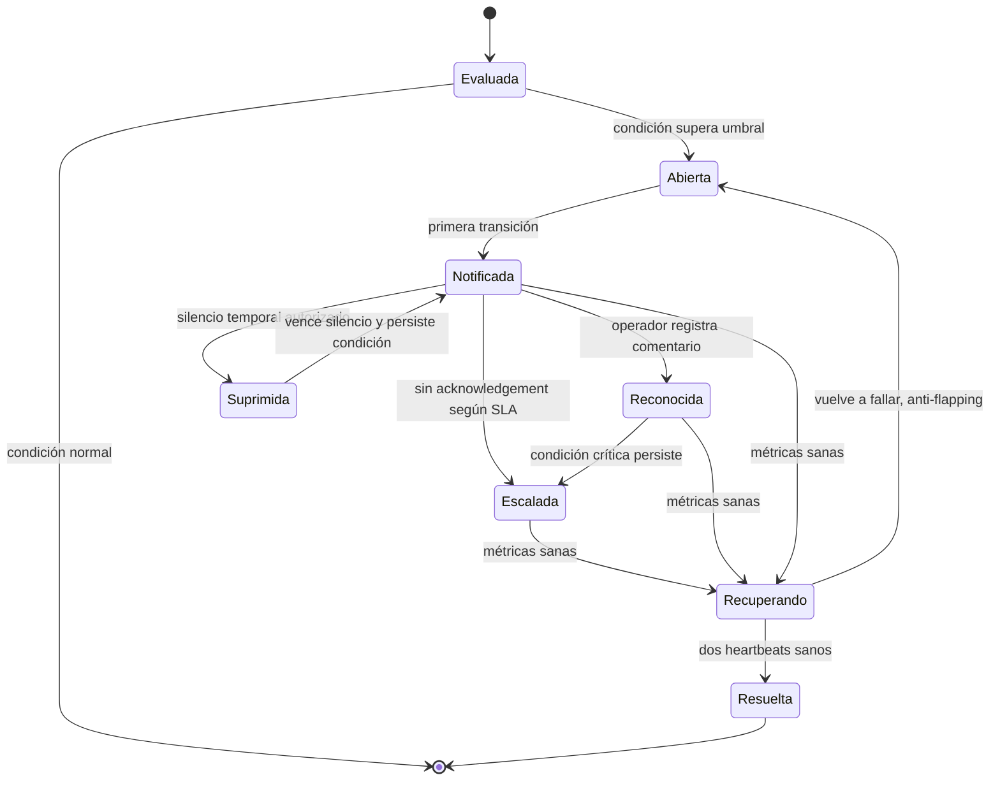

# Plan detallado 05: Panel administrativo y operación de flota

> **Estado:** plan de implementación V3.
>
> **Ámbito:** `services/central-api`, bajo la ruta privada `/admin`.
>
> **Fuentes:** `plan.md`, `.research/04-auth-admin-config.md` y los contratos de `plans/00`, `02`, `03` y `04`.

---

## 1. Objetivo y alcance

El panel V3 es la consola operativa interna de MrBot.

No es una segunda API pública.

No ejecuta bots.

No se comunica con el worker por imports Python ni por un singleton local.

Opera siempre contra el plano de control de `central-api`.

Sus objetivos son:

1. Administrar identidades de clientes, planes, claves API y créditos.
2. Observar y operar la cola persistente de jobs.
3. Dar visibilidad accionable de toda la flota de workers, requisito R11.
4. Operar suscripciones, pagos y conciliación sin alterar el ledger histórico.
5. Ofrecer informes exportables con datos autorizados y paginados.
6. Producir una auditoría completa, append-only y consultable.
7. Proteger secretos, credenciales fiscales, PII y diagnósticos internos.

El panel será responsabilidad de `central-api` porque este servicio es dueño de:

- `users`, `api_keys`, `admin_users`, `jobs`, `workers` y `audit_log`.
- la asignación de jobs y el estado de la cola.
- la facturación, los períodos de suscripción y los ledgers.
- la clave privada RSA y las autorizaciones efímeras de artefactos.

Quedan fuera de alcance de la primera entrega:

- una app móvil de operadores.
- administración de infraestructura a nivel de host.
- ejecución manual arbitraria de SQL.
- visualización rutinaria de secretos o credenciales fiscales.
- un reemplazo de Grafana, Prometheus o el agregador de logs.
- automatización de cobros distinta de la definida en `plans/04-billing/plan.md`.

### 1.1 Principios no negociables

| Principio | Decisión del panel |
|---|---|
| Fuente de verdad | Lee y modifica solo mediante servicios transaccionales de `central-api`. |
| Aislamiento | Ninguna ruta `/admin` pertenece al contrato público ni aparece en OpenAPI pública. |
| Identidad | Cada operador tiene una cuenta individual en `admin_users`. |
| Mínimo privilegio | Las acciones se autorizan por rol y permiso, no por conocer una contraseña global. |
| Trazabilidad | Todo acceso administrativo relevante y todo cambio escribe un evento de auditoría. |
| Secretos | Nunca se renderizan valores de claves API, contraseñas fiscales, tokens ni URLs firmadas persistentes. |
| Errores | Los diagnósticos internos se reservan al panel autorizado, en cumplimiento de SEC-1 para clientes. |
| Idempotencia | Operaciones repetibles, como reencolar o conciliar, usan clave de operación y estado explícito. |
| Accesibilidad | HTML semántico, foco visible, formularios etiquetados y acciones confirmables. |
| Seguridad de navegador | CSRF, CSP, cookies `Secure`, `HttpOnly`, `SameSite` y validación estricta de origen. |

### 1.2 Roles iniciales

| Rol | Permisos principales | Restricción explícita |
|---|---|---|
| `admin_supervisor` | Usuarios, jobs, flota, auditoría, billing y exportaciones | No lee secretos sin flujo break-glass. |
| `admin_soporte` | Consultar usuarios, jobs, resultados saneados y artefactos | No cambia créditos, planes ni pagos. |
| `admin_operaciones` | Flota, jobs, drenaje, cancelación y reintentos | No gestiona claves API ni facturación. |
| `admin_finanzas` | Planes, pagos, conciliación, créditos y reportes de ingreso | No ve payloads de jobs ni diagnósticos técnicos. |
| `admin_auditor` | Lectura de auditoría y reportes autorizados | No muta recursos. |

La primera versión puede implementar estos roles como conjuntos fijos de permisos.

La tabla debe permitir extenderlos a permisos granulares sin migrar el modelo de sesión.

Toda denegación se audita cuando corresponde a una operación sensible.

---

## 2. Qué existe en V2 y qué se conserva

La V2 implementa el panel en `app/api/routes/admin.py`.

El archivo tiene 1.630 líneas.

Usa rutas FastAPI con prefijo `/admin`.

Está excluido de OpenAPI.

Renderiza HTML con Jinja2 desde `app/templates/admin/`.

Las plantillas existentes son:

- `base.html`.
- `login.html`.
- `users.html`.
- `jobs.html`.
- `tables.html`.
- `reporting.html`.

La navegación V2 contiene Usuarios, Tablas, Jobs, Reporting y cerrar sesión.

El patrón de herencia de plantillas Jinja se conserva.

El contrato de datos, autenticación y acciones cambia de forma sustancial.

### 2.1 Inventario de capacidades V2

| Capacidad V2 | Evidencia | Clasificación V3 | Decisión concreta |
|---|---|---|---|
| Prefijo `/admin` fuera de OpenAPI | Router V2 y plantilla base | **Se conserva** | Montar router privado bajo `central-api` y excluirlo del esquema público. |
| HTML Jinja renderizado en servidor | `Jinja2Templates`, seis templates | **Se conserva y rediseña** | Mantener SSR, componentes parciales y formularios seguros. |
| Formulario de login | `GET /admin`, `POST /admin/login` | **Se rediseña** | Sustituir credencial global por `admin_users`, contraseña hash, sesión y MFA. |
| Logout | `POST /admin/logout` | **Se conserva** | Revocar sesión persistida y cookie, no solo borrar la cookie. |
| Búsqueda de usuarios | `GET /admin/users` | **Se conserva** | Buscar por UUID, email, estado y plan con paginación. |
| Alta de usuario | `POST /admin/users/create` | **Se conserva y rediseña** | Crear usuario, suscripción inicial y evento auditado. |
| Habilitar o deshabilitar usuarios | Toggle individual y masivo | **Se conserva** | Mantener operaciones unitarias y masivas con motivo y confirmación. |
| Generar o cargar clave API | Alta V2 | **Se rediseña** | Emitir credencial solo una vez, guardar verificador HMAC y prefijo. |
| Rotar clave API | `POST /admin/users/{id}/api-key` | **Se conserva** | Crear una nueva fila `api_keys`, revocar la anterior y auditar. |
| Límite mensual por usuario | `monthly-limit` | **Se descarta como modelo** | Reemplazar por plan, período de suscripción, cuota y ledger. |
| Explorador genérico de tablas | `GET /admin/tables` | **Se descarta** | Reemplazar por vistas de recursos con campos permitidos y paginación. |
| Mostrar columnas fiscales crudas | Excepción deliberada V2 | **Se descarta** | Nunca renderizar credenciales. Solo metadatos enmascarados y break-glass excepcional. |
| Borrar todos los logs | `clear-consulta-logs` | **Se rediseña** | Aplicar políticas de retención por entidad, aprobación y job de purga auditado. |
| Purgar logs por antigüedad | `purge-consulta-logs` | **Se conserva y rediseña** | Definir retención por clase, previsualizar impacto y ejecutar asincrónicamente. |
| Lista de jobs | `GET /admin/jobs` | **Se conserva** | Vista central con cola, ejecución, historial, asignación y eventos. |
| Cancelar job | `/admin/jobs/{job_id}/cancel` | **Se rediseña** | Enviar comando durable al worker por la central y mostrar acuse. |
| Cancelación masiva | `bulk_cancel` | **Se conserva y restringe** | Selección paginada, límite, motivo obligatorio y resumen de resultados. |
| Purga de historial de jobs | `POST /admin/jobs/purge` | **Se rediseña** | Retención configurable, legal hold y borrado por proceso programado. |
| Métricas de cola | `/admin/jobs/metrics` | **Se conserva y amplía** | Combinar métricas de DB con observabilidad de flota y backend de métricas. |
| Worker ID en grilla de jobs | Plantilla `jobs.html` | **Se conserva** | Mostrar worker, versión, intento y razón de reasignación. |
| Reporting `resumen` | `reporte/query_resumen.sql` | **Se rediseña** | Convertir a consultas versionadas sobre el modelo unificado V3. |
| Reporting `desglose_cuit` | `reporte/query_desglose_cuit.sql` | **Se rediseña** | Mantener desglose autorizado, sin exponer credenciales ni datos innecesarios. |
| Exportación CSV | `/admin/reporting/download` | **Se conserva** | Exportación asíncrona, auditada, con URL temporal y límite de filas. |
| Auditoría de acceso fiscal | `admin_fiscal_credential_audits` | **Se generaliza** | Reemplazar por `audit_log` append-only para toda operación administrativa. |
| Billing y MercadoPago | No existe en V2 | **Es nuevo** | Integrar la operación definida por el plan 04. |
| Dashboard de workers | No existe como página propia | **Es nuevo** | Crear página, alertas y acciones de drenaje, R11. |
| Sesiones y dispositivos | No existe | **Es nuevo** | Inventario, revocación y caducidad de sesiones administrativas. |
| MFA y recuperación | No existe | **Es nuevo** | TOTP o WebAuthn, códigos de recuperación cifrados y flujo de soporte auditado. |

### 2.2 Decisiones de compatibilidad

La V3 no intenta conservar URL por URL de V2.

Se preservan los resultados operativos que los equipos utilizan.

No se preservan interfaces que habilitan fuga de secretos o acoplamiento monolítico.

La ruta V2 `/admin/legacy` no se replica.

Durante la migración se mostrará un enlace de solo lectura a documentación histórica si es necesario.

La tabla V2 `admin_fiscal_credential_audits` se preserva en el esquema `legacy` de solo lectura.

Su semántica se transforma en entradas nuevas de `audit_log` solo para acciones ocurridas en V3.

Los 28 conjuntos de `consulta_*_logs` no se exponen por reflexión SQL.

Los datos históricos se consultan mediante una vista limitada y solo con el permiso `legacy.read`.

---

## 3. Autenticación del administrador

### 3.1 Problema V2

V2 configura una sola pareja `ADMIN_USERNAME` y `ADMIN_PASSWORD` por entorno.

La comparación usa `secrets.compare_digest`.

El panel acepta HTTP Basic o una cookie firmada manualmente.

La cookie dura ocho horas.

El secreto de sesión puede derivar de la propia contraseña administrativa.

La identidad no puede deshabilitarse individualmente.

No existe MFA, inventario de sesiones, rol ni auditoría de inicio de sesión completa.

Una contraseña comprometida representa acceso total sin atribución individual.

HTTP Basic no debe mantenerse para el navegador V3.

### 3.2 Modelo V3

`admin_users` es una tabla de principales administrativos.

Cada fila usa UUIDv7 para su PK, salvo que el plan de base defina un identificador distinto de administración.

El email se normaliza y es único.

La contraseña se almacena como hash Argon2id.

Nunca se almacena ni se registra una contraseña en claro.

La tabla mínima es:

| Columna | Uso |
|---|---|
| `id` | Identidad inmutable del administrador. |
| `email` | Login único, normalizado. |
| `display_name` | Nombre visible en auditoría y panel. |
| `password_hash` | Argon2id con parámetros revisables. |
| `role` | Rol fijo inicial o relación con permisos. |
| `enabled` | Revocación inmediata del acceso. |
| `mfa_secret_encrypted` | Secreto TOTP cifrado con KMS, si se usa TOTP. |
| `mfa_enrolled_at` | Evidencia de enrolamiento. |
| `last_login_at` | Metadato operativo, no sustituto de auditoría. |
| `failed_login_count` | Protección contra fuerza bruta. |
| `locked_until` | Bloqueo temporal. |
| `password_changed_at` | Invalidación de sesiones antiguas. |
| `created_by_admin_id` | Relación al evento de alta. |

La tabla `admin_sessions` persiste sesiones revocables.

Una sesión contiene identificador aleatorio de alta entropía almacenado como hash.

También guarda `admin_user_id`, emisión, expiración, última actividad, IP inicial, user agent resumido y `revoked_at`.

La cookie contiene solo el identificador opaco de sesión firmado.

La cookie se configura con `HttpOnly`, `Secure`, `SameSite=Lax`, `Path=/admin` y expiración acotada.

En producción no hay excepción para `Secure=false`.

### 3.3 MFA y política de acceso

MFA será obligatorio para `admin_supervisor`, `admin_operaciones` y `admin_finanzas`.

La primera implementación recomendada es TOTP con una clave protegida por KMS.

La evolución preferible es WebAuthn con llave física o passkey.

Los códigos de recuperación se muestran una vez, se almacenan como hashes y se invalidan al usar.

La autenticación exige:

1. Email y contraseña válidos.
2. Cuenta habilitada y no bloqueada.
3. Segundo factor si el rol lo requiere.
4. Creación de sesión nueva y registro del evento.
5. Rotación del identificador de sesión al autenticar o elevar privilegio.

Se aplican límite por IP y por cuenta.

Después de cinco fallos se aplica retardo progresivo.

Después de diez fallos se bloquea temporalmente y se alerta a operaciones.

No se revela si el email existe.

El logout revoca la sesión del servidor.

El panel permite revocar una sesión, todas las sesiones propias o todas las sesiones de otro administrador con permiso apropiado.

### 3.4 Migración desde la credencial compartida

| Paso | Acción | Resultado verificable |
|---|---|---|
| 1 | Inventariar quién conoce la pareja V2 sin registrar la contraseña. | Lista de propietarios y fecha de retiro. |
| 2 | Crear migración de `admin_users`, roles, sesiones y auditoría. | Esquema V3 disponible. |
| 3 | Crear al menos dos cuentas nominales de supervisor con MFA. | No hay dependencia operativa de una sola persona. |
| 4 | Entregar códigos de recuperación por canal seguro. | Operadores pueden recuperar acceso bajo proceso aprobado. |
| 5 | Activar login V3 y verificar auditoría de éxito, fallo y MFA. | Eventos correlacionables por request ID. |
| 6 | Deshabilitar Basic y el fallback de `ADMIN_SESSION_SECRET`. | Las rutas V3 rechazan Basic. |
| 7 | Retirar `ADMIN_USERNAME` y `ADMIN_PASSWORD` del despliegue. | El validador de configuración los rechaza como variables desconocidas. |
| 8 | Rotar la contraseña V2 y eliminar su secreto al retirar V2. | No queda credencial compartida utilizable. |

No se migra la contraseña V2 a un hash V3.

Su valor compartido no identifica a una persona y no debe perpetuarse.

Las cuentas nominales se aprovisionan con enlaces de activación de un solo uso o ceremonia presencial.

---

## 4. Observabilidad de la flota de workers, R11

### 4.1 Fuente de datos y estados

La central registra cada worker y recibe heartbeats autenticados.

El worker no consulta PostgreSQL.

La central persiste el último heartbeat y calcula el estado visible.

El panel consulta `workers`, `worker_heartbeats`, `jobs` y el backend de métricas.

El estado no depende de una sola métrica aislada.

| Estado | Regla de entrada | Efecto del scheduler | Acción visible |
|---|---|---|---|
| `SANO` | Heartbeat fresco, capacidad disponible, error bajo | Puede recibir trabajos | Verde. |
| `SATURADO` | Heartbeat fresco y `running >= capacity` o cola local alta | No recibe más hasta liberar capacidad | Ámbar. |
| `DEGRADADO` | Heartbeat fresco con error alto, browser unhealthy o latencia elevada | Penalizar o dejar de asignar según política | Naranja. |
| `CAIDO` | Heartbeat vencido o readiness fallida confirmada | No recibe trabajos, jobs en vuelo se recuperan | Rojo, alerta activa. |
| `DRENANDO` | Comando de drain confirmado | No recibe trabajos nuevos | Azul, contador de trabajos restantes. |
| `RETIRADO` | Baja explícita y sin jobs en vuelo | Nunca recibe trabajos | Gris, conservado para auditoría. |

`capacity` es el máximo anunciado por el worker y no puede superar cinco.

La V3 fija `MAX_CONCURRENT_JOBS=5` por worker, invariante W-2.

Un heartbeat inválido, de protocolo incompatible o con capacidad mayor a cinco se rechaza y se audita.

### 4.2 Dashboard de flota

La página `GET /admin/workers` presenta una tabla paginada y actualizable por SSE autenticado.

La actualización periódica por polling queda como fallback.

La vista no expone IP privada, token del worker, rutas locales ni trazas.

| Columna requerida | Origen | Presentación |
|---|---|---|
| Worker | `workers.id` y nombre lógico | Identificador corto copiable, sin secreto. |
| Estado | Máquina de estados de central | Badge con color, texto y tooltip de regla. |
| Capacidad | Heartbeat registrado | `ejecutando / capacidad`, máximo 5. |
| Jobs en ejecución | Heartbeat y asignaciones activas | Número y enlace filtrado a jobs. |
| Jobs en cola | Heartbeat | Número del backlog local declarado. |
| Último heartbeat | `last_heartbeat_at` | Tiempo relativo y timestamp UTC. |
| Versión de imagen | Etiqueta o digest reportado | Tag legible más digest truncado. |
| Versión de protocolo | `mrbot-contracts` | Compatible, pendiente de upgrade o incompatible. |
| Bots soportados | Manifiesto firmado | Chips, conteo y enlace al catálogo. |
| Tasa de error | Ventana móvil de 15 minutos | Porcentaje, numerador y muestra. |
| Uptime | Inicio de proceso reportado | Duración y reinicios recientes. |

La vista detallada `GET /admin/workers/{worker_id}` agrega:

- historia de heartbeats y cambios de estado.
- asignaciones activas y últimos jobs terminales.
- intentos, reencolados por pérdida de worker y razones.
- memoria, CPU, PID y salud de pool de browser, como métricas agregadas.
- compatibilidad de manifiesto de bots y protocolo.
- últimos errores saneados y enlace restringido al diagnóstico.
- alertas activas, reconocimientos y línea de tiempo.
- acciones permitidas por rol: drenar, retirar, silenciar una alerta y abrir incidente.

No se ofrece botón de reinicio de contenedor desde la aplicación.

Ese control pertenece al plano de infraestructura.

### 4.3 Umbrales de alerta

El detector corre en `central-api` como tarea líder transaccional o job único protegido por lock.

Se evalúa cada diez segundos.

| Condición | Umbral inicial | Severidad | Recuperación |
|---|---|---|---|
| Heartbeat atrasado | 30 s, equivalente a tres intervalos de 10 s | Advertencia | Heartbeat válido posterior. |
| Worker caído | 60 s sin heartbeat | Crítica | Dos heartbeats válidos consecutivos. |
| Todos los workers de un bot caídos | Ningún `SANO` compatible durante 60 s | Crítica | Un worker compatible sano. |
| Saturación | `running / capacity >= 100%` por 5 min | Advertencia | Menor a 80% durante 2 min. |
| Error elevado | Más de 20% y al menos 10 jobs en 15 min | Advertencia | Menor a 10% en ventana siguiente. |
| Error crítico | Más de 50% y al menos 10 jobs en 15 min | Crítica | Menor a 20% en dos ventanas. |
| Reinicios | Tres o más en 15 min | Advertencia | Sin reinicio durante 30 min. |
| Incompatibilidad | Protocolo no soportado | Crítica | Registro con versión compatible. |
| Drenaje atascado | Jobs en vuelo tras `DRAIN_TIMEOUT` | Crítica | Cero jobs en vuelo o reencolado confirmado. |

Los valores son configuración versionada de operaciones.

No son constantes ocultas en la plantilla.

Un cambio de umbral exige auditoría y motivo.

### 4.4 Canales de notificación

| Canal | Uso | Destinatarios | Propiedades |
|---|---|---|---|
| Banner del panel | Toda alerta abierta relevante | Todo administrador autenticado con permiso de flota | Persistente, priorizado y enlazado al incidente. |
| Email SMTP | Advertencias sostenidas y alertas críticas | Guardias y grupo de operaciones | Usa SMTP central V2 evolucionado, outbox y reintento. |
| Webhook | Integración con incidentes o chatops | Endpoint configurado por operaciones | HMAC, timeout, reintentos y payload mínimo. |

El email usa `SMTP_SERVER`, `SMTP_PORT`, `SMTP_USER`, `SMTP_PASSWORD` y TLS desde el servicio central.

El worker no recibe ningún secreto SMTP.

El webhook contiene ID de alerta, severidad, worker, estado, timestamp y URL administrativa.

No contiene credenciales, payload de job ni diagnóstico sensible.

### 4.5 Deduplificación y anti-flapping

Una alerta se identifica por `(tipo, worker_id o bot_key, condición activa)`.

Mientras está abierta, los eventos repetidos incrementan un contador y actualizan `last_seen_at`.

No crean una alerta nueva.

La primera transición a crítica notifica inmediatamente.

Las repeticiones de la misma alerta se resumen como máximo cada 30 minutos.

La recuperación notifica una única vez si se había enviado una notificación inicial.

Una condición recuperada debe permanecer sana dos heartbeats para cerrar el incidente.

Una condición que alterna antes de esa ventana se mantiene abierta.

Tras tres ciclos de flapping en 15 minutos se aumenta la severidad y se exige revisión.

El silencio manual tiene vencimiento máximo de 4 horas.

Silenciar evita canales externos, nunca oculta el banner a supervisores ni elimina la auditoría.

### 4.6 Escalamiento y acknowledgement

| Momento | Acción |
|---|---|
| T0 | Crear alerta, banner y notificación por severidad. |
| T+5 min crítica sin reconocimiento | Reenviar email y webhook a la guardia primaria. |
| T+15 min crítica sin reconocimiento | Escalar a supervisor de operaciones. |
| T+30 min sin recuperación | Abrir o actualizar incidente externo y enviar resumen periódico. |
| Recuperación | Marcar resuelta automáticamente, preservar historia y enviar una notificación. |

Reconocer una alerta requiere un comentario.

El reconocimiento no cambia el estado técnico.

Solo confirma que un responsable la vio.

El panel muestra quién reconoció, cuándo y qué medida declaró.

Cerrar manualmente una alerta técnica solo está permitido si se añade una excepción documentada.

### 4.7 Ciclo de vida de alerta

---

## 5. Gestión de jobs

### 5.1 Vistas

| Vista | Filtros | Datos principales |
|---|---|---|
| Cola pendiente | Bot, usuario, edad, prioridad, intento | `job_id`, espera, reserva de consumo, razón de bloqueo. |
| Jobs en ejecución | Worker, bot, usuario, duración | Worker asignado, progreso, lease, intentos y cancelación. |
| Historial | Rango, estado, bot, usuario, worker, correlación | Resultado saneado, timings, consumo y razón terminal. |
| Detalle | `job_id` UUIDv7 | Eventos, artefactos, resultado, auditoría y diagnóstico restringido. |

La consulta se pagina por cursor y orden estable.

No se cargan payloads JSONB completos en la grilla.

Las búsquedas de UUID deben validar formato antes de consultar.

Los estados se toman de la máquina de estados común, no de textos de plantilla.

### 5.2 Acciones

| Acción | Regla | Resultado visible |
|---|---|---|
| Cancelar | Permitida si no es terminal y el rol autoriza | Solicitud `PENDIENTE`, `ACEPTADA`, `RECHAZADA` o `COMPLETADA`. |
| Reencolar fallido | Solo estados reintentables y antes de máximo de intentos | Nuevo intento relacionado, sin duplicar consumo. |
| Reintentar artefacto | Solo si la ejecución terminó y falla una transferencia recuperable | Evento de artefacto separado. |
| Priorizar | Solo operaciones y dentro de cuotas de usuario | Cambio auditado de prioridad. |
| Drenar worker | Bloquea asignaciones nuevas al worker | Estado `DRENANDO` y contador restante. |

Cancelar no invoca una función local como `worker_manager.cancel_running()` de V2.

La central persiste un comando de control con ID.

El worker lo obtiene o recibe por su canal autenticado.

El worker responde con acuse y resultado.

Si un worker cae, W-4 reencola trabajos de forma automática según contrato del scheduler.

La acción manual nunca debe ser la única recuperación de disponibilidad.

### 5.3 Resultados, artefactos y diagnóstico

El resultado público y el administrativo normal comparten la capa de saneamiento SEC-1.

La vista normal muestra código público, mensaje seguro, correlación y resultado funcional.

Los artefactos se listan por nombre lógico, tamaño, tipo, checksum y estado.

La descarga se realiza con URL prefirmada corta emitida al hacer clic.

La URL no se almacena en HTML, DB de auditoría ni logs.

El modo diagnóstico exige permiso `jobs.diagnostics.read`.

Muestra categoría interna, componente, versión, selector o traza solo cuando la política lo permite.

Nunca muestra contraseña fiscal, token, cookie, clave API, URL con credenciales ni contenido sensible del request.

Abrir diagnóstico genera una entrada de `audit_log`.

---

## 6. Gestión de usuarios

La gestión se apoya en el modelo de identidad y billing V3.

`users.id` es UUIDv4 conforme I-1.

Las auditorías y entidades operativas utilizan UUIDv7 donde corresponda.

### 6.1 Operaciones

| Operación | Validación | Auditoría obligatoria |
|---|---|---|
| Alta | Email normalizado único, API key fija o generada, estado inicial, consentimiento y plan inicial | Actor, usuario, plan, estado, prefijo de clave, origen, resultado. |
| Baja lógica | Confirmación y motivo, sin borrar ledger | Actor, usuario, motivo, resultado. |
| Habilitar | Verificar que no haya bloqueo legal o de fraude | Actor, transición y motivo. |
| Deshabilitar | Requiere motivo, revoca claves y bloquea nuevos jobs | Actor, impacto y resultado. |
| Ver consumo | Período, bot y fuente de ledger | Acceso si contiene datos financieros sensibles. |
| Emitir API key | Permiso, etiqueta, scopes y expiración | Emisión, prefijo, nunca valor. |
| Rotar API key | Revocar predecesora según período de gracia | IDs de claves, razón y resultado. |
| Asignar plan | Validar catálogo y efecto a próximo período o inmediato | Plan anterior, nuevo, fecha efectiva. |
| Ajustar créditos | Motivo obligatorio, autorización financiera | Delta, saldo previo/posterior, razón y referencia. |

La clave API se revela una única vez en una página que prohíbe caché.

El operador debe confirmar recepción antes de abandonar el flujo.

El alta integrada acepta `api_key` opcional, `estado` y `enviar_credenciales`.
Los alias `habilitado` y `send_api_key_email` conservan compatibilidad con el
formulario administrativo de V1/V2. El envío usa SMTP STARTTLS desde
`central-api`; si no está configurado o falla, la creación no se revierte y el
resultado informa que el operador debe entregar la clave manualmente.

La interfaz nunca lista valores de claves existentes.

Muestra prefijo, fecha de emisión, última utilización, scopes, expiración y estado de revocación.

Los ajustes de crédito son entradas compensatorias en `credit_ledger`.

No se actualiza un saldo de manera opaca.

Toda operación exige un campo de razón de 10 a 500 caracteres.

La razón se escapa y se registra inmutablemente.

---

## 7. Suscripciones y cobros en el panel

El panel administrativo no implementa lógica de cobro paralela.

Consume los servicios y estados descritos en `plans/04-billing/plan.md`.

### 7.1 Vista de cuenta comercial

Para cada usuario muestra:

- plan actual, estado de suscripción y período vigente.
- cuota de período, uso reservado, confirmado y disponible.
- saldo de créditos y últimas entradas del ledger.
- fuente de alta, precio, moneda y próxima renovación si aplica.
- historial de pagos y eventos de MercadoPago.
- discrepancias de conciliación y estado de investigación.

| Acción | Regla de negocio |
|---|---|
| Cambiar plan | Define prorrateo y fecha efectiva mediante billing. |
| Suspender suscripción | No elimina pagos ni ledger. |
| Aplicar crédito manual | Entrada compensatoria con motivo, actor y autorización. |
| Reprocesar webhook | Solo por ID, idempotente y con trazabilidad. |
| Conciliar pago | Compara proveedor, `payments` y `payment_events`, sin editar el evento origen. |
| Marcar discrepancia | Crea caso operativo con dueño, nota y SLA. |

### 7.2 Conciliación MercadoPago

La conciliación lista el identificador externo, importe, moneda, estado del proveedor, estado local, timestamps y motivo de diferencia.

El panel no acepta que un operador pegue un webhook no verificado.

La recuperación usa una consulta autenticada al proveedor desde el servicio de billing.

La modificación de estado genera un evento compensatorio o de reconciliación.

No se sobrescribe el hecho original.

Las discrepancias posibles incluyen pago externo ausente, webhook duplicado, monto distinto, moneda distinta, pago revertido y plan no aplicado.

La exportación financiera exige el permiso específico y queda auditada.

---

## 8. Auditoría

### 8.1 Modelo `audit_log`

`audit_log` reemplaza y generaliza el buen patrón de V2 `admin_fiscal_credential_audits`.

Es append-only.

La cuenta de aplicación no tiene permiso `UPDATE` ni `DELETE` sobre sus eventos ya insertados.

La retención y exportación se controlan por política.

| Campo | Responde a | Ejemplo de uso |
|---|---|---|
| `id` | Identidad del evento | UUIDv7. |
| `occurred_at` | Cuándo | UTC generado por servidor. |
| `actor_type`, `actor_id` | Quién | `admin_user` y UUID del operador. |
| `action` | Qué | `user.api_key.rotated`. |
| `target_type`, `target_id` | Sobre qué | `job`, `worker`, `user`, `payment` o `credential`. |
| `request_id` | Correlación | Une UI, API y logs. |
| `remote_addr` | Desde dónde | IP normalizada tras proxy confiable. |
| `user_agent` | Desde dónde | Resumen con límite de tamaño. |
| `result` | Resultado | `success`, `denied`, `failed`, `accepted`. |
| `reason` | Justificación | Obligatoria para cambios sensibles. |
| `metadata_redacted` | Contexto | JSON sin secretos ni payload fiscal. |

Toda acción administrativa registra quién, qué, cuándo, sobre qué, desde dónde y el resultado.

Los fallos de validación relevantes también se registran.

Las lecturas sensibles se registran, no solo las escrituras.

### 8.2 Acciones auditadas

| Categoría | Eventos mínimos |
|---|---|
| Autenticación | Login exitoso, fallido, MFA fallido, bloqueo, logout, revocación de sesión. |
| Administración | Alta, baja, habilitación, plan, clave API, crédito y cambios de rol. |
| Jobs | Consulta de diagnóstico, cancelación, reencolado, prioridad y exportación. |
| Flota | Drenaje, retiro, reconocimiento, silencio y cambio de umbral. |
| Billing | Conciliación, ajuste, reproceso, exportación financiera y discrepancia. |
| Datos sensibles | Lectura de credencial fiscal, solicitud break-glass y descarga de artefacto sensible. |

Leer una credencial fiscal es en sí mismo un evento auditado.

La política normal es que el panel no permite esa lectura.

Si un caso legal excepcional exige recuperación, se requiere:

1. Permiso `fiscal_credentials.break_glass`.
2. Razón y ticket externo obligatorios.
3. Aprobación de segundo administrador cuando sea técnicamente posible.
4. Revelado temporal, enmascarado por defecto y sin inclusión en exportaciones.
5. Evento de apertura y evento de cierre con actor, motivo y resultado.

No existe una vista equivalente al explorador V2 que revele `clave`, `clave_representante`, `contrasena` o `clave_encriptada`.

---

## 9. Reporting

V2 tiene una página de reportes por intervalo de fechas.

Ejecuta consultas fijas, no SQL introducido por el usuario.

Las consultas son `reporte/query_resumen.sql` y `reporte/query_desglose_cuit.sql`.

Ofrece vista previa limitada y CSV.

La propiedad importante que se conserva es el catálogo fijo de consultas.

La V3 no entrega una consola SQL administrativa.

### 9.1 Catálogo V3

| Informe | Dimensiones | Métricas |
|---|---|---|
| Consumo por usuario | Usuario, plan, período, bot | Jobs reservados, completados, créditos y cuota. |
| Consumo por bot | Bot, operación, versión, período | Jobs, artefactos, costo y consumo. |
| Éxito por bot | Bot, versión, worker, período | Completos, fallidos, cancelados y tasa de éxito. |
| Duración por bot | Bot, operación y versión | Media, p50, p95, p99 y tiempo de cola. |
| Ingresos | Plan, período, moneda, estado de pago | Cobrado, reembolsado, pendiente y neto. |
| Salud de flota | Worker, imagen, bot y período | Uptime, errores, saturación y alertas. |

Cada informe tiene una consulta versionada, tests de autorización y un contrato de columnas.

Las fechas se interpretan en UTC y se muestran con zona seleccionada explícitamente.

La previsualización se limita a 200 filas.

Las exportaciones grandes se generan como job administrativo.

El archivo queda en object storage con URL prefirmada de corto plazo.

Cada descarga genera auditoría.

Los filtros se validan contra valores permitidos.

Nunca se interpolan fragmentos SQL desde parámetros HTTP.

---

## 10. Implementación

### 10.1 Decisión de interfaz

Se recomienda Jinja server-rendered dentro de `central-api`.

No se recomienda una SPA separada para la primera V3.

| Criterio | Jinja SSR recomendado | SPA separada |
|---|---|---|
| V2 existente | Reutiliza conocimiento, navegación y templates | Exige reescritura completa. |
| Seguridad | Sesión cookie y CSRF centralizados en un backend | Añade CORS, tokenización y superficie de API administrativa. |
| Operación | Un despliegue y un log correlacionado | Dos artefactos, versión y hosting adicional. |
| Necesidad de tiempo real | SSE autenticado o polling parcial es suficiente | WebSocket y estado cliente añaden complejidad. |
| Formularios | Validación servidor y redirección segura | Duplicación de validación y gestión de estados. |

Las páginas reutilizan base Jinja y componentes de tabla.

Se puede usar HTMX de forma acotada para filtros, confirmaciones y refresco parcial.

No se permite que HTMX se convierta en una API pública no documentada.

### 10.2 Montaje y separación

`services/central-api/app/admin/router.py` monta el router bajo `/admin`.

Las rutas se excluyen de OpenAPI pública.

Un subdominio `admin.<dominio>` es preferible en producción.

El proxy aplica allowlist de IP o VPN cuando sea viable.

La API pública permanece bajo `/api/v3`.

Las rutas internas worker-central permanecen bajo `/internal/v1` y no son navegables públicamente.

No se comparte middleware de autenticación de API key con el panel.

### 10.3 Protección CSRF y sesiones

Todo método mutante exige token CSRF ligado a la sesión y verificación de origen.

Los tokens se rotan al login y al cambio de contraseña.

Las respuestas de formularios usan PRG, POST-Redirect-GET.

Los destinos de retorno se generan en servidor desde rutas permitidas.

No se confía en `Referer` para seleccionar una URL de redirección.

Se configura CSP estricta sin scripts inline salvo nonce controlado.

Se envían HSTS, `X-Content-Type-Options: nosniff` y `Referrer-Policy: same-origin`.

Las vistas sensibles configuran `Cache-Control: no-store`.

### 10.4 Secuencia de entrega

1. Crear esquema de administradores, sesiones, permisos y `audit_log`.
2. Implementar autenticación, MFA, CSRF y layout Jinja.
3. Migrar vistas de usuarios y claves API sobre los servicios V3.
4. Implementar lista, detalle y comandos durables de jobs.
5. Implementar registro de workers, dashboard, detector y alertas R11.
6. Integrar billing y conciliación usando el contrato de plan 04.
7. Implementar reportes y exportaciones asincrónicas.
8. Añadir tests de autorización, CSRF, secreto no expuesto, auditoría y anti-flapping.

---

## 11. Criterios de aceptación

1. El router `/admin` está excluido de OpenAPI pública y no responde a API keys de cliente.
2. No existen `ADMIN_USERNAME` ni `ADMIN_PASSWORD` como mecanismo de login V3.
3. Cada administrador inicia sesión con una fila habilitable de `admin_users` y contraseña Argon2id.
4. Los roles privilegiados requieren MFA y los códigos de recuperación nunca se almacenan en claro.
5. La cookie de sesión es opaca, `HttpOnly`, `Secure`, `SameSite=Lax`, revocable y limitada a `/admin`.
6. Todo POST, PUT, PATCH o DELETE administrativo falla sin CSRF válido y origen permitido.
7. El panel lista usuarios por UUIDv4, email, estado y plan con paginación.
8. Emitir o rotar una API key la muestra una vez y auditoría no contiene su valor.
9. Ajustar créditos exige razón, crea una entrada de ledger y registra actor, saldo previo y posterior.
10. La vista de jobs distingue pendiente, ejecutando, terminal y cancelación solicitada.
11. Cancelar un job usa un comando durable y muestra acuse del worker o timeout controlado.
12. Reencolar un job fallido no duplica un consumo confirmado ni supera el máximo de intentos.
13. El modo diagnóstico está separado del resultado público y jamás se entrega por `/api/v3` al cliente.
14. La tabla de workers muestra estado, capacidad, jobs ejecutando, cola, heartbeat, imagen, protocolo, bots, error y uptime.
15. Un worker sin heartbeat durante 60 segundos pasa a `CAIDO`, deja de recibir asignaciones y dispara alerta crítica.
16. Una alerta de worker muestra banner, usa SMTP central y puede emitir webhook HMAC sin datos sensibles.
17. El anti-flapping evita notificaciones repetidas de la misma alerta más de una vez por 30 minutos.
18. Reconocer una alerta exige comentario, registra al actor y no modifica el estado técnico.
19. Un worker en drenaje no recibe jobs nuevos y los jobs no terminados se recuperan conforme W-4.
20. No existe explorador genérico de base de datos ni renderizado rutinario de columnas de credenciales.
21. Toda lectura break-glass de credencial fiscal exige permiso, razón y evento de auditoría inmutable.
22. `audit_log` registra quién, qué, cuándo, sobre qué, desde dónde y resultado para toda acción administrativa sensible.
23. Los informes incluyen consumo por usuario y bot, éxito, duración, ingresos y exportación controlada.
24. La conciliación de MercadoPago es idempotente, preserva los eventos fuente y presenta discrepancias.
25. Las pruebas cubren MFA, sesión revocable, CSRF, RBAC, auditoría, SEC-1, jobs y ciclo completo de alertas.
