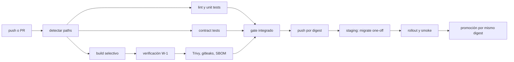

# Plan detallado 06: Infraestructura, imágenes y operación

> **Estado:** plan de implementación V3.
>
> **Fuentes:** `plan.md`, `.research/04-auth-admin-config.md`, `.research/05-bots-runtime.md` y `.research/06-docs-tests-history.md`.
>
> **Invariantes relevantes:** I-4, W-1, W-2, W-3, W-4, SEC-3.

---

## 1. Objetivo y alcance

Este plan convierte la V3 en dos servicios desplegables, observables y aislados:

- `central-api`, plano de control, API pública, panel, scheduler y único cliente PostgreSQL.
- `bot-worker`, plano de ejecución, API interna privada y runtime Playwright.

También define:

- construcción reproducible en monorepo.
- Compose para desarrollo y el primer despliegue en VPS.
- secretos por destinatario y mínima capacidad.
- migraciones seguras y desplegables con réplicas.
- CI/CD, escaneo, publicación por digest y rollback.
- observabilidad, backup, dimensionamiento y evolución hacia k3s más KEDA.

No es objetivo inicial:

- Kubernetes en la primera salida.
- Redis, service mesh o gRPC.
- alta disponibilidad de PostgreSQL.
- una imagen por bot.
- que el worker conozca PostgreSQL, modelos ORM o migraciones.

El resultado debe respetar:

1. Solo `central-api` posee `DATABASE_URL` y driver PostgreSQL.
2. La imagen worker no instala `psycopg`, SQLAlchemy ni Alembic.
3. Cada worker acepta solo control autenticado de la central.
4. Cada worker ejecuta como máximo cinco jobs concurrentes.
5. Todas las imágenes usan tags base y digests inmutables.
6. Los contenedores escriben logs estructurados a stdout, no a `./logs`.

---

## 2. Punto de partida real de la V2

La V2 está desplegada como un único Docker Compose.

Tiene una aplicación API y un contenedor `sqlite-web`.

No tiene una flota de workers separada.

No tiene PostgreSQL en su Compose real.

No tiene un runbook de producción, monitorización centralizada ni cron operativo documentado.

| Hecho V2 | Evidencia | Cambio V3 |
|---|---|---|
| Una API monolítica | Un contenedor `api-bots-mrbot` | Separar `central-api` y `bot-worker`. |
| SQLite | Bind mount `./data` | PostgreSQL 17 con volumen administrado. |
| Interfaz de DB sqlite-web | Segundo servicio en `127.0.0.1:5011` | Eliminar. Panel V3 con vistas autorizadas. |
| Imagen privada | `docker.abp.net.ar/abustosp/api-bots-mrbot-v2` | Dos repositorios o nombres V3, publicación por digest. |
| Base Playwright interna | `docker.abp.net.ar/abustosp/bb:py3.14.7-pw1.62-20260818` | Solo worker, fijada por digest. |
| `alembic upgrade head` en CMD | Dockerfile V2 | Job one-off previo al despliegue. |
| Bind `./data` | Compose V2 | Eliminar de aplicaciones. PostgreSQL usa volumen propio. |
| Bind `./logs` | Compose V2 | Eliminar. Logs JSON a stdout. |
| Bind `./mrbot-keys` RO | Compose V2 | Solo central y preferentemente KMS, jamás worker por defecto. |
| `init: true` | Compose V2 | Conservar en workers por procesos Chromium hijos. |
| Tags `latest` y timestamp | `build-and-push.sh` | Digest inmutable, SBOM y metadatos de versión. |
| Credencial de registry en README | `readme-registry.md` | Rotar ya, eliminar texto y usar secretos CI. |

### 2.1 Acciones de saneamiento antes del primer build V3

1. Rotar la credencial de registry expuesta en `readme-registry.md` de V2.
2. Invalidar cualquier copia local, token de CI o secreto de pull que dependa de ella.
3. Eliminar la credencial de toda documentación, ejemplos, imágenes y capas de Git.
4. Crear una cuenta de robot por CI con permisos mínimos de `push` para repositorios V3.
5. Crear una cuenta de pull de producción con permisos solo `pull`.
6. Confirmar que `.dockerignore`, `.gitignore` y el escaneo de secretos excluyen `.env`, PEM y archivos de claves.

La fecha de la rotación y el resultado se documentan en el runbook.

Nunca se vuelve a publicar un secreto real como ejemplo.

---

## 3. Estructura del monorepo y construcción

La estructura obligatoria proviene de `plan.md` sección 5.

```text
api-bots-mrbot-v3/
├── packages/
│   └── mrbot-contracts/
├── services/
│   ├── central-api/
│   └── bot-worker/
├── infra/
│   ├── compose/
│   └── postgres/
├── plans/
└── README.md
```

La regla de dependencia es unidireccional.

`services/*` puede depender de `packages/*`.

`packages/mrbot-contracts` no importa servicios.

`central-api` y `bot-worker` no se importan entre sí.

Se comunican por HTTP/JSON y esquemas versionados.

### 3.1 Unidades construibles

| Unidad | Dockerfile | Dependencias Python | Contexto de build | Contenido permitido |
|---|---|---|---|---|
| Central | `services/central-api/Dockerfile` | `services/central-api/requirements.txt` | raíz del monorepo | central y `mrbot-contracts`. |
| Worker | `services/bot-worker/Dockerfile` | `services/bot-worker/requirements.txt` | raíz del monorepo | worker, bots y `mrbot-contracts`. |
| Contratos | Sin imagen propia | `packages/mrbot-contracts/pyproject.toml` | incluido por cada servicio | Pydantic, enums, versión del protocolo. |
| Migración | Misma imagen central | mismas deps central | imagen por digest ya publicada | Alembic y scripts de migración. |

### 3.2 Problema del monorepo

Tanto `services/central-api` como `services/bot-worker` dependen de `packages/mrbot-contracts`.

Un contexto `services/central-api` impediría copiar el paquete compartido.

Ampliar el contexto a toda la raíz sin control podría introducir secretos, tests y artefactos en la imagen.

| Opción | Ventaja | Riesgo | Decisión |
|---|---|---|---|
| Contexto raíz, `COPY` dirigido | Simple, atómico y reproducible en CI | Requiere `.dockerignore` estricto | **Recomendada**. |
| Wheel local previo | Imágenes desacopladas | Pipeline y versionado adicional | Útil más adelante. |
| Índice privado | Reuso entre repos | Infra, credenciales y promoción extra | No necesario inicialmente. |

Cada `Dockerfile` se invoca desde la raíz:

```bash
docker build \
  -f services/central-api/Dockerfile \
  -t mrbot-central-api:dev \
  .

docker build \
  -f services/bot-worker/Dockerfile \
  -t mrbot-bot-worker:dev \
  .
```

El `.dockerignore` de raíz excluye como mínimo:

```text
.git
.env
.env.*
!.env.example
**/__pycache__
**/.pytest_cache
**/.mypy_cache
**/.ruff_cache
**/node_modules
*.pem
*.key
mrbot-keys
data
logs
coverage
htmlcov
```

Una prueba CI verifica que los contextos no contienen secretos ni `bots_dev/` salvo que se declare expresamente.

---

## 4. Imágenes

### 4.1 Matriz de responsabilidades

| Imagen | Base | Incluye | Excluye de forma obligatoria |
|---|---|---|---|
| `central-api` | Python slim por digest | FastAPI, Uvicorn, SQLAlchemy, Alembic, `psycopg`, Jinja, MinIO broker | Navegador, Playwright, Chromium, bots pesados. |
| `bot-worker` | Base Playwright interna por digest | Runtime, bots, Chromium, Playwright, PDF/XLSX/HTML parsing | `psycopg`, SQLAlchemy, Alembic, modelos DB, RSA privada, SMTP, MercadoPago. |

La base worker V2 conocida es `docker.abp.net.ar/abustosp/bb:py3.14.7-pw1.62-20260818`.

Su digest debe resolverse y fijarse en una variable de build controlada.

No se afirma un manifiesto exacto de paquetes OS porque el Dockerfile de esa base no está disponible.

La versión de Playwright Python, revisión Chromium y digest de base se publican juntos como metadata OCI.

### 4.2 Reparto de dependencias V2

| Dependencia V2 | Central | Worker | Motivo |
|---|---:|---:|---|
| `fastapi`, `uvicorn` | Sí | Sí | Ambos exponen HTTP, público o interno. |
| `sqlalchemy`, `alembic`, `psycopg` | Sí | **No** | DB y migraciones solo central, I-4 y W-1. |
| `minio` | Sí | No directo en diseño objetivo | Central firma URLs y grants, worker usa URLs prefirmadas. |
| `jinja2` | Sí | Opcional | Panel y email central. |
| `cryptography` | Sí | Sí, limitado | Central RSA y sesiones, worker validación de tokens o mTLS. |
| `passlib` o `argon2-cffi` | Sí | No | Contraseñas administrativas. |
| `python-multipart`, `email-validator` | Sí | Según API interna | Formularios y validación pública central. |
| `pydantic`, `pydantic-settings` | Sí | Sí | Contratos y settings tipados. |
| `python-dotenv` | Desarrollo solo | Desarrollo solo | No requerido en imagen producción. |
| `starlette` | Transitivo | Transitivo | Proporcionado por FastAPI. |
| `playwright` | **No** | Base y worker | Automatización browser. |
| `playwright-stealth` | No | Sí | Bots que lo requieran. |
| `pandas`, `numpy`, `openpyxl` | No | Sí | Extracción, XLSX y reportes de bots. |
| `pdfplumber`, `beautifulsoup4` | No | Sí | PDF y parsing HTML. |
| `aiofiles`, `requests` | Según necesidad | Sí | IO local y APIs externas. |
| `uuid-utils` | Sí | Sí si contratos lo usan | UUID y utilidades compartidas. |

`openssl` se instala en worker solo si el flujo de conversión PEM permanece allí.

Debe declararse como requisito de plugin y no como supuesto implícito.

### 4.3 Dockerfile completo de central

El central usa multi-stage para aislar la construcción de wheels.

No instala compiladores en runtime.

No instala Playwright ni dependencias de navegador.

```dockerfile
# syntax=docker/dockerfile:1.7
ARG PYTHON_IMAGE=python:3.14-slim@sha256:<PINNED_DIGEST>

FROM ${PYTHON_IMAGE} AS builder
ENV PIP_DISABLE_PIP_VERSION_CHECK=1 \
    PIP_NO_CACHE_DIR=1 \
    PIP_ROOT_USER_ACTION=ignore
WORKDIR /build
COPY services/central-api/requirements.txt ./requirements.txt
COPY packages/mrbot-contracts ./mrbot-contracts
RUN python -m pip install --upgrade pip \
 && python -m pip wheel --wheel-dir /wheels -r requirements.txt ./mrbot-contracts

FROM ${PYTHON_IMAGE} AS runtime
ENV PYTHONUNBUFFERED=1 \
    PYTHONDONTWRITEBYTECODE=1 \
    PIP_DISABLE_PIP_VERSION_CHECK=1 \
    PORT=8000 \
    HOME=/app
RUN addgroup --system --gid 10001 mrbot \
 && adduser --system --uid 10001 --ingroup mrbot --home /app mrbot \
 && mkdir -p /app /tmp/mrbot \
 && chown -R mrbot:mrbot /app /tmp/mrbot
WORKDIR /app
COPY --from=builder /wheels /wheels
RUN python -m pip install --no-cache-dir /wheels/* \
 && rm -rf /wheels
COPY --chown=mrbot:mrbot services/central-api/app ./app
COPY --chown=mrbot:mrbot services/central-api/alembic ./alembic
COPY --chown=mrbot:mrbot services/central-api/alembic.ini ./alembic.ini
USER mrbot
EXPOSE 8000
HEALTHCHECK --interval=30s --timeout=3s --start-period=20s --retries=3 \
  CMD python -c "import urllib.request; urllib.request.urlopen('http://127.0.0.1:8000/health', timeout=2)"
CMD ["uvicorn", "app.main:app", "--host", "0.0.0.0", "--port", "8000", "--proxy-headers"]
```

`alembic` se conserva en la imagen para el job one-off.

No se ejecuta desde `CMD`.

El proceso corre como UID 10001.

El runtime recibe filesystem de solo lectura salvo `/tmp/mrbot` cuando la plataforma lo soporte.

### 4.4 Dockerfile completo de worker

La base contiene el runtime browser compatible.

Se utiliza una etapa de builder Python para wheels que no copia secretos.

El worker se ejecuta sin privilegios y escribe temporales en `/work`.

```dockerfile
# syntax=docker/dockerfile:1.7
ARG PLAYWRIGHT_IMAGE=docker.abp.net.ar/abustosp/bb:py3.14.7-pw1.62-20260818@sha256:<PINNED_DIGEST>

FROM ${PLAYWRIGHT_IMAGE} AS builder
ENV PIP_DISABLE_PIP_VERSION_CHECK=1 \
    PIP_NO_CACHE_DIR=1 \
    PIP_ROOT_USER_ACTION=ignore
WORKDIR /build
COPY services/bot-worker/requirements.txt ./requirements.txt
COPY packages/mrbot-contracts ./mrbot-contracts
RUN python -m pip install --upgrade pip \
 && python -m pip wheel --wheel-dir /wheels -r requirements.txt ./mrbot-contracts

FROM ${PLAYWRIGHT_IMAGE} AS runtime
ENV PYTHONDONTWRITEBYTECODE=1 \
    HOME=/home/mrbot
RUN addgroup --system --gid 10001 mrbot \
 && adduser --system --uid 10001 --ingroup mrbot --home /home/mrbot mrbot \
 && mkdir -p /app /work /home/mrbot \
 && chown -R mrbot:mrbot /app /work /home/mrbot
WORKDIR /app
COPY --from=builder /wheels /wheels
RUN python -m pip install --no-cache-dir /wheels/* \
 && rm -rf /wheels \
 && ! python -c "import psycopg" \
 && ! python -c "import sqlalchemy" \
 && ! python -c "import alembic"
COPY --chown=mrbot:mrbot services/bot-worker/app ./app
COPY --chown=mrbot:mrbot services/bot-worker/bots ./bots
COPY --chown=mrbot:mrbot services/bot-worker/templates ./templates
USER mrbot
EXPOSE 8080
HEALTHCHECK --interval=30s --timeout=3s --start-period=45s --retries=3 \
  CMD python -c "import urllib.request; urllib.request.urlopen('http://127.0.0.1:8080/internal/v1/health', timeout=2)"
CMD ["python", "-u", "-m", "bot_worker"]
```

La instrucción negativa de import es defensa adicional, no la única garantía.

CI debe inspeccionar el entorno final con `pip list` y buscar paquetes prohibidos.

También debe inspeccionar capas para confirmar ausencia de `alembic`, fuentes central y PEM.

La imagen tiene una sola familia de bots productivos inicial.

No copia `bots_dev/`, rutas API V2, `reporte/`, modelos ORM ni SQLite.

### 4.5 Justificación de decisiones

| Decisión | Motivo |
|---|---|
| Multi-stage | Reduce herramientas y cachés en la imagen ejecutable. |
| Usuario no root | Limita daño de un bot comprometido y evita permisos de host. |
| Digest de base | Evita que el mismo tag cambie navegador o librerías sin revisión. |
| `/work` efímero | Los downloads de browser no sobreviven al job ni contaminan imagen. |
| `--concurrency 5` por CLI | Hace cumplir W-2 sin variables de entorno. |
| Sin DB driver worker | Verificación estática clara de W-1. |
| Sin `CMD alembic` | Evita carrera de migraciones con réplicas. |
| Healthcheck propio | Distingue proceso vivo de readiness funcional de worker. |

---

## 5. Docker Compose para desarrollo y producción inicial

El Compose de desarrollo simula la topología real.

La producción inicial usa la misma topología en un VPS, con valores, secretos, imágenes por digest y proxy externos distintos.

El servicio de central se publica al proxy con el dominio
`central-api.mrbot.com.ar`.

Los workers no publican puertos al host. Cuando se habilita el ingress
nginx-v2, cada instancia usa `worker-${WORKER_NUMBER}.mrbot.com.ar` sobre la
red externa `proxy-edge` y mantiene la validación de asignaciones firmadas.

La inspección de la base se ofrece mediante una UI HTTP opcional llamada
`database-bots`, publicada como `database-bots.mrbot.com.ar` solo con el perfil
`database-ui`. PostgreSQL nunca se publica directamente: nginx-v2 es un proxy
HTTP(S), no un proxy TCP de PostgreSQL.

MinIO puede ser externo existente.

El bloque local siguiente se usa solo para desarrollo y pruebas integradas.

```yaml
name: mrbot-v3

services:
  postgres:
    image: postgres:17.6-bookworm@sha256:<PINNED_DIGEST>
    environment:
      POSTGRES_DB: mrbot
      POSTGRES_USER: mrbot_app
      POSTGRES_PASSWORD_FILE: /run/secrets/postgres_app_password
    secrets:
      - postgres_app_password
    volumes:
      - postgres_data:/var/lib/postgresql/data
    networks: [control]
    healthcheck:
      test: ["CMD-SHELL", "pg_isready -U mrbot_app -d mrbot"]
      interval: 10s
      timeout: 5s
      retries: 10
      start_period: 20s
    restart: unless-stopped

  migrate:
    image: ${CENTRAL_IMAGE:?set_digest}
    profiles: [migrate]
    env_file: ./env/central.env
    environment:
      DATABASE_URL_FILE: /run/secrets/database_url
    secrets:
      - database_url
      - api_key_hmac_secret
      - session_signing_key
      - rsa_private_key
    depends_on:
      postgres:
        condition: service_healthy
    networks: [control]
    command: ["alembic", "upgrade", "head"]
    restart: "no"

  central-api:
    image: ${CENTRAL_IMAGE:?set_digest}
    init: true
    env_file: ./env/central.env
    environment:
      DATABASE_URL_FILE: /run/secrets/database_url
      API_KEY_HMAC_SECRET_FILE: /run/secrets/api_key_hmac_secret
      SESSION_SIGNING_KEY_FILE: /run/secrets/session_signing_key
      RSA_PRIVATE_KEY_FILE: /run/secrets/rsa_private_key
    secrets:
      - database_url
      - api_key_hmac_secret
      - session_signing_key
      - rsa_private_key
      - smtp_password
      - mercadopago_access_token
      - minio_central_credentials
    ports:
      - "127.0.0.1:8000:8000"
    labels:
      nginx.host.enable: "true"
      nginx.host.route: "central-api"
      nginx.host.domains: "central-api.mrbot.com.ar"
      nginx.host.port: "8000"
      nginx.host.tls: "true"
      nginx.host.profile: "long-running-api"
    networks: [edge, control, storage]
    depends_on:
      postgres:
        condition: service_healthy
    healthcheck:
      test: ["CMD", "python", "-c", "import urllib.request; urllib.request.urlopen('http://127.0.0.1:8000/ready', timeout=2)"]
      interval: 15s
      timeout: 5s
      retries: 6
      start_period: 30s
    deploy:
      resources:
        limits:
          cpus: "2.0"
          memory: 2G
        reservations:
          memory: 512M
    read_only: true
    tmpfs:
      - /tmp:mode=1777,size=256m
    restart: unless-stopped

  bot-worker:
    image: ${WORKER_IMAGE:?set_digest}
    init: true
    # Sin entorno ni secretos: la config entra por CLI y todo dato sensible
    # lo provisiona la central por asignación sellada; el token y la clave
    # de verificación llegan en el registro, en memoria.
    command:
      - python
      - -u
      - -m
      - bot_worker
      - --central-url
      - http://central-api:8000
      - --advertised-url
      - http://bot-worker:8080
      - --concurrency
      - "5"
    volumes:
      - ../certs:/certs:ro
    networks: [edge, control]
    depends_on:
      central-api:
        condition: service_healthy
    expose:
      - "8080"
    labels:
      nginx.host.enable: "true"
      nginx.host.route: "worker-${WORKER_NUMBER:-1}"
      nginx.host.domains: "worker-${WORKER_NUMBER:-1}.mrbot.com.ar"
      nginx.host.port: "8080"
      nginx.host.tls: "true"
      nginx.host.profile: "long-running-api"
    healthcheck:
      test: ["CMD", "python", "-c", "import urllib.request; urllib.request.urlopen('http://127.0.0.1:8080/internal/v1/status', timeout=2)"]
      interval: 15s
      timeout: 5s
      retries: 6
      start_period: 60s
    deploy:
      replicas: 2
      resources:
        limits:
          cpus: "2.5"
          memory: 3G
          pids: 512
        reservations:
          memory: 2G
    stop_grace_period: 150s
    shm_size: "2gb"
    tmpfs:
      - /dev/shm:rw,nosuid,nodev,size=2g
      - /work:rw,nosuid,nodev,size=4g
    read_only: true
    restart: unless-stopped

  database-bots:
    image: adminer:5.4.1-standalone
    profiles: [database-ui]
    environment:
      ADMINER_DEFAULT_SERVER: postgres
    networks: [edge, control]
    expose:
      - "8080"
    labels:
      nginx.host.enable: "true"
      nginx.host.route: "database-bots"
      nginx.host.domains: "database-bots.mrbot.com.ar"
      nginx.host.port: "8080"
      nginx.host.tls: "true"
      nginx.host.profile: "long-running-api"
    depends_on:
      postgres:
        condition: service_healthy
    restart: unless-stopped

  minio:
    image: minio/minio:RELEASE.2025-04-22T22-12-26Z@sha256:<PINNED_DIGEST>
    profiles: [local-storage]
    command: server /data --console-address ":9001"
    environment:
      MINIO_ROOT_USER_FILE: /run/secrets/minio_root_user
      MINIO_ROOT_PASSWORD_FILE: /run/secrets/minio_root_password
    secrets:
      - minio_root_user
      - minio_root_password
    volumes:
      - minio_data:/data
    networks: [storage]
    ports:
      - "127.0.0.1:9001:9001"
    healthcheck:
      test: ["CMD", "mc", "ready", "local"]
      interval: 15s
      timeout: 5s
      retries: 6
    restart: unless-stopped

networks:
  edge:
    external: true
    name: proxy-edge
  control:
    internal: true
  storage:
    internal: true

volumes:
  postgres_data:
  minio_data:

secrets:
  postgres_app_password:
    file: ./secrets/postgres_app_password.txt
  database_url:
    file: ./secrets/database_url.txt
  api_key_hmac_secret:
    file: ./secrets/api_key_hmac_secret.txt
  session_signing_key:
    file: ./secrets/session_signing_key.txt
  rsa_private_key:
    file: ./secrets/rsa_private_key.pem
  smtp_password:
    file: ./secrets/smtp_password.txt
  mercadopago_access_token:
    file: ./secrets/mercadopago_access_token.txt
  minio_central_credentials:
    file: ./secrets/minio_central_credentials.txt
  worker_auth_token:
    file: ./secrets/worker_auth_token.txt
  proxy_credentials:
    file: ./secrets/proxy_credentials.txt
  capmonster_arca_key:
    file: ./secrets/capmonster_arca_key.txt
  capmonster_srt_key:
    file: ./secrets/capmonster_srt_key.txt
  cuit_service_key:
    file: ./secrets/cuit_service_key.txt
  ai_api_key:
    file: ./secrets/ai_api_key.txt
  minio_root_user:
    file: ./secrets/minio_root_user.txt
  minio_root_password:
    file: ./secrets/minio_root_password.txt
```

### 5.1 Gotchas de Playwright

Cada worker puede ejecutar cinco Chromium simultáneos.

La investigación V2 indica aproximadamente 300 a 500 MB por browser según bot, descarga y sitio remoto.

El límite base de memoria por worker es 3 GiB.

Es adecuado para cinco navegadores de 400 MB más Python, archivos temporales y margen.

En bots pesados se eleva a 4 GiB tras medir p95 real.

`/dev/shm` debe ser memory-backed y de 2 GiB.

Cinco instancias Chromium no deben usar el `/dev/shm` pequeño por defecto de Docker.

`init: true` es obligatorio para recolección de hijos huérfanos de Chromium.

`pids: 512` evita una explosión de procesos sin bloquear el árbol normal de cinco navegadores.

Se declara como `deploy.resources.limits.pids` y **no** como `pids_limit`, que
es la forma que usaba la V2 en su `docker-compose.yml`. Comprobado con
`docker compose config`: si el servicio tiene un bloque `deploy.resources` y a
la vez se usa `pids_limit` en el nivel del servicio, Compose falla con
`can't set distinct values on 'pids_limit' and 'deploy.resources.limits.pids'`
y el proyecto entero queda inválido. No es un aviso, es un error que impide
levantar el stack. Ambas claves son válidas por separado; lo que no se puede
es usar `pids_limit` junto a un `deploy.resources` que deja `pids` implícito
en cero.

`stop_grace_period: 150s` supera el `WORKER_DRAIN_TIMEOUT=120s` heredado como mínimo operativo.

Antes de apagar, el worker entra `DRENANDO`, deja de aceptar jobs y confirma reencolado o terminación de los restantes.

### 5.2 Réplicas

Compose normal no usa `deploy.replicas` fuera de Swarm de forma portable.

Para desarrollo se inicia explícitamente:

```bash
docker compose -f infra/compose/compose.yml up -d --scale bot-worker=2
```

Producción debe fijar dos instancias nombradas o usar un orquestador que implemente réplicas reales.

La central registra workers por ID de proceso y no por nombre de servicio.

---

## 6. Gestión de secretos

### 6.1 Reglas de destino

`central-api` recibe solo secretos de control, identidad, DB, billing, notificación y broker de artefactos.

`bot-worker` no recibe ningún secreto ni variable de entorno: su config entra
por CLI y todo dato que necesita (credenciales, proxy, captcha, endpoints,
URLs prefirmadas) lo provisiona la central por asignación sellada. El token
de servicio y la clave de verificación llegan en el registro, en memoria.

El worker nunca recibe:

- `DATABASE_URL`.
- la clave privada RSA ni `MRBOT_KEYS_DIR`.
- credenciales MinIO de larga duración.
- `SMTP_USER`, `SMTP_PASSWORD` ni configuración SMTP.
- token, clave webhook o configuración MercadoPago.
- `API_KEY_HMAC_SECRET`.
- claves de sesión administrativa.
- credenciales de proxy, claves de captcha ni endpoints de servicio por
  entorno o archivo: solo por sobre sellado en memoria.
- ningún token pre-compartido: la ejecución se autoriza por asignaciones
  firmadas (Ed25519) que solo la central puede emitir.

Para artifacts, la central entrega al worker una URL prefirmada limitada al objeto y al tiempo del job.

La central emite al cliente URLs de descarga temporales.

### 6.2 Inventario V2 por destino

La tabla conserva el inventario de `.research/04-auth-admin-config.md` sección 8.

`Central` puede recibir la variable o una alternativa V3 equivalente.

`Worker` (redacción histórica) hoy significa que la Central lo provisiona por
sobre sellado en memoria para el job que lo necesite; el worker nunca lo
recibe por entorno ni archivo.

`Ninguno` significa retirada, solo build/ops o reemplazo por configuración tipada.

| Variable V2 | Destino V3 | Tratamiento |
|---|---|---|
| `CONTEXT_SSL` | Central | Config SMTP TLS tipada. |
| `SMTP_USER` | Central | Secreto SMTP. |
| `SMTP_PASSWORD` | Central | Secreto SMTP. |
| `SMTP_PORT` | Central | Config SMTP. |
| `SMTP_SERVER` | Central | Config SMTP. |
| `SQLITE_DATABASE` | Ninguno | Retirar junto con sqlite-web. |
| `SQLITE_WEB_PASSWORD` | Ninguno | Retirar junto con sqlite-web. |
| `DATABASE_URL` | Central | DSN solo central, nunca worker. |
| `CORS_MODE` | Central | Política de API pública. |
| `CORS_ALLOWED_ORIGINS` | Central | Allowlist explícita. |
| `CORS_ALLOW_CREDENTIALS` | Central | Solo allowlist, no público. |
| `SECRET_KEY` | Ninguno | Retirar fallback multipropósito. |
| `JOB_SECRETS_KEY` | Ninguno | Reemplazar por envelopes y KMS. |
| `API_KEY_HMAC_SECRET` | Central | Verificador de API keys. |
| `ADMIN_USERNAME` | Ninguno | Retirar por `admin_users`. |
| `ADMIN_PASSWORD` | Ninguno | Retirar por Argon2id. |
| `ADMIN_SESSION_SECRET` | Central | Reemplazar por clave de sesión independiente. |
| `MRBOT_KEYS_DIR` | Central | Reemplazar por KMS o mount privado central. |
| `SERVER_PROXY` | Worker | Config de plugin. |
| `PROXY_DEBUG` | Worker | Solo no productivo o logs redactados. |
| `USERNAME_PROXY` | Worker | Secreto proveedor. |
| `PASSWORD_PROXY` | Worker | Secreto proveedor. |
| `SERVER_PROXY_HOST` | Worker | Endpoint no secreto. |
| `PUERTO_PROXY_FIJO` | Worker | Config plugin. |
| `PUERTO_PROXY_FIJO_NUMERO` | Worker | Config plugin. |
| `PUERTO_PROXY_MINIMO` | Worker | Config plugin. |
| `PUERTO_PROXY_MAXIMO` | Worker | Config plugin. |
| `STICKY_SESSION` | Worker | Config plugin. |
| `SESSION_MIN` | Worker | Config plugin. |
| `SESSION_MAX` | Worker | Config plugin. |
| `ROTATING_PROXIES` | Worker | Config plugin. |
| `ROTATING_PROXIES_HOST` | Worker | Endpoint proveedor. |
| `DATACENTER_PROXY` | Worker | Config plugin. |
| `DATACENTER_USERNAME` | Worker | Secreto proveedor. |
| `DATACENTER_PASSWORD` | Worker | Secreto proveedor. |
| `ENTRY_POINT_PROXY` | Worker | Endpoint proveedor. |
| `STARTING_PORT_PROXY` | Worker | Config plugin. |
| `ENDING_PORT_PROXY` | Worker | Config plugin. |
| `API_CONSULTA_CUIT_URL` | Worker | Endpoint integración. |
| `API_CONSULTA_CUIT_MASIVA_URL` | Worker | Endpoint integración. |
| `API_CONSULTA_CUIT_USUARIO` | Worker | Secreto integración. |
| `API_CONSULTA_CUIT_KEY` | Worker | Secreto integración. |
| `AI_MODEL` | Worker | Config, solo si se conserva función. |
| `AI_API_KEY` | Worker | Secreto, solo si se conserva función. |
| `RETRY_LOGIN` | Worker | Config de runtime. |
| `MINIO` | Central | Activación del broker de artefactos. |
| `MINIO_URL` | Central | Endpoint interno del broker. |
| `MINIO_URL_INTERNA` | Central | Endpoint interno tipado. |
| `MINIO_URL_EXTERNA` | Central | URL externa para enlaces firmados. |
| `MINIO_SSL` | Central | TLS del broker. |
| `MINIO_INTERNO` | Central | Retirar o mapear a endpoint interno. |
| `MINIO_MRBOT_ACCESS_KEY` | Central | Credencial de firma, nunca worker. |
| `MINIO_MRBOT_SECRET_KEY` | Central | Credencial de firma, nunca worker. |
| `VEP_RETRY_GENERAR` | Worker | Config específica de bot. |
| `MINIO_BUCKET_VEP` | Central | Política de prefix y bucket. |
| `MINIO_BUCKET_JSON` | Central | Política de prefix y bucket. |
| `MINIO_BUCKET_TEMP` | Central | Política de prefix y bucket. |
| `MINIO_BUCKET_MC` | Central | Política de prefix y bucket. |
| `MINIO_BUCKET_CCMA` | Central | Política de prefix y bucket. |
| `MINIO_BUCKET_RCEL` | Central | Política de prefix y bucket. |
| `MINIO_BUCKET_PORTAL_IVA` | Central | Política de prefix y bucket. |
| `MINIO_BUCKET_RETPER_IIBB_MISIONES` | Central | Política de prefix y bucket. |
| `MINIO_BUCKET_HACIENDA` | Central | Política de prefix y bucket. |
| `MINIO_BUCKET_LIQUIDACION_GRANOS` | Central | Política de prefix y bucket. |
| `MINIO_BUCKET_SCT` | Central | Política de prefix y bucket. |
| `MINIO_BUCKET_SRT` | Central | Política de prefix y bucket. |
| `MINIO_BUCKET_SIPER` | Central | Política de prefix y bucket. |
| `MINIO_BUCKET_APORTESENLINEA` | Central | Política de prefix y bucket. |
| `MINIO_BUCKET_SIFERE` | Central | Política de prefix y bucket. |
| `MINIO_BUCKET_DECLARACIONENLINEA` | Central | Política de prefix y bucket. |
| `MINIO_BUCKET_MISFACILIDADES` | Central | Política de prefix y bucket. |
| `MINIO_BUCKET_MISRETENCIONES` | Central | Política de prefix y bucket. |
| `MINIO_BUCKET_PAGODEVOLUCIONES` | Central | Política de prefix y bucket. |
| `MINIO_BUCKET_RETPER_IIBB_AGIP` | Central | Política de prefix y bucket. |
| `MINIO_BUCKET_RETPER_IIBB_ARBA` | Central | Política de prefix y bucket. |
| `MINIO_BUCKET_MOA` | Central | Política de prefix y bucket. |
| `MINIO_BUCKET_LIBROSIVA` | Central | Política de prefix y bucket. |
| `MINIO_BUCKET_FACTUROMETRO` | Central | Política de prefix y bucket. |
| `MINIO_BUCKET_CONTROLADORES_FISCALES` | Central | Política de prefix y bucket. |
| `MINIO_BUCKET_CERTIFICADO_MIPYME` | Central | Política de prefix y bucket. |
| `MINIO_JSON_THRESHOLD_KB` | Central | Política de externalización. |
| `MINIO_PRESIGNED_EXPIRES` | Central | TTL de grants y URLs firmadas. |
| `SRT_CAPMONSTER_API_KEY` | Worker | Secreto solver SRT. |
| `SRT_CAPMONSTER_TIMEOUT_SECONDS` | Worker | Timeout solver. |
| `SRT_CAPMONSTER_POLL_SECONDS` | Worker | Poll solver. |
| `SRT_CAPMONSTER_TASK_TYPE` | Worker | Tipo de tarea solver. |
| `ARCA_SOLVE_CAPTCHA` | Worker | Habilitación explícita. |
| `ARCA_CAPMONSTER_API_KEY` | Worker | Secreto solver ARCA. |
| `ARCA_CAPMONSTER_TIMEOUT_SECONDS` | Worker | Timeout solver. |
| `ARCA_CAPMONSTER_POLL_SECONDS` | Worker | Poll solver. |
| `ARCA_CAPMONSTER_MAX_ATTEMPTS` | Worker | Límite de intentos. |
| `ARCA_CAPMONSTER_MODULE` | Worker | Config de reconocimiento. |
| `ARCA_CAPMONSTER_CASE` | Worker | Config de reconocimiento. |
| `ARCA_CAPMONSTER_THRESHOLD` | Worker | Config de reconocimiento. |
| `MAX_BOTS` | Ninguno | Reemplazar por `--concurrency 5` por CLI (sin entorno). |
| `PLAYWRIGHT_JOB_TIMEOUT` | Worker | Timeout por job. |
| `PLAYWRIGHT_QUEUE_POLL_INTERVAL` | Ninguno | Retirar por scheduling push. |
| `MAX_PENDING_JOBS` | Central | Admisión de cola. |
| `MAX_PENDING_JOBS_PER_USER` | Central | Admisión por usuario. |
| `JOB_HISTORY_RETENTION_DAYS` | Central | Política de retención. |
| `JOB_HISTORY_RETENTION_INTERVAL_HOURS` | Central | Frecuencia de purga programada. |
| `REGISTRY_URL` | Ninguno | Solo CI/ops, no runtime. |
| `REGISTRY_USER` | Ninguno | Solo CI/ops, secreto. |
| `REGISTRY_PASS` | Ninguno | Solo CI/ops, secreto. |

El token worker-central es nuevo.

Puede ser mTLS con identidad de workload o token rotatorio por worker.

La preferencia de producción es mTLS gestionado por un secret manager.

### 6.3 Mecanismo y rotación

| Entorno | Mecanismo | Regla |
|---|---|---|
| Desarrollo individual | `.env` no versionado y archivos secretos ignorados | Solo placeholders en `.env.example`. |
| Compose VPS | Docker secrets montados como archivos | Permisos de host estrictos y rotación con recreate. |
| Producción futura k3s | Secret manager más workload identity | Sin secretos de larga duración como env plano. |
| CI | Secretos del proveedor CI | Nunca imprimir, nunca pasar como build-arg. |

| Clase | Cadencia o evento de rotación | Procedimiento |
|---|---|---|
| Registry | Inmediato por fuga y cada 90 días | Crear token nuevo, probar pull/push, revocar anterior. |
| DB | Cada 90 días o incidente | Crear usuario/clave nuevo, desplegar central, revocar anterior. |
| API HMAC | Rotación con keyring | Aceptar `current` y `previous`, rehash gradual, retirar anterior. |
| Sesión admin | Cada 90 días o incidente | Rotar, invalidar sesiones o aceptar dos claves por ventana breve. |
| RSA | Ceremonia KMS y fecha programada | Publicar nueva pública, aceptar transición, re-cifrar y retirar vieja. |
| Worker auth | Por despliegue o máximo 30 días | Registrar nueva identidad, drenar vieja, revocar. |
| SMTP, MP, MinIO | Proveedor o incidente | Crear nuevo secreto, healthcheck real, revocar anterior. |
| Proxy, CAPTCHA, IA, CUIT | Por proveedor o incidente | Cambiar referencia por plugin, desplegar worker, validar y revocar. |

Ningún secreto se incluye en Git, README, `docker history`, logs, errores o labels OCI.

---

## 7. Migraciones en el despliegue

V2 ejecuta `alembic upgrade head` en el `CMD` de la imagen.

Eso es incorrecto con múltiples réplicas porque varias instancias pueden migrar concurrentemente.

V3 ejecuta Alembic como job one-off con la misma imagen central por digest.

Secuencia de release:

1. Construir, probar, escanear y publicar imágenes por digest.
2. Ejecutar backup verificado previo a migración.
3. Ejecutar `migrate` una única vez con lock de despliegue.
4. Verificar revisión Alembic esperada y smoke query.
5. Desplegar central nuevo.
6. Drenar y reemplazar workers respetando protocolo compatible.
7. Ejecutar smoke tests y observar métricas.

```bash
export CENTRAL_IMAGE='docker.abp.net.ar/abustosp/mrbot-central-api@sha256:<digest>'
docker compose -f infra/compose/compose.yml --profile migrate run --rm migrate
```

La migración sigue expand/contract.

| Fase | Regla |
|---|---|
| Expand | Agregar tabla, columna nullable, índice concurrente o escritura dual sin romper lector viejo. |
| Compatibilidad | Ejecutar código que puede leer ambos formatos y poblar nuevo dato. |
| Contract | Quitar campo o tabla vieja solo tras que no quede versión antigua ni datos pendientes. |

Una migración irreversible requiere backup probado, ventana de mantenimiento y aprobación explícita.

El job migrador es el único proceso con credenciales DDL si se separan roles DB.

---

## 8. CI/CD

### 8.1 Base V2 que se preserva

La CI V2 ya incluye activos valiosos:

- compilación.
- `pytest` offline.
- gate de paridad.
- gate de Playwright.
- build de Docker.
- Trivy.
- gitleaks.

V3 los divide por servicio y añade contrato, imágenes y despliegue verificable.

### 8.2 Pipeline V3

| Etapa | Disparador | Salida o gate |
|---|---|---|
| Detectar cambios | Todo push y PR | Matriz `central`, `worker`, `contracts`, `infra`, `docs`. |
| Formato y tipo | Servicios cambiados | Ruff, formatter, mypy o pyright. |
| Unit tests | Servicio o contratos | Tests offline y cobertura. |
| Contract tests | Central, worker o contratos | Compatibilidad HTTP y versión protocolo. |
| Integración | Cambios relevantes | Postgres 17, MinIO y dos workers fake o reales. |
| Playwright gate | Worker o bots | Navegador controlado y fixtures, no credenciales reales. |
| Seguridad | Todo cambio | Gitleaks, Trivy FS, SCA, SBOM y licencia. |
| Build | Servicio afectado | Docker build reproducible por Dockerfile. |
| Verificación W-1 | Worker | Sin `psycopg`, SQLAlchemy, Alembic ni `DATABASE_URL`. |
| Scan imagen | Imágenes construidas | Trivy image y política de CVE. |
| Publicar | Main o tag aprobado | Registry privado con tag semántico y digest. |
| Desplegar staging | Imagen firmada | Migración, rollout, smoke y métricas. |
| Promover producción | Aprobación | Digest idéntico, backup, rollout y verificación. |

Un cambio solo en `services/bot-worker/**` o sus dependencias no reconstruye central.

Un cambio en `packages/mrbot-contracts/**` reconstruye y prueba ambos.

Un cambio en `infra/**` ejecuta lint Compose, pruebas de secret policy y build smoke de ambos servicios.

### 8.3 Esquema de workflow



Las imágenes nunca se despliegan por `latest`.

Se etiqueta con versión semántica, SHA corto y fecha solo como metadatos humanos.

La referencia operativa es siempre `@sha256:<digest>`.

Cada publicación adjunta SBOM, provenance y etiquetas OCI de commit, versión de contratos y base image digest.

---

## 9. Despliegue y operación

### 9.1 Objetivo inicial honesto

El objetivo inicial es Docker Compose en un VPS.

Es coherente con la realidad V2.

No se afirma tener un clúster k3s ya operativo.

El VPS debe tener:

- Docker Engine y Compose actualizados.
- volumen persistente para PostgreSQL.
- proxy TLS gestionado por separado.
- acceso de administración limitado por VPN o allowlist.
- sincronización NTP.
- almacenamiento externo o separado para backups.

### 9.2 Rolling update sin perder jobs

| Paso | Central | Worker | Validación |
|---|---|---|---|
| 1 | Congelar digest y backup | Ningún cambio | Backup íntegro. |
| 2 | Ejecutar migración compatible | Continúa versión anterior | Revisión DB correcta. |
| 3 | Desplegar central compatible | Continúa | Readiness y scheduler. |
| 4 | Marcar un worker `DRENANDO` | Deja de recibir jobs | Acuse registrado. |
| 5 | Esperar finalización | Observa | Cero jobs en vuelo o timeout. |
| 6 | Reencolar restos | Ejecuta W-4 | Intentos y ledger correctos. |
| 7 | Reemplazar worker | Nueva imagen se registra | Protocolo y manifest compatibles. |
| 8 | Repetir | Flota conserva capacidad | SLO y cola normales. |

Nunca se mata primero un worker que tiene jobs en vuelo.

Si el timeout de 120 segundos expira, la central marca el intento recuperable y reencola según la máquina de estados.

No cancela globalmente jobs de otros workers, defecto identificado en V2.

### 9.3 Rollback

El rollback de aplicación usa el digest anterior conocido.

No se usa una etiqueta mutable.

Antes del rollback se evalúa compatibilidad de schema.

Una migración expand permite bajar código si el lector anterior tolera campos nuevos.

Una migración contract bloquea rollback hasta completar una migración de restauración definida.

El runbook exige:

1. Poner worker nuevo en drain.
2. Guardar evidencia de alertas y estado de cola.
3. Desplegar digest previo compatible.
4. Verificar health, protocol y métricas de jobs.
5. Documentar el incidente y prohibir promoción automática hasta análisis.

### 9.4 Backup PostgreSQL

| Aspecto | Política inicial |
|---|---|
| Método | `pg_dump --format=custom` desde job dedicado con usuario lectura. |
| Frecuencia | Diario a las 02:00 UTC y previo a toda migración. |
| Destino | Object storage separado, cifrado y con acceso mínimo. |
| Retención | 30 diarios, 12 mensuales y 4 anuales, ajustable por política. |
| Integridad | Checksum SHA-256 y listado de objetos esperado. |
| Restore test | Mensual en instancia aislada, con reporte de duración y checksum. |
| RPO inicial | Máximo 24 horas, salvo backup previo a release. |
| RTO objetivo inicial | 4 horas documentadas y medidas en restore test. |

El backup no incluye secretos de runtime.

Los objetos de artefactos tienen su propia lifecycle policy, versionado o retención según clasificación.

### 9.5 Camino a k3s más KEDA

El plan V2 de cluster es insumo, no implementación literal.

k3s puede reutilizar:

- VPS propios y Traefik.
- PostgreSQL StatefulSet inicial no HA.
- Alembic Job de pre-sync.
- imágenes versionadas y workers con drain.
- señal de demanda de cola para autoscaling.

KEDA escala infraestructura.

`central-api` conserva la asignación de ejecución.

| Responsabilidad | KEDA | Central API |
|---|---|---|
| Cuántos pods worker existen | Sí, por backlog y límites | Publica métricas de demanda. |
| Qué worker recibe un job | No | Sí, scheduler push basado en salud y capacidad. |
| Salud y registro de worker | No | Sí, heartbeats y protocolo. |
| Límite cinco jobs por worker | No | Sí, contabilidad y semáforo worker. |
| Recuperación de job perdido | No | Sí, W-4 y estado persistente. |

KEDA no recibe acceso para decidir jobs individuales.

No se restaura el modelo V2 donde cada worker consulta PostgreSQL y hace claim.

---

## 10. Observabilidad de la plataforma

El bind mount `./logs:/code/logs` de V2 desaparece.

Cada servicio escribe JSON estructurado a stdout.

El runtime Docker o el agente de host envía esos logs a un agregador.

Campos obligatorios:

| Campo | Uso |
|---|---|
| `timestamp` | Orden UTC. |
| `level` | Severidad. |
| `service` | `central-api` o `bot-worker`. |
| `version` | Digest o release. |
| `request_id` | Correlación HTTP. |
| `job_id` | Correlación de ejecución cuando aplique. |
| `worker_id` | Correlación de flota cuando aplique. |
| `event` | Nombre estable y searchable. |
| `duration_ms` | Latencia. |
| `error_code` | Categoría saneada, no traza pública. |

Los logs no incluyen headers de auth, contraseña fiscal, URL prefirmada, payload secreto, token SMTP ni credenciales de proxy.

Se recomienda Loki, OpenSearch o proveedor equivalente según operación existente.

### 10.1 Métricas

| Servicio | Métricas principales |
|---|---|
| Central | HTTP por ruta, DB pool, cola pendiente, latencia de asignación, reservas de cuota, webhooks, errores y alertas. |
| Worker | Jobs en ejecución y cola local, browser pool, RAM, CPU, PIDs, heartbeats, duración por bot, errores por categoría y drain. |
| PostgreSQL | Conexiones, locks, slow queries, tamaño DB, WAL, backup y replicación si aparece. |
| Object storage | Objetos, bytes, fallos de upload, URLs firmadas y lifecycle. |

`/health` significa liveness del proceso. En el worker la ruta equivalente es `/internal/v1/health`, porque toda su superficie es privada.

`/ready` significa capacidad de servir. En el worker el equivalente con detalle de capacidad es `/internal/v1/status`.

Central readiness verifica conexión DB, revisión de schema y dependencias esenciales configuradas.

Worker readiness verifica loop de control, semáforo, espacio `/work`, browser runtime y capacidad de reportar a central.

Un worker puede estar vivo y no ready, por ejemplo al iniciar browsers o durante drain.

---

## 11. Dimensionamiento

Las cifras iniciales son presupuestos conservadores que se deben corregir con mediciones p95 por bot.

Se asume cinco jobs máximos por worker y 300 a 500 MB por Chromium.

| Jobs concurrentes N | Workers mínimos | RAM workers | CPU workers | Central | Conexiones Postgres estimadas | Storage objetos por mes inicial |
|---:|---:|---:|---:|---:|---:|---:|
| 5 | 1 | 3 GiB | 2.5 vCPU | 1 réplica, 2 GiB | 1 × 5 pool + 5 overflow = 10 | 50 GiB |
| 10 | 2 | 6 GiB | 5 vCPU | 1 réplica, 2 GiB | 10 | 100 GiB |
| 25 | 5 | 15 GiB | 12.5 vCPU | 2 réplicas, 4 GiB | 2 × 10 = 20 | 250 GiB |
| 50 | 10 | 30 GiB | 25 vCPU | 2 réplicas, 4 GiB | 20 | 500 GiB |
| 100 | 20 | 60 GiB | 50 vCPU | 3 réplicas, 6 GiB | 3 × 10 = 30 | 1 TiB |

El pool inicial central es `pool_size=5`, `max_overflow=5`, `pool_pre_ping=true` y `pool_recycle=1800`.

La fórmula de máximo potencial de conexiones es:

```text
conexiones_maximas = replicas_central × (pool_size + max_overflow) +
                      conexiones_migrador + conexiones_backup + margen_operativo
```

El administrador Postgres reserva al menos 20% de `max_connections` para mantenimiento, backups y observabilidad.

El crecimiento de object storage se calcula con:

```text
crecimiento_mensual = jobs_mes × artefactos_promedio_por_job × bytes_promedio
```

La estimación 50 GiB por cinco jobs es un punto de partida, no una cuota implícita.

El lifecycle de objetos temporales reduce los datos huérfanos.

Un alerta avisa antes de 70%, 85% y 95% de capacidad de volumen.

---

## 12. Criterios de aceptación

1. Existen imágenes separadas `central-api` y `bot-worker` construibles desde la raíz del monorepo.
2. Ambos Dockerfiles copian `packages/mrbot-contracts` sin importar el otro servicio.
3. Todas las bases e imágenes desplegadas se referencian por digest inmutable.
4. `central-api` incluye `psycopg`, SQLAlchemy y Alembic, y no incluye Playwright ni Chromium.
5. `bot-worker` incluye Playwright y dependencias de bots, y no instala `psycopg`, SQLAlchemy ni Alembic.
6. CI falla si la imagen worker permite `import psycopg`, `import sqlalchemy` o `import alembic`.
7. CI falla si una imagen contiene `.env`, PEM, `mrbot-keys`, `bots_dev` o secretos detectados.
8. El worker corre como no root, tiene `/work` efímero y límite duro `--concurrency 5` por CLI, sin entorno.
9. Compose levanta PostgreSQL 17 con volumen y healthcheck antes de iniciar central.
10. Las migraciones se ejecutan mediante job one-off y ningún `CMD` de aplicación ejecuta `alembic upgrade head`.
11. Compose inicia dos o más workers y estos no publican puerto al host.
12. Cada worker tiene `init: true`, `/dev/shm` memory-backed de 2 GiB, `deploy.resources.limits.pids=512`, 3 GiB RAM y `stop_grace_period` de al menos 150 s.
13. El worker no recibe `DATABASE_URL`, RSA privada, credenciales MinIO, SMTP ni MercadoPago.
14. Los secretos runtime se montan desde Docker secrets o secret manager y no se pasan como build arguments.
15. La credencial filtrada de `readme-registry.md` V2 se rota antes de usar registry V3 y no aparece en documentación V3.
16. La CI ejecuta detección por paths, pruebas offline, contratos, Playwright gate, gitleaks, Trivy, SBOM y pruebas integradas pertinentes.
17. Un cambio exclusivo de worker no reconstruye ni despliega central, salvo cambios de contratos compartidos.
18. La publicación produce referencias por digest, provenance y SBOM, y nunca promueve `latest`.
19. Un rollout drena un worker, espera o recupera jobs en vuelo y no cancela trabajos de otros workers.
20. El rollback usa el digest anterior y respeta la compatibilidad expand/contract de la base.
21. Se genera `pg_dump` diario cifrado a object storage con retención definida y restore test mensual documentado.
22. Central y worker emiten logs JSON a stdout sin secretos, y no existe bind mount `./logs`.
23. Cada servicio expone liveness y readiness con semánticas diferentes y monitoreadas: la central en `/health` y `/ready`, el worker en `/internal/v1/health` y `/internal/v1/status`. Los nombres coinciden con `plans/02-central-api/plan.md` §3 y `plans/03-worker/plan.md` §3.
24. La capacidad operativa se calcula con cinco jobs por worker, memoria browser medida y conexiones Postgres por réplicas y pool.
25. El diseño futuro k3s y KEDA escala pods sin sustituir a `central-api` como asignador de jobs.
