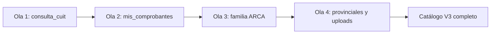
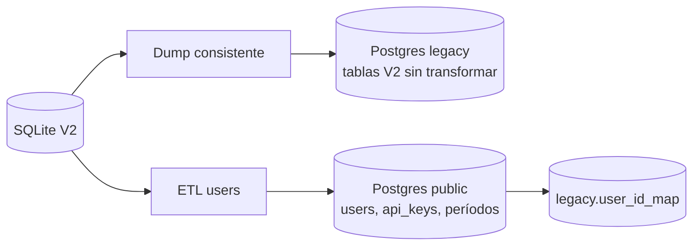
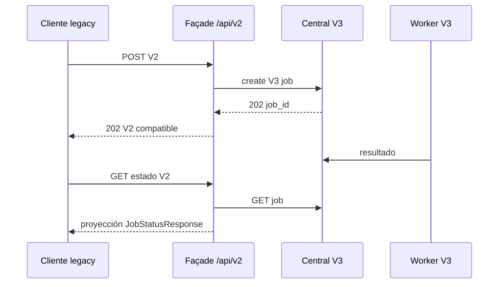

# Plan 07: migración V2 → V3

## 1. Objetivo y alcance

La V3 es una reescritura con límites de servicio nuevos, no un refactor in situ de la V2.

La migración no debe tratarse como una sola actividad, porque contiene tres flujos con riesgos, dueños y puntos de reversión diferentes.

| Flujo | Origen | Destino | Riesgo dominante | Dueño |
|---|---|---|---|---|
| Migración de código | bots y utilidades V2 | plugins del `bot-worker` | regresión funcional silenciosa | equipo de bots |
| Migración de datos | SQLite V2 | PostgreSQL V3 | auditoría o dinero-adjacent data corruptos | datos y central |
| Migración de clientes | `/api/v1`, `/api/v2` | `/api/v3` | ruptura de integraciones | API y soporte |

No se aprobará una fase por completar otra.

Por ejemplo, un bot portado no autoriza a mover usuarios, y una base importada no autoriza a apagar `/api/v2`.

El objetivo operativo es llegar a F6 con V3 como sistema de producción, V2 fuera del camino de escritura, historial V2 conservado en solo lectura, y clientes con una ruta explícita de actualización.

Este plan implementa y verifica las fases del plan maestro.

| Fase | Relación con este plan | Hito de migración |
|---|---|---|
| F0 | prepara el monorepo, contratos y Compose | no se mueve producción |
| F1 | crea V3 Postgres e importa `legacy` | datos verificables sin tráfico |
| F2 | valida scheduler y un bot mínimo | tubería distribuida demostrada |
| F3 | porta catálogo de bots | cobertura funcional V3 |
| F4 | aterriza suscripciones y cuota | consumo V3 confiable |
| F5 | expone observabilidad y transición | soporte puede operar ambos mundos |
| F6 | carga, caos, comunicación y corte | cutover irreversible controlado |

### 1.1 Principios no negociables

1. La V3 conserva semántica útil de jobs, no las dependencias internas de la V2.
2. La central es el único plano de control y el único proceso con acceso a PostgreSQL.
3. Un worker recibe un sobre autocontenido, nunca una sesión ORM ni un `DATABASE_URL`.
4. Las credenciales fiscales se usan en memoria, no viajan a resultados ni a `legacy` nuevo.
5. El historial importado conserva su forma y es auditable, pero no alimenta tablas activas V3.
6. Un cliente no queda migrado hasta que haya ejecutado y validado su flujo real contra `/api/v3`.
7. No se inventan transformaciones para logs históricos cuya semántica no sea demostrable.
8. No se publica una clave API en claro en logs, reportes ni mensajes de soporte.
9. Cada corte debe tener un responsable, hora UTC, evidencia y condición de abortar.
10. V2 no puede volver a escribir después del punto de no retorno sin restaurar un backup completo.

### 1.2 Límites explícitos

La importación de `legacy` no convierte los 28 `consulta_*_logs` en `jobs` ni `job_results` V3.

La V3 no conserva ejecuciones síncronas como arquitectura permanente.

Los dos módulos no browser, `apoc` y `consulta_cuit`, no se fuerzan artificialmente a un worker Chromium.

Se decidirá si viven como capacidades ligeras de la central o un utility worker separado, con sus contratos propios.

La compatibilidad puede conservar formas de respuesta temporalmente, pero no implica conservar tablas, executors ni rutas V2.

## 2. Migración de código

### 2.1 Diagnóstico y frontera correcta

La investigación es inequívoca: ningún módulo de `app/bot/*.py` de V2 toca la base de datos.

La búsqueda cubrió imports de DB, sesiones SQLAlchemy y mutaciones comunes, sin hallazgos dentro de esos módulos.

Por ello los bots son portables casi mecánicamente hacia `services/bot-worker/bots/`, una vez desacoplados de sus efectos laterales de entorno y almacenamiento.

La acoplación a DB está fuera de los bots y debe eliminarse, no trasladarse.

| Ubicación V2 | Acoplación | Decisión V3 |
|---|---|---|
| `app/jobs/worker.py:69-141` | construye `ConsultaLog`, hace `db.add()` y `db.commit()` | se descarta del worker |
| `app/jobs/worker.py:119-135` | persiste log de Mis Comprobantes | central persiste `job_results` tras callback |
| `app/jobs/executors/mis_retenciones_iva_simple.py:92` | consulta un log con DB inyectada | se elimina de plugin |
| `app/jobs/executors/mis_retenciones_iva_simple.py:94-110` | inserta y confirma log | central materializa resultado |
| `app/jobs/executors/mis_retenciones_iva_simple.py:124-140` | segunda rama de inserción y commit | central recibe evento idempotente |

No se copiarán `app/jobs/worker.py` ni los executors V2 al contenedor worker.

Se rescatan únicamente reglas de negocio que puedan expresarse en esquema de entrada, manifiesto, plugin o normalización de resultado.

### 2.2 Forma destino de un plugin

Cada bot productivo queda compuesto por cuatro piezas separadas.

| Pieza | Ubicación V3 | Responsabilidad |
|---|---|---|
| manifiesto | `bots/<bot>/manifest.py` | identidad, riesgos, artefactos, tiempo y capacidad |
| esquema | `bots/<bot>/schema.py` | validar entrada y compatibilidad de aliases |
| plugin | `bots/<bot>/plugin.py` | automatización y parsing |
| contrato | `tests/contracts/bots/test_<bot>.py` | asegurar la frontera pública |

El manifiesto sustituye el registro duplicado de V2 en router, fábrica, registry, executor y resolución de logs.

```python
@dataclass(frozen=True)
class PluginManifest:
    name: str
    version: str
    input_schema: type[BaseModel]
    needs_playwright: bool
    required_secrets: tuple[str, ...]
    external_hosts: tuple[str, ...]
    artifact_media_types: tuple[str, ...]
    default_deadline_seconds: int
    retry_class: Literal["read_only", "continuation", "side_effect"]
    maximum_browser_count: int
```

El plugin recibe `BotRuntime`, no argumentos globales dispersos.

```python
class BotPlugin(Protocol):
    manifest: PluginManifest

    async def execute(
        self,
        payload: BaseModel,
        runtime: BotRuntime,
    ) -> BotResult:
        ...
```

`BotRuntime` inyecta directorio de trabajo, deadline, navegador, proxy, credenciales efímeras, almacenamiento restringido, cancelación y emisor de eventos.

El código de negocio no llama `os.getenv()`, no toma rutas desde `os.getcwd()`, no abre una conexión a DB y no recibe credenciales de MinIO.

### 2.3 Procedimiento obligatorio por bot

Aplicar esta lista en orden para cada nombre canónico.

1. Abrir una ficha de portado con módulo V2, operación, fixture, riesgo y dueño.
2. Escribir el manifiesto declarativo con nombre canónico, versión y clase de reintento.
3. Declarar el esquema Pydantic de entrada y los aliases V1/V2 que se mantengan durante transición.
4. Probar que el esquema rechaza CUIT, periodo, archivo y combinación de flags inválidos antes de ejecutar navegador.
5. Portar el módulo a un plugin sin cambiar simultáneamente parsing y semántica de negocio.
6. Reemplazar `os.getcwd()` y rutas implícitas por `runtime.work_dir`.
7. Reemplazar lecturas directas de ambiente por dependencias construidas por el runtime.
8. Reemplazar subida directa a bucket por referencias de `runtime.artifact_store` y URLs prefirmadas emitidas por central.
9. Reemplazar callbacks V2 no tipados por `runtime.event_sink` con eventos de protocolo versionado.
10. Garantizar `finally` o context manager para cerrar page, context, browser y archivos temporales.
11. Construir el test de contrato de manifest, schema, resultado y artefactos declarados.
12. Ejecutar parsing contra fixture grabado y redactado, sin ARCA ni credenciales reales.
13. Registrar el bot y sus operaciones en la tabla catálogo `bots` y `bot_operations` por migración o comando idempotente.
14. Verificar el endpoint V3 y el polling contra un fake worker antes de habilitar el plugin real.
15. Hacer una ejecución controlada con cuenta de prueba autorizada y comparar campos significativos con V2.
16. Habilitarlo mediante feature flag de catálogo, con versión de plugin observable.
17. Vigilar fallas, tasa de `PARCIAL`, duración y artefactos durante una ventana acordada.
18. Cerrar la ficha solo cuando el contrato, fixture, prueba controlada y rollback estén documentados.

### 2.4 Orden de portado por olas

La secuencia evita que treinta bots oculten un error del runtime común.



#### Ola 1: prueba mínima de la tubería

`consulta_cuit` es el primer candidato porque no usa Playwright, tiene solo 48 LOC y es una consulta local simple.

Demuestra autenticación, `202 + job_id`, scheduler, callback, resultados, idempotencia y URLs de artefacto sin introducir Chromium ni un tercero fiscal.

Si se decide que sea servicio ligero, se conserva el mismo sobre de ejecución y estado de job para no crear una excepción pública.

Criterio de salida: central, PostgreSQL, worker, contratos compartidos, fake bot y `consulta_cuit` funcionan desde un cliente externo.

#### Ola 2: piloto de carga y negocio real

`mis_comprobantes` es el piloto real de mayor prioridad funcional y volumen esperado.

Su módulo de 1.508 LOC tiene tres operaciones relacionadas: consulta, solicitar consulta e historial.

También fuerza decisiones sobre continuaciones, cookies, CSV/ZIP, DataFrames, resultados JSON y carga de artefactos.

La escritura V2 de `ConsultaLog` se reemplaza por un callback `JobResultReported` idempotente.

Criterio de salida: las tres operaciones conservan `OK | PARCIAL | ERROR`, archivos con URL prefirmada y no exceden cinco jobs por worker.

#### Ola 3: familia ARCA con infraestructura compartida

Se porta `arca_login` una vez y se agrupan bots que consumen su sesión y navegación de servicios.

La ola debe ordenar primero consultas de solo lectura y luego side effects.

| Grupo | Bots | Orden interno |
|---|---|---|
| consultas ARCA breves | `siper`, `facturometro`, `sct`, `sct_compensaciones`, `ccma` | bajo riesgo de parsing y artefactos |
| descargas ARCA | `aportes_en_linea`, `certificado_mipyme`, `libros_portal_iva`, `rcel`, `mis_retenciones` | prueban PDF, CSV y XLSX |
| flujos complejos | `declaracion_en_linea`, `hacienda`, `liquidacion_granos`, `mis_facilidades`, `moa`, `pago_devoluciones` | múltiples pantallas y artefactos |
| ARCA con efectos | `portal_iva`, `controladores_fiscales`, `vep_archivo`, `vep_ccma` | después de verificación idempotente |

Todos comparten la extracción de login de `app/utils/arca_login.py`.

No se permite que cada port invente sus propios selectores de sesión, CAPTCHA, profile o manejo de popup.

#### Ola 4: outliers y fronteras de archivos

La última ola reúne sitios con credenciales o flujos diferentes, más cargas multipart y generación de archivos.

| Categoría | Bots | Riesgo específico |
|---|---|---|
| provincial | `retper_iibb_arba`, `retper_iibb_agip`, `retper_iibb_misiones`, `sifere`, `srt` | login y CAPTCHA no ARCA |
| multipart/import | `portal_iva_carga`, `portal_iva`, `vep_archivo`, `controladores_fiscales` | intake, antivirus, tamaño, paths y side effects |
| VEP relacionado | `consulta_pagos_vep`, `vep_ccma` | archivos, continuaciones y comprobantes |
| utilidades no browser | `apoc`, `consulta_cuit` | no deben entrar a Chromium |

`portal_iva_carga` y VEP requieren verificación posterior a la acción antes de reintentar.

Una falla de red después de subir o presentar no autoriza una repetición ciega.

### 2.5 Catálogo de portado

La siguiente tabla enumera los aproximadamente treinta bots productivos y operaciones visibles.

| Nombre canónico | Organismo | Complejidad | Dependencias compartidas | Ola |
|---|---|---|---|---|
| `consulta_cuit` | fuente local | baja | `cuit_validation` | 1 |
| `apoc` | APOC local | baja | ruta de base de referencia | 4 |
| `mis_comprobantes` | ARCA | alta | `arca_login`, cookies, bucket | 2 |
| `mis_comprobantes_solicitar` | ARCA | alta | `arca_login`, continuación | 2 |
| `mis_comprobantes_historial` | ARCA | alta | `arca_login`, cookies, bucket | 2 |
| `siper` | ARCA | media | `arca_login`, proxy | 3 |
| `facturometro` | ARCA | media | `arca_login`, bucket | 3 |
| `sct` | ARCA | media | `arca_login`, extractor | 3 |
| `sct_compensaciones` | ARCA | media | `arca_login`, bucket | 3 |
| `ccma` | ARCA | media | `arca_login`, bucket | 3 |
| `aportes_en_linea` | ARCA | media | `arca_login`, bucket | 3 |
| `certificado_mipyme` | ARCA | media | `arca_login`, bucket | 3 |
| `libros_portal_iva` | ARCA | alta | `arca_login`, bucket | 3 |
| `rcel` | ARCA | alta | `arca_login`, extractor, bucket | 3 |
| `mis_retenciones` | ARCA/SIRE | alta | `arca_login`, bucket | 3 |
| `mis_retenciones_iva_simple` | ARCA/SIRE | alta | `arca_login`, bucket | 3 |
| `declaracion_en_linea` | ARCA | alta | `arca_login`, bucket | 3 |
| `hacienda` | ARCA | muy alta | `arca_login`, extractor, bucket | 3 |
| `liquidacion_granos` | ARCA | muy alta | `arca_login`, bucket | 3 |
| `mis_facilidades` | ARCA | alta | `arca_login`, bucket | 3 |
| `moa` | ARCA | alta | `arca_login`, bucket | 3 |
| `pago_devoluciones` | ARCA | media | `arca_login`, bucket | 3 |
| `portal_iva` | ARCA | muy alta | `arca_login`, uploads, bucket | 4 |
| `portal_iva_carga` | ARCA | muy alta | `arca_login`, multipart, bucket | 4 |
| `controladores_fiscales` | ARCA | alta | `arca_login`, `pem_converter`, uploads | 4 |
| `consulta_pagos_vep` | ARCA/SETI | media | `arca_login`, bucket | 4 |
| `vep_archivo` | ARCA VEP | alta | `arca_login`, multipart, bucket | 4 |
| `vep_ccma` | ARCA VEP | alta | `arca_login`, CCMA, bucket | 4 |
| `retper_iibb_arba` | ARBA | media | proxy, bucket | 4 |
| `retper_iibb_agip` | AGIP | alta | proxy, email gateway, bucket | 4 |
| `retper_iibb_misiones` | ATM Misiones | alta | CAPTCHA, proxy, bucket | 4 |
| `sifere` | Convenio Multilateral | alta | proxy, extractor, bucket | 4 |
| `srt` | SRT | media | CAPTCHA, proxy | 4 |

El alias `arba` no se registra como bot nuevo.

Se modela como alias temporal de operación o compatibilidad de ruta y se traduce al canónico `retper_iibb_arba`.

### 2.6 Destino de utilidades compartidas

| Utilidad V2 | Destino | Cambio obligatorio |
|---|---|---|
| `arca_login.py` | worker | dividir en perfil, autenticador, navegación y sesión context-managed |
| `arca_captcha.py` | worker | interfaz `CaptchaSolver`, errores públicos, sin secretos en logs |
| `capmonster.py` | worker | inyectar cliente y límite de gasto, sin leer env desde plugin |
| `proxies.py` | central + worker | central entrega `proxy_profile_ref`, worker resuelve perfil permitido |
| `extractor.py` | worker | entrada `Path` de workspace, resultado tipado, no rutas caller-controlled |
| `pem_converter.py` | worker o central intake | validar MIME y paths, salida en workspace, sin zip-slip |
| `cuit_validation.py` | contracts | función pura y esquemas compartidos |
| `browser_limiter.py` | worker | semáforo duro 5, métricas y cancelación segura |
| `bucket.py` | dividido central/worker | worker PUT solo con URL prefirmada, central firma GET/PUT y valida metadatos |

`proxies.py` no transporta un proxy arbitrario indicado por el cliente.

El cliente elige, a lo sumo, un perfil autorizado por contrato y política central.

`bucket.py` no sigue como helper omnipotente con credenciales de MinIO en cada worker.

La central conserva las credenciales de firma, y el worker conoce exclusivamente URLs ya delimitadas por `job_id`, tamaño y content type.

### 2.7 Rutas y executors que no migran

V2 tiene aproximadamente 35 módulos de rutas y alrededor de 30 executors o mapeos de ejecución.

Su estructura existe para acoplar ejecución inline, schema, log model y persistencia de bot.

Ese diseño se elimina en V3.

| Elemento V2 | Acción | Valor que se rescata |
|---|---|---|
| rutas V1 síncronas | borrar | validación y nombres de entrada |
| factory V2 | borrar | `202`, idempotencia, multipart temprano |
| router V2 disperso | borrar | tabla de rutas de compatibilidad |
| executors | borrar casi todos | adaptadores puros si contienen mapping útil |
| `registry.py` | sustituir | nombres canónicos y aliases auditados |
| `job_status.py` | sustituir | proyección pública y regeneración de URLs |
| modelos `Consulta*Log` | congelar en `legacy` | lectura de auditoría histórica |

La validación salvada debe hacerse explícita en `input_schema` y no residir en rutas HTTP.

La normalización de CUIT, comprobación de periodos, combinaciones de flags y requisitos de archivos se prueba como contrato del bot.

## 3. Migración de datos: SQLite V2 → PostgreSQL V3

### 3.1 Realidad de origen

El origen conocido es `data/sql_app.db`, un SQLite de alrededor de 133 MB.

El esquema V2 tiene 33 tablas.

| Grupo V2 | Cantidad | Identificadores |
|---|---:|---|
| `users` | 1 | `INTEGER` autoincremental |
| `consulta_*_logs` | 28 | `INTEGER` autoincremental |
| jobs Playwright | 2 | `job_id` string UUIDv7 |
| acceso a credenciales | 1 | entero o columnas asociadas |
| total | 33 | enteros salvo `job_id` |

Los 28 logs contienen mucha información común pero también payloads específicos sin destino uno a uno probado.

Hay campos fiscales, credenciales tratadas por listeners V2, respuestas JSON y referencias de objetos que no deben reinterpretarse masivamente.

### 3.2 Estrategia: legado inmutable y V3 fresca

Se importan las tablas V2 tal cual a un esquema Postgres `legacy` de solo lectura.

Las tablas forward-looking V3 se crean desde migraciones limpias en `public`.



Esta alternativa es preferible a una transformación completa de todos los logs por cuatro motivos.

1. Las 28 tablas de logs no tienen un destino canónico limpio en V3.
2. Su valor principal es auditoría y soporte, no alimentación del scheduler nuevo.
3. Una conversión a `job_results.payload` puede borrar distinciones específicas o mezclar estados incompatibles.
4. El contenido es dinero-adjacent y fiscal, por lo que una migración semántica incorrecta es peor que una consulta histórica aislada.

`legacy` no recibe inserts, updates ni deletes de la aplicación.

El rol de aplicación V3 no recibe permisos DML sobre `legacy`.

```sql
REVOKE INSERT, UPDATE, DELETE, TRUNCATE ON ALL TABLES IN SCHEMA legacy FROM central_app;
REVOKE USAGE ON ALL SEQUENCES IN SCHEMA legacy FROM central_app;
GRANT USAGE ON SCHEMA legacy TO central_readonly;
GRANT SELECT ON ALL TABLES IN SCHEMA legacy TO central_readonly;
```

La UI administrativa muestra el origen como “histórico V2” y no mezcla registros legacy con jobs creados en V3.

### 3.3 Tablas V3 creadas frescas

Se crean nuevas, sin importar sus IDs V2, las tablas `users`, `api_keys`, `plans`, `subscriptions`, `subscription_periods`, `usage_ledger`, `credit_ledger`, `bots`, `bot_operations`, `workers`, `worker_heartbeats`, `jobs`, `job_events`, `job_results`, `job_artifacts` y `payments`.

Esto garantiza I-1, I-2, I-3 e I-4 desde el DDL, no por corrección posterior.

`users.id` es UUIDv4.

Los IDs de jobs, resultados, ledger y pagos son UUIDv7.

No existe una secuencia de aplicación ni columna `SERIAL` o `IDENTITY` en `public`.

### 3.4 ETL de usuarios y mapa de IDs

Los únicos datos legacy que deben convertirse para operar V3 son los usuarios y su relación de identidad histórica.

| Campo V2 | Acción V3 | Nota |
|---|---|---|
| `id` entero | nuevo `users.id` UUIDv4 | nunca reutilizar entero como PK V3 |
| `mail` | `users.email` normalizado | deduplicar con decisión explícita |
| `api_key` verificador HMAC | `api_keys.key_hash` | no hay clave en claro que copiar |
| `habilitado` | `users.enabled` | conservar el estado operativo |
| `maximas_consultas_mensuales` | primer período/suscripción | ver sección 3.6 |
| `consultas_realizadas` | primer `subscription_period` | usar como consumo heredado documentado |
| `fecha_ultimo_reset` | inicio calculado de período | no existe columna equivalente en users |
| `created_at` | no se copia a users | R17 lo elimina conscientemente |
| `updated_at` | no se copia a users | R17 lo elimina conscientemente |

Se crea `legacy.user_id_map` como artefacto de migración y trazabilidad.

```sql
CREATE TABLE legacy.user_id_map (
    legacy_user_id integer PRIMARY KEY,
    v3_user_id uuid NOT NULL UNIQUE,
    migrated_at timestamptz NOT NULL,
    source_mail text,
    source_row_checksum text NOT NULL
);
```

El mapa permite enlazar un registro histórico con usuario actual sin alterar 28 tablas ni convertir sus FKs enteras.

Pseudocódigo ETL:

```python
for row in sqlite.execute("SELECT * FROM users ORDER BY id"):
    email = normalize_email(row["mail"])
    assert email and is_valid_email(email)
    assert email not in seen_emails

    v3_user_id = uuid4()
    create_v3_user(
        id=v3_user_id,
        email=email,
        enabled=bool(row["habilitado"]),
    )
    if row["api_key"]:
        insert_api_key_verifier(
            user_id=v3_user_id,
            hmac_verifier=row["api_key"],
            label="migrada-v2",
            status="active_or_reissue_pending",
        )
    create_initial_period_from_legacy(row, v3_user_id)
    insert_legacy_user_map(
        legacy_user_id=row["id"],
        v3_user_id=v3_user_id,
        checksum=sha256(canonical_json(row)),
    )
```

El ETL debe correr dentro de transacciones por lotes y producir un archivo de excepciones sin secreto.

Una fila inválida no se arregla silenciosamente.

Se la excluye con motivo, se bloquea el go/no-go si afecta un cliente habilitado, y se decide manualmente con evidencia.

### 3.5 Problema de las API keys

V2 persiste un verificador HMAC de API key, no la clave original en texto plano.

Por definición, no se pueden recuperar las claves originales a partir del verificador.

Existen dos opciones controladas.

| Opción | Mecánica | Ventajas | Riesgos |
|---|---|---|---|
| reutilizar secreto HMAC | V3 verifica la clave presentada contra el hash V2 | clientes no cambian de clave en el corte | prolonga secreto heredado y acoplamiento criptográfico |
| reemitir claves | V3 genera una nueva clave una sola vez | rota secreto y limpia modelo V3 | cada cliente debe actualizar configuración |

Se recomienda reemitir las claves API.

La razón es que V3 ya cambia el sistema de autenticación, IDs y facturación, y no debe perpetuar un secreto HMAC de V2 sin rotación ni prueba de fortaleza actual.

Se habilita un período limitado de transición solamente si hay un inventario de clientes y una necesidad contractual de continuidad.

Si se acepta compatibilidad temporal, la central soporta verificación de dos versiones, marcada por `api_keys.hash_version`.

La clave V2 no se copia, solo su verificador se importa como `legacy-hmac`.

La primera autenticación válida con clave V2 puede devolver cabeceras de deprecación y un enlace seguro de reemisión, pero nunca una clave nueva automáticamente en la respuesta normal.

Comunicación mínima a clientes:

1. aviso inicial con fecha de corte y URL de guía;
2. entrega autenticada de clave V3 mediante panel o canal verificado;
3. recordatorios 30, 14, 7 y 1 días antes;
4. listado individual de endpoints y claves legacy aún usadas;
5. soporte de contingencia documentado durante la ventana;
6. revocación definitiva de hash V2 al vencer la fecha.

### 3.6 Cuota V2 hacia primer período de suscripción

R17 elimina de `users` `consultas_realizadas`, `maximas_consultas_mensuales` y `fecha_ultimo_reset` como mecanismo de cuota.

No se pierde su semántica en la migración.

Cada usuario habilitado recibe una suscripción de migración o un período inicial asociado al plan que corresponda.

| Dato V2 | Campo V3 inicial | Regla |
|---|---|---|
| `maximas_consultas_mensuales` | `subscription_periods.included_quota` | máximo legado, salvo mapeo comercial explícito |
| `consultas_realizadas` | `subscription_periods.consumed_quota` | consumo al instante del freeze |
| `fecha_ultimo_reset` | `subscription_periods.starts_at` | inicio de período heredado validado |
| próximo mes UTC | `subscription_periods.ends_at` | primer límite UTC posterior a `starts_at` |
| saldo disponible | derivado | `max(0, included - consumed)` |

Si `fecha_ultimo_reset` es nula o inválida, el período se inicia a la hora del corte y se documenta como corrección manual.

Si `consultas_realizadas > maximas_consultas_mensuales`, se conserva el consumo observado, el saldo queda cero y no se vuelve negativo.

No se fabrican filas históricas de `usage_ledger` por cada consulta V2, porque no existe evidencia de una operación individual limpia y consistente para todas las tablas.

Se crea una sola entrada de ajuste de migración, con referencia al checksum de la fila V2.

```sql
INSERT INTO usage_ledger (
  id, user_id, subscription_period_id, kind, units, source, metadata
) VALUES (
  uuid_generate_v7(), :user_id, :period_id, 'migration_opening_balance',
  :consumed, 'v2-users', jsonb_build_object('legacy_user_id', :legacy_id)
);
```

La semántica exacta del ledger debe permitir esta entrada sin fingir que fue una ejecución V3.

### 3.7 Importación técnica de `legacy`

1. Detener escrituras V2 durante la ventana de freeze.
2. Verificar integridad SQLite con `PRAGMA integrity_check`.
3. Calcular hash SHA-256 de `sql_app.db` y guardar manifiesto de tablas y conteos.
4. Generar dump reproducible y guardar copia cifrada e inmutable.
5. Crear esquema `legacy` y DDL que preserve nombres de tabla y tipos interpretables.
6. Cargar tablas con `COPY` o herramienta auditada, sin aplicar listeners V2 destructivos.
7. Restaurar índices necesarios para lecturas históricas, especialmente `user_id`, `job_id` y timestamp.
8. Aplicar dueño y privilegios readonly antes de exponer central.
9. Registrar hash de fuente, versión ETL, hora y operador en tabla de auditoría de migración.
10. No abrir V3 al tráfico hasta concluir la reconciliación.

Para el traslado, `pgloader` puede ser una herramienta de transporte, no la definición de transformación.

El DDL, mapeos de tipo, comandos exactos y checksums deben quedar versionados como artefactos de release.

### 3.8 Verificación y conciliación

La verificación no se limita a que el importador termine con exit code cero.

| Control | Método | Umbral |
|---|---|---|
| conteo por tabla | `sqlite COUNT(*)` frente a `legacy COUNT(*)` | igualdad exacta |
| nulos críticos | comparar conteos por columna seleccionada | igualdad exacta o excepción aprobada |
| suma de usuarios | habilitados, deshabilitados y con key | igualdad exacta |
| mapa de usuarios | cada `users.id` V2 tiene una fila en map | 100% |
| unicidad | emails y `v3_user_id` | cero duplicados |
| logs spot check | muestra estratificada por cada tabla | payload y artefacto equivalentes |
| jobs legacy | conteo activo/histórico y UUID válidos | reporte explicativo |
| objetos | keys referenciadas contra bucket | existencia o marca histórica clara |
| seguridad | búsqueda de URLs/secretos en tablas V3 | cero hallazgos prohibidos |

La muestra estratificada debe incluir al menos registros con `OK`, `PARCIAL`, `ERROR`, archivos, credenciales redacted y valores nulos.

El informe de reconciliación se genera como JSON y CSV firmados, con hash del dump, conteos de fuente/destino, excepciones y aprobación nominal.

Ejemplo de consulta de conteo:

```sql
SELECT 'consulta_mc_logs' AS table_name, count(*) FROM legacy.consulta_mc_logs
UNION ALL
SELECT 'users', count(*) FROM legacy.users
UNION ALL
SELECT 'user_id_map', count(*) FROM legacy.user_id_map;
```

### 3.9 Runbook de cutover de datos

Los tiempos son objetivos operativos y deben ensayarse con un clon de tamaño comparable antes de producción.

| Tiempo | Acción | Dueño | Gate |
|---|---|---|---|
| T-14 días | ensayo completo de import y restore | datos | duración conocida y reporte limpio |
| T-7 días | anunciar mantenimiento y reemisión de claves | soporte | clientes críticos contactados |
| T-48 h | backup verificable V2 y Postgres base | operaciones | restore probado |
| T-24 h | freeze de deploys V2 y V3 | release manager | hashes de imágenes fijados |
| T-60 min | poner V2 en drain, negar nuevas ejecuciones | operaciones | cola llega a cero o lista explícita |
| T-45 min | activar mantenimiento público | soporte | 503 controlado en V2 |
| T-40 min | detener escritores V2 y snapshot SQLite | datos | `integrity_check = ok` |
| T-30 min | importar `legacy` y ejecutar ETL users | datos | jobs ETL sin errores bloqueantes |
| T-15 min | correr reconciliación automática y revisión humana | datos + seguridad | todos los umbrales verdes |
| T-10 min | sembrar catálogo, planes y período inicial | central | DDL y permisos validados |
| T-5 min | levantar central y workers V3 en modo sin tráfico | operaciones | health, heartbeat y fake job verdes |
| T-0 | abrir `/api/v3`, habilitar DNS/ruta | release manager | aprobación go |
| T+15 min | ejecutar canarios de bots y autenticación | QA | sin fuga ni duplicación |
| T+60 min | cerrar observación inicial | incident commander | métricas dentro de rango |

Go/no-go antes de T-0:

1. hashes de backup, dump y reporte coinciden;
2. conteos de las 33 tablas y el mapa de usuarios son correctos;
3. no hay datos V3 que violen IDs o columnas R17;
4. central no puede escribir en `legacy`;
5. al menos un worker sano acepta y completa un fake job;
6. `consulta_cuit` y `mis_comprobantes` canarios cumplen contrato;
7. un cliente piloto autentica con mecanismo acordado;
8. owner de negocio, operaciones y seguridad dan aprobación explícita.

El punto de no retorno aparece al aceptar el primer job productivo V3 o al confirmar el primer consumo V3, lo que ocurra primero.

Antes de ese punto se puede apagar V3, restaurar la ruta V2 y preservar el snapshot como ensayo fallido.

Después de ese punto, volver a V2 exige reconciliar usuarios, cuotas, claves y jobs V3 o restaurar todo el sistema a un punto anterior con pérdida explícita de trabajo V3.

## 4. Migración de clientes

### 4.1 Contrato objetivo y compatibilidad semántica

V3 expone creación asíncrona canónica bajo `/api/v3/bots/{bot}/{operacion}` y consulta bajo `/api/v3/jobs/{job_id}`.

Las formas finales pueden evolucionar, pero la transición debe preservar los significados que clientes ya consumen.

| Semántica V2 | Equivalente V3 | Tratamiento |
|---|---|---|
| `POST /api/v2/<bot>/<op>` | `POST /api/v3/bots/<bot>/<op>` | crea job 202 |
| `GET /api/v2/<bot>/<op>/{job_id}` | `GET /api/v3/jobs/{job_id}` | estado normalizado |
| `POST .../cancelar/{job_id}` | `POST /api/v3/jobs/{job_id}/cancelar` | cancelación autenticada |
| `POST /api/v2/jobs/status:batch` | `POST /api/v3/jobs/estado:lote` | lectura por lote, sin consumo de cuota |
| endpoints `/logs` | `GET /api/v3/jobs` con filtros, o el panel admin para el esquema `legacy` | solo lectura y paginación por cursor |

Las rutas V3 de esta tabla son las canónicas de
[`plans/02-central-api/plan.md`](../02-central-api/plan.md) §3. Se usan los
nombres en castellano (`cancelar`, `estado:lote`) por coherencia con el resto
de la API y con los nombres de estado, que ya son en castellano desde la V2.
| URL MinIO regenerada | artefactos V3 | URL prefirmada corta |

Los nombres de rutas V2 pueden representarse como alias en una façade temporal, pero los clientes nuevos solo reciben documentación V3.

### 4.2 Matriz de familias públicas

| Familia V2 | Ejemplos V2 | Destino V3 | Estado de migración |
|---|---|---|---|
| jobs Mis Comprobantes | consulta, solicitar, historial | `bots/mis_comprobantes/*` | prioridad piloto |
| jobs ARCA base | CCMA, SIPER, SCT, compensaciones | `bots/<canónico>/consulta` | ola 3 |
| Portal IVA | consulta y carga multipart | `bots/portal_iva/*` | ola 4 |
| descargas ARCA | RCEL, Hacienda, Libros, Retenciones | `bots/<canónico>/consulta` | ola 3 |
| declaraciones complejas | Declaración, Granos, Mis Facilidades, MOA | `bots/<canónico>/consulta` | ola 3 |
| provincial | ARBA, AGIP, Misiones, SIFERE, SRT | `bots/<canónico>/consulta` | ola 4 |
| VEP | carga, pagos, CCMA, archivo | `bots/vep_*/*` | ola 4 |
| Controladores | carga PEM | `bots/controladores_fiscales/carga` | ola 4 |
| utilities directas | PDF extractor, PEM, ZIP/TXT, modelo | endpoint utility explícito o job | decidir por coste |
| usuario/admin | create, reset, cuota | panel y API de administración V3 | F5 |
| logs V2 | 28 wrappers POST | `legacy` readonly, no bot endpoint | transición |

Las rutas V1 de ejecución inline no obtienen equivalente síncrono estable.

Se transforman en creación de job o, si la utilidad no invoca bot, en endpoint ligero claramente separado.

### 4.3 Campos cuya compatibilidad es obligatoria durante transición

El `JobStatusResponse` V2 es el contrato de polling con mayor riesgo de ruptura.

Mientras exista cliente legacy se debe entregar una proyección compatible.

| Campo | Regla V3/adapter |
|---|---|
| `job_id` | UUID serializado como string |
| `status` | conservar español: `PENDIENTE`, `CORRIENDO`, `COMPLETO`, `CANCELADO` |
| `result` | eje separado: `OK`, `PARCIAL`, `ERROR` o `null` |
| `bot` | nombre V2 traducido desde canónico cuando aplique |
| `operation` | operación solicitada |
| `created_at`, `started_at`, `finished_at` | ISO 8601, nulos coherentes por estado |
| `cancel_reason`, `cancelled_by` | sanitizados y compatibles |
| `error` | seguro, sin selector, URL, ruta, traza o secreto |
| `files` | `name`, URL prefirmada, `size` nullable |
| `data` | JSON específico de bot, sanitizado |

La creación legacy mantiene HTTP 202 y cuerpo `{"success": true, "job_id": ..., "status": "PENDIENTE"}` mientras se anuncie como compatible.

No se confunde `COMPLETO` con `OK`: un job puede estar completo y el resultado ser `PARCIAL` o `ERROR`.

Los artefactos no contienen rutas locales ni credenciales de bucket.

Las URLs se vuelven a firmar en cada lectura y no se persisten como URL pública.

### 4.4 Fases de deprecación y comunicación

| Momento relativo | Medida técnica | Comunicación |
|---|---|---|
| D-90 | publicar OpenAPI V3, SDK y guía por bot | anuncio general y webinar |
| D-60 | cabecera `Deprecation: true` en V1/V2 | email a responsables técnicos |
| D-45 | `Link: <...>; rel="deprecation"` por endpoint | tablero de consumo por cliente |
| D-30 | cabecera `Sunset: <fecha RFC 9110>` | recordatorio con ejemplos de migración |
| D-14 | bloquear alta de nuevas integraciones V1/V2 | seguimiento individual críticos |
| D-7 | limitar façade sync y requerir ticket | plan de contingencia y guardia |
| D-0 | apagar ejecución V1/V2 | estado público de corte |
| D+30 | retirar fachada async V2 restante | informe final de adopción |

Las cabeceras se aplican también a respuestas de error, para que los integradores las detecten durante fallas.

Ejemplo:

```http
Deprecation: true
Sunset: Fri, 15 Jan 2027 00:00:00 GMT
Link: </docs/migracion-v3>; rel="deprecation"; type="text/html"
```

El panel admin debe mostrar por cliente: última llamada legacy, familia, endpoint, versión, user agent, key label, cantidad de jobs y fecha estimada de bloqueo.

No almacena valores de API key ni payload fiscal para esa analítica.

El panel ofrece export CSV de adopción y filtro de clientes habilitados que aún usan V1 o V2.

### 4.5 Façade de compatibilidad opcional

Una façade puede conservar transitoriamente `/api/v2` para endpoints asíncronos ya compatibles.

La fachada valida el esquema V2, traduce aliases y crea un job V3 con idempotencia normal.

Luego proyecta el job V3 a `JobStatusResponse` V2.



Para una ruta V1 originalmente síncrona, una façade que prometa sincronía solo puede crear un job V3 y hacer polling bloqueante hasta timeout.

Es una experiencia degradada: consume conexión, aumenta timeout, no ayuda al scheduler y no elimina las dependencias de cliente.

Por ello se autoriza únicamente para clientes con imposibilidad demostrada de migrar, con timeout corto, header de advertencia, métrica específica y fecha de expiración aprobada.

No se usa para cargas multipart de gran tamaño ni flujos que puedan tardar minutos.

## 5. Convivencia V2 / V3

### 5.1 ¿Pueden ejecutarse simultáneamente?

Técnicamente sí, pero compartir recursos de escritura convierte la convivencia en una fuente de errores difícil de reconciliar.

| Recurso | Riesgo de coexistencia | Regla |
|---|---|---|
| buckets de objetos | colisión de keys, retention y ACL | prefijo V3 separado: `v3/<job_id>/` |
| claves RSA | mezcla de envelopes y rotación inconsistente | pares separados o versionados, privada solo central V3 |
| credenciales MinIO | workers V2 y V3 con poder excesivo | V3 workers no reciben credenciales |
| `JOB_SECRETS_KEY` | ambos podrían leer trabajos pendientes si comparten formato | no compartir cola ni secreto operativo |
| SQLite/PG | doble fuente de verdad de usuarios/cuota | V2 en lectura o apagada |
| APIs públicas | cliente puede crear trabajo duplicado | idempotencia no cruza sistemas |

V2 y V3 no deben competir por jobs ni reusar una tabla de cola.

V3 no monta el volumen `data/` de V2 en workers.

### 5.2 Postura operativa recomendada

La recomendación es hard cutover con ventana de mantenimiento corta para escritura, precedido por una etapa limitada de V3 paralela sin tráfico productivo general.

Durante el paralelo se permite V2 productiva y V3 con datos clonados, cuentas canario y workers de prueba.

Después del freeze, V2 queda como interfaz de auditoría read-only, aislada de ejecución, o se reemplaza por la consulta `legacy` de V3.

No se sostiene una etapa larga con V2 y V3 aceptando jobs productivos al mismo tiempo.

Eso duplicaría cuota, consumo, efectos externos y soporte de estado.

## 6. Rollback por fase

| Fase | Antes del punto de no retorno | Rollback | Pérdida aceptada |
|---|---|---|---|
| F0 | todo es infraestructura nueva | destruir entorno V3 | ninguna producción |
| F1 | PG no expuesto | restaurar Postgres y repetir import | tiempo de ensayo |
| F2 | solo fake bot/canario | deshabilitar scheduler y workers | jobs de prueba |
| F3 | feature flags por bot | deshabilitar bot y volver temporalmente a V2 | resultados V3 de canario |
| F4 | sandbox o flags de cobro | congelar compras y reconciliar ledger | ninguna transacción no confirmada |
| F5 | admin nuevo paralelo | volver a panel V2 readonly | cambios de UI |
| F6 antes de T-0 | DNS/rutas no abiertos | reactivar V2 con snapshot intacto | ventana de mantenimiento |
| F6 después de T-0 | primer job/consumo V3 | restauración completa o modo incidente | jobs/consumos V3 posteriores al backup |

El rollback posterior a T-0 no es un botón de despliegue.

Requiere decisión de incidente, congelar aceptación V3, preservar audit logs, enumerar jobs en vuelo y conciliar uso, créditos, pagos y artefactos.

Nunca se reinyecta un job side-effecting en V2 sin verificación manual.

## 7. Criterios de aceptación

1. Los documentos de release distinguen explícitamente código, datos y clientes.
2. Ningún módulo portado de bot importa SQLAlchemy, sesión de DB ni modelo V2.
3. `app/jobs/worker.py` y el executor DB-writing de IVA Simple no se copian al worker V3.
4. Cada bot del catálogo tiene manifiesto, esquema, plugin, fixture y test de contrato.
5. La ola 1 prueba la tubería completa y la ola 2 prueba Mis Comprobantes antes de masificar portados.
6. La tabla `bots` contiene nombres canónicos, operaciones y versiones de todos los bots habilitados.
7. `arca_login`, CAPTCHA, proxy, browser limiter y storage tienen un único destino definido y probado.
8. Las rutas y executors V2 se eliminan como arquitectura y su validación se expresa en contratos V3.
9. El SQLite fuente pasa `PRAGMA integrity_check` antes de cada importación final.
10. Las 33 tablas V2 están en `legacy` con conteos iguales al origen.
11. El rol de aplicación no puede escribir en `legacy`.
12. Cada usuario V2 migrado tiene una fila `legacy.user_id_map` y UUIDv4 V3 único.
13. `users` V3 no contiene `fecha_ultimo_reset`, `created_at` ni `updated_at`.
14. Ninguna PK V3 de dominio es entero autoincremental, `SERIAL` ni `IDENTITY`.
15. La estrategia de API keys está aprobada, probada y comunicada antes del corte.
16. La cuota legado aparece como balance inicial verificable de un `subscription_period`.
17. Existe informe de reconciliación con conteos, checksums, spot checks y excepciones firmadas.
18. Los endpoints V2 críticos tienen entrada en matriz V2→V3 y pruebas de proyección.
19. La creación legacy temporal devuelve 202 y `job_id` cuando corresponde.
20. `JobStatusResponse` compatible conserva campos, estados españoles y eje `OK/PARCIAL/ERROR`.
21. Los archivos se entregan con URLs prefirmadas y no filtran path local o key secreta.
22. Las rutas legacy devuelven `Deprecation`, `Sunset` y enlace de guía durante la ventana.
23. El admin identifica clientes que aún usan V1/V2 sin almacenar secretos.
24. Toda façade síncrona está time-boxed, medida y documentada como degradada.
25. V2 y V3 no comparten cola, escrituras de usuario ni credenciales de bucket en workers.
26. Se realizó un ensayo de cutover con duración y gates documentados.
27. El punto de no retorno y su rollback están aprobados por negocio y operaciones.
28. Tras F6, ningún nuevo job productivo se crea por endpoint V1 o V2.
