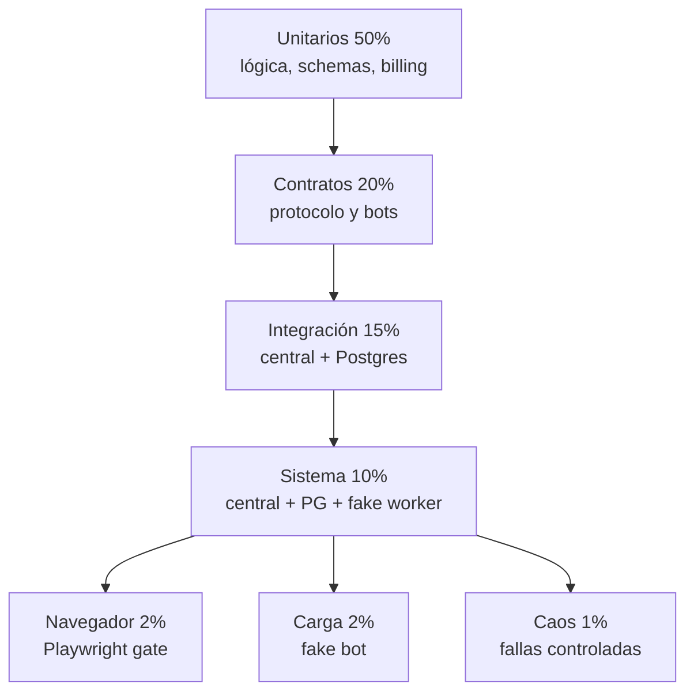
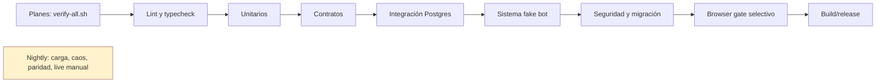

# Plan 08: estrategia de pruebas y aceptación V3

## 1. Objetivo y alcance

Este plan define cómo demostrar que la reescritura V3 funciona como un sistema distribuido, seguro y compatible en los comportamientos públicos que se decidan conservar.

No es un plan para maximizar número de tests.

Es un plan para cerrar riesgos de scheduler, workers sin DB, PostgreSQL, credenciales, artefactos, facturación, bots Playwright y migración de clientes con evidencia repetible.

El alcance cubre F0 a F6 y termina cuando la lista de aceptación completa de V3 puede ser recorrida por una persona con enlaces a pruebas y reportes.

| Área | Pregunta que debe responder la prueba |
|---|---|
| contratos | ¿central y worker entienden exactamente el mismo protocolo? |
| bots | ¿cada plugin acepta solo su entrada y produce resultados declarados? |
| datos | ¿Postgres conserva invariantes y exclusión mutua? |
| scheduler | ¿un job se asigna una vez y se recupera si el worker cae? |
| seguridad | ¿ningún borde público revela infraestructura o credenciales? |
| billing | ¿los saldos y webhooks resisten repetición y carrera? |
| migración | ¿V2 puede convertirse sin perder auditoría ni romper clientes acordados? |
| operaciones | ¿se detectan y recuperan fallas realistas? |

Las pruebas se implementan cerca del dueño de cada frontera, pero todas se ejecutan desde un pipeline común con resultados trazables.

No se usa SQLite como sustituto de integración V3.

V3 depende de `FOR UPDATE SKIP LOCKED`, JSONB, roles y semántica transaccional específicas de PostgreSQL.

### 1.1 Principios de diseño

1. Una prueba de navegador no sustituye una prueba de contrato ni una integración de scheduler.
2. Los unitarios no usan red, Chromium, bucket productivo ni credenciales fiscales reales.
3. Cada bug de producción reproduce primero como test determinista de menor nivel posible.
4. Los fixtures son datos de prueba versionados, redactados y con origen conocido.
5. Las pruebas de carga usan un fake bot para medir plataforma, no la disponibilidad de ARCA.
6. Todo test de incidente debe declarar resultado observable, no solo “no falla”.
7. Toda aserción sobre secreto se prueba en respuesta, log, callback, persistencia y artefacto.
8. Se ejecuta Postgres real en CI para integración y sistema.
9. La cobertura de líneas es informativa, no gate principal de calidad distribuida.
10. Un release solo se promueve cuando los gates aplicables a su cambio están verdes.

### 1.2 Taxonomía de entornos

| Entorno | Servicios | Datos | Uso |
|---|---|---|---|
| unit | proceso Python aislado | factories y fixtures | lógica pura y schemas |
| contract | paquetes compartidos y plugin | fixtures redactados | compatibilidad de mensajes y bots |
| integration | central + PostgreSQL | DB efímera | repositorios, scheduler, billing |
| system | central + PostgreSQL + worker | fake bot y object store fake | pipeline distribuida |
| browser gate | worker image + Chromium | HTML local o sitio controlado | limpieza real de procesos |
| staging | servicios desplegados | cuentas de prueba autorizadas | smoke manual limitado |

## 2. Qué existe en V2

La V2 aporta 65 archivos de pruebas inventariados, no una base vacía.

`pytest.ini` declara los markers `playwright_gate`, `parity` y `live`.

El CI actual ejecuta la suite offline excluyendo `live`, `parity` y `playwright_gate`.

Un job separado corre `tests/test_parity_v1_v2_with_bd_samples.py` contra 513 casos de 27 módulos extraídos de un fixture externo `BD-api-v1`.

Ese harness es un activo crítico porque compara comportamiento público, no implementación.

### 2.1 Clasificación de herencia

La clasificación no implica copiar imports V2 o SQLite.

“Se hereda casi tal cual” significa conservar objetivo, casos adversariales y estructura, adaptando namespaces mínimos.

“Se adapta” significa que la propiedad sigue siendo valiosa pero cambia de servicio, protocolo o modelo de persistencia.

“Se descarta” significa que la implementación y el objetivo V3 no justifican conservar la suite como gate ordinario.

| Clasificación | Archivos V2 | Acción V3 |
|---|---|---|
| Se hereda casi tal cual | `test_adversarial_safe_errors.py`, `test_adversarial_safe_errors_stress_gate.py`, `test_public_errors.py`, `test_public_errors_remediation.py` | portar corpus de fugas y AST audit |
| Se hereda casi tal cual | `test_adversarial_storage_fuzz.py`, `test_controladores_fiscales_upload_security.py`, `test_cors_configuration.py` | conservar propiedades y mutadores |
| Se hereda casi tal cual | `test_parity_v1_v2_with_bd_samples.py` y seis `test_paridad_v1body_*` | cambiar comparador de V1/V2 a V2/V3 |
| Se adapta | `test_adversarial_concurrency.py`, `test_challenger_concurrency_gate.py`, `test_empirical_concurrency_gate1.py` | scheduler push y capacidad cinco |
| Se adapta | `test_job_lifecycle_operational.py`, `test_job_manager.py`, `test_jobs_cierre.py`, `test_jobs_lifecycle.py` | Postgres, lease y callbacks |
| Se adapta | `test_batch_status.py`, `test_v2_endpoints.py`, `test_factory_rehydratacion.py` | API V3 y projection adapter |
| Se adapta | `test_api_key_digest.py`, `test_job_secrets.py`, `test_rsa_credentials.py` | UUIDv4, key versions y central-only secrets |
| Se adapta | `test_admin_jobs.py`, `test_admin_html_safe_errors.py`, `test_authorization_surfaces.py` | panel y control plane V3 |
| Se adapta | `test_deployment_hardening.py`, `test_auxiliary_transport_security.py` | dos imágenes y no-DB worker |
| Se adapta | `test_factory_multipart.py`, `test_cierre_legacy_multipart.py` | intake central, URLs prefirmadas y adapter |
| Se adapta | `test_factory_url_regeneration.py`, `test_adversarial_storage.py` | artefactos V3 firmados por central |
| Se adapta | `test_fiscal_credential_logging.py`, `test_sensitive_storage_boundary.py`, `test_user_secret_exposure.py` | resultado, callback y DB V3 |
| Se adapta | `test_browser_limiter_lifecycle_gate.py`, `test_worker_max_bots.py` | semáforo worker máximo 5 |
| Se adapta | `test_arca_captcha.py`, `test_bot_builder_runner_cleanup.py` | runtime del worker |
| Se adapta | `test_playwright_orphan_pids_gate.py` | gate de imagen worker |
| Se adapta | `test_clean_urls.py` | higiene ETL y sanitización V3 |
| Se adapta | `test_audit_acceptance.py`, `test_jobs_retention_metrics.py` | aceptación por servicio y observabilidad |
| Se descarta como gate regular | `test_endpoints.py`, `test_single.py`, `test_smoke_compare.py` | convertir en smoke manual `live` de staging |
| Se descarta o repara antes | `test_cuit_validation.py` | no tiene `test_*` colectable según inventario |
| Se descarta | `test_dual_app_inventory_gate.py`, `test_dual_app_multipart_contract.py` | solo útiles mientras exista adapter migratorio |

### 2.2 Suites V2 de valor alto

Las siguientes deben entrar temprano, antes del port masivo de bots.

| Suite V2 | Propiedad preservada | Nueva ubicación propuesta |
|---|---|---|
| `test_adversarial_safe_errors.py` | negación de fugas en respuestas, payloads, logs e historial | `tests/security/test_public_errors_adversarial.py` |
| `test_adversarial_safe_errors_stress_gate.py` | bypasses, obfuscación y AST audit | `tests/security/test_error_leak_gate.py` |
| `test_adversarial_concurrency.py` | carreras, crash recovery y cancelación | `tests/system/test_scheduler_adversarial.py` |
| `test_job_lifecycle_operational.py` | límite, recuperación e idempotencia | `tests/integration/test_job_lifecycle.py` |
| `test_job_manager.py` | create, get, cancel, FIFO y aislamiento | `services/central-api/tests/test_jobs_repository.py` |
| `test_parity_v1_v2_with_bd_samples.py` | 513 casos semánticos de 27 módulos | `tests/parity/test_v2_v3_samples.py` |
| `test_playwright_orphan_pids_gate.py` | no deja Chromium huérfano | `services/bot-worker/tests/gates/test_orphan_pids.py` |
| `test_controladores_fiscales_upload_security.py` | zip-slip, symlink, duplicados y paths | `tests/security/test_upload_boundary.py` |

El harness de paridad no se marca como smoke cosmético.

Se conserva separado porque puede requerir fixture externo, pero bloquea cualquier cambio que rompa cuerpos legacy prometidos.

## 3. Estrategia y pirámide

La pirámide V3 se organiza por coste y fidelidad, no por tecnología de test.



Los porcentajes son objetivo aproximado de tiempo de ejecución y esfuerzo de mantenimiento, no una cuota rígida de archivos.

| Capa | Meta | Contenido | Dependencias prohibidas |
|---|---:|---|---|
| unitarios | 50% | schemas, estados, cálculo de cuota, sanitización, selección pura | DB, HTTP, navegador |
| contratos | 20% | Pydantic de protocolo, manifest, fixtures de bot | ARCA, credenciales reales |
| integración | 15% | central, repositorios, Postgres, transacciones | Chromium, sitio externo |
| sistema | 10% | central, PG, worker real y fake bot | sitio fiscal real |
| navegador | 2% | Chromium real, limpieza y flujo sintético | producción, credenciales |
| carga | 2% | cola, asignación y capacidad fake | bots fiscales reales |
| caos | 1% | procesos, red, DB y webhook repetido | datos productivos |

### 3.1 Fake bot: activo de mayor apalancamiento

El fake bot es el único plugin de worker que se implementa antes de confiar en un bot fiscal real.

Permite probar determinísticamente la totalidad de la tubería distribuida sin Chromium, AFIP, ARCA, CAPTCHA, proxy ni variabilidad web.

Debe estar incluido en el worker por una feature flag exclusiva de test y nunca publicarse en el catálogo productivo.

```python
class FakeBot(BotPlugin):
    manifest = FakeManifest(name="__fake__", needs_playwright=False)

    async def execute(self, payload, runtime):
        await runtime.event_sink.progress(50, "fake-progress")
        if payload.mode == "hang":
            await runtime.cancellation.wait()
        if payload.mode == "fail":
            raise ControlledBotFailure("fixture")
        if payload.mode == "partial":
            return BotResult.partial(data={"fixture": True})
        if payload.mode == "artifact":
            artifact = await runtime.artifact_store.write_bytes(b"fixture", "text/plain")
            return BotResult.ok(data={"fixture": True}, artifacts=[artifact])
        return BotResult.ok(data={"fixture": True})
```

El fake bot soporta adicionalmente demora configurable, crash de proceso, resultado duplicado, rechazo 409 y consumo controlado de slots.

Con él se prueban de punta a punta creación 202, reserva, asignación, aceptación, transición de estado, callback, resultado, ledger, artefacto, cancelación, recuperación y reintento.

Una prueba de sistema que usa fake bot es más fiable y rápida que una prueba que navega un sitio de terceros.

## 4. Tests de contrato

### 4.1 Contrato de protocolo central ↔ worker

El paquete `packages/mrbot-contracts` es la única fuente de esquemas para mensajes entre central y worker.

Cada tipo se valida en sentido emisor y receptor.

| Mensaje | Central valida | Worker valida | Casos mínimos |
|---|---|---|---|
| registro de worker | identidad y versión | respuesta y intervalo | firma, campos extra, versión |
| heartbeat | estado, cola y capacidad | ack si aplica | métricas imposibles, reloj tardío |
| asignación de job | envelope completo | credenciales/ref y deadlines | job autocontenido, artifacts delimitados |
| aceptación/rechazo | 202 o 409 tipado | capacidad local | replay, job desconocido |
| progreso | orden y sanitización | esquema emitido | secuencia, payload prohibido |
| resultado | idempotencia `(job_id, attempt)` | formato de confirmación | duplicado, parcial, artefactos |
| cancelación | ownership y estado | token de cancelación | terminal, carrera |
| error de versión | estado `DRENANDO` | incompatibilidad explícita | mayor, menor y feature flag |

La suite debe serializar a JSON, volver a validar y asegurar que los esquemas no dependan de imports de servicios.

```python
@pytest.mark.parametrize("message", protocol_examples())
def test_protocol_round_trip(message):
    encoded = message.model_dump_json()
    decoded = type(message).model_validate_json(encoded)
    assert decoded == message
```

La incompatibilidad de versión no cae en una excepción sin formato.

Un worker con major diferente recibe respuesta autenticada de incompatibilidad y es marcado `DRENANDO`, por lo que no recibe trabajos nuevos.

El contrato prohíbe `database_url`, sesiones, modelos ORM, claves MinIO y paths locales dentro de `WorkerJob`.

### 4.2 Contrato por bot

Cada uno de los aproximadamente treinta bots tiene como mínimo una prueba independiente de contrato.

| Comprobación | Aserción |
|---|---|
| manifest bien formado | nombre único, semver, deadline, retry class y hosts declarados |
| schema de entrada | acepta fixture válido y rechaza datos inválidos |
| aliases | los aliases permitidos se normalizan una vez |
| artefactos | media types y nombres declarados coinciden con resultado fixture |
| secretos | se declaran, pero nunca aparecen en `model_dump()` público |
| side effects | retry class exige verificación o bloqueo de reintento |
| runtime | no usa cwd, env ni bucket sin runtime |
| parsing | fixture grabado devuelve datos esperados redactados |

Ejemplo de parametrización obligatoria:

```python
@pytest.mark.parametrize("plugin", all_production_plugins())
def test_plugin_manifest_is_catalogue_safe(plugin):
    assert plugin.manifest.name in canonical_bot_names
    assert plugin.manifest.input_schema is not None
    assert plugin.manifest.default_deadline_seconds > 0
    assert plugin.manifest.maximum_browser_count <= 1
    assert plugin.manifest.retry_class in {"read_only", "continuation", "side_effect"}
```

El límite de un navegador por job respeta la recomendación de aislamiento inicial, aun cuando el worker pueda tener cinco jobs concurrentes.

### 4.3 Fixtures grabados sin datos sensibles

Un fixture de bot prueba parsing y flujo local, no autentica contra el organismo real.

| Etapa | Regla |
|---|---|
| captura | usar cuenta de prueba autorizada y sesión aislada |
| minimización | conservar solo HTML, JSON, PDF o descarga necesaria |
| redacción | reemplazar CUIT, nombre, email, cookie, token, URL firmada y secreto |
| normalización | quitar timestamps variables, nonce y IDs no deterministas |
| validación | scanner de PII/secrets y revisión humana de diff |
| almacenamiento | `tests/fixtures/bots/<bot>/<case>/` cifrado si lo exige política |
| metadatos | fuente, fecha, versión de bot, hash y transformaciones |
| actualización | nuevo fixture, nunca overwrite silencioso |

No se almacenan credenciales reales, cookies, headers `Authorization`, API keys, URLs prefirmadas activas ni PII fiscal identificable.

Los HTML se reducen a selectores y contenido necesario para el parser.

Los PDFs se reemplazan por documentos sintéticos equivalentes cuando la estructura, no el dato fiscal, es la unidad bajo prueba.

## 5. Tests de invariantes

Cada invariante del plan maestro tiene un test automatizado y un archivo propuesto.

### 5.0 Separar seguridad de vivacidad, y probar el caso vacío

Esta sección no es teoría. Sale de ejecutar el esquema y la consulta de cola
contra PostgreSQL 17 real durante la redacción de los planes, documentado en
`plans/01-database/plan.md` §13.0. Se encontraron dos defectos, y cada uno
enseña una regla que se aplica a toda esta suite.

**Regla 1. Probar siempre el caso vacío, el cero y el nulo.**

La consulta de claim del plan incrementaba el contador de slots del worker
aunque no hubiera ningún job para asignar, por la semántica de las CTE que
modifican datos en PostgreSQL. El defecto es invisible en revisión de código y
en cualquier prueba con cola poblada. Se detectó únicamente al probar la cola
vacía. Consecuencia en producción: el scheduler consumiría un slot por cada
vuelta en vacío, y tras cinco vueltas el worker figuraría `SATURADO` sin haber
ejecutado nada, degradando la flota en silencio.

Todo test de esta suite que ejercite un camino con datos debe tener su gemelo
sin datos. Aplicado a los casos concretos de la V3:

| Camino | Caso vacío que también debe probarse |
|---|---|
| Claim con cola poblada | Claim con cola vacía: ningún contador se mueve |
| Asignación a worker sano | Asignación sin ningún worker sano: el job queda `PENDIENTE`, no se pierde |
| Reserva de cuota con período abierto | Usuario sin período y sin créditos: rechazo limpio, sin reserva colgada |
| Resultado con artefactos | Resultado sin artefactos: no se emiten URLs prefirmadas vacías |
| Webhook con pago existente | Webhook cuyo pago local aún no existe |
| Heartbeat de flota con workers | Flota vacía: el panel y el scheduler no fallan |
| Listado de jobs del usuario | Usuario sin jobs: página vacía, no error |

**Regla 2. Seguridad y vivacidad son aserciones distintas y no se mezclan.**

La primera versión de la prueba concurrente exigía que 12 claims simultáneos
asignaran los 10 jobs de la cola en una sola ráfaga. Falla de forma
intermitente, y la aserción estaba mal, no el diseño: `FOR UPDATE SKIP LOCKED`
es deliberadamente no bloqueante y puede devolver vacío por contención. Medido:
entre 9 y 10 asignados por ráfaga, con la cola siempre drenada tras reintentar.

| Propiedad | Qué afirma | Cuándo se verifica | Tolerancia a reintento |
|---|---|---|---|
| Seguridad | Nunca dos workers reciben el mismo job. Nunca se excede la capacidad. El contador de slots nunca se desalinea del conteo real de jobs asignados | Después de **cada** ráfaga u operación | Ninguna. Debe valer en todo momento |
| Vivacidad | La cola termina drenada. Un job pendiente termina ejecutándose | Al final, tras varias pasadas | Requiere reintento y un límite de tiempo |

Una aserción de vivacidad escrita como si fuera de seguridad produce un test
intermitente, y un test intermitente se acaba desactivando. Entonces se pierde
también la parte de seguridad que ese test cubría. Por eso la distinción
importa más de lo que parece.

**Verificación ya disponible.** `infra/verify-all.sh` corre cuatro gates que no
necesitan código de aplicación y que ya cubren 9 de las 17 invariantes del plan
maestro:

| Gate | Invariantes cubiertas hoy | Cómo |
|---|---|---|
| `postgres/verify-ddl.sh` | **I-1**, **I-2**, **I-3**, **S-2** | DDL y consulta de cola sobre PostgreSQL 17 real |
| `verify-packaging.sh` | **I-4**, **W-1**, **W-2**, **W-3**, **SEC-3** | `docker compose config` y análisis del artefacto resuelto |
| `check-consistency.py` | coherencia de vocabulario y contratos entre los 15 documentos | análisis estático |
| `validate-code-blocks.py` | 97 bloques de código de los planes parsean | parsers nativos |

Las 8 invariantes restantes (**W-4**, **S-1**, **B-1** a **B-4**, **SEC-1**,
**SEC-2**) requieren código en ejecución y quedan para las fases F2 y F4.

Tres propiedades hacen que estos gates valgan algo:

1. **Extraen el artefacto del propio plan**, no de una copia. Editar el plan y
   romper la semántica hace fallar la verificación.
2. **Están comprobados como gates**, inyectando defectos a propósito:
   capacidad 8 en vez de 5, `DATABASE_URL` en el worker, un puerto publicado,
   el `EXISTS` quitado de la consulta de cola. Todos fueron detectados.
3. **Son deterministas**: 6 corridas consecutivas del conjunto completo con el
   mismo resultado, sin contenedores residuales.

Encontraron siete defectos reales durante la redacción, listados en
[`infra/README.md`](../../infra/README.md). Dos de ellos habrían llegado a
producción: la fuga de capacidad y un `docker-compose` que Docker rechaza por
completo.

| Invariante | Método de verificación concreto | Tipo | Archivo propuesto |
|---|---|---|---|
| I-1 | consulta `pg_catalog` y `information_schema`: `users.id` uuid y cero columnas integer con default secuencial o identity en `public` | integración DDL | `tests/integration/test_schema_ids.py` |
| I-2 | consulta de PK de bots, jobs, resultados, consumo y pagos, valida tipo UUID y UUIDv7 generado por fábrica | integración + unit | `tests/integration/test_schema_ids.py` |
| I-3 | inspección de `information_schema.columns` asegura ausencia de `fecha_ultimo_reset`, `created_at`, `updated_at` en `users` | integración DDL | `tests/integration/test_users_columns.py` |
| I-4 | smoke de imágenes y secretos verifica que solo central tiene `DATABASE_URL` y puede abrir conexión PG | sistema | `tests/system/test_database_isolation.py` |
| W-1 | inspección de image SBOM y `pip freeze`, más AST/module graph sin driver/ORM/DB import en worker | estático | `services/bot-worker/tests/gates/test_no_database.py` |
| W-2 | entregar 10 jobs simultáneos a un worker y afirmar exactamente 5 en ejecución, 5 rechazados 409 o permanecen sin asignar | sistema | `tests/system/test_worker_capacity.py` |
| W-3 | POST interno sin token, token inválido y token de otro worker devuelven 401/403 sin side effect | contrato + sistema | `tests/contracts/test_worker_auth.py` |
| W-4 | matar o silenciar worker con job asignado, vencer heartbeat/lease y comprobar retorno a `PENDIENTE` y reasignación | sistema + caos | `tests/chaos/test_worker_loss_requeue.py` |
| S-1 | escanear OpenAPI y handlers: toda operación de bot pública responde 202 y no importa plugin/executor inline | estático + contract | `tests/contracts/test_public_async_only.py` |
| S-2 | property test con N requests mismo user, key y `Idempotency-Key`: un `jobs.id`, una asignación y respuesta estable | integración | `tests/integration/test_job_idempotency.py` |
| B-1 | property test: toda reserva, confirmación, reembolso o consumo produce exactamente una entrada append-only y conteo conciliable | integración | `tests/integration/test_usage_ledger.py` |
| B-2 | crear job, reservar, provocar rechazo antes de correr y comprobar liberación exacta una vez | sistema | `tests/system/test_quota_reservation.py` |
| B-3 | enviar webhook MercadoPago repetido y fuera de orden, luego verificar un único evento/efecto por ID | integración | `tests/integration/test_payment_webhook_idempotency.py` |
| B-4 | lanzar transacciones concurrentes de gasto sobre saldo limitado y comprobar saldo final no negativo | integración Postgres | `tests/integration/test_credit_races.py` |
| SEC-1 | reutilizar AST audit que prohíbe `str(exc)` y corpus de errores contra API, callback y panel | unit + seguridad | `tests/security/test_error_leak_gate.py` |
| SEC-2 | enviar credenciales sentinel y buscar su valor en `jobs`, `job_results`, `job_events`, logs y artefactos | sistema + seguridad | `tests/security/test_fiscal_secret_nonpersistence.py` |
| SEC-3 | inspección de manifiestos, mounts y procesos comprueba que clave privada RSA solo aparece en central | estático + sistema | `tests/security/test_rsa_key_isolation.py` |

La consulta para I-1 e I-2 se ejecuta contra la migración final, no una copia del modelo ORM.

```sql
SELECT table_schema, table_name, column_name, data_type, is_identity, column_default
FROM information_schema.columns
WHERE table_schema = 'public'
  AND (data_type IN ('integer', 'bigint', 'smallint') OR is_identity = 'YES');
```

La aserción espera conjunto vacío para IDs de dominio y analiza explícitamente cualquier entero permitido que no sea PK.

Para S-1 no basta revisar que la ruta devuelve 202 en happy path.

El test verifica que el endpoint no puede completar un fake bot dentro de la misma llamada, que no importa `services.bot_worker.bots` y que OpenAPI publica 202 como respuesta exitosa de todas las operaciones de bot.

Para B-1, append-only significa que no hay `UPDATE` ni `DELETE` aceptado por el rol de aplicación sobre ledger.

Para SEC-1, el corpus incluye selectores CSS/XPath, `http://minio`, rutas `/work`, nombres de worker, stacktrace, `DATABASE_URL`, token de captcha y valores de credencial sentinel.

## 6. Tests de caos y resiliencia

Las pruebas de caos se ejecutan contra Compose de CI con fake bot, Postgres y object storage local o fake controlado.

Cada escenario registra métricas, eventos de job, estado de worker y ledger antes y después.

| Escenario | Inyección | Resultado observable esperado | Archivo propuesto |
|---|---|---|---|
| worker muerto con 5 jobs | `SIGKILL` durante cinco ejecuciones | jobs pierden lease, vuelven una vez a `PENDIENTE`, no duplican ledger | `tests/chaos/test_worker_loss_requeue.py` |
| acepta y deja de reportar | worker devuelve 202 y congela heartbeat | central marca `DEGRADADO/CAIDO`, reencola luego de TTL | `tests/chaos/test_heartbeat_timeout.py` |
| worker responde 409 siempre | fake worker sin slots | scheduler no marca `CORRIENDO`, intenta otro sano o conserva pendiente con backoff | `tests/chaos/test_worker_rejection.py` |
| central cae al terminar job | detener central antes de callback | worker reintenta callback idempotente al volver central | `tests/chaos/test_callback_retry.py` |
| partición central-worker | bloquear red bidireccional | no hay falso éxito, lease expira y resultado duplicado se deduplica al reconectar | `tests/chaos/test_network_partition.py` |
| PostgreSQL reiniciado | reiniciar contenedor PG | central pierde readiness, reconecta, no duplica claim ni reserva | `tests/chaos/test_postgres_restart.py` |
| disco lleno worker | llenar volumen `/work` controlado | error público seguro, cleanup, artefacto no parcial publicado | `tests/chaos/test_worker_disk_full.py` |
| OOM Chromium | proceso simulador consume límite de memoria | job falla/reintenta solo si clase permite, slots y hijos se liberan | `tests/chaos/test_browser_oom.py` |
| resultado duplicado | enviar dos callbacks iguales `(job_id, attempt)` | una transición terminal y un ledger, segundo responde idempotente | `tests/chaos/test_duplicate_result.py` |
| webhook MercadoPago repetido/desordenado | reenvío y orden invertido | pago final correcto, una acreditación, audit de evento | `tests/chaos/test_webhook_ordering.py` |

Para cada caos se fija un timeout corto y se captura diagnóstico sin PII.

Las pruebas no usan `sleep()` ciego como aserción principal.

Esperan condición observable de base, API o métrica con una deadline definida.

Un job side-effecting no se reintenta automáticamente en los escenarios de OOM, corte de red o timeout sin evidencia de que la acción externa no ocurrió.

## 7. Tests de carga

### 7.1 Qué se mide

La carga mide el plano de control y el worker protocol, no la velocidad de AFIP.

| Métrica | Definición | Instrumento |
|---|---|---|
| throughput de asignación | jobs aceptados por central y entregados por segundo | contador scheduler |
| latencia de asignación | creación 202 a aceptación worker | histograma p50/p95/p99 |
| profundidad sostenible | pendientes sin crecimiento ilimitado con tasa estable | serie de cola |
| jobs por worker por hora | completados fake por worker | contador por `worker_id` |
| tasa de rechazo | 409, 429, 5xx y reintentos | métrica HTTP/eventos |
| uso de slots | promedio y máximo de ejecución | heartbeat worker |
| duplicados | callbacks, ledger o jobs repetidos | queries de invariantes |
| recuperación | tiempo de reanudar después de worker/PG | trazas y estado |

### 7.2 Escenarios y umbrales iniciales

Los umbrales son presupuestos de salida F6 y deben recalibrarse con hardware de producción documentado.

| Escenario fake | Carga | Criterio de aprobado |
|---|---|---|
| creación burst | 1.000 POST con idempotency keys únicas | p95 de 202 menor a 500 ms, 0 duplicados |
| creación repetida | 1.000 POST sobre 100 keys repetidas | exactamente 100 jobs, p95 menor a 500 ms |
| capacidad única | 10 jobs a un worker | máximo 5 corriendo, resto pendiente/409 sin pérdida |
| flota estable | 4 workers, 20 slots, fake 100 ms | utilización sostenida 70-90%, p95 de asignación menor a 2 s |
| backlog | 10.000 jobs fake 10 ms | cola drena y no hay starvation observable |
| worker cae | carga 20 jobs con muerte de un worker | recuperación de jobs afectados dentro de 2 TTLs |
| billing en carrera | 100 solicitudes contra saldo 20 | como máximo 20 consumos confirmados, saldo ≥ 0 |

Los valores de latencia no se extrapolan a duraciones de bot reales.

Un bot real tarda minutos y depende de tercero, por eso usarlo en benchmark contaminaría la medición de capacidad de plataforma.

Los tests de carga corren con fake bot de duración configurable y artefactos pequeños controlados.

La carga no se ejecuta en cada commit porque su variabilidad puede generar falsos negativos.

Se ejecuta nightly y antes de release F6, con tendencia histórica y presupuesto de regresión.

## 8. Datos de prueba

### 8.1 Fixtures y factories

| Recurso | Estrategia |
|---|---|
| users | factory UUIDv4 con email de dominio `.test` |
| keys | generadas en test, nunca fixtures estáticos de producción |
| jobs | factory UUIDv7, estados válidos y timestamps controlables |
| workers | factory con protocolos, capacidad y heartbeat programable |
| planes/períodos | fixtures de tiers, cuota y saldo pequeño para carreras |
| webhooks | JSON firmado con secreto de test efímero |
| artefactos | object store fake o MinIO CI con bucket dedicado |
| bots | manifest y respuesta fixture por bot |
| HTML/PDF | fixtures grabados redactados y sintéticos |

Las factories de dominio deben impedir por construcción estado imposible, pero las pruebas adversariales pueden crear datos corruptos intencionalmente a través de builders separados.

### 8.2 Base de datos de prueba

CI usa PostgreSQL real por servicio, preferentemente contenedor efímero versionado igual a producción.

No se aceptan pruebas de repositorio V3 que pasen solo en SQLite.

Cada test de integración crea esquema o base aislada, aplica migraciones desde cero y limpia con transacción, truncado ordenado o database drop según paralelismo.

| Nivel | Base | Aislamiento |
|---|---|---|
| unitario | ninguna | memoria |
| contrato | ninguna o fake | memoria/fixture |
| integración | Postgres real | database/schema por worker pytest |
| sistema | Postgres Compose | proyecto por job CI |
| carga | Postgres Compose dedicado | reset completo antes y después |

Se prueban explícitamente `SKIP LOCKED`, JSONB, índices GIN, bloqueos de saldo, roles `legacy` readonly y migraciones Alembic.

### 8.3 Credenciales fiscales y secretos

Nunca se usan credenciales fiscales, CUIT reales de clientes, cookies productivas ni API keys reales en tests.

Los valores sentinel como `CLAVE-FISCAL-SENTINEL-TEST` existen para probar no persistencia y se rotan si llegaran a aparecer fuera de tests.

Secrets de CI se inyectan desde el proveedor y no se imprimen por `pytest -vv`, snapshot, trace ni artefacto.

Las pruebas live requieren cuentas de prueba explícitamente aprobadas, se marcan `live`, no corren por defecto y tienen procedimiento de revocación.

## 9. CI

### 9.1 Pipeline por etapas



| Etapa | Cada commit | PR | nightly | manual/release |
|---|---|---|---|---|
| planes `infra/verify-all.sh` | sí | sí | sí | sí |
| lint, format, typecheck | sí | sí | sí | sí |
| unitarios | sí | sí | sí | sí |
| contratos | sí si cambia contracts/bots | sí | sí | sí |
| integración Postgres | sí si cambia central/db/billing | sí | sí | sí |
| sistema fake bot | sí si cambia protocol/scheduler/worker | sí | sí | sí |
| seguridad AST y leak corpus | sí | sí | sí | sí |
| migración legacy | no | si cambia ETL/DDL | sí | obligatorio |
| browser gate | no | si cambia worker/Playwright | sí | obligatorio |
| paridad 513 casos | no | si cambia adapter/bot response | sí | obligatorio durante transición |
| caos | no | selección focal | sí | obligatorio F6 |
| carga | no | no | sí | obligatorio F6 |
| live | no | no | no | decisión humana con credenciales test |

### 9.2 Detección de cambios por servicio

| Cambio detectado | Gates mínimos |
|---|---|
| `packages/mrbot-contracts/**` | unit, contrato bidireccional, central integration, worker system |
| `services/central-api/**` | unit, Postgres integration, system fake bot, seguridad |
| `services/bot-worker/**` | unit, bot contracts, worker capacity, browser gate si browser code |
| `bots/<bot>/**` | schema contract, fixture parsing, parity del bot, browser gate si lifecycle cambia |
| `infra/postgres/**` o migraciones | migración desde cero, catálogo DDL, backup/restore smoke |
| billing/pagos | ledger properties, credit race, webhook ordering |
| façade legacy | V2/V3 parity, headers deprecation, multipart adapter |
| Dockerfiles/Compose | deployment hardening, SBOM no-DB, system boot |

Un cambio en contratos siempre dispara ambos consumidores aunque sus directorios no hayan cambiado.

La matriz de cambios se mantiene como código del pipeline y tiene un test de meta-configuración para impedir que un directorio nuevo quede sin gate.

### 9.3 Gates que bloquean merge

Bloquean merge:

1. lint, typecheck o test unitario fallido;
2. ruptura de serialización o compatibilidad de protocolo;
3. migración Postgres que no parte de cero;
4. violación de invariantes I-1 a I-4, W-1 a W-4, S-1/S-2, B-1 a B-4 o SEC-1 a SEC-3;
5. fuga detectada por AST, corpus de errores o sentinel de credenciales;
6. duplicación de job, callback, webhook o ledger;
7. worker que supera cinco ejecuciones;
8. incompatibilidad de manifest o fixture de bot habilitado;
9. falta de prueba de paridad para una respuesta legacy modificada;
10. browser gate fallido cuando se cambia lifecycle Playwright o imagen worker.

Nightly rojo abre issue o alerta automáticamente y bloquea promoción de release hasta diagnóstico.

Un flaky test no se silencia con `xfail` permanente.

Se aísla, se etiqueta con dueño y fecha de vencimiento, y se corrige o elimina con decisión explícita.

## 10. Criterios de aceptación de la V3 completa

La V3 se considera terminada solo cuando todos los siguientes puntos tienen evidencia ejecutada, enlazada y aprobada.

1. F0 levanta monorepo, contratos, central, PostgreSQL y worker vacío en Compose reproducible.
2. F1 aplica todas las migraciones en PostgreSQL limpio sin depender de SQLite.
3. I-1 verifica `users.id` UUIDv4 y ausencia de PK correlativas en el esquema V3.
4. I-2 verifica UUIDv7 en PK de bots, jobs, resultados, consumo y pagos.
5. I-3 verifica que `users` no contiene las tres columnas eliminadas por R17.
6. I-4 demuestra que solo la central posee y usa credenciales Postgres.
7. W-1 demuestra por imagen y grafo de imports que worker no instala ni importa DB driver/ORM.
8. W-2 demuestra diez entregas a un worker con exactamente cinco ejecuciones simultáneas máximas.
9. W-3 demuestra autenticación fail-closed de toda API interna de worker.
10. W-4 demuestra reencolado automático de un job asignado a worker perdido.
11. S-1 demuestra que cada operación pública de bot retorna `202 + job_id` y no ejecuta inline.
12. S-2 demuestra idempotencia bajo requests concurrentes y reintentos HTTP.
13. B-1 demuestra exactamente una fila append-only de ledger por consumo/ajuste relevante.
14. B-2 demuestra reserva previa y liberación única si un job no comienza.
15. B-3 demuestra webhook MercadoPago idempotente por ID, incluso repetido y desordenado.
16. B-4 demuestra saldo de créditos nunca negativo bajo carga concurrente PostgreSQL.
17. SEC-1 supera corpus de errores, respuestas, panel, callbacks y AST sin fuga técnica.
18. SEC-2 prueba que una credencial sentinel no llega a resultados, eventos, logs ni artefactos.
19. SEC-3 prueba que la privada RSA solo existe en despliegue central.
20. El fake bot ejecuta pipeline completo con éxito, parcial, error, artifact, cancelación, hang y callback duplicado.
21. El protocolo central-worker tiene esquema compartido, round-trip JSON y prueba de versiones incompatibles.
22. Cada bot habilitado tiene manifest, esquema, fixture redactado, contrato y resultado declarado.
23. Los bots side-effecting declaran clase de reintento y verifican estado antes de reintentar.
24. `consulta_cuit` completa la ola 1 como prueba end-to-end sin Chromium.
25. Mis Comprobantes completa las tres operaciones piloto con resultado, continuación y artefactos válidos.
26. El catálogo de aproximadamente treinta bots está cubierto por pruebas de contrato individuales.
27. Chromium no deja procesos huérfanos ante éxito, error, timeout, cancelación y shutdown.
28. La frontera multipart rechaza archivos vacíos, path traversal, zip-slip, symlink y tipos no permitidos.
29. Artefactos se entregan por URLs prefirmadas y no exponen rutas locales ni secretos de bucket.
30. La importación de `legacy` conserva conteos de las 33 tablas y permisos solo lectura.
31. El ETL de usuarios crea UUIDv4, mapa `legacy.user_id_map` y período inicial conciliable.
32. La política de API keys V2 está probada y la reemisión o compatibilidad está comunicada.
33. La cuota V2 aterriza en `subscription_periods` sin contador mutable en `users`.
34. El informe de reconciliación incluye checksum, conteos, spot checks y excepciones aprobadas.
35. La matriz V2/V3 cubre cada familia pública, polling, cancelación, batch, history y artefactos.
36. Cuando existe façade, conserva 202, `job_id`, estados españoles y eje `OK/PARCIAL/ERROR`.
37. Las rutas legacy entregan `Deprecation`, `Sunset` y enlace de guía hasta su retiro.
38. El panel muestra uso legacy por cliente sin exponer API key ni payload fiscal.
39. La façade sync, si existe, está limitada por timeout, métrica y fecha de retiro.
40. Una muerte de worker con cinco jobs se recupera sin doble job ni doble ledger.
41. Una caída de central durante callback se recupera por reporte idempotente.
42. Partición de red, reinicio Postgres, disco lleno y OOM Chromium tienen resultados seguros comprobados.
43. Se ejecutó carga fake con burst, backlog, idempotencia y saldo concurrente dentro de umbrales aprobados.
44. La tendencia nightly de carga, caos, browser y paridad no tiene regresiones abiertas sin waiver.
45. Las pruebas `live` no usan credenciales o datos de clientes y solo corren por decisión explícita.
46. Cada documento de operaciones enlaza al dashboard, runbook y comando para repetir sus gates.
47. Se realizó ensayo de cutover y rollback contra copia representativa de datos.
48. Negocio, seguridad, QA y operaciones aprobaron los gates F6 con evidencia fechada.
49. No quedan endpoints V1/V2 capaces de iniciar ejecución productiva fuera de la ventana de compatibilidad aprobada.
50. El primer release productivo V3 incluye versiones de contratos, imágenes, migraciones, fixture manifest y resultados de gates.
