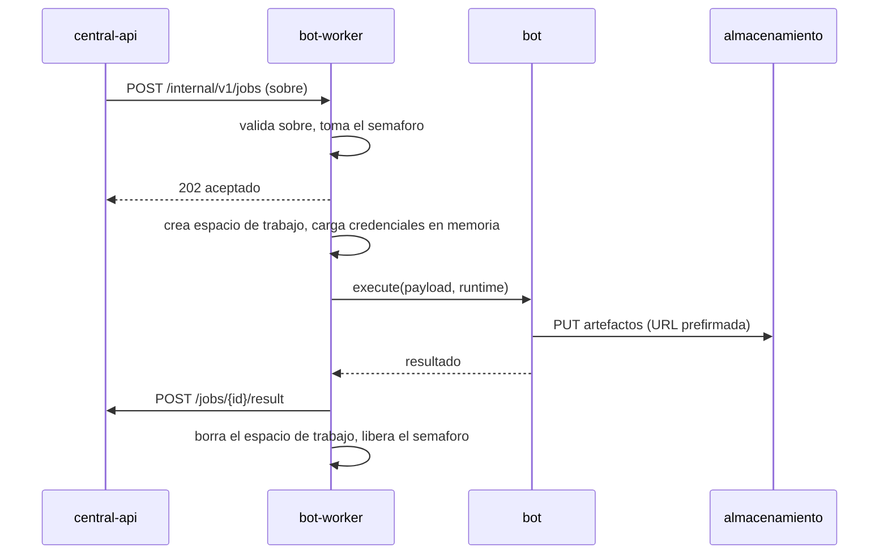
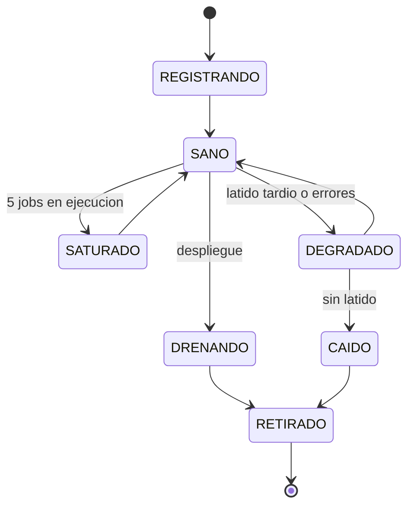

# bot-worker

Servicio ejecutor de la V3. Corre los bots Playwright que automatizan los sitios
de los organismos.

> **Estado: sin implementar.** Diseño en
> [`../../plans/03-worker/plan.md`](../../plans/03-worker/plan.md).

---

## Qué es

Un **ejecutor puro**. Recibe de la API central un sobre de job autocontenido,
ejecuta el bot, sube los archivos que genera al almacenamiento de objetos usando
URLs prefirmadas, y reporta el resultado.

No decide qué ejecutar. No busca trabajo. No guarda nada.

## Invariantes

Estas cuatro reglas no son recomendaciones, son condiciones de aceptación del
servicio:

| | Invariante | Verificación |
|---|---|---|
| **W-1** | No accede a ninguna base de datos | La imagen no instala driver de PostgreSQL ni ORM. Un test recorre el grafo de módulos y falla si aparece un import de base de datos |
| **W-2** | Nunca ejecuta más de 5 jobs concurrentes | Semáforo de 5 y rechazo `409` cuando está lleno. Test: 10 jobs simultáneos, 5 corren y 5 son rechazados |
| **W-3** | Solo responde a la API central | Token emitido en el registro más aislamiento de red. Sin ingreso desde internet |
| **W-4** | Un worker que deja de reportar salud libera sus jobs | La central reencola por vencimiento del lease, sin intervención manual |

## Lo que este servicio NO tiene

- `DATABASE_URL`, ni driver, ni modelos ORM, ni tabla de logs.
- Credenciales del almacenamiento de objetos. Recibe URLs prefirmadas.
- La clave privada RSA.
- Credenciales SMTP ni de MercadoPago.

Sí tiene: la URL de la central, su token, las claves de los resolvedores de
captcha y la configuración de proxies.

## API secundaria

Privada. Solo la central la consume.

| Método | Ruta | Descripción |
|---|---|---|
| `POST` | `/internal/v1/jobs` | Recibe una asignación. `202` si acepta, `409` si está saturado |
| `GET` | `/internal/v1/jobs` | Jobs en curso en este worker |
| `POST` | `/internal/v1/jobs/{job_id}/cancel` | Cancela un job en vuelo |
| `GET` | `/internal/v1/health` | Vivacidad. Sin dependencias |
| `GET` | `/internal/v1/status` | Salud detallada: en ejecución, en cola, capacidad, versiones, recursos |
| `GET` | `/internal/v1/bots` | Manifiesto de los bots que esta imagen soporta |

Además del API, el worker **empuja latidos** a la central. Las dos direcciones
son complementarias: el latido da vivacidad sin que la central tenga que sondear
N workers, y el API da detalle a demanda y permite asignar.

## Ciclo de vida de un job



La limpieza del espacio de trabajo está garantizada incluso si el bot falla o el
proceso recibe una señal.

## Estados del worker



`SATURADO`, `DEGRADADO` y `CAIDO` disparan aviso al administrador.

## Contrato de plugin de bot

Cada bot es un plugin con un manifiesto declarativo y una función `execute`. El
worker le inyecta un contexto de ejecución que es dueño de todos los efectos
laterales.

```python
class BotPlugin(Protocol):
    manifest: PluginManifest

    async def validate(self, payload: Mapping[str, Any]) -> ValidatedPayload: ...

    async def execute(
        self,
        payload: ValidatedPayload,
        runtime: BotRuntime,
    ) -> BotResult: ...
```

Prohibiciones del plugin, cada una con su motivo:

| Prohibido | Motivo |
|---|---|
| Abrir conexiones a base de datos | Invariante W-1 |
| Usar `os.getcwd()` o rutas absolutas | Debe escribir solo en `runtime.work_dir` |
| Leer variables de entorno en la lógica de negocio | Toda la configuración llega por el contexto |
| Subir a claves de bucket arbitrarias | Solo las URLs prefirmadas que recibió |
| Loguear credenciales | Invariante SEC-2 |
| Construir el mensaje de error público | Devuelve categoría y diagnóstico; la central decide qué se expone |

Contrato completo en
[`../../plans/03-worker/plan.md`](../../plans/03-worker/plan.md) §7.

## Recursos

Chromium consume entre 300 y 500 MB por instancia. Con el tope de 5 jobs
concurrentes:

| Recurso | Mínimo | Recomendado |
|---|---|---|
| Memoria | 2.5 GB | 4 GB |
| CPU | 1 núcleo | 2 núcleos |
| `/dev/shm` | 512 MB en memoria | 1 GB en memoria |

`/dev/shm` respaldado en memoria no es opcional: sin eso Chromium se cae bajo
concurrencia. Es el error más común al contenerizar Playwright.

## Estructura prevista

```
services/bot-worker/
├── README.md
├── Dockerfile
├── pyproject.toml
└── src/bot_worker/
    ├── main.py
    ├── api/                 # API secundaria
    ├── runtime/             # contexto de ejecucion, navegador, artefactos
    │   ├── arca_login.py    # login compartido, portado de la V2
    │   ├── captcha.py
    │   └── proxies.py
    ├── scheduler/           # semaforo, cola local, drenaje
    ├── reporting/           # latidos, eventos, resultado
    └── bots/                # un paquete por bot
        ├── mis_comprobantes/
        ├── hacienda/
        └── ...
```

## Cómo correrlo

> Pendiente de la fase F0.

```bash
# previsto
docker compose -f ../../infra/compose/docker-compose.yml up --scale bot-worker=2
```

## Documentos relacionados

- [`plans/03-worker/plan.md`](../../plans/03-worker/plan.md) - diseño de este servicio
- [`plans/00-arquitectura/plan.md`](../../plans/00-arquitectura/plan.md) - protocolo con la central
- [`plans/07-migracion/plan.md`](../../plans/07-migracion/plan.md) - portado de los bots de la V2
- [`plans/06-infra/plan.md`](../../plans/06-infra/plan.md) - imagen y dimensionamiento
