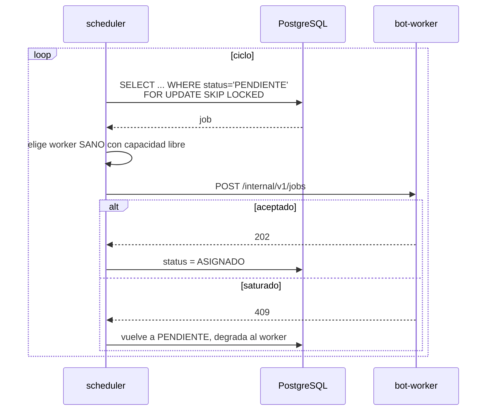

# central-api

Servicio central de la V3. Es el **plano de control** completo del sistema.

> **Estado: operativo en desarrollo.** Diseño y límites en
> [`../../plans/02-central-api/plan.md`](../../plans/02-central-api/plan.md).

---

## Responsabilidades

| Área | Detalle |
|---|---|
| API pública v3 | Creación, consulta, cancelación y listado de ejecuciones. Catálogo de bots |
| Autenticación | Claves API con verificador HMAC, rotación y revocación |
| Cuotas | Verificación y reserva de consumo antes de ejecutar |
| Planificación | Cola de jobs en PostgreSQL y reparto entre workers sanos |
| Gobierno de la flota | Registro de workers, ingesta de latidos, clasificación de salud |
| Panel de administración | Usuarios, jobs, flota, suscripciones, auditoría |
| Facturación | Planes, suscripciones, créditos, webhooks de MercadoPago |

## Lo que este servicio es el único en tener

- Las credenciales de PostgreSQL. **Ningún otro servicio se conecta a la base.**
- La clave privada RSA con la que se descifran las credenciales fiscales.
- Las credenciales del almacenamiento de objetos. Los workers reciben URLs
  prefirmadas, nunca las llaves.
- Los tokens de MercadoPago.
- Las credenciales SMTP.

## Superficie HTTP

### API pública, `/api/v3`

| Método | Ruta | Descripción |
|---|---|---|
| `POST` | `/bots/{bot}/{operacion}` | Crea una ejecución. Devuelve `202` y `job_id` |
| `POST` | `/uploads` | Ticket de carga temporal para operaciones con archivos |
| `GET` | `/jobs/{job_id}` | Estado y resultado de una ejecución |
| `POST` | `/jobs/{job_id}/cancelar` | Cancela una ejecución |
| `POST` | `/jobs/estado:lote` | Estado de hasta 200 ejecuciones en un pedido |
| `GET` | `/jobs` | Listado propio con filtros y paginación por cursor |
| `GET` | `/bots` | Catálogo de bots disponibles |
| `GET` | `/bots/{bot}` | Detalle, operaciones y esquema de entrada |
| `GET` | `/mi/cuenta` | Plan, consumo del período y saldo de créditos |

### Middleware de bots y compatibilidad V2

La ruta normativa es `POST /api/v3/bots/{bot}/{operacion}`. La central valida la
clave API, ownership, cuota e idempotencia, persiste el job en PostgreSQL y el
planificador lo asigna al worker sano que tenga capacidad. La central no importa
plugins de bots ni expone al worker directamente.

Para facilitar la migración de clientes V2, el router de compatibilidad publica
los 36 endpoints históricos de ejecución como aliases bajo `/api/v3`:

```text
/mis_comprobantes/consulta
/mis_comprobantes/solicitar_consulta
/mis_comprobantes/historial
/ccma/consulta                         /siper/consulta
/sct/consulta                          /sct/compensaciones/consulta
/portal_iva/consulta                    /portal_iva/carga
/rcel/consulta                          /hacienda/consulta
/sifere/consulta                        /aportes-en-linea/consulta
/declaracion-en-linea/consulta          /mis_facilidades/consulta
/mis_retenciones/consulta               /mis_retenciones_iva_simple/consulta
/retenciones_percepciones_iibb/misiones/consulta
/retenciones_percepciones_iibb/agip/consulta
/retenciones_percepciones_iibb/arba/consulta
/arba/consulta                           /pago_devoluciones/consulta
/moa/consulta                            /libros_iva/consulta
/facturometro/consulta                   /controladores-fiscales/carga
/certificado-mipyme/consulta             /srt/alicuotas/consulta
/vep/carga                               /vep_archivo/carga
/vep-ccma/generar                        /vep/consulta-pagos
/liquidacion_granos/consulta              /consulta_cuit/individual
/consulta_cuit/masivo
```

Cada alias `POST` devuelve un `job_id` y comparte las rutas de estado y
cancelación con el formato `/{job_id}` y `/cancelar/{job_id}`. También se
mantiene `GET /api/v3/apoc/consulta/{cuit}` como adaptador idempotente. Por lo
tanto, los clientes V2 conservan el flujo asíncrono, pero la ejecución pasa por
la misma central, cola, cuota, auditoría y despacho que la API V3.

Los endpoints V2 que devolvían logs sin un job se reemplazan por `GET /jobs`
con filtros `bot`, `operacion` y `status`, y por `GET /jobs/{job_id}` para el
detalle. Las operaciones que recibían archivos no se proxifican como multipart:
se solicita primero un ticket con `POST /api/v3/uploads` y se envía el
`object_key` en el payload del job. Esta decisión evita almacenar archivos
temporales en la central y es parte del contrato V3.

### API interna para workers, `/internal/v1`

| Método | Ruta | Descripción |
|---|---|---|
| `POST` | `/workers/register` | Alta de un worker en la flota |
| `POST` | `/workers/{id}/heartbeat` | Latido con salud y profundidad de cola |
| `POST` | `/jobs/{job_id}/events` | Eventos de progreso |
| `POST` | `/jobs/{job_id}/result` | Reporte de resultado, idempotente |
| `POST` | `/jobs/{job_id}/artifacts/presign` | Solicitud de URLs prefirmadas de subida |

Esta superficie no se expone a internet.

### Operación

| Método | Ruta | Descripción |
|---|---|---|
| `GET` | `/health` | Vivacidad del proceso. No consulta dependencias |
| `GET` | `/ready` | Disponibilidad real: base de datos y versión de esquema |
| `GET` | `/admin/*` | Panel de administración |

### Panel web administrativo V3

`GET /admin/` y `GET /admin/login` sirven una consola HTML inspirada en la
navegación y el lenguaje visual del panel V2, sin copiar su acceso directo a
tablas ni exponer credenciales. Incluye estas vistas:

- **Resumen:** métricas de jobs, estado de la flota y últimas acciones.
- **Usuarios:** búsqueda, alta, habilitación/deshabilitación y emisión de
  claves API, cuyo valor se muestra una sola vez.
- **Jobs:** filtros, métricas, detalle y cancelación de ejecuciones.
- **Flota:** estado de workers, capacidad, protocolo y evaluación de alertas.
- **Auditoría:** consulta de eventos append-only con filtros básicos.

La consola valida el `ADMIN_TOKEN` contra los endpoints JSON privados y lo
conserva únicamente en `sessionStorage` durante la sesión del navegador. Los
endpoints `/admin/*` JSON mantienen su autorización `Bearer` independiente,
por lo que agregar la interfaz no cambia el contrato de clientes ni workers.
La sesión persistente, MFA, CSRF y administración de sesiones del diseño
completo de `plans/05-admin-panel` quedan como una siguiente fase.

## Planificador

El planificador es lo que convierte a este servicio en balanceador de carga.



`FOR UPDATE SKIP LOCKED` permite correr N réplicas de este servicio sin que dos
asignen el mismo job.

## Estructura prevista

```
services/central-api/
├── README.md
├── Dockerfile
├── pyproject.toml
├── alembic/                 # migraciones
└── src/central_api/
    ├── main.py
    ├── api/                 # rutas publicas v3
    ├── internal/            # rutas para workers
    ├── admin/               # panel
    ├── scheduler/           # cola, seleccion de worker, reaper
    ├── domain/              # servicios de negocio
    ├── repositories/        # acceso a datos
    ├── models/              # ORM
    ├── schemas/             # entrada y salida
    ├── security/            # claves API, RSA, sesiones
    ├── billing/             # planes, creditos, MercadoPago
    └── observability/       # logging, metricas
```

Regla de capas: las rutas llaman a servicios, los servicios llaman a
repositorios, y **ninguna ruta toca el ORM directamente**. La V2 no tenía esta
separación y las rutas usaban el manager y el ORM en el mismo archivo.

## Base de datos y migraciones (job one-off `migrate`)

Sin `DATABASE_URL` el servicio arranca en modo desarrollo con el `store.py`
en memoria (fallback para `JOBS`/`WORKERS`). Con `DATABASE_URL` configurada,
`api`, `internal`, `scheduler` y `admin` usan `repositories` + `models`
contra PostgreSQL, único source of truth (el worker nunca toca la base, W-1).

Las migraciones viven en `alembic/versions/` (`0001`–`0010`) y se aplican
**solo** como job efímero con la misma imagen, nunca en el arranque:

```bash
python -m central_api.migrate
# o con compose:
docker compose -f infra/compose/docker-compose.yml \
  --profile migrate run --rm migrate
```

`GET /ready` verifica conectividad y versión de esquema (`alembic_version`).

## Secretos centralizados (`settings.py`)

Todo secreto se lee solo desde `central_api.settings`: `DATABASE_URL`,
`API_KEY_HMAC_SECRET`, `ADMIN_TOKEN`, `INTERNAL_JWT_SIGNING_KEY`,
`MP_WEBHOOK_SECRET`, `MP_ENVIRONMENT` (`sandbox`/`production`) y
`MP_ACCESS_TOKEN`. Ningún router lee el entorno directo.

## Facturación

`billing/` implementa ajustes append-only (`AJUSTE` con motivo y actor),
períodos forzados por admin, cierre de vencidos y conciliación periódica
contra recursos reconsultados de MercadoPago (contraste exacto en centavos,
sin editar el hecho origen). El admin de suscripciones vive en
`/admin/billing/*` (cuenta, plan, suspensión, crédito manual, reproceso de
webhooks, conciliación y discrepancias).

## Configuración

Inventario completo en
[`../../plans/06-infra/plan.md`](../../plans/06-infra/plan.md) §6. Resumen:

| Variable | Propósito |
|---|---|
| `DATABASE_URL` | Conexión a PostgreSQL |
| `API_KEY_HMAC_SECRET` | Secreto del verificador de claves API |
| `MRBOT_KEYS_DIR` | Directorio del par de claves RSA |
| `MINIO_*` | Credenciales y buckets del almacenamiento de objetos |
| `SMTP_*` | Envío de avisos al administrador |
| `MERCADOPAGO_*` | Tokens de cobro y validación de webhooks |
| `WORKER_TOKEN_SECRET` | Emisión de tokens para los workers |
| `SCHEDULER_*` | Intervalos, umbrales de salud, TTL del lease |

## Cómo correrlo

```bash
docker compose -f ../../infra/compose/docker-compose.yml up central-api
# abrir luego https://central-api.mrbot.com.ar/admin/
```

## Documentos relacionados

- [`plans/02-central-api/plan.md`](../../plans/02-central-api/plan.md) - diseño de este servicio
- [`plans/00-arquitectura/plan.md`](../../plans/00-arquitectura/plan.md) - protocolo con los workers
- [`plans/01-database/plan.md`](../../plans/01-database/plan.md) - esquema que este servicio posee
- [`plans/04-billing/plan.md`](../../plans/04-billing/plan.md) - facturación
- [`plans/05-admin-panel/plan.md`](../../plans/05-admin-panel/plan.md) - panel
